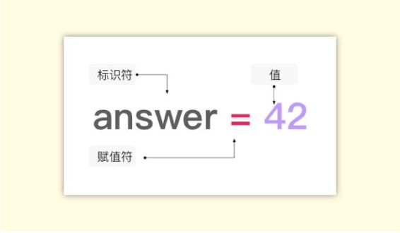
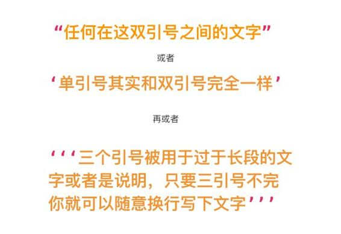
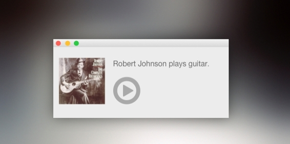

# 第三章 变量与字符串

## 3.1 开始学习编程

初学者经常会遇到的困惑是，看书上或是听课都懂，但还是不明白要怎么编程。这是因为缺乏足够多的实践。

正如我们在婴儿时期学习说话的时候，最初是模仿父母的发音，逐渐才能学会表达自己的想法。学习编程也是一样，在你阅读这本教程的时候，需要模仿着示例敲一遍代码，不要怕麻烦、不要嫌简单，当你动手敲代码的时候，就会发现很多眼睛会忽略的细节：小到中文标点还是英文标点、大到语句之间的逻辑关系。当然，在你发现亲手写出的程序运行成功之后，你也会感受到无比的喜悦，你能用程序计算数学题了！你能实现小功能了！我会带着你循序渐进地完成一个个实践，直到你有能力脱离模仿、开始创造。

所以，你需要在阅读时打开 IDE ，边看边敲代码。如果安装环境这一步遇到了问题，请回到上一章阅读。

如果你准备好了，跟我走吧。

## 3.2 变量

简单地说，变量就是编程中最基本的存储单位，变量会暂时性地储存你放进去的东西。

《银河系漫游指南》里面说“生命、宇宙以及任何事情的终极答案是 42”，如果用编程语言来表达的话，就是如下等式，一个叫做 `“answer”` 的变量被赋值为 `42` 。正如每个人都有姓名一样，变量的名字叫做标识符。



现在我们来试着给变量赋值。为了最简单的完成这一步，Windows 用户请打开命令行输入 `Python` 并回车，Mac 用户打开终端输入 `Python3` 并回车，然后输入：

```
a = 12
```

这样就完成了 a 的赋值，试着回车换行并输入 `a` ，再回车之后，你会看到赋值的结果是 12。

需要注意的是，Python 对大小写敏感，也就是说 `“a”` 和 `“A”` 会是两个不同的变量，而不是同一个。

这样，你就学会给变量起名字了，并且他们随叫随到。

## 3.3 `print()`


打印是 Python 中最常用的功能，顾名思义，我们现在就简单把 `print()`这个功能理解为展示打印的结果。使用方法是把你要打印查看结果的对象塞进括号中，这样就可以了。（如果你的 print 不用括号也能使用，请检查你的 Python 版本是不是 Python2，为了方便快速理解编程概念和少走弯路，后面的所有例子都会用 Python 3.x 实现。）

如果你使用命令行或终端直接输入 `print（a）`，你会得到这样的结果： `name 'a' is not defined` 。这是因为你漏掉了变量的赋值，Python 是无法打印不存在的对象的。

在今后的学习中，我们还有很多很多的东西要进行“打印”，我们需要知道要打印的东西是什么。即便变量是最容易理解的基础知识，也不要因为简单就随意命名，一定要保持 Python 的可读性。

看看下面这段代码，即便你现在不知道其中一些细节，但是读了一遍之后，你也能大概猜到这段代码做了什么事情吧？

```
file = open('/Users/yourname/Desktop/file.txt','w')
file.write('hello world!')
```

这是你敲的第一段代码，所以在这里多说几句。首先需要注意语法问题，使用英文标点符号、大小写不要出错、空格不能少。其次要注意文件路径问题，你的桌面上不需要有 `file.txt` 这个文件，但你需要知道你的电脑上桌面文件的路径是什么，然后把 `/Users/yourname/Desktop/` 替换掉。查看文件路径的方法是，Windows 用户用资源管理器打开桌面上的一个文件，查看路径。Mac 用户打开终端 terminal，然后把桌面上的某个文件拖拽进去就可以查看到路径。

这段代码打开了桌面上的 file.txt 文件，并写入了 Hello World！`w` 代表着如果桌面上有 file.txt 这个文件就直接写入 hello world ,如果没有 file.txt 这个文件就创建一个这样的文件。

互联网上有着诸多的代码和教程，但如果你没能一眼看懂这段代码是什么意思，其中有一多半是因为变量命名不清楚造成的。因此在随后的教程中，哪怕很啰嗦，我也会使用清晰的命名方式，从而保证即便是没有计算机基础的人，也能够理解代码。

要保持良好的命名习惯应该尽量使用英文命名，学编程的同时还能背单词，岂不一举两得，过一阵子你就会发现英文教程也会阅读得很顺畅。

在这里先了解这么多，更深入的会在之后介绍。

**扩展阅读：**

*   [驼峰式命名法](https://zh.wikipedia.org/wiki/舵峰式大小寫)
*   [帕斯卡命名法](https://zh.wikipedia.org/wiki/帕斯卡命名法)

## 3.4 字符串

### 字符串是什么

在上面我们已经初步接触到了字符串，很简单地说，字符串就是……



### 字符串的基本用法

现在我们来试着了解一些字符串的基本用法一一合并。请在你的 IDE（也就是前面推荐的 PyCharm) 中输入如下代码，在 IDE 中代码并不能自动运行，所以我们需要手动点击运行，方法是点击右键，选择 `Run‘文件名’` 来运行代码。

```
what_he_does = ' plays '
his_instrument = 'guitar'
his_name = 'Robert Johnson'
artist_intro = his_name + what_he_does + his_instrument

print(artist_intro)
```

你会发现输出了这样的结果：

```
Robert Johnson plays guitar
```

也许你会觉得无聊，但实际上这段代码加上界面之后是下图这样的，类似于你在音乐播放器里面经常看到的样子。Robert Johnson 是著名的美国蓝调吉他手，被称为与魔鬼交换灵魂的人。



> 注:本图的 GUI 图形界面采用了 Python 标准库 TKinter 进行实现

也许你已经注意到了，上面我们说到变量的时候，有些变量被进行不同形式的赋值。我们现在试着在 IDE 中这样做：

```
num = 1
string = '1'

print(num + string)
```

你一定会得到如下的结果，原因是字符串（string）只是 Python 中的一种数据类型，另一种数据类型则称之为整数（integer），而不同的数据类型是不能够进行合并的，但是通过一些方法可以得到转换。


插一句，如果你不知道变量是什么类型，可以通过 `type()` 函数来查看类型，在 IDE 中输入 `print(type(word))` 。

另外，由于中文注释会导致报错，所以需要在文件开头加一行魔法注释 `#coding:utf-8` ，也可以在设置里面找到 `“File Encodings”` 设置为 `UTF-8` 。

接下来，我们来转化数据数据类型。我们需要将转化后的字符串储存在另一个变量中，试着输入这些：

```
num = 1
string = '1'
num2 = int(string)

print(num + num2)
```

这样被转换成了同种类型之后，就可以合并这两个变量了。

我们来做一些更有意思的事情，既然字符串可以相加，那么字符串之间能不能相乘？当然可以！输入代码：

```
words = 'words' * 3
print(words)
```

你会得到 `wordswordswords`。

好，现在我们试着解决一个更复杂的问题：

```
word = 'a loooooong word'
num = 12
string = 'bang!'
total = string * (len(word) - num)  #等价于字符串'bang!'*4
print(total)
```

到这里，你就掌握了字符串最基本的用法了，Bang!

### 字符串的分片与索引

字符串可以通过 `string[x]` 的方式进行索引、分片，也就是加一个 `[]` 。字符串的分片(slice) 实际上可以看作是从字符串中找出来你要截取的东西，复制出来一小段你要的长度，储存在另一个地方，而不会对字符串这个源文件改动。分片获得的每个字符串可以看作是原字符串的一个副本。

先来看下面这段代码。如果你对字符串变量后面一些莫名其妙的数字感到困惑和没有头绪的话，不妨对照着代码下面的这个表格来分析。

```
name = 'My Name is Mike'

print(name[0])
'M'
print(name[-4])
'M'
print(name[11:14])  # from 11th to 14th, 14th one is excluded
'Mik'
print(name[11:15])  # from 11th to 15th, 15th one is excluded
'Mike'
print(name[5:])  
'me is Mike'
print(name[:5]) 
'My Na'
```


`:` 两边分别代表着字符串的分割从哪里开始，并到哪里结束。

以 `name[11:14]` 为例，截取的编号从第 11 个字符开始，到位置为 14 但不包含第 14 个字符结束。

而像 `name[5:]` 这样的写法代表着从编号为 5 的字符到结束的字符串分片。

相反， `name[:5]` 则代表着从编号为 0 的字符开始到编号为 5 但不包含第 5 个字符的字符分片。可能容易搞混，可以想象成第一种是从 5 到最后面，程序员懒得数有多少个所以就省略地写。第二种是从最前面到 5，同样是懒得写 0，所以就写成了 `[:5]` 。

好，现在我们试着解决一个更复杂的问题，来做一个文字小游戏叫做一一**“找出你朋友中的魔鬼”**。输入代码：

```
word = 'friends'
find_the_evil_in_your_friends =  word[0] + word[2:4] + word[-3:-1]
print(find_the_evil_in_your_friends)
```

如果运行正常，你就会发现这样的答案：`fiend` , 也就发现了朋友中的魔鬼，get 到了吗？

再来看一个实际项目中的应用，同样是分片的用法。

```
'http://ww1.site.cn/14d2e8ejw1exjogbxdxhj20ci0kuwex.jpg'
'http://ww1.site.cn/85cc87jw1ex23yhwws5j20jg0szmzk.png'
'http://ww2.site.cn/185cc87jw1ex23ynr1naj20jg0t60wv.jpg'
'http://ww3.site.cn/185cc87jw1ex23yyvq29j20jg0t6gp4.gif'
```

在实际项目中切片十分好用。上面几个网址（网址经过处理，所以你是打不开的）是使用 Python 编写爬虫后，从网页中解析出来的部分图片链接，现在总共有 500 余张附有这样链接的图片要进行下载，也就是说我需要给这 500 张不同格式的图片（png.jpg,gif）以一个统一的方式进行命名。通过观察规律，决定以链接尾部倒数 10 个字符的方式进行命名，于是输入代码如下：

```
url = 'http://ww1.site.cn/14d2e8ejw1exjogbxdxhj20ci0kuwex.jpg'
file_name = url[-10:]

print(file_name)
```

你会得到这样的结果： `0kuwex.jpg`

### 字符串的方法

Python 是面向对象进行编程的语言，而对象拥有各种功能、特性，专业术语称之为——方法（Method）。为了方便理解，我们假定日常生活中的车是“对象”，即 car。然后众所周知，汽车有着很多特性和功能，其中"开"就是汽车一个重要功能，于是汽车这个对象使用“开”这个功能，我们在 Python 编程中就可以表述成这样：`car.drive()`


在理解了对象的方法后，我们来看这样一个场景。很多时候你使用手机号在网站注册账户信息，为了保证用户的信息安全性，通常账户信息只会显示后四位，其余的用 `*` 来代替，我们试着用字符串的方法来完成这一个功能。


输入代码：

```
phone_number = '1386-666-0006'
hiding_number = phone_number.replace(phone_number[:9],'*' * 9)
print(hiding_number)
```

其中我们使用了一个新的字符串方法 replace(）进行“遮挡”。replace 方法的括号中，第一个 `phone_number[:9]` 代表要被替换掉的部分，后面的 `'*' * 9` 表示将要替换成什么字符，也就是把 `*` 乘以 9，显示 9 个 `*` 。

你会得到这样的结果：`*********0006`

现在我们试着解决一个更复杂的问题，来模拟手机通讯簿中的**电话号码联想功能**。


> 注:在这里只是大致地展示解决思路，真实的实现方法远比我们看到的要复杂

输入代码：

```
search = '168'
num_a = '1386-168-0006'
num_b = '1681-222-0006'

print(search + ' is at ' + str(num_a.find(search)) + ' to ' + str(num_a.find(search) + len(search) + len(search)) + ' of num_a')
print(search + ' is at ' + str(num_b.find(search)) + ' to ' + str(num_b.find(search) + len(search) + len(search)) + ' of num_b')
```

你会得到这样的结果，代表了包含 168 的所有手机号码

```
168 is at 5 to 8 of num_a
168 is at 0 to 3 of num_b
```

### 字符串格式化符

```
____a word she can get what she ____ for. 

A.With    B.came
```

这样的填空题会让我们印象深刻，当字符串中有多个这样的“空”需要填写的时候，我们可以使用 `.format（）` 进行批处理，它的基本使用方法有如下几种，输入代码：

```
print('{} a word she can get what she {} for.'.format('With','came'))
print('{preposition} a word she can get what she {verb} for'.format(preposition = 'With',verb = 'came'))
print('{0} a word she can get what she {1} for.'.format('With','came'))
```

这种字符串填空的方式使用很广泛，例如下面这段代码可以填充网址中空缺的城市数据：

```
city = input("write down the name of city:")
url = "http://apistore.baidu.com/microservice/weather?citypinyin={}".format(city)
```

> 注:这是利用百度提供的天气 api 实现客户端天气插件的开发的代码片段

好了，到这里你就掌握了变量和字符串的基本概念和常用方法。

下一步，我们会继续学习更深一步的循环与函数。