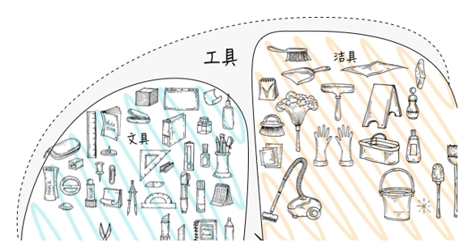

# 第七章 类与可口可乐

> All the Cokes are the same and all the Cokes are good. Liz Taylor > knows it, the President knows it, the bum knows it, and you know > it. ——Andy Warhol


“在美国，所有人喝到的可乐的都是一样的，无论是总统或者是流浪汉”。波普艺术家 Andy Warhol 如是说。如果用编程的语言来表达 Andy 的思想，那么我想可能用**类（class）**这个概念最为合适。

```
class CocaCola():
    it_taste = 'So good!'
coke_for_bum = CocaCola()
coke_for_president = CocaCola()
print(coke_for_bum.it_taste)
print(coke_for_president.it_taste)
```

运行结果：

```
>>> So good!
>>> So good!
```


怎么样？无论是 Andy Warhol 的波普艺术的理念，还是 Python 中的类的概念，看起来似乎都没有那么难理解。即便你现在对类还充满疑惑，但是我相信，在学习了这一章之后，你将会很好地理解类中那些令人费解的概念。同时，这一章将会使用可乐来讲解关于类的各种概念，实际上编程中的概念都可以在现实生活中找到很好的例子进行对照理解，为了加强理解，你最好现在出门买一瓶可乐，然后开始接下来的学习！

## 7.1 定义一个类

正如“类”的名称一样，它描述的概念和我们现实生活中的类的概念很相似。生物有不同的种类，食物有不同的种类，人类社会的种种商品也有不同的种类。但凡可被称之为一类的物体，他们都有着相似的特征和行为方式。也就是说，**类是有一些系列有共同特征和行为事物的抽象概念的总和。**

对于可乐来讲，只要是同一个品牌的可乐，他们就有着同样的成分，这被称之为配方（formula）。就像是工厂进行批量生产时所遵循的统一标准，正是因为有着同样的配方，所有可口可乐才能达到一样的口味。我们用 Python 中的类来表达这件事：

```
class CocaCola:
    formula = ['caffeine','sugar','water','soda']
```

我们使用 class 来定义一个类，就如同创建函数时使用的 def 定义一个函数一样简单，接着你可以看到缩进的地方有一个装载着列表的变量 `formula`，在类里面赋值的变量就是类的变量，而类的变量有一个专有的术语，我们称之为**类的属性(Class Atrribute)**。

类的变量与我们接触到的变量并没有什么区别，既然字符串、列表、字典、整数等等都可以是变量，那么它们当然都可以成为类的属性。在本章的后面你会逐渐地深入认识这点。



## 7.2 类的实例化

我们继续按照定义好的配方(类)来生产可乐。当然，按照这个配方，无论生产多少瓶可乐，它们的味道都是一样的。

```
coke_for_me = CocaCola()
coke_for_you = CocaCola()
```


在左边我们创建一个变量，右边写上类的名称，这样看起来很像是赋值的行为，我们称之为类的实例化。而被实例化后的对象，我们称之为**实例(instance)**，或者说是类的实例。对于可乐来说，按照配方把可乐生产出来的过程就是实例化的过程。

```
print(CocaCola.formula)
print(coke_for_me.formula)
print(coke_for_you.formula)
```

运行结果：

```
>>> ['caffeine','sugar','water','soda']
>>> ['caffeine','sugar','water','soda']
>>> ['caffeine','sugar','water','soda']
```

## 7.3 类属性引用

在类的名字后面输入 `.`，IDE 就会自动联想出我们之前在定义类的时候写在里面的属性，而这就是**类属性的引用(attribute references)**。

**类的属性会被所有类的实例共享**，所以当你在类的实例后面再点上 `.` ,索引用的属性值是完全一样的。

```
print(CocaCola.formula)
print(coke_for_me.formula)
print(coke_for_you.formula)
```

```
>>> ['caffeine','sugar','water','soda']
>>> ['caffeine','sugar','water','soda']
>>> ['caffeine','sugar','water','soda']
```

上面的这几行代码就像是说，“告诉我可口可乐的配方”与“告诉我你手中的可乐的配方”，结果是完全一样的。

类的属性与正常的变量并无区别，你可以试着这样来感受一下：

```
for element in coke_for_me.formula:
    print(element)
```

运行结果：

```
>>> caffeine
>>> sugar
>>> water
>>> soda
```

## 7.4 实例属性


可口可乐风靡全球和其本地化的推广策略有着密不可分的关系。1927 年，可口可乐首次进入中国，那时国人对这个黑色的、甜中带苦的饮料有一种隔阂感，再加上那时候“可乐”这东西并没有一个官方的翻译，而是直接沿用英文标识“CocaCola”，而民间将这个奇怪的东西称为“蝌蝌啃蜡”。奇怪的味道加上奇怪的名字，可乐早期进入中国并没有得到好的反响。

1979 年，中国开始大规模开放进出口贸易，官方的、印有我们熟知的“可口可乐”中文标识的可乐才逐渐出现人们的生活中，变得流行起来。


同样的配方，不一样的名称，就带来了不同的效果。这说明生产的过程中有必要做一些独有的本地化调整：

```
class CocaCola:
    formula = ['caffeine','sugar','water','soda']
coke_for_China = CocaCola()
coke_for_China.local_logo = '可口可乐'     #创建实例属性
print(coke_for_China.local_logo)          #打印实例属性引用结果
```

运行结果：

```
>>> 可口可乐
```

通过上面的代码，我们给在中国生产的可口可乐贴上了中文字样的“可口可乐”标签——在创建了类之后，通过 `object.new_atrr` 的形式进行一个赋值，于是我们就得到了一个新的实例的变量，实例的变量就是实例变量，而实例变量有一个专有的术语，我们称之为**实例属性(Instance Atrribute)**。

> 注：如果你见过对象属性这种说法，这二者其实是在说一件事情。

可乐的配方 (formula) 属于可口可乐（Class），而“可口可乐”的中文标识(local_logo)属于中国区的每一瓶可乐（Instance），给中国区的可口可乐贴上中文标签，并不能影响到美国或是日本等其他地区销售的可乐标签。


如果你在这里察觉了一点可疑的、甚至是令人困惑的地方，那么真是一件值得高兴的事情。 因为从引用方式上说，引用实例属性和引用类属性完全一样！但是这二者却有本质上的差异，后面我们会详细说明类属性和实例属性的区别。

## 7.5 畅爽开怀，实例方法

类的实例可以引用属性，但我们更早了解到的是类的实例可以使用方法这件事（见第三章：字符串的方法)。方法就是函数，但我们把这个函数称之为**方法(Method)**。方法是供实例使用的，因此我们还可以称之为**实例方法(Instance Method)**。当你掉喝一瓶可乐的时候，你会从咖啡因和大量的糖分中获得能量，如果使用类的方法来表示可乐的这个“功能”的话，那应该是这样的：

```
class CocaCola:
    formula = ['caffeine','sugar','water','soda']
    def drink(self):
        print('Energy!')        
coke = CocaCola()
coke.drink()
```

运行结果：

```
>>> Energy!
```

> 注：事实上，英文中“功能”和“函数”都由一个词表达—— Function。

### self?

我知道你现在的关注点一定在这个奇怪的地方——似乎没有派上任何用场的 `self` 参数。我们来说明一下原理，其实很简单，我们不妨修改一下代码:

```
class CocaCola:
    formula = ['caffeine','sugar','water','soda']
    def drink(coke):    # HERE！
        print('Energy!')    

coke = CocaCola()
coke.drink()
```

运行结果：

```
>>> Energy!
```

怎么样，现在有些头绪了吧？和你想的一样，这个参数其实就是被创建的实例本身！还记得我们在第四章说的函数的使用办法吗？就是将一个个对象作为参数放入函数括号内。

再进一步说，一旦一个类被实例化，那么我们其实可以同样使用原来的方式：

```
coke = CocaCola
coke.drink() == CocaCola.drink(coke) #左右两边的写法完全一致
```

被实例化的对象会被编译器默默地传入后面方法的括号中，作为第一个参数。上面这两种方法是一样的，但是我们更多地会写成前面那种形式。其实 `self` 这个参数名称是可以随意修改名称的（编译器并不会因此而报错），但是按照 Python 的规矩，我们还是统一使用 `self`。

## 7.6 更多参数

和函数一样，类的方法也能有属于自己的参数，我们先来试着在 `.drink()` 方法上做些改动：

```
class CocaCola:
    formula = ['caffeine','sugar','water','soda']
    def drink(self,how_much):      

        if how_much == 'a sip':
            print('Cool~')
        elif how_much == 'whole bottle':
            print('Headache!')       

ice_coke = CocaCola()
ice_coke.drink('a sip')
```

运行结果：

```
>>> Cool~
```

## 7.7 魔术方法

Python 的类中存在一些方法，被称为"魔术方法"，`_init_()` 就是其中之一。

`__init()` 的神奇之处就在于，如果你在类里定义了它，在创建实例的时候它就能帮你自动地处理很多事情——比如新增实例属性。在上面的代码中，我们创建了一个实例属性，但那是在定义完类之后再做的，这次我们一步到位：

```
class CocaCola():
    formula = ['caffeine','sugar','water','soda']
    def __init__(self):
        self.local_logo = '可口可乐' 

    def drink(self):    # HERE！
        print('Energy!')        

coke = CocaCola()
print(coke.local_logo)
```

运行结果：

```
>>> 可口可乐
```

其实`_init()`是 initialize(初始化)的缩写，这也就意味着即使我们在创建实例的时候不去引用 init_()方法，其中的命令也会先被自动地执行。是不是感觉像变魔术一样？

`_init_()` 方法可以给类的使用提供极大的灵活性。试试看下面的代码会发生什么：

```
class CocaCola:
    formula = ['caffeine','sugar','water','soda']
    def __init__(self):

        for element in self.formula:
            print('Coke has {}!'.format(element))

    def drink(self):
        print('Energy!')

coke = CocaCola()
```

除了必写的 self 参数之外，`_init()` 同样可以有自己的参数，同时也不需要这样`obj.init()`的方式来调用（因为是自动执行），而是在实例化的时候往类后面的括号中放进参数，相应的所有参数都会传递到这个特殊的 `init_()` 方法中，和函数的参数的用法完全相同。

```
class CocaCola:
    formula = ['caffeine','sugar','water','soda']
    def __init__(self,logo_name):
        self.local_logo = logo_name

    def drink(self):
        print('Energy!')

coke = CocaCola('可口可乐')
coke.local_logo
```

运行结果：

```
>>> 可口可乐
```

如果你对上面代码中的 `self.local_logo = logo_name` 感到不理解，我们在这里可以简单地解释一下。左边是变量作为类的属性，右边是传入的这个参数作为变量，也就是说这个变量的赋值所储存的结果将取决于初始化的时候所传进来的参数 `logo_name`，传进来什么那么它就将是什么。

## 7.8 类的继承

时代在变迁，消费品的种类在不断增长，现在的时代早已经不是 Andy Warhol 那个只有一个口味的可口可乐的时代了，而且也并非是所有可口可乐的味道一样好——如果喝过樱桃味的可乐你一定会明白。可口可乐本身的口味也是根据现代人的需求变了又变。


现在我们使用[可口可乐官方网站上最新的配方](http://www.coca-colaproductfacts.com/en/coca-cola-products/coca-cola/)来重新定义这个类：

```
class CocaCola:
    calories    = 140
    sodium      = 45
    total_carb  = 39
    caffeine    = 34
    ingredients =  [     
        'High Fructose Corn Syrup',
        'Carbonated Water',
        'Phosphoric Acid',
        'Natural Flavors',
        'Caramel Color',
        'Caffeine' 
    ]

    def __init__(self,logo_name):
        self.local_logo = logo_name    

    def drink(self):
        print('You got {} cal energy!'.format(self.calories))
```

不同的本地化策略和新的种类的开发，使得生产并非仅仅是换个标签这么简单了，包装、容积、甚至是配方都会发生变化，但唯一不变的是：它们永远是可口可乐。

所有的子品类都会继承可口可乐的品牌，Python 中类自然也有对应的概念，叫做**类的继承 (inheritance)**，我们拿无咖可乐（CAFFEINE-FREE）作为例子：

```
class CaffeineFree(CocaCola):
    caffeine = 0
    ingredients =  [
        'High Fructose Corn Syrup',
        'Carbonated Water',
        'Phosphoric Acid',
        'Natural Flavors',
        'Caramel Color',
    ]

coke_a = CaffeineFree('Cocacola-FREE')

coke_a.drink()
```

我们在新的类 CaffeineFree 后面的括号中放入 CocaCola，这就表示这个类是继承于 CocaCola 这个父类的，而 CaffeineFree 则成为了 CocaCola 子类。类中的变量和方法可以完全被子类继承，但如需有特殊的改动也可以进行**覆盖（override）**。

可以看到 CAFFEINE-FREE 存在着咖啡因含量、成分这两处不同的地方，并且在新的类中也仅仅是重写了这两个地方，其他没有重写的地方，方法和属性都能照常使用。

### 令人困惑的类属性与实例属性

> Q1：类属性如果被重新赋值，是否会影响到类属性的引用？

```
class TestA:
    attr = 1
obj_a = TestA()

TestA.attr = 42
print(obj_a.attr)
```

> Q2：实例属性如果被重新赋值，是否会影响到类属性的引用？

```
class TestA:
    attr = 1
obj_a = TestA()
obj_b = TestA()

obj_a.attr = 42

print(obj_b.attr)
```

> Q3：类属性实例属性具有相同的名称，那么 `.` 后面引用的将会是什么？

```
class TestA:
    attr = 1
    def __init__(self):
        self.attr = 42

obj_a = TestA()

print(obj_b.attr)
```

也许运行完上面三段代码，你会有一些初步的结论，但是更为直接的解释，全部隐藏在类的特殊属性 `_dict` 中。`dict_` 是一个类的特殊属性，它是一个字典，用于储存类或者实例的属性。即使你不去定义它，它也会存在于每一个类中，是默认隐藏的。我们以问题 3 中的代码为背景，在下面添加上这两行：

```
print(TestA.__dict__)
print(obj_a.__dict__)
```

我们可以看到这样的结果：

```
{'__module__': '__main__', '__doc__': None, '__dict__': <attribute '__dict__' of 'TestA' objects>, '__init__': <function TestA.__init__ at 0x1007fc7b8>, 'attr': 1, '__weakref__': <attribute '__weakref__' of 'TestA' objects>}

{'attr': 42}
```

其中类 `TestA` 和类的实例 `obj_a` 拥有各自的 attr 属性，井水不犯河水，是完全独立的。但是这样一来又如何解释问题 1 中的情况呢？为什么引用实例属性的方式会和引用类属性的方式是一样的呢？为何在问题 3 中返回的是 42 而不是 1 呢？看下面的图：

如图所示， Python 中属性的引用机制是自外而内的，当你创建了一个实例之后，准备开始引用属性，这时候编译器会先搜索该实例是否拥有该属性，如果有，则引用；如果没有，将搜索这个实例所属的类是否有这个属性，如果有，则引用，没有那就只能报错了。


### 类的扩展理解

现在试着敲下这几行代码:

```
obj1 = 1
obj2 = 'String!'
obj3 = []
obj4 = {}

print(type(obj1),type(obj2),type(obj3),type(obj4))
```

Python 中任何种类的对象都是类的实例，上面的这些类型被称作内建类型，它们并不需要像我们上面一样实例化。

如果你安装了 Beautifulsoup4 这个第三方的库，你可以试着这样:

```
from bs4 import Beautifulsoup
soup = BeautifulSoup
print(type(soup))
```

然后你可以按住 cmd （win 系统为 ctr）点击 Beautifulsoup 来查看一个 soup 对象的完整类定义。

到了这里你已经掌握类的基础用法，现在我们还不想把事情搞得复杂，至少现在还不值得浪费更多时间去深入你暂时不会使用到的高级概念。**要记住，不是越多就越好，你不可能在短时间内掌握诸多交织密集的抽象概念。**（一些关于类的高级概念你会在后面的实战项目中学到）

你不用担心如何验证自己是否掌握类的概念，接下来将带你做一个关于类的实践，到那时你可以验证自己的理解是否到位。

## 7.9 类的实践

其实类背后所承载的理念是 OOP（面向对象）的编程理念。在大型项目中为了易于管理和维护代码质量，会采取面向对象的方式，这也是软件工程的智慧所在。接下来，我们将使用类的概念来编写一个日常的工具库导入到 Python 的库中，这样一来我们也可以使用 import 方法导入自己的库了。

在使用 Python 处理数据或者是开发网站时，有时候会使用一些无意义的假数据，比如用户详情页信息。

我们来制作这样一个填充用户假数据的小工具，这个小工具的设计思路如下：

> 父类:FakeUser
> 
> 功能:
> 
> 1.  随机姓名
>     
>     
>     
>     a. 单字名
>     
>     
>     
>     b. 双字名
>     
>     
>     
>     c. 无所谓是什么反正有个名字就好了
>     
>     
> 2.  随机性别
> 
> 子类：SnsUser
> 
> 功能：
> 
> 1.  随机数量的跟随者
>     
>     
>     
>     a. few
>     
>     
>     
>     b. a lot

在开始之前先来处理一下词库，我们使用的随机姓名的词库来自于某输入法的姓名词库解析后的结果，现在分成两个文件，一个是常见姓氏，一个是常见的名。使用 open 函数打开这两个文件，将其中的文字添加进列表中。我们获取全部的常见姓氏，后面的姓名只获取 5000 个即可，否则太占内存。

```
ln_path = '/Users/Hou/Desktop/last_name.txt'
fn_path = '/Users/Hou/Desktop/first_name.txt'
fn  = []
ln1 = [] #单字名
ln2 = [] #双字名
with open(fn_path,'r') as f:
    for line in f.readlines():
        fn.append(line.split('\n')[0]) #如果这里看不明白不妨试试対其中的一行使用 split 方法看看会返回回来什么结果
print(fn)
with open(ln_path,'r') as f:
    for line in f.readlines():
        if len(line.split('\n')[0]) == 1:
            ln1.append(line.split('\n')[0])
        else:
            ln2.append(line.split('\n')[0])
print(ln1)
print('='*70) #分割线
print(ln2)
```

打印完成后，我们做两件事情：

1.  将 `fn = []` `ln1 = []` `ln2 = []` 修改改成元组，元组比列表要更省内存。
2.  将打印出来的结果复制粘贴到元组中，显然在制作完成后我们不能每做一次就重新读一遍，要把这些变成常量。

完成后看起来应该像这样（当然比这个要长很多很多）：

```
fn = ('李', '王', '张', '刘')
ln1 = ('娉', '览', '莱', '屹'）
ln2 = ('治明', '正顺', '书铎'）
```

现在开始我们可以来定义父类 FakeUser 了：

```
import random
class FakeUser:
    def fake_name(self,one_word=False,two_words=False):
        if one_word:
            full_name = random.choice(fn) + random.choice(ln1)
        elif two_words:
            full_name = random.choice(fn) + random.choice(ln2)
        else:
            full_name = random.choice(fn) + random.choice(ln1 + ln2)
        print(full_name)
    def fake_gender(self):
        gender = random.choice(['男','女','未知'])
        print(gender)
```

接下来是定义子类：

```
class SnsUser(FakeUser):
    def get_followers(self,few=True,a_lot=False):
        if few:
            followers = random.randrange(1,50)
        elif a_lot:
            followers = random.randrange(200,10000)
    print(followers)
user_a = FakeUser()
user_b = SnsUser()
user_a.fake_name()
user_b.get_followers(few=True)
```

### 似乎这并没有解决什么问题？

到了这里，我们创建的类已经可以正常使用了。我们的目的是批量制造假的填充数据，但是这样使用比起手工添加，效果并好不到哪去，因此在原有的代码上，我们要做一些小的调整，把所有的 print 替换成 yield 并在其上方加上一层循环，然后神奇的事情就这样发生了，我们就可以像 range 函数一样使用方法了：

```
class FakeUser():
    def fake_name(self,amount=1,one_word=False,two_words=False):
        n = 0
        while n <= amount:
            if one_word:
                full_name = random.choice(fn) + random.choice(ln1)
            elif two_words:
                full_name = random.choice(fn) + random.choice(ln2)
            else:
                full_name = random.choice(fn) + random.choice(ln1 + ln2)
            yield full_name
            n+=1
    def fake_gender(self,amount=1):
        n = 0
        while n <= amount:
            gender = random.choice(['男','女','未知'])
            yield gender
            n +=1
class SnsUser(FakeUser):
    def get_followers(self,amount=1,few=True,a_lot=False):
        n = 0
        while n <= amount :
            if few:
                followers = random.randrange(1,50)
            elif a_lot:
                followers = random.randrange(200,10000)
            yield followers
            n+=1
user_a = FakeUser()
user_b = SnsUser()
for name in user_a.fake_names(30):
    print(name)
for gender in user_a.fake_gender(30):
    print(gender)
```

### 为什么？

这其实用到了一个新的概念，叫做**生成器（generator）**。简单的来说，在函数中我们只要在任意一种循环（loop）中使用 yield 返回结果，就可以得到类似于 range 函数的效果。

### 安装自己的库

我们一般使用 pip 来进行第三方库的安装，那么自己的库要怎么安装呢？当然可以把自己的库提交到 pip 上，但是还要添加一定量的代码和必要文件才行。在这里我们使用一个更简单的方法：

1.  找到你的 Python 安装目录，找到下面的 site-packages 文件夹;
2.  记住你的文件名,因为它将作为引用时的名称，然后将你写的 py 文件放进去。

这个文件夹应该有你所装的所有第三方库。

如果你并不清楚你的安装路径，你可以尝试使用如下方式搞清楚它究竟在哪里：

```
import sys
print(sys.path)
```

打印出来的会是一个列表，列表中的第四个将是你的库安装路径所在，因此你也可以直接这么做：

```
import sys
print(sys.path[3])
```

现在就来试试使用自己写的库吧！

### 练习题

*   给子类设计增加一个新的方法——get_nick_name()