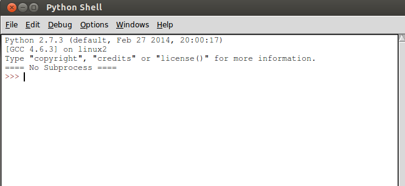

# 一、预备

## 关于 Python 的故事

我已经在[《零基础学 Python（第一版）》href="https://github.com/qiwsir/ITArticles/blob/master/BasicPython/index.md)中写了一个专门讲述 Python 故事的——[唠叨一些关于 Python 的事情](https://github.com/qiwsir/ITArticles/blob/master/BasicPython/001.md")——章节，今天再写类似的标题，不打算完全重复原来的，只是把部分认为重要的或者不可或缺的东西复制过来。

### 越来越火的 Python

在前几年(before 2011)，我跟一些朋友介绍 Python 的时候，看到的常常是一种很诧异的眼神，通常会听到：

```py
“那时什么东西？”
“解释性语言会不会很慢？”
“没听说谁用呀？”
“能像 php，java，c# 那样用来做网站吗？”
“什么？你说的是 pascal？你还在用这个老古董？”
“哦，我听说过，有一些老外在用，不过我们这还没有人用呢。” 
```

时过境迁，现在已经有了很大变化。

2014 年初，我开始写《零基础学 Python》系列，就得到了很多朋友的支持，而且吸引了不少学习 Python 的朋友，特别是在我的那个 QQ 群里面，集中了不少学习者和爱好者，当然也有高手深藏不露。

获得我发布的有关 Python 信息途径：

1.  加入 QQ 群，里面可以跟很多人交流。QQ 群：Code Craft：26913719
2.  关注我的新浪微博，名称是：老齐 Py。地址：[`weibo.com/qiwsir`](http://weibo.com/qiwsir)
3.  到 github.com 上直接 follow 我，名称是：qiwsir。地址：[`github.com/qiwsir`](https://github.com/qiwsir)
4.  经常关注我的网站：[www.itdiffer.com](http://www.itdiffer.com)

特别是今年（2015 年）一开始，在 QQ 群（26913719）里面，就有朋友说，他在上海找工作，看到好多公司都要有 Python 开发经验的。也有朋友委托我推荐 Python 程序员的。

从我自己的经历中也感受到，不仅仅是国外，国内也如此，用 Python 的领域越来越多，找 Pythoner 的公司和机构也越来越多了。

所以，学习 Python，挺好。

### 需要什么基础吗

这是很多初学者都会问的一个问题。诚然，在计算机方面的基础越好，对学习任何一门新的编程语言，都是更有利的。如果，你在编程语言的学习上，属于零基础，也不用担心，不管用哪门语言作为学习编程的入门语言，总要有一个开始吧。

就我个人来看，Python 是比较适合作为学习编程的入门语言的。换言之，就是不用担心自己的所谓基础问题。

看我这个课程的标题，就是强调“零基础”的。

不仅我这么认为，美国有不少高校也这么认为，纷纷用 Python 作为编程专业甚至是非编程专业的大学生入门语言。

我跟很多计算机专业的大学生朋友聊过，他们比较痛苦的就是大学用 C 语言作为编程入门语言，学了这个，才知道自己不适合学习编程，因为直到课程完毕，甚至考试通过了（一般是师生一块糊里糊涂地通过），对编程这件事也还是雾里看花的那种感觉。当然，或许你不在此列，一来你有天分，二来你下了功夫。

总而言之，学习 Python，你不用担心基础问题。**特别是在这里学习，我的后续内容，就是从零基础开始的**。

### 优雅的 Python

Python 号称是优雅的。但是这种说法仁者见仁智者见智。比如经常听到大师们说“数学美”，是不是谁都能体验到呢？不见得吧。

所以，是不是优雅，是不是简单，是不是明确，只有“谁用谁知道”。

不过，我特别喜欢下面这句话：**人生苦短，我用 Python**。意思就是说，Python 能够提高开发效率，让你短暂的人生能够除了工作之外，还有更多的时间休息、娱乐或者别的什么。

或许有的人不相信，那么也只有“谁用谁知道了”。

### 跟别的语言比较

“如果你遇到的问题无法用 Python 解决，这个问题也不能用别的语言解决。”——这是我向一些徘徊在 Python 之外的人常说的，是不是有点夸张了呢？

最近看到了一篇文章，[《如果编程语言是女人》](http://www.vaikan.com/if-programming-languages-are-woman/)，我转载如下(考虑到篇幅所限，所了适当删改，非删减请通过连接查看原文)：


> PHP 是你的豆蔻年华的心上人，她是情窦初开的你今年夏天傻乎乎的追求的目标。玩一玩可以，但千万不要投入过深，因为这个女孩有严重的问题。
> 
> Ruby 是脚本家族中一个非常漂亮的孩子。第一眼看她，你的心魄就会被她的美丽摄走。她还很有有趣。起初她看起来有点慢，不怎么稳定，但近些年来她已经成熟了很多。
> 
> Python 是 Ruby 的一个更懂事的姐姐。她优雅，新潮，成熟。她也许太过优秀。很多小伙都会说“嘿，兄弟，你怎么可能不爱上 Python 呢！？”。没错，你喜欢 Python。你把她当成了一个脾气和浪漫都退烧了的 Ruby。
> 
> Java 是一个事业成功的女人。很多在她手下干过的人都感觉她的能力跟她的地位并不般配，她更多的是通过技巧打动了中层管理人员。你也许会认为她是很有智慧的人，你愿意跟随她。但你要准备好在数年里不断的听到“你用错了接口，你遗漏了一个分号”这样的责备。
> 
> C++ 是 Java 的表姐。她在很多地方跟 Java 类似，不同的是她成长于一个天真的年代，不认为需要使用“保护措施”。当然，“保护措施”是指自动内存管理。你以为我指的是什么？
> 
> C 是 C++ 的妈妈。对一些头发花白的老程序员说起这个名称，会让他们眼睛一亮，产生无限回忆。
> 
> Objective C C 语言家族的另外一个成员。她加入了一个奇怪的教会，不愿意和任何教会之外的人约会。

虽然是娱乐，或许有争议，权当参考吧。

### The Zen of Python

这就是著名的《Python 之禅》。

> Beautiful is better than ugly.
> 
> Explicit is better than implicit.
> 
> Simple is better than complex.
> 
> Complex is better than complicated.
> 
> Flat is better than nested.
> 
> Sparse is better than dense.
> 
> Readability counts.
> 
> Special cases aren't special enough to break the rules.
> 
> Although practicality beats purity.
> 
> Errors should never pass silently.
> 
> Unless explicitly silenced.
> 
> In the face of ambiguity, refuse the temptation to guess.
> 
> There should be one-- and preferably only one --obvious way to do it.
> 
> Although that way may not be obvious at first unless you're Dutch.
> 
> Now is better than never.
> 
> Although never is often better than *right* now.
> 
> If the implementation is hard to explain, it's a bad idea.
> 
> If the implementation is easy to explain, it may be a good idea.
> 
> Namespaces are one honking great idea -- let's do more of those!

### 感谢 Guido van Rossum

Guido van Rossum 是值得所有 Pythoner 感谢和尊重的，因为他发明了这个优雅的编程语言。他发明 Python 的过程是那么让人称赞和惊叹，显示出牛人的风采。

> 1989 年的圣诞节期间，吉多·范罗苏姆为了在阿姆斯特丹打发时间，决心开发一个新的脚本解释程序，作为 ABC 语言的一种继承。之所以选中 Python 作为程序的名字，是因为他是一个蒙提·派森的飞行马戏团的爱好者。ABC 是由吉多参加设计的一种教学语言。就吉多本人看来，ABC 这种语言非常优美和强大，是专门为非专业程序员设计的。但是 ABC 语言并没有成功，究其原因，吉多认为是非开放造成的。吉多决心在 Python 中避免这一错误，并取得了非常好的效果，完美结合了 C 和其他一些语言。

这段故事的英文刊载在：[`www.python.org/doc/essays/foreword/`](https://www.python.org/doc/essays/foreword/)

### 新版的设想

我写《零基础学 Python（第二版）》，是承接第一版的，并在第一版基础上，最出比较大量的改进，比如每个章节的标题，现在改为更为直接的描述，而不是用那种文艺范写了，因为这样不仅更明确，而且还能用于以后备查。

此外，我会继续原有的大家认可的风格，兼顾零基础和后续的发展。特别是要在里面穿插如更多的项目例子。

* * *

总目录   |   下节：从小工到专家

## 从小工到专家

这个标题，我借用了一本书的名字——《程序员修炼之道：从小工到专家》——这本书特别推荐阅读。

“从小工到专家”，也是很多开始学习编程的朋友的愿望。如何能实现呢？上面所提到的那本书中，给出了非常好的建议，值得借鉴。

我在这里倒是想到了另外一个问题，也是学习 Python 的朋友给我提出来的：

> “书已经看了，书上的代码也运行过了，习题也能解答了，但是还不知如何开发一个真正的应用程序，不知从何处下手。”

此外，我在工作中，也遇到过一些刚刚毕业来求职的大学生，从简历上看，相关专业的考试分数是不错的（我一般是相信那些成绩是真的），但是，一讨论到专业问题，常常出乎我的预料。特别是当他面对真是的工作对象时，表现出来的比成绩单差太多了。

我一般会武断地下一个结论：练的少。

从小工到专家，必经之路就是要多阅读代码，多调试程序。

### 阅读代码

有句话说的好：“读书破万卷，下笔如有神”。这也适用于编程。阅读别人的代码，是必须的。通过阅读别人的代码，“站在巨人的肩膀上”，让自己眼界开阔，思维充实。

阅读代码的最好地方就是：[www.github.com](https://github.com/)

如果你还没有帐号，请尽快注册，他将是你作为一个优秀程序员的起点。当然了，不要忘记来 follow 我，我的帐号是: qiwsir。

阅读代码最好的一个方法是一边阅读，一边进行必要的注释，这是在梳理自己对别人代码的认识。然后，可以 run 一下，看看效果。当然，还可以按照自己的设想进行必要修改，再 run。这样你就将别人的代码消化吸收了。

### 调试程序

首先就是要自己动手写程序。“一万小时定律”在编程领域也是成立的，除非你是天才，否则，只有通过“一万小时定律”才能成为天才。

“拳不离手，曲不离口”，小工只有通过勤奋地敲代码才能成为专家。

另外，在调试程序的时候，要善于应用网络，看看类似的问题别人如何解决，不要仅仅局限于自己的思维范围。利用网络就少不了搜索引擎。我特别向那些要想成为专家的小工们说：只有 google 能够帮助你成为专家，其它的搜索引擎，特别是某国内常用的，充其量成为“砖家”，更多的是“砖工”。所以，请用：**google.com**。

我在本教程中，会陆续想有意成为专家的朋友提供更多有用的网站或者工具。

除了以上两条基本方法之外，成为专家之路还要注意很多呢，不过都是旁枝末节的问题了。以上两条做好，至少在编程上不迷茫了。

* * *

总目录

## Python 安装

任何高级语言都是需要一个自己的编程环境的，这就好比写字一样，需要有纸和笔，在计算机上写东西，也需要有文字处理软件，比如各种名称的 OFFICE。笔和纸以及 office 软件，就是写东西的硬件或软件，总之，那些文字只能写在那个上边，才能最后成为一篇文章。那么编程也是，要有个什么程序之类的东西，要把程序写到那个上面，才能形成最后类似文章那样的东西。

> **注：推荐一种非常重要的学习方法**
> 
> 在我这里看文章的零基础朋友，乃至于非零基础的朋友，不要希望在这里学到很多高深的 Python 语言技巧。
> 
> “靠，那看你胡扯吗？”
> 
> 非也。重要的是学会一些方法。比如刚才给大家推荐的“上网 google 一下”，就是非常好的学习方法。互联网的伟大之处，不仅仅在于打打游戏、看看养眼的照片或者各种视频之类的，当然，在某国很长时间互联网等于娱乐网，我忠心希望从读本文的朋友开始，互联网不仅仅是娱乐网，还是知识网和创造网。扯远了，拉回来。在学习过程中，如果遇到一点点疑问，都不要放过，思考一下、尝试一下之后，不管有没有结果，还都要 google 一下。
> 
> 列位看好了，我上面写的很清楚，是 google 一下，不是让大家去用那个什么度来搜索，那个搜索是专用搜索八卦、假药、以及各种穿着很简单衣服的女孩子照片的。如果你真的要提高自己的技术视野并且专心研究技术问题，请用 google。当然，我知道你在用的时候会遇到困难，做为一个要在技术上有点成就的人，一定要学点上网的技术的，你懂得。
> 
> 什么？你不懂？你的确是我的读者：零基础。那就具体来问我吧，不管是加入 ＱＱ 群还是微博，都可以。

所需要安装的东西，都在这个页面里面：[www.Python.org/downloads/](https://www.python.org/downloads/)

> [www.python.org](https://www.python.org/) 是 python 的官方网站，如果你的英语足够使用，那么自己在这里阅读，可以获得非常多的收获。

在 Python 的下载页面里面，显示出 Python 目前有两大类，一类是 Python3.x.x，另外一类是 Python2.7.x。可以说，Python3 是未来，它比 Python2.7 有进步。但是，现在，还有很多东西没有完全兼容 Python3。更何况，如果学了 Python2.7，对于 Python3，也只是某些地方的小变化了。

所以，我这里是用 Python2.7 为例子来讲授的。

### Linux 系统的安装

你的计算机是什么操作系统的？自己先弄懂。如果是 Linux 某个发行版，就跟我同道了。并且我恭喜你，因为以后会安装更多的一些 Python 库（模块），在这种操作系统下，操作非常简单，当然，如果是 iOS，也一样，因为都是 UNIX 下的蛋。只是 widows 有点另类了。

不过，没关系，Python 就是跨平台的。

但是，我还是推荐列位，至少在某种意义上讲，用 Linux 操作系统是很好的事情。

我用 Ubuntu。

以 ubutu14.04 为例，一般只要装好了这个操作系统，里面就已经把 Python 安装好了。可能是 Python2.7.6 版本，不过，在我来看，不需要升级，虽然目前最高版本是 Python2.7.9（在 64 位的上面，默认也安装了 Python3，供使用者选择）。

接下来就在 shell 中输入 Python，如果看到了`>>>`，并且显示出 Python 的版本信息，恭喜你，这就进入到了 Python 的交互模式下。

如果非要自己安装。参考下面的操作：

*   到官方网站下载源码。比如：

    wget [`www.python.org/ftp/python/2.7.8/Python-2.7.8.tgz`](http://www.python.org/ftp/python/2.7.8/Python-2.7.8.tgz)

*   解压源码包

    tar -zxvf Python-2.7.8.tgz

*   编译

    cd Python-2.7.8 ./configure --prefix=/usr/local # 指定了目录，如果不制定，可以使用默认的，直接运行 ./configure 即可。 make&&sudo make install

安装好之后，进入 shell，输入 Python，会看到如下：

```py
qw@qw-Latitude-E4300:~$ python
Python 2.7.6 (default, Nov 13 2013, 19:24:16)   # 后来我升级到 2.7.8 了,就是用后面讲到的源码安装方法
[GCC 4.6.3] on linux2
Type "help", "copyright", "credits" or "license" for more information.
>>> 
```

我用的是 Python2.7.6，或许你的版本号更高。这些差别就不用纠结了。

### windows 系统的安装

到[下载页面里面](https://www.python.org/download/releases/2.7.8/)找到 windows 安装包，下载之，比如下载了这个文件：Python-2.7.8.msi。然后就是不断的“下一步”，即可完成安装。

特别注意，安装完之后，需要检查一下，在环境变量是否有 Python。

> 如果还不知道什么是 windows 环境变量，以及如何设置。不用担心，请 google 一下，搜索："windows 环境变量"就能找到如何设置了。

以上搞定，在 cmd 中，输入 Python，得到跟上面类似的结果，就说明已经安装好了。

### Mac OS X 系统的安装

其实根本就不用再写怎么安装了，因为用 Mac OS X 的朋友，肯定是高手中的高高手了，至少我一直很敬佩那些用 Mac OS X 并坚持没有更换为 windows 的。麻烦用 Mac OS X 的朋友自己网上搜吧，跟前面 unbutu 差不多。

如果按照以上方法，顺利安装成功，只能说明幸运，无它。如果没有安装成功，这是提高自己的绝佳机会，因为只有遇到问题才能解决问题，才能知道更深刻的道理，不要怕，有 google，它能帮助列为看官解决所有问题。当然，加入 ＱＱ 群或者通过微博，问我也可以。

就一般情况而言，Linux 和 Mac OS x 系统都已经安装了某种 Python 的版本，打开就可以使用。但是 windows 是肯定不安装的。除了可以用上面所说的方法安装，还有一个更省事的方法，就是安装：ActivePython

简单记录一下我的安装方法（我是在 linux 系统中做的）：

1.  获得 root 权限
2.  到上述地址下载某种版本的 Python: wget [`www.Python.org/ftp/Python/2.7.8/Python-2.7.8.tgz`](https://www.Python.org/ftp/Python/2.7.8/Python-2.7.8.tgz)
3.  解压缩：tar xfz Python-2.7.8.tgz
4.  进入该目录：cd Python-2.7.8
5.  配置： ./configure
6.  在上述文件夹内运行：make，然后运行：make install
7.  祝你幸运
8.  安装完毕

OK!已经安装好之后，马上就可以开始编程了。

最后喊一句在一个编程视频课程广告里面看到的口号，很有启发：“我们程序员，不求通过，但求报错”。

还需要补充说明，本教程使用的是 Python2，虽然跟 Python3 有区别，但是，你不用纠结是 2 还是 3，因为两者区别不是很大，再者，目前工程上应用最多的，还是 Python2，虽然 Python3 是趋势，毕竟需要时间过渡的。很多初学者特别是大学生喜欢纠缠这个问题，实在有点浪费脑细胞了。

* * *

总目录

如果你认为有必要打赏我，请通过支付宝：**qiwsir@126.com**,不胜感激。

## 集成开发环境(IDE)

当安装好 Python 之后，其实就已经可以进行开发了。按照惯例，第一行代码总是：Hello World

### 值得纪念的时刻：Hello world

不管你使用的是什么操作系统，总之肯定能够找到一个地方，运行 Python，进入到交互模式。

像下面一样：

```py
Python 2.7.6 (default, Nov 13 2013, 19:24:16) 
[GCC 4.6.3] on linux2
Type "help", "copyright", "credits" or "license" for more information.
>>> 
```

在`>>>`后面输入`print "Hello, World"`，并按回车。这就是见证奇迹的时刻。

```py
>>> print "Hello, World"
Hello, World 
```

如果你从来不懂编程，从这一刻起，就跨入了程序员行列;如果已经是程序员，那么就温习一下当初的惊喜吧！

`Hello, World`是你用代码向这个世界打招呼了。

每个程序员，都曾经经历过这个伟大时刻，不经历这个伟大时刻的程序员不是伟大的程序员。为了纪念这个伟大时刻，理解其伟大之所在，下面执行分解动作：

> 说明：在下面的分解动作中，用到了一个符号：#，就是键盘上数字 ３ 上面的那个井号。这个符号，在 Python 编程中，表示注释。所谓注释，就是在计算机不执行那句话，只是为了说明某行语句表达什么意思，是给计算机前面的人看的。特别提醒，在编程实践中，注释是必须的。请牢记：程序在大多数情况下是给人看的，只是偶尔让计算机执行一下。

```py
# 看到“>>>”符号，表示 Python 做好了准备，等待你向她发出指令，让她做什么事情

>>>

# print，意思是打印。在这里也是这个意思，是要求 Python 打印什么东西

>>> print

#"Hello,World"是打印的内容，注意，变量的双引号，都是英文状态下的。引号不是打印内容，它相当于一个包裹，把打印的内容包起来，统一交给 Python。

>>> print "Hello, World"  

# 上面命令执行的结果。Python 接收到你要求她所做的事情：打印 Hello,World，于是她就老老实实地执行这个命令，丝毫不走样。

Hello, World 
```

在 Python 中，如果进入了上面的样式，我们称之为“交互模式”。这是非常有用而且简单的模式，她是我们进行各种学习和有关探索的好方式，随着学习的深入，你将更加觉得她魅力四射。

> 笑一笑：有一个程序员，自己感觉书法太烂了，于是立志继承光荣文化传统，购买了笔墨纸砚。在某天，开始练字。将纸铺好，拿起笔蘸足墨水，挥毫在纸上写下了两个大字：Hello World

虽然进入了程序员序列，但是，如果程序员用的这个工具，也仅仅是打印 Hello,World，怎能用“伟大”来形容呢？

况且，这个工具也太简陋了？你看美工妹妹用的 Photoshop，行政妹妹用的 word，出纳妹妹用的 Excel，就连坐在老板桌后面的那个家伙还用一个 PPT 播放自己都不相信的新理念呢，难道我们伟大的程序员，就用这么简陋的工具写出旷世代码吗？

当然不是。软件是谁开发的？程序员。程序员肯定会先为自己打造好用的工具，这也叫做“近水楼台先得月”。

IDE 就是程序员的工具。

### 集成开发环境

IDE 的全称是：Integrated Development Environment，简称 IDE，也称为 Integration Design Environment、Integration Debugging Environment，翻译成中文叫做“集成开发环境”，在台湾那边叫做“整合開發環境”。它是一种辅助程序员开发用的应用软件。

[维基百科](http://zh.wikipedia.org/zh/%E9%9B%86%E6%88%90%E5%BC%80%E5%8F%91%E7%8E%AF%E5%A2%83)这样对 IDE 定义：

> > IDE 通常包括程式语言编辑器、自动建立工具、通常还包括除错器。有些 IDE 包含编译器／直译器，如微软的 Microsoft Visual Studio，有些则不包含，如 Eclipse、SharpDevelop 等，这些 IDE 是通过调用第三方编译器来实现代码的编译工作的。有时 IDE 还会包含版本控制系统和一些可以设计圆形用戶界面的工具。许多支援物件导向的现代化 IDE 还包括了类別浏览器、物件检视器、物件结构图。虽然目前有一些 IDE 支援多种程式语言（例如 Eclipse、NetBeans、Microsoft Visual Studio），但是一般而言，IDE 主要还是针对特定的程式语言而量身打造（例如 Visual Basic）。

看不懂，没关系，看图，认识一下，混个脸熟就好了。所谓有图有真相。


上面的图显示的是微软的提供的名字叫做 Microsoft Visual Studio 的 IDE。用 C# 进行编程的程序员都用它。


上图是在苹果电脑中出现的名叫 XCode 的 IDE。

要想了解更多 IDE 的信息，推荐阅读维基百科中的词条

*   英文词条：[Integrated development environment](http://en.wikipedia.org/wiki/Integrated_development_environment)
*   中文词条：[集成开发环境](http://zh.wikipedia.org/zh/%E9%9B%86%E6%88%90%E5%BC%80%E5%8F%91%E7%8E%AF%E5%A2%83)

### Python 的 IDE

google 一下：Python IDE，会发现，能够进行 Python 编程的 IDE 还真的不少。东西一多，就开始无所适从了。所有，有不少人都问用哪个 IDE 好。可以看看[这个提问，还列出了众多 IDE 的比较](http://stackoverflow.com/questions/81584/what-ide-to-use-for-Python)。

> 顺便向列位看客推荐一个非常好的开发相关网站：[stackoverflow.com](http://stackoverflow.com/)
> 
> 在这里可以提问，可以查看答案。一般如果有问题，先在这里查找，多能找到非常满意的结果，至少有很大启发。
> 
> 在某国有时候有些地方可能不能访问，需要科学上网。好东西，一定不会让你轻易得到，也不会让任何人都得到。

那么做为零基础的学习者，用什么好呢？

既然是零基础，就别瞎折腾了，就用 Python 自带的 IDLE。原因就是：简单。

Windows 的朋友操作：“开始”菜单->“所有程序”->“Python 2.x”->“IDLE（Python GUI）”来启动 IDLE。启动之后，大概看到这样一个图



注意：看官所看到的界面中显示版本跟这个图不同，因为安装的版本区别。大致模样差不多。

其它操作系统的用户，也都能在找到 idle 这个程序，启动之后，跟上面一样的图。

后面我们所有的编程，就在这里完成了。这就是伟大程序员用的第一个 IDE。

除了这个自带的 IDE，还有很多其它的 IDE，列出来，供喜欢折腾的朋友参考

*   PythonWin: 是 Python Win32 Extensions(半官方性质的 Python for win32 增强包)的一部分，也包含在 ActivePython 的 windows 发行版中。如其名字所言，只针对 win32 平台。
*   MacPython IDE: MacPythonIDE 是 Python 的 Mac OS 发行版内置的 IDE，可以看作是 PythonWin 的 Mac 对应版本，由 Guido 的哥哥 Just van Rossum 编写。(哥俩都很牛)
*   Emacs 和 Vim: Emacs 和 Vim 号称是这个星球上最强大(以及第二强大)的文本编辑器，对于许多程序员来说是万能 IDE 的不二(三?)选择。
*   Eclipse + PyDev: Eclipse 是新一代的优秀泛用型 IDE，虽然是基于 Java 技术开发的，但出色的架构使其具有不逊于 Emacs 和 Vim 的可扩展性，现在已经成为了许多程序员最爱的瑞士军刀。

简单列几个，供参考，要找别的 IDE，网上搜一下，五花八门，不少呢。

磨刀不误砍柴工。IDE 已经有了，伟大程序员就要开始从事伟大的编程工作了。

* * *

总目录

如果你认为有必要打赏我，请通过支付宝：**qiwsir@126.com**,不胜感激。