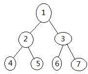
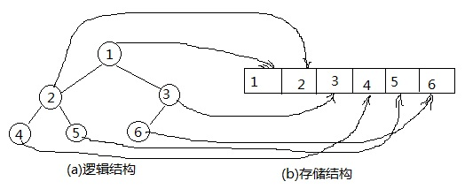
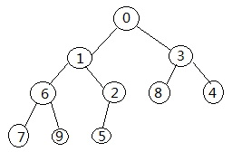
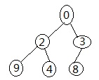

# 七、模块

## 编写模块

在本章之前，Python 还没有显示出太突出的优势。本章开始，读者就会越来越感觉到 Python 的强大了。这种强大体现在“模块自信”上，因为 Python 不仅有很强大的自有模块（称之为标准库），还有海量的第三方模块，任何人还都能自己开发模块，正是有了这么强大的“模块自信”，才体现了 Python 的优势所在。并且这种方式也正在不断被更多其它语言所借鉴。

“模块自信”的本质是：开放。

Python 不是一个封闭的体系，是一个开放系统。开放系统的最大好处就是避免了“熵增”。

> 熵的概念是由德国物理学家克劳修斯于 1865 年（这一年李鸿章建立了江南机械制造总局，美国废除奴隶制，林肯总统遇刺身亡，美国南北战争结束。）所提出。是一种测量在动力学方面不能做功的能量总数，也就是当总体的熵增加，其做功能力也下降，熵的量度正是能量退化的指标。
> 
> 熵亦被用于计算一个系统中的失序现象，也就是计算该系统混乱的程度。
> 
> 根据熵的统计学定义， 热力学第二定律说明一个孤立系统的倾向于增加混乱程度。换句话说就是对于封闭系统而言，会越来越趋向于无序化。反过来，开放系统则能避免无序化。

### 回忆过去

在本教程的《语句(1)》中，曾经介绍了 import 语句，有这样一个例子：

```
>>> import math
>>> math.pow(3,2)
9.0 
```

这里的 math 就是一个模块，用 import 引入这个模块，然后可以使用模块里面的函数，比如这个 pow() 函数。显然，这里我们是不需要自己动手写具体函数的，我们的任务就是拿过来使用。这就是模块的好处：拿过来就用，不用自己重写。

### 模块是程序

这个标题，一语道破了模块的本质，它就是一个扩展名为 `.py` 的 Python 程序。我们能够在应该使用它的时候将它引用过来，节省精力，不需要重写雷同的代码。

但是，如果我自己写一个 `.py` 文件，是不是就能作为模块 import 过来呢？还不那么简单。必须得让 Python 解释器能够找到你写的模块。比如：在某个目录中，我写了这样一个文件：

```
#!/usr/bin/env Python
# coding=utf-8

lang = "python" 
```

并把它命名为 pm.py，那么这个文件就可以作为一个模块被引入。不过由于这个模块是我自己写的，Python 解释器并不知道，我得先告诉它我写了这样一个文件。

```
>>> import sys
>>> sys.path.append("~/Documents/VBS/StartLearningPython/2code/pm.py") 
```

用这种方式就是告诉 Python 解释器，我写的那个文件在哪里。在这个告诉方法中，也用了一个模块 `import sys`，不过由于 sys 模块是 Python 被安装的时候就有的，所以不用特别告诉，Python 解释器就知道它在哪里了。

上面那个一长串的地址，是 ubuntu 系统的地址格式，如果读者使用的 windows 系统，请写你所保存的文件路径。

```
>>> import pm
>>> pm.lang
'python' 
```

本来在 pm.py 文件中，有一个变量 `lang = "Python"`，这次它作为模块引入（注意作为模块引入的时候，不带扩展名），就可以通过模块名字来访问变量 `pm.py`，当然，如果不存在的属性这么去访问，肯定是要报错的。

```
>>> pm.xx
Traceback (most recent call last):
  File "<stdin>", line 1, in <module>
AttributeError: 'module' object has no attribute 'xx' 
```

请读者回到 pm.py 文件的存储目录，是不是多了一个扩展名是 .pyc 的文件？如果不是，你那个可能是外星人用的 Python。

> 解释器，英文是：interpreter，港台翻译为：直译器。在 Python 中，它的作用就是将 .py 的文件转化为 .pyc 文件，而 .pyc 文件是由字节码(bytecode)构成的，然后计算机执行 .pyc 文件。关于这方面的详细解释，请参阅维基百科的词条：[直译器](http://zh.wikipedia.org/zh/%E7%9B%B4%E8%AD%AF%E5%99%A8)

不少人喜欢将这个世界简化简化再简化。比如人，就分为好人还坏人，比如编程语言就分为解释型和编译型，不但如此，还将两种类型的语言分别贴上运行效率高低的标签，解释型的运行速度就慢，编译型的就快。一般人都把 Python 看成解释型的，于是就得出它运行速度慢的结论。不少人都因此上当受骗了，认为 Python 不值得学，或者做不了什么“大事”。这就是将本来复杂的多样化的世界非得划分为“黑白”的结果。这种喜欢用“非此即彼”的思维方式考虑问题的现象可以说在现在很常见，比如一提到“日本人”，都该杀，这基本上是小孩子的思维方法，可惜在某个过度内大行其道。

世界是复杂的，“敌人的敌人就是朋友”是幼稚的，“一分为二”是机械的。

就如同刚才看到的那个 .pyc 文件一样，当 Python 解释器读取了 .py 文件，先将它变成由字节码组成的 .pyc 文件，然后这个 .pyc 文件交给一个叫做 Python 虚拟机的东西去运行（那些号称编译型的语言也是这个流程，不同的是它们先有一个明显的编译过程，编译好了之后再运行）。如果 .py 文件修改了，Python 解释器会重新编译，只是这个编译过程不是完全显示给你看的。

我这里说的比较笼统，要深入了解 Python 程序的执行过程，可以阅读这篇文章：[说说 Python 程序的执行过程](http://www.cnblogs.com/kym/archive/2012/05/14/2498728.html)

总之，有了 .pyc 文件后，每次运行，就不需要从新让解释器来编译 .py 文件了，除非 .py 文件修改了。这样，Python 运行的就是那个编译好了的 .pyc 文件。

是否还记得，我们在前面写有关程序，然后执行，常常要用到 `if __name__ == "__main__"`。那时我们写的 .py 文件是来执行的，这时我们同样写了 .py 文件，是作为模块引入的。这就得深入探究一下，同样是 .py 文件，它是怎么知道是被当做程序执行还是被当做模块引入？

为了便于比较，将 pm.py 文件进行改造，稍微复杂点。

```
#!/usr/bin/env Python
# coding=utf-8

def lang():
    return "Python"

if __name__ == "__main__":
    print lang() 
```

如以前做的那样，可以用这样的方式：

```
$ Python pm.py
python 
```

但是，如果将这个程序作为模块，导入，会是这样的：

```
>>> import sys
>>> sys.path.append("~/Documents/VBS/StarterLearningPython/2code/pm.py")
>>> import pm
>>> pm.lang()
'python' 
```

因为这时候 pm.py 中的函数 lang() 就是一个属性：

```
>>> dir(pm)
['__builtins__', '__doc__', '__file__', '__name__', '__package__', 'lang'] 
```

同样一个 .py 文件，可以把它当做程序来执行，还可以将它作为模块引入。

```
>>> __name__
'__main__'
>>> pm.__name__
'pm' 
```

如果要作为程序执行，则`__name__ == "__main__"`；如果作为模块引入，则 `pm.__name__ == "pm"`，即变量`__name__`的值是模块名称。

用这种方式就可以区分是执行程序还是作为模块引入了。

在一般情况下，如果仅仅是用作模块引入，可以不写 `if __name__ == "__main__"`。

### 模块的位置

为了让我们自己写的模块能够被 Python 解释器知道，需要用 `sys.path.append("~/Documents/VBS/StarterLearningPython/2code/pm.py")`。其实，在 Python 中，所有模块都被加入到了 sys.path 里面了。用下面的方法可以看到模块所在位置：

```
>>> import sys
>>> import pprint
>>> pprint.pprint(sys.path)
['',
 '/usr/local/lib/python2.7/dist-packages/autopep8-1.1-py2.7.egg',
 '/usr/local/lib/python2.7/dist-packages/pep8-1.5.7-py2.7.egg',
 '/usr/lib/python2.7',
 '/usr/lib/python2.7/plat-i386-linux-gnu',
 '/usr/lib/python2.7/lib-tk',
 '/usr/lib/python2.7/lib-old',
 '/usr/lib/python2.7/lib-dynload',
 '/usr/local/lib/python2.7/dist-packages',
 '/usr/lib/python2.7/dist-packages',
 '/usr/lib/python2.7/dist-packages/PILcompat',
 '/usr/lib/python2.7/dist-packages/gtk-2.0',
 '/usr/lib/python2.7/dist-packages/ubuntu-sso-client',
 '~/Documents/VBS/StarterLearningPython/2code/pm.py'] 
```

从中也发现了我们自己写的那个文件。凡在上面列表所包括位置内的 .py 文件都可以作为模块引入。不妨举个例子。把前面自己编写的 pm.py 文件修改为 pmlib.py，然后把它复制到`'/usr/lib/Python2.7/dist-packages` 中。（这是以 ubuntu 为例说明，如果是其它操作系统，读者用类似方法也能找到。）

```
$ sudo cp pm.py /usr/lib/python2.7/dist-packages/pmlib.py
[sudo] password for qw: 

$ ls /usr/lib/python2.7/dist-packages/pm*
/usr/lib/Python2.7/dist-packages/pmlib.py 
```

文件放到了指定位置。看下面的：

```
>>> import pmlib
>>> pmlib.lang
<function lang at 0xb744372c>
>>> pmlib.lang()
'python' 
```

也就是，要将模块文件放到合适的位置——就是 sys.path 包括位置——就能够直接用 import 引入了。

### PYTHONPATH 环境变量

将模块文件放到指定位置是一种不错的方法。当程序员都喜欢自由，能不能放到别处呢？当然能，用 `sys.path.append()` 就是不管把文件放哪里，都可以把其位置告诉 Python 解释器。但是，这种方法不是很常用。因为它也有麻烦的地方，比如在交互模式下，如果关闭了，然后再开启，还得从新告知。

比较常用的告知方法是设置 PYTHONPATH 环境变量。

> 环境变量，不同操作系统的设置方法略有差异。读者可以根据自己的操作系统，到网上搜索设置方法。

我以 ubuntu 为例，建立一个 Python 的目录，然后将我自己写的 .py 文件放到这里，并设置环境变量。

```
:~$ mkdir Python
:~$ cd python
:~/Python$ cp ~/Documents/VBS/StarterLearningPython/2code/pm.py mypm.py
:~/Python$ ls
mypm.py 
```

然后将这个目录 `~/Python`，也就是 `/home/qw/Python` 设置环境变量。

```
vim /etc/profile 
```

提醒要用 root 权限，在打开的文件最后增加 `export PATH = /home/qw/python:$PAT`，然后保存退出即可。

注意，我是在 `~/Python` 目录下输入 `Python`，进入到交互模式：

```
:~$ cd Python
:~/python$ Python

>>> import mypm
>>> mypm.lang()
'Python' 
```

如此，就完成了告知过程。

### `__init__.py` 方法

`__init__.py` 是一个空文件，将它放在某个目录中，就可以将该目录中的其它 .py 文件作为模块被引用。这个具体应用参见用 tornado 做网站(2)

* * *

总目录

如果你认为有必要打赏我，请通过支付宝：**qiwsir@126.com**,不胜感激。

## 标准库 (1)

“Python 自带‘电池’”，听说过这种说法吗？

在 Python 被安装的时候，就有不少模块也随着安装到本地的计算机上了。这些东西就如同“能源”、“电力”一样，让 Python 拥有了无限生机，能够非常轻而易举地免费使用很多模块。所以，称之为“自带电池”。

它们被称为“标准库”。

熟悉标准库，是进行编程的必须。

### 引用的方式

不仅使标准库的模块，所有模块都服从下述引用方式。

最基本的、也是最常用的，还是可读性非常好的：

```
import modulename 
```

例如：

```
>>> import pprint
>>> a = {"lang":"Python", "book":"www.itdiffer.com", "teacher":"qiwsir", "goal":"from beginner to master"}
>>> pprint.pprint(a)
{'book': 'www.itdiffer.com',
 'goal': 'from beginner to master',
 'lang': 'python',
 'teacher': 'qiwsir'} 
```

在对模块进行说明的过程中，我以标准库 pprint 为例。以 `pprint.pprint()` 的方式应用了一种方法，这种方法能够让 dict 格式化输出。看看结果，是不是比原来更容易阅读了你？

在 import 后面，理论上可以跟好多模块名称。但是在实践中，我还是建议大家一次一个名称吧。这样简单明了，容易阅读。

这是用 `import pprint` 样式引入模块，并以 `.` 点号的形式引用其方法。

还可以：

```
>>> from pprint import pprint 
```

意思是从 `pprint` 模块中之将 `pprint()` 引入，然后就可以这样来应用它：

```
>>> pprint(a)
{'book': 'www.itdiffer.com',
 'goal': 'from beginner to master',
 'lang': 'Python',
 'teacher': 'qiwsir'} 
```

再懒惰一些，可以：

```
>>> from pprint import * 
```

这就将 pprint 模块中的一切都引入了，于是可以像上面那样直接使用每个函数。但是，这样造成的结果是可读性不是很好，并且，有用没用的都拿过来，是不是太贪婪了？贪婪的结果是内存就消耗了不少。所以，这种方法，可以用于常用并且模块属性或方法不是很多的情况。

诚然，如果很明确使用那几个，那么使用类似 `from modulename import name1, name2, name3...`也未尝不可。一再提醒的是不能因为引入了模块东西而降低了可读性，让别人不知道呈现在眼前的方法是从何而来。如果这样，就要慎用这种方法。

有时候引入的模块或者方法名称有点长，可以给它重命名。如：

```
>>> import pprint as pr
>>> pr.pprint(a)
{'book': 'www.itdiffer.com',
 'goal': 'from beginner to master',
 'lang': 'python',
 'teacher': 'qiwsir'} 
```

当然，还可以这样：

```
>>> from pprint import pprint as pt
>>> pt(a)
{'book': 'www.itdiffer.com',
 'goal': 'from beginner to master',
 'lang': 'python',
 'teacher': 'qiwsir'} 
```

但是不管怎么样，一定要让人看懂，过了若干时间，自己也还能看懂。记住：“软件很多时候是给人看的，只是偶尔让机器执行”。

### 深入探究

继续以 pprint 为例，深入研究：

```
>>> import pprint
>>> dir(pprint)
['PrettyPrinter', '_StringIO', '__all__', '__builtins__', '__doc__', '__file__', '__name__', '__package__', '_commajoin', '_id', '_len', '_perfcheck', '_recursion', '_safe_repr', '_sorted', '_sys', '_type', 'isreadable', 'isrecursive', 'pformat', 'pprint', 'saferepr', 'warnings'] 
```

对 dir() 并不陌生。从结果中可以看到 pprint 的属性和方法。其中有不少是双划线、电话线开头的。为了不影响我们的视觉，先把它们去掉。

```
>>> [ m for m in dir(pprint) if not m.startswith('_') ]
['PrettyPrinter', 'isreadable', 'isrecursive', 'pformat', 'pprint', 'saferepr', 'warnings'] 
```

对这几个，为了能够搞清楚它们的含义，可以使用 `help()`，比如：

```
>>> help(isreadable)
Traceback (most recent call last):
  File "<stdin>", line 1, in <module>
NameError: name 'isreadable' is not defined 
```

这样做是错误的。知道错在何处吗？

```
>>> help(pprint.isreadable) 
```

别忘记了，我前面是用 `import pprint` 方式引入模块的。

```
Help on function isreadable in module pprint:

isreadable(object)
    Determine if saferepr(object) is readable by eval(). 
```

通过帮助信息，能够查看到该方法的详细说明。可以用这种方法一个一个地查过来，反正也不多，对每个方法都熟悉一些。

注意的是 `pprint.PrettyPrinter` 是一个类，后面的是函数（方法）。

在回头看看 `dir(pprint)` 的结果，关注一个：

```
>>> pprint.__all__
['pprint', 'pformat', 'isreadable', 'isrecursive', 'saferepr', 'PrettyPrinter'] 
```

这个结果是不是眼熟？除了"warnings"，跟前面通过列表解析式得到的结果一样。

其实，当我们使用 `from pprint import *`的时候，就是将`__all__`里面的方法引入，如果没有这个，就会将其它所有属性、方法等引入，包括那些以双划线或者单划线开头的变量、函数，这些东西事实上很少被在引入模块时使用。

### 帮助、文档和源码

不知道读者是否能够记住看过的上述内容？反正我记不住。所以，我非常喜欢使用 dir() 和 help()，这也是本教程从开始到现在，乃至到以后，总在提倡的方式。

```
>>> print pprint.__doc__
Support to pretty-print lists, tuples, & dictionaries recursively.

Very simple, but useful, especially in debugging data structures.

Classes
-------

PrettyPrinter()
    Handle pretty-printing operations onto a stream using a configured
    set of formatting parameters.

Functions
---------

pformat()
    Format a Python object into a pretty-printed representation.

pprint()
    Pretty-print a Python object to a stream [default is sys.stdout].

saferepr()
    Generate a 'standard' repr()-like value, but protect against recursive
    data structures. 
```

`pprint.__doc__`是查看整个类的文档，还知道整个文档是写在什么地方的吗？

关于文档的问题，曾经在《类(5)》中有介绍。但是，现在出现的是模块文档。

还是使用 pm.py 那个文件，增加如下内容：

```
#!/usr/bin/env Python
# coding=utf-8

"""                                          #增加的
This is a document of the python module.     #增加的
"""                                          #增加的

def lang():
    ...                                      #省略了，后面的也省略了 
```

在这个文件的开始部分，所有类和方法、以及 import 之前，写一个用三个引号包括的字符串。那就是文档。

```
>>> import sys
>>> sys.path.append("~/Documents/VBS/StarterLearningPython/2code")
>>> import pm
>>> print pm.__doc__

This is a document of the python module. 
```

这就是撰写模块文档的方法，即在 .py 文件的最开始写相应的内容。这个要求应该成为开发习惯。

Python 的模块，不仅可以看帮助信息和文档，还能够查看源码，因为它是开放的。

还是回头到 `dir(pprint)` 中找一找，有一个`__file__`，它就告诉我们这个模块的位置：

```
>>> print pprint.__file__
/usr/lib/python2.7/pprint.pyc 
```

我是在 ubuntu 中为例，读者要注意观察自己的操作系统结果。

虽然是 .pyc 文件，但是不用担心，根据现实的目录，找到相应的 .py 文件即可。

```
$ ls /usr/lib/python2.7/pp*
/usr/lib/python2.7/pprint.py  /usr/lib/python2.7/pprint.pyc 
```

果然有一个 pprint.py。打开它，就看到源码了。

```
$ cat /usr/lib/python2.7/pprint.py

...

"""Support to pretty-print lists, tuples, & dictionaries recursively.

Very simple, but useful, especially in debugging data structures.

Classes
-------

PrettyPrinter()
    Handle pretty-printing operations onto a stream using a configured
    set of formatting parameters.

Functions
---------

pformat()
    Format a Python object into a pretty-printed representation.

....
""" 
```

我只查抄了文档中的部分信息，是不是跟前面通过`__doc__`查看的结果一样一样的呢？

请读者在闲暇时间，阅读以下源码。事实证明，这种标准库中的源码是质量最好的。

* * *

总目录

如果你认为有必要打赏我，请通过支付宝：**qiwsir@126.com**,不胜感激。

## 标准库 (2)

Python 标准库内容非常多，有人专门为此写过一本书。在本教程中，由于我的原因，不会将标准库进行完整的详细介绍，但是，我根据自己的理解和喜好，选几个呈现出来，一来显示标准库之强大功能，二来演示如何理解和使用标准库。

### sys

这是一个跟 Python 解释器关系密切的标准库，上一节中我们使用过 `sys.path.append()`。

```
>>> import sys
>>> print sys.__doc__ 
```

显示了 sys 的基本文档，看第一句话，概括了本模块的基本特点。

```
This module provides access to some objects used or maintained by the
interpreter and to functions that interact strongly with the interpreter. 
```

在诸多 sys 函数和变量中，选择常用的（应该说是我觉得常用的）来说明。

#### sys.argv

sys.argv 是变量，专门用来向 Python 解释器传递参数，所以名曰“命令行参数”。

先解释什么是命令行参数。

```
$ Python --version
Python 2.7.6 
```

这里的`--version` 就是命令行参数。如果你使用 `Python --help` 可以看到更多：

```
$ Python --help
usage: Python [option] ... [-c cmd | -m mod | file | -] [arg] ...
Options and arguments (and corresponding environment variables):
-B     : don't write .py[co] files on import; also PYTHONDONTWRITEBYTECODE=x
-c cmd : program passed in as string (terminates option list)
-d     : debug output from parser; also PYTHONDEBUG=x
-E     : ignore PYTHON* environment variables (such as PYTHONPATH)
-h     : print this help message and exit (also --help)
-i     : inspect interactively after running script; forces a prompt even
         if stdin does not appear to be a terminal; also PYTHONINSPECT=x
-m mod : run library module as a script (terminates option list)
-O     : optimize generated bytecode slightly; also PYTHONOPTIMIZE=x
-OO    : remove doc-strings in addition to the -O optimizations
-R     : use a pseudo-random salt to make hash() values of various types be
         unpredictable between separate invocations of the interpreter, as
         a defense against denial-of-service attacks 
```

只选择了部分内容摆在这里。所看到的如 `-B, -h` 之流，都是参数，比如 `Python -h`，其功能同上。那么 `-h` 也是命令行参数。

`sys.arg` 在 Python 中的作用就是这样。通过它可以向解释器传递命令行参数。比如：

```
#!/usr/bin/env Python
# coding=utf-8

import sys

print "The file name: ", sys.argv[0]
print "The number of argument", len(sys.argv)
print "The argument is: ", str(sys.argv) 
```

将上述代码保存，文件名是 22101.py（这名称取的，多么数字化）。然后如此做：

```
$ python 22101.py
The file name:  22101.py
The number of argument 1
The argument is:  ['22101.py'] 
```

将结果和前面的代码做个对照。

*   在 `$ Python 22101.py` 中，“22101.py”是要运行的文件名，同时也是命令行参数，是前面的`Python` 这个指令的参数。其地位与 `Python -h` 中的参数 `-h` 是等同的。
*   sys.argv[0] 是第一个参数，就是上面提到的 `22101.py`，即文件名。

如果我们这样来试试，看看结果：

```
$ python 22101.py beginner master www.itdiffer.com
The file name:  22101.py
The number of argument 4
The argument is:  ['22101.py', 'beginner', 'master', 'www.itdiffer.com'] 
```

如果在这里，用 `sys.arg[1]` 得到的就是 `beginner`，依次类推。

#### sys.exit()

这是一个方法，意思是退出当前的程序。

```
Help on built-in function exit in module sys:

exit(...)
    exit([status])

    Exit the interpreter by raising SystemExit(status).
    If the status is omitted or None, it defaults to zero (i.e., success).
    If the status is an integer, it will be used as the system exit status.
    If it is another kind of object, it will be printed and the system
    exit status will be one (i.e., failure). 
```

从文档信息中可知，如果用 `sys.exit()` 退出程序，会返回 SystemExit 异常。这里先告知读者，还有另外一退出方式，是 `os._exit()`，这两个有所区别。后者会在后面介绍。

```
#!/usr/bin/env Python
# coding=utf-8

import sys

for i in range(10):
    if i == 5:
        sys.exit()
    else:
        print i 
```

这段程序的运行结果就是：

```
$ python 22102.py
0
1
2
3
4 
```

需要提醒读者注意的是，在函数中，用到 return，这个的含义是终止当前的函数，并返回相应值（如果有，如果没有就是 None）。但是 sys.exit() 的含义是退出当前程序，并发起 SystemExit 异常。这就是两者的区别了。

如果使用 `sys.exit(0)` 表示正常退出。如果读者要测试，需要在某个地方退出的时候有一个有意义的提示，可以用 `sys.exit("I wet out at here.")`，那么字符串信息就被打印出来。

#### sys.path

`sys.path` 已经不陌生了，前面用过。它可以查找模块所在的目录，以列表的形式显示出来。如果用`append()` 方法，就能够向这个列表增加新的模块目录。如前所演示。不在赘述。不理解的读者可以往前复习。

#### sys.stdin, sys.stdout, sys.stderr

这三个放到一起，因为他们的变量都是类文件流对象，分别表示标准 UNIX 概念中的标准输入、标准输出和标准错误。与 Python 功能对照，sys.stdin 获得输入（用 raw_input() 输入的通过它获得，Python3.x 中是 imput()），sys.stdout 负责输出了。

> 流是程序输入或输出的一个连续的字节序列，设备(例如鼠标、键盘、磁盘、屏幕、调制解调器和打印机)的输入和输出都是用流来处理的。程序在任何时候都可以使用它们。一般来讲，stdin（输入）并不一定来自键盘，stdout（输出）也并不一定显示在屏幕上，它们都可以重定向到磁盘文件或其它设备上。

还记得 `print()` 吧，在这个学习过程中，用的很多。它的本质就是 `sys.stdout.write(object + '\n')`。

```
>>> for i in range(3):
...     print i
... 
0
1
2

>>> import sys
>>> for i in range(3):
...     sys.stdout.write(str(i))
... 
012>>> 
```

造成上面输出结果在表象上如此差异，原因就是那个`'\n'`的有无。

```
>>> for i in range(3):
...     sys.stdout.write(str(i) + '\n')
... 
0
1
2 
```

从这看出，两者是完全等效的。如果仅仅止于此，意义不大。关键是通过 sys.stdout 能够做到将输出内容从“控制台”转到“文件”，称之为重定向。这样也许控制台看不到（很多时候这个不重要），但是文件中已经有了输出内容。比如：

```
>>> f = open("stdout.md", "w")
>>> sys.stdout = f
>>> print "Learn Python: From Beginner to Master"
>>> f.close() 
```

当 `sys.stdout = f` 之后，就意味着将输出目的地转到了打开（建立）的文件中，如果使用 print()，即将内容输出到这个文件中，在控制台并无显现。

打开文件看看便知：

```
$ cat stdout.md
Learn Python: From Beginner to Master 
```

这是标准输出。另外两个，输入和错误，也类似。读者可以自行测试。

关于对文件的操作，虽然前面这这里都涉及到一些。但是，远远不足，后面我会专门讲授对某些特殊但常用的文件读写操作。

### copy

在《字典(2)》中曾经对 copy 做了讲授，这里再次提出，即是复习，又是凑数，以显得我考虑到了这个常用模块，还有：

```
>>> import copy
>>> copy.__all__
['Error', 'copy', 'deepcopy'] 
```

这个模块中常用的就是 copy 和 deepcopy。

为了具体说明，看这样一个例子：

```
#!/usr/bin/env Python
# coding=utf-8

import copy

class MyCopy(object):
    def __init__(self, value):
        self.value = value

    def __repr__(self):
        return str(self.value)

foo = MyCopy(7)

a = ["foo", foo]
b = a[:]
c = list(a)
d = copy.copy(a)
e = copy.deepcopy(a)

a.append("abc")
foo.value = 17

print "original: %r\n slice: %r\n list(): %r\n copy(): %r\n deepcopy(): %r\n" % (a,b,c,d,e) 
```

保存并运行：

```
$ python 22103.py 
original: ['foo', 17, 'abc']
 slice: ['foo', 17]
 list(): ['foo', 17]
 copy(): ['foo', 17]
 deepcopy(): ['foo', 7] 
```

读者可以对照结果和程序，就能理解各种拷贝的实现方法和含义了。

* * *

总目录

如果你认为有必要打赏我，请通过支付宝：**qiwsir@126.com**,不胜感激。

## 标准库 (3)

### OS

os 模块提供了访问操作系统服务的功能，它所包含的内容比较多。

```
>>> import os
>>> dir(os)
['EX_CANTCREAT', 'EX_CONFIG', 'EX_DATAERR', 'EX_IOERR', 'EX_NOHOST', 'EX_NOINPUT', 'EX_NOPERM', 'EX_NOUSER','EX_OK', 'EX_OSERR', 'EX_OSFILE', 'EX_PROTOCOL', 'EX_SOFTWARE', 'EX_TEMPFAIL', 'EX_UNAVAILABLE', 'EX_USAGE', 'F_OK', 'NGROUPS_MAX', 'O_APPEND', 'O_ASYNC', 'O_CREAT', 'O_DIRECT', 'O_DIRECTORY', 'O_DSYNC', 'O_EXCL', 'O_LARGEFILE', 'O_NDELAY', 'O_NOATIME', 'O_NOCTTY', 'O_NOFOLLOW', 'O_NONBLOCK', 'O_RDONLY', 'O_RDWR', 'O_RSYNC', 'O_SYNC', 'O_TRUNC', 'O_WRONLY', 'P_NOWAIT', 'P_NOWAITO', 'P_WAIT', 'R_OK', 'SEEK_CUR', 'SEEK_END', 'SEEK_SET', 'ST_APPEND', 'ST_MANDLOCK', 'ST_NOATIME', 'ST_NODEV', 'ST_NODIRATIME', 'ST_NOEXEC', 'ST_NOSUID', 'ST_RDONLY', 'ST_RELATIME', 'ST_SYNCHRONOUS', 'ST_WRITE', 'TMP_MAX', 'UserDict', 'WCONTINUED', 'WCOREDUMP', 'WEXITSTATUS', 'WIFCONTINUED', 'WIFEXITED', 'WIFSIGNALED', 'WIFSTOPPED', 'WNOHANG', 'WSTOPSIG', 'WTERMSIG', 'WUNTRACED', 'W_OK', 'X_OK', '_Environ', '__all__', '__builtins__', '__doc__', '__file__', '__name__', '__package__', '_copy_reg', '_execvpe', '_exists', '_exit', '_get_exports_list', '_make_stat_result', '_make_statvfs_result', '_pickle_stat_result', '_pickle_statvfs_result', '_spawnvef', 'abort', 'access', 'altsep', 'chdir', 'chmod', 'chown', 'chroot', 'close', 'closerange', 'confstr', 'confstr_names', 'ctermid', 'curdir', 'defpath', 'devnull', 'dup', 'dup2', 'environ', 'errno', 'error', 'execl', 'execle', 'execlp', 'execlpe', 'execv', 'execve', 'execvp', 'execvpe', 'extsep', 'fchdir', 'fchmod', 'fchown', 'fdatasync', 'fdopen', 'fork', 'forkpty', 'fpathconf', 'fstat', 'fstatvfs', 'fsync', 'ftruncate', 'getcwd', 'getcwdu', 'getegid', 'getenv', 'geteuid', 'getgid', 'getgroups', 'getloadavg', 'getlogin', 'getpgid', 'getpgrp', 'getpid', 'getppid', 'getresgid', 'getresuid', 'getsid', 'getuid', 'initgroups', 'isatty', 'kill', 'killpg', 'lchown', 'linesep', 'link', 'listdir', 'lseek', 'lstat', 'major', 'makedev', 'makedirs', 'minor', 'mkdir', 'mkfifo', 'mknod', 'name', 'nice', 'open', 'openpty', 'pardir', 'path', 'pathconf', 'pathconf_names', 'pathsep', 'pipe', 'popen', 'popen2', 'popen3', 'popen4', 'putenv', 'read', 'readlink', 'remove', 'removedirs', 'rename', 'renames', 'rmdir', 'sep', 'setegid', 'seteuid', 'setgid', 'setgroups', 'setpgid', 'setpgrp', 'setregid', 'setresgid', 'setresuid', 'setreuid', 'setsid', 'setuid', 'spawnl', 'spawnle', 'spawnlp', 'spawnlpe', 'spawnv', 'spawnve', 'spawnvp', 'spawnvpe', 'stat', 'stat_float_times', 'stat_result', 'statvfs', 'statvfs_result', 'strerror', 'symlink', 'sys', 'sysconf', 'sysconf_names', 'system', 'tcgetpgrp', 'tcsetpgrp', 'tempnam', 'times', 'tmpfile', 'tmpnam', 'ttyname', 'umask', 'uname', 'unlink', 'unsetenv', 'urandom', 'utime', 'wait', 'wait3', 'wait4', 'waitpid', 'walk', 'write'] 
```

这么多内容不能都介绍，况且不少方法在实践中用的不多，比如 `os.popen()` 在实践中用到了，但是 os 模块还有 popen2、popen3、popen4，这三个我在实践中都没有用过，或者有别人用了，也请补充。不过，我下面介绍的都是自认为用的比较多的，至少是我用的比较多或者用过的。如果没有读者要是用，但是我这里没有介绍，读者也完全可以自己用我们常用的 `help()` 来自学明白其应用方法，当然，还有最好的工具——google（内事不决问 google，外事不明问谷歌，须梯子）。

#### 操作文件：重命名、删除文件

在对文件操作的时候，`open()` 这个内建函数可以建立、打开文件。但是，如果对文件进行改名、删除操作，就要是用 os 模块的方法了。

首先建立一个文件，文件名为 22201.py，文件内容是：

```
#!/usr/bin/env python
# coding=utf-8

print "This is a tmp file." 
```

然后将这个文件名称修改为其它的名称。

```
>>> import os
>>> os.rename("22201.py", "newtemp.py") 
```

注意，我是先进入到了文件 22201.py 的目录，然后进入到 Python 交互模式，所以，可以直接写文件名，如果不是这样，需要将文件名的路径写上。`os.rename("22201.py", "newtemp.py")`中，第一个文件是原文件名称，第二个是打算修改成为的文件名。

```
$ ls new*
newtemp.py 
```

查看，能够看到这个文件。并且文件内容可以用 `cat newtemp.py` 看看（这是在 ubuntu 系统，如果是 windows 系统，可以用其相应的编辑器打开文件看内容）。

```
Help on built-in function rename in module posix:

rename(...)
    rename(old, new)

    Rename a file or directory. 
```

除了修改文件名称，还可以修改目录名称。请注意阅读帮助信息。

另外一个 os.remove()，首先看帮助信息，然后再实验。

```
Help on built-in function remove in module posix:

remove(...)
    remove(path)

    Remove a file (same as unlink(path)). 
```

比较简单。那就测试一下。为了测试，先建立一些文件吧。

```
$ pwd
/home/qw/Documents/VBS/StarterLearningPython/2code/rd 
```

这是我建立的临时目录，里面有几个文件：

```
$ ls
a.py  b.py  c.py 
```

下面删除 a.py 文件

```
>>> import os
>>> os.remove("/home/qw/Documents/VBS/StarterLearningPython/2code/rd/a.py") 
```

看看删了吗？

```
$ ls
b.py  c.py 
```

果然管用呀。再来一个狠的：

```
>>> os.remove("/home/qw/Documents/VBS/StarterLearningPython/2code/rd")
Traceback (most recent call last): 
  File "<stdin>", line 1, in <module>
OSError: [Errno 21] Is a directory: '/home/qw/Documents/VBS/StarterLearningPython/2code/rd' 
```

报错了。我打算将这个目录下的所剩文件删光光。这么做不行。注意帮助中一句话 `Remove a file`，os.remove() 就是用来删除文件的。并且从报错中也可以看到，告诉我们错误的原因在于那个参数是一个目录。

要删除目录，还得继续向下学习。

#### 操作目录

**os.listdir**：显示目录中的文件

```
Help on built-in function listdir in module posix:

listdir(...)
    listdir(path) -> list_of_strings

Return a list containing the names of the entries in the directory.

    path: path of directory to list

The list is in arbitrary order.  It does not include the special
entries '.' and '..' even if they are present in the directory. 
```

看完帮助信息，读者一定觉得这是一个非常简单的方法，不过，特别注意它返回的值是列表，还有就是如果文件夹中有那样的特殊格式命名的文件，不显示。在 linux 中，用 ls 命令也看不到这些隐藏的东东。

```
>>> os.listdir("/home/qw/Documents/VBS/StarterLearningPython/2code/rd")
['b.py', 'c.py']
>>> files = os.listdir("/home/qw/Documents/VBS/StarterLearningPython/2code/rd")
>>> for f in files:
...     print f
... 
b.py
c.py 
```

**os.getcwd, os.chdir**：当前工作目录，改变当前工作目录

这两个函数怎么用？惟有通过 `help()` 看文档啦。请读者自行看看。我就不贴出来了，仅演示一个例子：

```
>>> cwd = os.getcwd()     #当前目录
>>> print cwd
/home/qw/Documents/VBS/StarterLearningPython/2code/rd
>>> os.chdir(os.pardir)    #进入到上一级

>>> os.getcwd()            #当前
'/home/qw/Documents/VBS/StarterLearningPython/2code'

>>> os.chdir("rd")         #进入下级

>>> os.getcwd()
'/home/qw/Documents/VBS/StarterLearningPython/2code/rd' 
```

`os.pardir` 的功能是获得父级目录，相当于`..`

```
>>> os.pardir
'..' 
```

**os.makedirs, os.removedirs**：创建和删除目录

废话少说，路子还是前面那样，就省略看帮助了，读者可以自己看。直接上例子：

```
>>> dir = os.getcwd()
>>> dir
'/home/qw/Documents/VBS/StarterLearningPython/2code/rd'
>>> os.removedirs(dir)
Traceback (most recent call last):
  File "<stdin>", line 1, in <module>
  File "/usr/lib/python2.7/os.py", line 170, in removedirs
    rmdir(name)
OSError: [Errno 39] Directory not empty: '/home/qw/Documents/VBS/StarterLearningPython/2code/rd' 
```

什么时候都不能得意忘形，一定要谦卑。那就是从看文档开始一点一点地理解。不能像上面那样，自以为是、贸然行事。看报错信息，要删除某个目录，那个目录必须是空的。

```
>>> os.getcwd()                   
'/home/qw/Documents/VBS/StarterLearningPython/2code' 
```

这是当前目录，在这个目录下再建一个新的子目录：

```
>>> os.makedirs("newrd")
>>> os.chdir("newrd")
>>> os.getcwd()
'/home/qw/Documents/VBS/StarterLearningPython/2code/newrd' 
```

建立了一个。下面把这个删除了。这个是空的。

```
>>> os.listdir(os.getcwd())
[]
>>> newdir = os.getcwd()
>>> os.removedirs(newdir) 
```

按照我的理解，这里应该报错。因为我是在当前工作目录删除当前工作目录。如果这样能够执行，总觉得有点别扭。但事实上，就行得通了。就算是 python 的规定吧。不过，让我来确定这个功能的话，还是习惯不能在本地删除本地。

按照上面的操作，在看当前工作目录：

```
>>> os.getcwd()
Traceback (most recent call last):
  File "<stdin>", line 1, in <module>
OSError: [Errno 2] No such file or directory 
```

目录被删了，当然没有啦。只能回到父级。

```
>>> os.chdir(os.pardir)
>>> os.getcwd()
'/home/qw/Documents/VBS/StarterLearningPython/2code' 
```

有点不可思议。本来没有当前工作目录，怎么会有“父级”的呢？但 Python 就是这样。

补充一点，前面说的如果目录不空，就不能用 `os.removedirs()` 删除。但是，可以用模块 shutil 的 retree 方法。

```
>>> os.getcwd()
'/home/qw/Documents/VBS/StarterLearningPython/2code'
>>> os.chdir("rd")
>>> now = os.getcwd()
>>> now
'/home/qw/Documents/VBS/StarterLearningPython/2code/rd'
>>> os.listdir(now)
['b.py', 'c.py']
>>> import shutil
>>> shutil.rmtree(now)
>>> os.getcwd()
Traceback (most recent call last):
  File "<stdin>", line 1, in <module>
OSError: [Errno 2] No such file or directory 
```

请读者注意的是，对于 os.makedirs() 还有这样的特点：

```
>>> os.getcwd()
'/home/qw/Documents/VBS/StarterLearningPython/2code'
>>> d0 = os.getcwd()
>>> d1 = d0+"/ndir1/ndir2/ndir3"    #这是想建立的目录，但是中间的 ndir1,ndir2 也都不存在。
>>> d1
'/home/qw/Documents/VBS/StarterLearningPython/2code/ndir1/ndir2/ndir3'
>>> os.makedirs(d1)
>>> os.chdir(d1)
>>> os.getcwd()
'/home/qw/Documents/VBS/StarterLearningPython/2code/ndir1/ndir2/ndir3' 
```

中间不存在的目录也被建立起来，直到做右边的目录为止。与 os.makedirs() 类似的还有 os.mkdir()，不过，`os.mkdir()` 没有上面这个功能，它只能一层一层地建目录。

`os.removedirs()` 和 `os.rmdir()` 也类似，区别也类似上面。

#### 文件和目录属性

不管是在什么操作系统，都能看到文件或者目录的有关属性，那么，在 os 模块中，也有这样的一个方法：`os.stat()`

```
>>> p = os.getcwd()    #当前目录
>>> p
'/home/qw/Documents/VBS/StarterLearningPython'

# 这个目录的有关信息
>>> os.stat(p)
posix.stat_result(st_mode=16895, st_ino=4L, st_dev=26L, st_nlink=1, st_uid=0, st_gid=0, st_size=12288L, st_atime=1430224935, st_mtime=1430224935, st_ctime=1430224935)

# 指定一个文件
>>> pf = p + "/README.md"
# 此文件的信息
>>> os.stat(pf)
posix.stat_result(st_mode=33279, st_ino=67L, st_dev=26L, st_nlink=1, st_uid=0, st_gid=0, st_size=50L, st_atime=1429580969, st_mtime=1429580969, st_ctime=1429580969) 
```

从结果中看，可能看不出什么来，先不用着急。这样的结果是对 computer 姑娘友好的，对读者可能不友好。如果用下面的方法，就友好多了：

```
>>> fi = os.stat(pf)
>>> mt = fi[8] 
```

fi[8] 就是 st_mtime 的值，它代表最后 modified（修改）文件的时间。看结果：

```
>>> mt
1429580969 
```

还是不友好。下面就用 time 模块来友好一下：

```
>>> import time
>>> time.ctime(mt)
'Tue Apr 21 09:49:29 2015' 
```

现在就对读者友好了。

用 `os.stat()` 能够查看文件或者目录的属性。如果要修改呢？比如在部署网站的时候，常常要修改目录或者文件的权限等。这种操作在 Python 的 os 模块能做到吗？

要求越来越多了。在一般情况下，不在 Python 里做这个呀。当然，世界是复杂的。肯定有人会用到的，所以 os 模块提供了 `os.chmod()`

#### 操作命令

读者如果使用某种 linux 系统，或者曾经用过 dos（恐怕很少），或者再 windows 里面用过 command，对敲命令都不陌生。通过命令来做事情的确是很酷的。比如，我是在 ubuntu 中，要查看文件和目录，只需要 `ls` 就足够了。我并不是否认图形界面，而是在某些情况下，还是离不开命令的，比如用程序来完成查看文件和目录的操作。所以，os 模块中提供了这样的方法，许可程序员在 Python 程序中使用操作系统的命令。（以下是在 ubuntu 系统，如果读者是 windows，可以将命令换成 DOS 命令。）

```
>>> p
'/home/qw/Documents/VBS/StarterLearningPython'
>>> command = "ls " + p
>>> command
'ls /home/qw/Documents/VBS/StarterLearningPython' 
```

为了输入方便，我采用了前面例子中已经有的那个目录，并且，用拼接字符串的方式，将要输入的命令（查看某文件夹下的内容）组装成一个字符串，赋值给变量 command，然后：

```
>>> os.system(command)
01.md     101.md  105.md  109.md  113.md  117.md  121.md  125.md  129.md   201.md  205.md  209.md  213.md  217.md  221.md   index.md
02.md     102.md  106.md  110.md  114.md  118.md  122.md  126.md  130.md   202.md  206.md  210.md  214.md  218.md  222.md   n001.md
03.md     103.md  107.md  111.md  115.md  119.md  123.md  127.md  1code      203.md  207.md  211.md  215.md  219.md  2code    README.md
0images  104.md  108.md  112.md  116.md  120.md  124.md  128.md  images  204.md  208.md  212.md  216.md  220.md  images
0 
```

这样就列出来了该目录下的所有内容。

需要注意的是，`os.system()` 是在当前进程中执行命令，直到它执行结束。如果需要一个新的进程，可以使用 `os.exec` 或者 `os.execvp`。对此有兴趣详细了解的读者，可以查看帮助文档了解。另外，`os.system()` 是通过 shell 执行命令，执行结束后将控制权返回到原来的进程，但是 `os.exec()` 及相关的函数，则在执行后不将控制权返回到原继承，从而使 Python 失去控制。

关于 Python 对进程的管理，此处暂不过多介绍。

`os.system()` 是一个用途不少的函数。曾有一个朋友网上询问，用它来启动浏览器。不过，这个操作的确要非常仔细。为什么呢？演示一下就明白了。

```
>>> os.system("/usr/bin/firefox")

(process:4002): GLib-CRITICAL **: g_slice_set_config: assertion 'sys_page_size == 0' failed

(firefox:4002): GLib-GObject-WARNING **: Attempt to add property GnomeProgram::sm-connect after class was initialised
...... 
```

我是在 ubuntu 上操作的，浏览器的地址是 `/usr/bin/firefox`，可是，那个朋友是 windows，他就要非常小心了，因为在 windows 里面，表示路径的斜杠是跟上面显示的是反着的，可是在 Python 中 `\` 这种斜杠代表转义。解决这个问题可以参看《字符串(1)》的转义符以及《字符串(2)》的原始字符串讲述。比较简单的一个方法用 `r"c:\user\firfox.exe"` 的样式，因为在 `r" "` 中的，都是被认为原始字符了。还没完，因为 windows 系统中，一般情况下那个文件不是安装在我演示的那个简单样式的文件夹中，而是 `C:\Program Files`，这中间还有空格，所以还要注意，空格问题。简直有点晕头转向了。读者按照这些提示，看看能不能完成用 `os.system()` 启动 firefox 的操作呢？

凡事感觉麻烦的东西，必然有另外简单的来替代。于是又有了一个 webbrowser 模块。可以专门用来打开指定网页。

```
>>> import webbrowser
>>> webbrowser.open("http://www.itdiffer.com")
True 
```

不管是什么操作系统，只要如上操作就能打开网页了。

真是神奇的标准库，有如此多的工具，能不加速开发进程吗？能不降低开发成本吗？“人生苦短，我用 Python”！

* * *

总目录

如果你认为有必要打赏我，请通过支付宝：**qiwsir@126.com**,不胜感激。

## 标准库 (4)

### heapq

堆（heap），是一种数据结构。用维基百科中的说明：

> 堆（英语：heap)，是计算机科学中一类特殊的数据结构的统称。堆通常是一个可以被看做一棵树的数组对象。

对于这个新的概念，读者不要感觉心慌意乱或者恐惧，因为它本质上不是新东西，而是在我们已经熟知的知识基础上的扩展。

堆的实现是通过构造二叉堆，也就是一种二叉树。

#### 基本知识

这是一颗在苏州很常见的香樟树，马路两边、公园里随处可见。


但是，在编程中，我们常说的树通常不是上图那样的，而是这样的：


跟真实现实生活中看到的树反过来，也就是“根”在上面。为什么这样呢？我想主要是画着更方便吧。但是，我觉这棵树，是完全写实的作品。我本人做为一名隐姓埋名多年的抽象派画家，不喜欢这样的树，我画出来的是这样的：


这棵树有两根枝杈，可不要小看这两根枝杈哦，《道德经》上不是说“一生二，二生三，三生万物”。一就是下面那个干，二就是两个枝杈，每个枝杈还可以看做下一个一，然后再有两个枝杈，如此不断重复（这简直就是递归呀），就成为了一棵大树。

我的确很佩服我自己的后现代抽象派的作品。但是，我更喜欢把这棵树画成这样：


并且给它一个正规的名字：二叉树


这个也是二叉树，完全脱胎于我所画的后现代抽象主义作品。但是略有不同，这幅图在各个枝杈上显示的是数字。这种类型的“树”就编程语言中所说的二叉树，维基百科曰：

> 在计算机科学中，二叉樹（英语：Binary tree）是每個節點最多有兩個子樹的樹結構。通常子樹被稱作「左子樹」（left subtree）和「右子樹」（right subtree）。二叉樹常被用於實現二叉查找樹和二叉堆。

在上图的二叉树中，最顶端的那个数字就相当于树根，也就称作“根”。每个数字所在位置成为一个节点，每个节点向下分散出两个“子节点”。就上图的二叉树，在最后一层，并不是所有节点都有两个子节点，这类二叉树又称为完全二叉树（Complete Binary Tree），也有的二叉树，所有的节点都有两个子节点，这类二叉树称作满二叉树（Full Binarry Tree)，如下图：



下面讨论的对象是实现二叉堆就是通过二叉树实现的。其应该具有如下特点：

*   节点的值大于等于（或者小于等于）任何子节点的值。
*   节点左子树和右子树是一个二叉堆。如果父节点的值总大于等于任何一个子节点的值，其为最大堆；若父节点值总小于等于子节点值，为最小堆。上面图示中的完全二叉树，就表示一个最小堆。

堆的类型还有别的，如斐波那契堆等，但很少用。所以，通常就将二叉堆也说成堆。下面所说的堆，就是二叉堆。而二叉堆又是用二叉树实现的。

#### 堆的存储

堆用列表（有的语言中成为数组）来表示。如下图所示：



从图示中可以看出，将逻辑结构中的树的节点数字依次填入到存储结构中。看这个图，似乎是列表中按照顺序进行排列似的。但是，这仅仅由于那个树的特点造成的，如果是下面的树：



如果将上面的逻辑结构转换为存储结构，读者就能看出来了，不再是按照顺序排列的了。

关于堆的各种，如插入、删除、排序等，本节不会专门讲授编码方法，读者可以参与有关资料。但是，下面要介绍如何用 Python 中的模块 heapq 来实现这些操作。

#### heapq 模块

heapq 中的 heap 是堆，q 就是 queue（队列）的缩写。此模块包括：

```
>>> import heapq
>>> heapq.__all__
['heappush', 'heappop', 'heapify', 'heapreplace', 'merge', 'nlargest', 'nsmallest', 'heappushpop'] 
```

依次查看这些函数的使用方法。

**heappush(heap, x)**：将 x 压入对 heap（这是一个列表）

```
Help on built-in function heappush in module _heapq:

heappush(...)
    heappush(heap, item) -> None. Push item onto heap, maintaining the heap invariant.

>>> import heapq
>>> heap = []    
>>> heapq.heappush(heap, 3)
>>> heapq.heappush(heap, 9)
>>> heapq.heappush(heap, 2)
>>> heapq.heappush(heap, 4)
>>> heapq.heappush(heap, 0)
>>> heapq.heappush(heap, 8)
>>> heap
[0, 2, 3, 9, 4, 8] 
```

请读者注意我上面的操作，在向堆增加数值的时候，我并没有严格按照什么顺序，是随意的。但是，当我查看堆的数据时，显示给我的是一个有一定顺序的数据结构。这种顺序不是按照从小到大，而是按照前面所说的完全二叉树的方式排列。显示的是存储结构，可以把它还原为逻辑结构，看看是不是一颗二叉树。



由此可知，利用 `heappush()` 函数将数据放到堆里面之后，会自动按照二叉树的结构进行存储。

**heappop(heap)**：删除最小元素

承接上面的操作：

```
>>> heapq.heappop(heap)
0
>>> heap
[2, 4, 3, 9, 8] 
```

用 `heappop()` 函数，从 heap 堆中删除了一个最小元素，并且返回该值。但是，这时候的 heap 显示顺序，并非简单地将 0 去除，而是按照完全二叉树的规范重新进行排列。

**heapify()**：将列表转换为堆

如果已经建立了一个列表，利用 `heapify()` 可以将列表直接转化为堆。

```
>>> hl = [2, 4, 6, 8, 9, 0, 1, 5, 3]
>>> heapq.heapify(hl)
>>> hl
[0, 3, 1, 4, 9, 6, 2, 5, 8] 
```

经过这样的操作，列表 hl 就变成了堆（注意观察堆的顺序，和列表不同），可以对 hl（堆）使用 heappop() 或者 heappush() 等函数了。否则，不可。

```
>>> heapq.heappop(hl)
0
>>> heapq.heappop(hl)
1
>>> hl
[2, 3, 5, 4, 9, 6, 8]
>>> heapq.heappush(hl, 9)
>>> hl
[2, 3, 5, 4, 9, 6, 8, 9] 
```

不要认为堆里面只能放数字，之所以用数字，是因为对它的逻辑结构比较好理解。

```
>>> heapq.heappush(hl, "q")
>>> hl
[2, 3, 5, 4, 9, 6, 8, 9, 'q']
>>> heapq.heappush(hl, "w")
>>> hl
[2, 3, 5, 4, 9, 6, 8, 9, 'q', 'w'] 
```

**heapreplace()**

是 heappop() 和 heappush() 的联合，也就是删除一个，同时加入一个。例如：

```
>>> heap
[2, 4, 3, 9, 8]
>>> heapq.heapreplace(heap, 3.14)
2
>>> heap
[3, 4, 3.14, 9, 8] 
```

先简单罗列关于对的几个常用函数。那么堆在编程实践中的用途在哪方面呢？主要在排序上。一提到排序，读者肯定想到的是 sorted() 或者列表中的 sort()，不错，这两个都是常用的函数，而且在一般情况下已经足够使用了。如果再使用堆排序，相对上述方法应该有优势。

堆排序的优势不仅更快，更重要的是有效地使用内存，当然，另外一个也不同忽视，就是简单易用。比如前面操作的，删除数列中最小的值，就是在排序基础上进行的操作。

### deque 模块

有这样一个问题：一个列表，比如是`[1,2,3]`，我打算在最右边增加一个数字。

这也太简单了，不就是用 `append()` 这个内建函数，追加一个吗？

这是简单，我要得寸进尺，能不能在最左边增加一个数字呢？

这个嘛，应该有办法。不过得想想了。读者在向下阅读的时候，能不能想出一个方法来？

```
>>> lst = [1, 2, 3]
>>> lst.append(4)
>>> lst
[1, 2, 3, 4]
>>> nl = [7]
>>> nl.extend(lst)
>>> nl
[7, 1, 2, 3, 4] 
```

你或许还有别的方法。但是，Python 为我们提供了一个更简单的模块，来解决这个问题。

```
>>> from collections import deque 
```

这次用这种引用方法，因为 collections 模块中东西很多，我们只用到 deque。

```
>>> lst
[1, 2, 3, 4] 
```

还是这个列表。试试分别从右边和左边增加数

```
>>> qlst = deque(lst) 
```

这是必须的，将列表转化为 deque。deque 在汉语中有一个名字，叫做“双端队列”（double-ended queue）。

```
>>> qlst.append(5)        #从右边增加
>>> qlst
deque([1, 2, 3, 4, 5])
>>> qlst.appendleft(7)    #从左边增加
>>> qlst
deque([7, 1, 2, 3, 4, 5]) 
```

这样操作多么容易呀。继续看删除：

```
>>> qlst.pop()
5
>>> qlst
deque([7, 1, 2, 3, 4])
>>> qlst.popleft()
7
>>> qlst
deque([1, 2, 3, 4]) 
```

删除也分左右。下面这个，请读者仔细观察，更有点意思。

```
>>> qlst.rotate(3)
>>> qlst
deque([2, 3, 4, 1]) 
```

rotate() 的功能是将[1, 2, 3, 4]的首位连起来，你就想象一个圆环，在上面有 1,2,3,4 几个数字。如果一开始正对着你的是 1，依顺时针方向排列，就是从 1 开始的数列，如下图所示：


经过 `rotate()`，这个环就发生旋转了，如果是 `rotate(3)`，表示每个数字按照顺时针方向前进三个位置，于是变成了：


请原谅我的后现代注意超级抽象派作图方式。从图中可以看出，数列变成了[2, 3, 4, 1]。rotate() 作用就好像在拨转这个圆环。

```
>>> qlst
deque([3, 4, 1, 2])
>>> qlst.rotate(-1)
>>> qlst
deque([4, 1, 2, 3]) 
```

如果参数是复数，那么就逆时针转。

在 deque 中，还有 extend 和 extendleft 方法。读者可自己调试。

* * *

总目录

如果你认为有必要打赏我，请通过支付宝：**qiwsir@126.com**,不胜感激。

## 标准库 (5)

“一寸光阴一寸金，寸金难买寸光阴”，时间是宝贵的。

在日常生活中，“时间”这个属于是比较笼统和含糊的。在物理学中，“时间”是一个非常明确的概念。在 Python 中，“时间”可以通过相关模块实现。

### calendar

```
>>> import calendar
>>> cal = calendar.month(2015, 1)
>>> print cal
    January 2015
Mo Tu We Th Fr Sa Su
          1  2  3  4
 5  6  7  8  9 10 11
12 13 14 15 16 17 18
19 20 21 22 23 24 25
26 27 28 29 30 31 
```

轻而易举得到了 2015 年 1 月的日历，并且排列的还那么整齐。这就是 calendar 模块。读者可以用 dir() 去查看这个模块下的所有内容。为了让读者阅读方便，将常用的整理如下：

**calendar(year,w=2,l=1,c=6)**

返回 year 年年历，3 个月一行，间隔距离为 c。 每日宽度间隔为 w 字符。每行长度为 21* W+18+2* C。l 是每星期行数。

```
>>> year = calendar.calendar(2015)
>>> print year
                                  2015

      January                   February                   March
Mo Tu We Th Fr Sa Su      Mo Tu We Th Fr Sa Su      Mo Tu We Th Fr Sa Su
          1  2  3  4                         1                         1
 5  6  7  8  9 10 11       2  3  4  5  6  7  8       2  3  4  5  6  7  8
12 13 14 15 16 17 18       9 10 11 12 13 14 15       9 10 11 12 13 14 15
19 20 21 22 23 24 25      16 17 18 19 20 21 22      16 17 18 19 20 21 22
26 27 28 29 30 31         23 24 25 26 27 28         23 24 25 26 27 28 29
                                                    30 31

       April                      May                       June
Mo Tu We Th Fr Sa Su      Mo Tu We Th Fr Sa Su      Mo Tu We Th Fr Sa Su
       1  2  3  4  5                   1  2  3       1  2  3  4  5  6  7
 6  7  8  9 10 11 12       4  5  6  7  8  9 10       8  9 10 11 12 13 14
13 14 15 16 17 18 19      11 12 13 14 15 16 17      15 16 17 18 19 20 21
20 21 22 23 24 25 26      18 19 20 21 22 23 24      22 23 24 25 26 27 28
27 28 29 30               25 26 27 28 29 30 31      29 30

        July                     August                  September
Mo Tu We Th Fr Sa Su      Mo Tu We Th Fr Sa Su      Mo Tu We Th Fr Sa Su
       1  2  3  4  5                      1  2          1  2  3  4  5  6
 6  7  8  9 10 11 12       3  4  5  6  7  8  9       7  8  9 10 11 12 13
13 14 15 16 17 18 19      10 11 12 13 14 15 16      14 15 16 17 18 19 20
20 21 22 23 24 25 26      17 18 19 20 21 22 23      21 22 23 24 25 26 27
27 28 29 30 31            24 25 26 27 28 29 30      28 29 30
                          31

      October                   November                  December
Mo Tu We Th Fr Sa Su      Mo Tu We Th Fr Sa Su      Mo Tu We Th Fr Sa Su
          1  2  3  4                         1          1  2  3  4  5  6
 5  6  7  8  9 10 11       2  3  4  5  6  7  8       7  8  9 10 11 12 13
12 13 14 15 16 17 18       9 10 11 12 13 14 15      14 15 16 17 18 19 20
19 20 21 22 23 24 25      16 17 18 19 20 21 22      21 22 23 24 25 26 27
26 27 28 29 30 31         23 24 25 26 27 28 29      28 29 30 31
                          30 
```

**isleap(year)**

判断是否为闰年，是则返回 true，否则 false.

```
>>> calendar.isleap(2000)
True
>>> calendar.isleap(2015)
False 
```

怎么判断一年是闰年，常常见诸于一些编程语言的练习题，现在用一个方法搞定。

**leapdays(y1,y2)**

返回在 Y1，Y2 两年之间的闰年总数，包括 y1，但不包括 y2，这有点如同序列的切片一样。

```
>>> calendar.leapdays(2000,2004)
1
>>> calendar.leapdays(2000,2003)
1 
```

**month(year,month,w=2,l=1)**

返回 year 年 month 月日历，两行标题，一周一行。每日宽度间隔为 w 字符。每行的长度为 7* w+6。l 是每星期的行数。

```
>>> print calendar.month(2015, 5)
      May 2015
Mo Tu We Th Fr Sa Su
             1  2  3
 4  5  6  7  8  9 10
11 12 13 14 15 16 17
18 19 20 21 22 23 24
25 26 27 28 29 30 31 
```

**monthcalendar(year,month)**

返回一个列表，列表内的元素还是列表，这叫做嵌套列表。每个子列表代表一个星期，都是从星期一到星期日，如果没有本月的日期，则为 0。

```
>>> calendar.monthcalendar(2015, 5)
[[0, 0, 0, 0, 1, 2, 3], [4, 5, 6, 7, 8, 9, 10], [11, 12, 13, 14, 15, 16, 17], [18, 19, 20, 21, 22, 23, 24], [25, 26, 27, 28, 29, 30, 31]] 
```

读者可以将这个结果和 `calendar.month(2015, 5)` 去对照理解。

**monthrange(year,month)**

返回一个元组，里面有两个整数。第一个整数代表着该月的第一天从星期几是（从 0 开始，依次为星期一、星期二，直到 6 代表星期日）。第二个整数是该月一共多少天。

```
>>> calendar.monthrange(2015, 5)
(4, 31) 
```

从返回值可知，2015 年 5 月 1 日是星期五，这个月一共 31 天。这个结果，也可以从日历中看到。

**weekday(year,month,day)**

输入年月日，知道该日是星期几（注意，返回值依然按照从 0 到 6 依次对应星期一到星期六）。

```
>>> calendar.weekday(2015, 5, 4)    #星期一
0
>>> calendar.weekday(2015, 6, 4)    #星期四
3 
```

### time

**time()**

time 模块是常用的。

```
>>> import time
>>> time.time()
1430745298.391026 
```

`time.time()` 获得的是当前时间（严格说是时间戳），只不过这个时间对人不友好，它是以 1970 年 1 月 1 日 0 时 0 分 0 秒为计时起点，到当前的时间长度（不考虑闰秒）

> UNIX 时间，或称 POSIX 时间是 UNIX 或类 UNIX 系统使用的时间表示方式：从协调世界时 1970 年 1 月 1 日 0 時 0 分 0 秒起至现在的总秒数，不考虑秒
> 
> 现时大部分使用 UNIX 的系统都是 32 位元的，即它们会以 32 位二進制数字表示时间。但是它们最多只能表示至协调世界时间 2038 年 1 月 19 日 3 时 14 分 07 秒（二进制：01111111 11111111 11111111 11111111，0x7FFF:FFFF），在下一秒二进制数字会是 10000000 00000000 00000000 00000000，（0x8000:0000），这是负数，因此各系统会把时间误解作 1901 年 12 月 13 日 20 时 45 分 52 秒（亦有说回鬼到 1970 年）。这时可能会令软件发生问题，导致系统瘫痪。
> 
> 目前的解決方案是把系統由 32 位元转为 64 位元系统。在 64 位系统下，此时间最多可以表示到 292,277,026,596 年 12 月 4 日 15 时 30 分 08 秒。

有没有对人友好一点的时间显示呢？

**localtime()**

```
>>> time.localtime()
time.struct_time(tm_year=2015, tm_mon=5, tm_mday=4, tm_hour=21, tm_min=33, tm_sec=39, tm_wday=0, tm_yday=124, tm_isdst=0) 
```

这个就友好多了。得到的结果可以称之为时间元组（也有括号），其各项的含义是：

| 索引 | 属性 | 含义 |
| --- | --- | --- |
| 0 | tm_year | 年 |
| 1 | tm_mon | 月 |
| 2 | tm_mday | 日 |
| 3 | tm_hour | 时 |
| 4 | tm_min | 分 |
| 5 | tm_sec | 秒 |
| 6 | tm_wday | 一周中的第几天 |
| 7 | tm_yday | 一年中的第几天 |
| 8 | tm_isdst | 夏令时 |

```
>>> t = time.localtime()
>>> t[1]
5 
```

通过索引，能够得到相应的属性，上面的例子中就得到了当前时间的月份。

其实，`time.localtime()` 不是没有参数，它在默认情况下，以 `time.time()` 的时间戳为参数。言外之意就是说可以自己输入一个时间戳，返回那个时间戳所对应的时间（按照公元和时分秒计时）。例如：

```
>>> time.localtime(100000)
time.struct_time(tm_year=1970, tm_mon=1, tm_mday=2, tm_hour=11, tm_min=46, tm_sec=40, tm_wday=4, tm_yday=2, tm_isdst=0) 
```

**gmtime()**

localtime() 得到的是本地时间，如果要国际化，就最好使用格林威治时间。可以这样：

```
>>> import time
>>> time.gmtime()
time.struct_time(tm_year=2015, tm_mon=5, tm_mday=4, tm_hour=23, tm_min=46, tm_sec=34, tm_wday=0, tm_yday=124, tm_isdst=0) 
```

> 格林威治标准时间（中国大陆翻译：格林尼治平均时间或格林尼治标准时间，台、港、澳翻译：格林威治标准时间；英语：Greenwich Mean Time，GMT）是指位于英国伦敦郊区的皇家格林威治天文台的标准时间，因为本初子午线被定义在通过那裡的经线。

还有更友好的：

**asctime()**

```
>>> time.asctime()
'Mon May  4 21:46:13 2015' 
```

`time.asctime()` 的参数为空时，默认是以 `time.localtime()` 的值为参数，所以得到的是当前日期时间和星期。当然，也可以自己设置参数：

```
>>> h = time.localtime(1000000)
>>> h
time.struct_time(tm_year=1970, tm_mon=1, tm_mday=12, tm_hour=21, tm_min=46, tm_sec=40, tm_wday=0, tm_yday=12, tm_isdst=0)
>>> time.asctime(h)
'Mon Jan 12 21:46:40 1970' 
```

注意，`time.asctime()` 的参数必须是时间元组，类似上面那种。不是时间戳，通过 `time.time()` 得到的时间戳，也可以转化为上面形式：

**ctime()**

```
>>> time.ctime()
'Mon May  4 21:52:22 2015' 
```

在没有参数的时候，事实上是以 `time.time()` 的时间戳为参数。也可以自定义一个时间戳。

```
>>> time.ctime(1000000)
'Mon Jan 12 21:46:40 1970' 
```

跟前面得到的结果是一样的。只不过是用了时间戳作为参数。

在前述函数中，通过 localtime()、gmtime() 得到的是时间元组，通过 time() 得到的是时间戳。有的函数如 asctime() 是以时间元组为参数，有的如 ctime() 是以时间戳为函数。这样做的目的是为了满足编程中多样化的需要。

**mktime()**

mktime() 也是以时间元组为参数，但是它返回的不是可读性更好的那种样式，而是：

```
>>> lt = time.localtime()
>>> lt
time.struct_time(tm_year=2015, tm_mon=5, tm_mday=5, tm_hour=7, tm_min=55, tm_sec=29, tm_wday=1, tm_yday=125, tm_isdst=0)
>>> time.mktime(lt)
1430783729.0 
```

返回了时间戳。就类似于 localtime() 的逆过程（localtime() 是以时间戳为参数）。

以上基本能够满足编程需要了吗？好像还缺点什么，因为在编程中，用的比较多的是“字符串”，似乎还没有将时间转化为字符串的函数。这个应该有。

**strftime()**

函数格式稍微复杂一些。

> Help on built-in function strftime in module time:
> 
> strftime(...) strftime(format[, tuple]) -> string
> Convert a time tuple to a string according to a format specification. See the library reference manual for formatting codes. When the time tuple is not present, current time as returned by localtime() is used.

将时间元组按照指定格式要求转化为字符串。如果不指定时间元组，就默认为 localtime() 值。我说复杂，是在于其 format，需要用到下面的东西。

| 格式 | 含义 | 取值范围（格式） |
| --- | --- | --- |
| %y | 去掉世纪的年份 | 00-99，如"15" |
| %Y | 完整的年份 | 如"2015" |
| %j | 指定日期是一年中的第几天 | 001-366 |
| %m | 返回月份 | 01-12 |
| %b | 本地简化月份的名称 | 简写英文月份 |
| %B | 本地完整月份的名称 | 完整英文月份 |
| %d | 该月的第几日 | 如 5 月 1 日返回"01" |
| %H | 该日的第几时（24 小时制） | 00-23 |
| %l | 该日的第几时（12 小时制） | 01-12 |
| %M | 分钟 | 00-59 |
| %S | 秒 | 00-59 |
| %U | 在该年中的第多少星期（以周日为一周起点） | 00-53 |
| %W | 同上，只不过是以周一为起点 | 00-53 |
| %w | 一星期中的第几天 | 0-6 |
| %Z | 时区 | 在中国大陆测试，返回 CST，即 China Standard Time |
| %x | 日期 | 日/月/年 |
| %X | 时间 | 时:分:秒 |
| %c | 详细日期时间 | 日/月/年 时:分:秒 |
| %% | ‘%’字符 | ‘%’字符 |
| %p | 上下午 | AM or PM |

简要列举如下：

```
>>> time.strftime("%y,%m,%d")
'15,05,05'
>>> time.strftime("%y/%m/%d")
'15/05/05' 
```

分隔符可以自由指定。既然已经变成字符串了，就可以“随心所欲不逾矩”了。

**strptime()**

> Help on built-in function strptime in module time:
> 
> strptime(...) strptime(string, format) -> struct_time
> Parse a string to a time tuple according to a format specification. See the library reference manual for formatting codes (same as strftime()).

strptime() 的作用是将字符串转化为时间元组。请注意的是，其参数要指定两个，一个是时间字符串，另外一个是时间字符串所对应的格式，格式符号用上表中的。例如：

```
>>> today = time.strftime("%y/%m/%d")
>>> today
'15/05/05'
>>> time.strptime(today, "%y/%m/%d")
time.struct_time(tm_year=2015, tm_mon=5, tm_mday=5, tm_hour=0, tm_min=0, tm_sec=0, tm_wday=1, tm_yday=125, tm_isdst=-1) 
```

### datetime

虽然 time 模块已经能够把有关时间方面的东西搞定了，但是，在某些调用的时候，还感觉不是很直接，于是又出来了一个 datetime 模块，供程序猿和程序媛们选择使用。

datetime 模块中有几个类：

*   datetime.date：日期类，常用的属性有 year/month/day
*   datetime.time：时间类，常用的有 hour/minute/second/microsecond
*   datetime.datetime：日期时间类
*   datetime.timedelta：时间间隔，即两个时间点之间的时间长度
*   datetime.tzinfo：时区类

#### date 类

通过实例了解常用的属性：

```
>>> import datetime
>>> today = datetime.date.today()
>>> today
datetime.date(2015, 5, 5) 
```

这里其实生成了一个日期对象，然后操作这个对象的各种属性。用 print 语句，可以是视觉更佳：

```
>>> print today
2015-05-05
>>> print today.ctime()
Tue May  5 00:00:00 2015
>>> print today.timetuple()
time.struct_time(tm_year=2015, tm_mon=5, tm_mday=5, tm_hour=0, tm_min=0, tm_sec=0, tm_wday=1, tm_yday=125, tm_isdst=-1)
>>> print today.toordinal()
735723 
```

特别注意，如果你妄图用 `datetime.date.year()`，是会报错的，因为 year 不是一个方法，必须这样行：

```
>>> print today.year
2015
>>> print today.month
5
>>> print today.day
5 
```

进一步看看时间戳与格式化时间格式的转换

```
>>> to = today.toordinal()
>>> to
735723
>>> print datetime.date.fromordinal(to)
2015-05-05

>>> import time
>>> t = time.time()
>>> t
1430787994.80093
>>> print datetime.date.fromtimestamp(t)
2015-05-05 
```

还可以更灵活一些，修改日期。

```
>>> d1 = datetime.date(2015,5,1)
>>> print d1
2015-05-01
>>> d2 = d1.replace(year=2005, day=5)
>>> print d2
2005-05-05 
```

#### time 类

也要生成 time 对象

```
>>> t = datetime.time(1,2,3)
>>> print t
01:02:03 
```

它的常用属性：

```
>>> print t.hour
1
>>> print t.minute
2
>>> print t.second
3
>>> t.microsecond
0
>>> print t.tzinfo
None 
```

#### timedelta 类

主要用来做时间的运算。比如：

```
>>> now = datetime.datetime.now()
>>> print now
2015-05-05 09:22:43.142520 
```

没有讲述 datetime 类，因为在有了 date 和 time 类知识之后，这个类比较简单，我最喜欢这个 now 方法了。

对 now 增加 5 个小时

```
>>> b = now + datetime.timedelta(hours=5)
>>> print b
2015-05-05 14:22:43.142520 
```

增加两周

```
>>> c = now + datetime.timedelta(weeks=2)
>>> print c
2015-05-19 09:22:43.142520 
```

计算时间差：

```
>>> d = c - b
>>> print d
13 days, 19:00:00 
```

* * *

总目录

如果你认为有必要打赏我，请通过支付宝：**qiwsir@126.com**,不胜感激。

## 标准库 (6)

### urllib

urllib 模块用于读取来自网上（服务器上）的数据，比如不少人用 Python 做爬虫程序，就可以使用这个模块。先看一个简单例子：

```
>>> import urllib
>>> itdiffer =  urllib.urlopen("http://www.itdiffer.com") 
```

这样就已经把我的网站 www.itdiffer.comhref="http://www.itdiffer.com)首页的内容拿过来了，得到了一个类似文件的对象。接下来的操作跟操作一个文件一样（如果忘记了文件怎么操作，可以参考：[《文件(1)）

```
>>> print itdiffer.read()
<!DOCTYPE HTML>
<html>
    <head>
        <title>I am Qiwsir</title>
....//因为内容太多，下面就省略了 
```

就这么简单，完成了对一个网页的抓取。当然，如果你真的要做爬虫程序，还不是仅仅如此。这里不介绍爬虫程序如何编写，仅说明 urllib 模块的常用属性和方法。

```
>>> dir(urllib)
['ContentTooShortError', 'FancyURLopener', 'MAXFTPCACHE', 'URLopener', '__all__', '__builtins__', '__doc__', '__file__', '__name__', '__package__', '__version__', '_asciire', '_ftperrors', '_have_ssl', '_hexdig', '_hextochr', '_hostprog', '_is_unicode', '_localhost', '_noheaders', '_nportprog', '_passwdprog', '_portprog', '_queryprog', '_safe_map', '_safe_quoters', '_tagprog', '_thishost', '_typeprog', '_urlopener', '_userprog', '_valueprog', 'addbase', 'addclosehook', 'addinfo', 'addinfourl', 'always_safe', 'base64', 'basejoin', 'c', 'ftpcache', 'ftperrors', 'ftpwrapper', 'getproxies', 'getproxies_environment', 'i', 'localhost', 'noheaders', 'os', 'pathname2url', 'proxy_bypass', 'proxy_bypass_environment', 'quote', 'quote_plus', 're', 'reporthook', 'socket', 'splitattr', 'splithost', 'splitnport', 'splitpasswd', 'splitport', 'splitquery', 'splittag', 'splittype', 'splituser', 'splitvalue', 'ssl', 'string', 'sys', 'test1', 'thishost', 'time', 'toBytes', 'unquote', 'unquote_plus', 'unwrap', 'url2pathname', 'urlcleanup', 'urlencode', 'urlopen', 'urlretrieve'] 
```

选几个常用的介绍，其它的如果读者用到，可以通过查看文档了解。

**urlopen()**

urlopen() 主要用于打开 url 文件，然后就获得指定 url 的数据，接下来就如同在本地操作文件那样来操作。

> Help on function urlopen in module urllib:
> 
> urlopen(url, data=None, proxies=None) Create a file-like object for the specified URL to read from.

得到的对象被叫做类文件。从名字中也可以理解后面的操作了。先对参数说明一下：

*   url：远程数据的路径，常常是网址
*   data：如果使用 post 方式，这里就是所提交的数据
*   proxies：设置代理

关于参数的详细说明，还可以参考[Python 的官方文档](https://docs.Python.org/2/library/urllib.html)，这里仅演示最常用的，如前面的例子那样。

当得到了类文件对象之后，就可以对它进行操作。变量 itdiffer 引用了得到的类文件对象，通过它查看：

```
>>> dir(itdiffer)
['__doc__', '__init__', '__iter__', '__module__', '__repr__', 'close', 'code', 'fileno', 'fp', 'getcode', 'geturl', 'headers', 'info', 'next', 'read', 'readline', 'readlines', 'url'] 
```

读者从这个结果中也可以看出，这个类文件对象也是可迭代的。常用的方法：

*   read(),readline(),readlines(),fileno(),close()：都与文件操作一样，这里不再赘述。可以参考前面有关文件章节
*   info()：返回头信息
*   getcode()：返回 http 状态码
*   geturl()：返回 url

简单举例：

```
>>> itdiffer.info()
<httplib.HTTPMessage instance at 0xb6eb3f6c>
>>> itdiffer.getcode()
200
>>> itdiffer.geturl()
'http://www.itdiffer.com' 
```

更多情况下，已经建立了类文件对象，通过对文件操作方法，获得想要的数据。

**对 url 编码、解码**

url 对其中的字符有严格要求，不许可某些特殊字符，这就要对 url 进行编码和解码了。这个在进行 web 开发的时候特别要注意。urllib 模块提供这种功能。

*   quote(string[, safe])：对字符串进行编码。参数 safe 指定了不需要编码的字符
*   urllib.unquote(string) ：对字符串进行解码
*   quote_plus(string [ , safe ] ) ：与 urllib.quote 类似，但这个方法用'+'来替换空格`' '`，而 quote 用'%20'来代替空格
*   unquote_plus(string ) ：对字符串进行解码；
*   urllib.urlencode(query[, doseq])：将 dict 或者包含两个元素的元组列表转换成 url 参数。例如{'name': 'laoqi', 'age': 40}将被转换为"name=laoqi&age=40"
*   pathname2url(path)：将本地路径转换成 url 路径
*   url2pathname(path)：将 url 路径转换成本地路径

看例子就更明白了：

```
>>> du = "http://www.itdiffer.com/name=python book"
>>> urllib.quote(du)
'http%3A//www.itdiffer.com/name%3Dpython%20book'
>>> urllib.quote_plus(du)
'http%3A%2F%2Fwww.itdiffer.com%2Fname%3Dpython+book' 
```

注意看空格的变化，一个被编码成 `%20`，另外一个是 `+`

再看解码的，假如在 google 中搜索`零基础 Python`，结果如下图：


我的教程可是在这次搜索中排列第一个哦。

这不是重点，重点是看 url，它就是用 `+` 替代空格了。

```
>>> dup = urllib.quote_plus(du)
>>> urllib.unquote_plus(dup)
'http://www.itdiffer.com/name=Python book' 
```

从解码效果来看，比较完美地逆过程。

```
>>> urllib.urlencode({"name":"qiwsir","web":"itdiffer.com"})
'web=itdiffer.com&name=qiwsir' 
```

这个在编程中，也会用到，特别是开发网站时候。

**urlretrieve()**

虽然 urlopen() 能够建立类文件对象，但是，那还不等于将远程文件保存在本地存储器中，urlretrieve() 就是满足这个需要的。先看实例：

```
>>> import urllib
>>> urllib.urlretrieve("http://www.itdiffer.com/images/me.jpg","me.jpg")
('me.jpg', <httplib.HTTPMessage instance at 0xb6ecb6cc>)
>>> 
```

me.jpg 是一张存在于服务器上的图片，地址是：http://www.itdiffer.com/images/me.jpg，把它保存到本地存储器中，并且仍旧命名为 me.jpg。注意，如果只写这个名字，表示存在启动 Python 交互模式的那个目录中，否则，可以指定存储具体目录和文件名。

在[urllib 官方文档](https://docs.Python.org/2/library/urllib.html)中有一大段相关说明，读者可以去认真阅读。这里仅简要介绍一下相关参数。

`urllib.urlretrieve(url[, filename[, reporthook[, data]]])`

*   url：文件所在的网址
*   filename：可选。将文件保存到本地的文件名，如果不指定，urllib 会生成一个临时文件来保存
*   reporthook：可选。是回调函数，当链接服务器和相应数据传输完毕时触发本函数
*   data：可选。如果用 post 方式所发出的数据

函数执行完毕，返回的结果是一个元组(filename, headers)，filename 是保存到本地的文件名，headers 是服务器响应头信息。

```
#!/usr/bin/env Python
# coding=utf-8

import urllib

def go(a,b,c):
    per = 100.0 * a * b / c
    if per > 100:
        per = 100
    print "%.2f%%" % per

url = "http://youxi.66wz.com/uploads/1046/1321/11410192.90d133701b06f0cc2826c3e5ac34c620.jpg"
local = "/home/qw/Pictures/g.jpg"
urllib.urlretrieve(url, local, go) 
```

这段程序就是要下载指定的图片，并且保存为本地指定位置的文件，同时要显示下载的进度。上述文件保存之后，执行，显示如下效果：

```
$ Python 22501.py 
0.00%
8.13%
16.26%
24.40%
32.53%
40.66%
48.79%
56.93%
65.06%
73.19%
81.32%
89.46%
97.59%
100.00% 
```

到相应目录中查看，能看到与网上地址一样的文件。我这里就不对结果截图了，唯恐少部分读者鼻子流血。

### urllib2

urllib2 是另外一个模块，它跟 urllib 有相似的地方——都是对 url 相关的操作，也有不同的地方。关于这方面，有一篇文章讲的不错：[Python: difference between urllib and urllib2](http://www.hacksparrow.com/python-difference-between-urllib-and-urllib2.html)

我选取一段，供大家参考：

> urllib2 can accept a Request object to set the headers for a URL request, urllib accepts only a URL. That means, you cannot masquerade your User Agent string etc.
> 
> urllib provides the urlencode method which is used for the generation of GET query strings, urllib2 doesn't have such a function. This is one of the reasons why urllib is often used along with urllib2.

所以，有时候两个要同时使用，urllib 模块和 urllib2 模块有的方法可以相互替代，有的不能。看下面的属性方法列表就知道了。

```
>>> dir(urllib2)
['AbstractBasicAuthHandler', 'AbstractDigestAuthHandler', 'AbstractHTTPHandler', 'BaseHandler', 'CacheFTPHandler', 'FTPHandler', 'FileHandler', 'HTTPBasicAuthHandler', 'HTTPCookieProcessor', 'HTTPDefaultErrorHandler', 'HTTPDigestAuthHandler', 'HTTPError', 'HTTPErrorProcessor', 'HTTPHandler', 'HTTPPasswordMgr', 'HTTPPasswordMgrWithDefaultRealm', 'HTTPRedirectHandler', 'HTTPSHandler', 'OpenerDirector', 'ProxyBasicAuthHandler', 'ProxyDigestAuthHandler', 'ProxyHandler', 'Request', 'StringIO', 'URLError', 'UnknownHandler', '__builtins__', '__doc__', '__file__', '__name__', '__package__', '__version__', '_cut_port_re', '_opener', '_parse_proxy', '_safe_gethostbyname', 'addinfourl', 'base64', 'bisect', 'build_opener', 'ftpwrapper', 'getproxies', 'hashlib', 'httplib', 'install_opener', 'localhost', 'mimetools', 'os', 'parse_http_list', 'parse_keqv_list', 'posixpath', 'proxy_bypass', 'quote', 'random', 'randombytes', 're', 'request_host', 'socket', 'splitattr', 'splithost', 'splitpasswd', 'splitport', 'splittag', 'splittype', 'splituser', 'splitvalue', 'sys', 'time', 'toBytes', 'unquote', 'unwrap', 'url2pathname', 'urlopen', 'urlparse', 'warnings'] 
```

比较常用的比如 urlopen() 跟 urllib.open() 是完全类似的。

**Request 类**

正如前面区别 urllib 和 urllib2 所讲，利用 urllib2 模块可以建立一个 Request 对象。方法就是：

```
>>> req = urllib2.Request("http://www.itdiffer.com") 
```

建立了 Request 对象之后，它的最直接应用就是可以作为 urlopen() 方法的参数

```
>>> response = urllib2.urlopen(req)
>>> page = response.read()
>>> print page 
```

因为与前面的 `urllib.open("http://www.itdiffer.com")` 结果一样，就不浪费篇幅了。

但是，如果 Request 对象仅仅局限于此，似乎还没有什么太大的优势。因为刚才的访问仅仅是满足以 get 方式请求页面，并建立类文件对象。如果是通过 post 向某地址提交数据，也可以建立 Request 对象。

```
import urllib    
import urllib2    

url = 'http://www.itdiffer.com/register.py'    

values = {'name' : 'qiwsir',    
          'location' : 'China',    
          'language' : 'Python' }    

data = urllib.urlencode(values)     # 编码  
req = urllib2.Request(url, data)    # 发送请求同时传 data 表单  
response = urllib2.urlopen(req)     #接受反馈的信息  
the_page = response.read()          #读取反馈的内容 
```

注意，读者不能照抄上面的程序，然后运行代码。因为那个 url 中没有相应的接受客户端 post 上去的 data 的程序文件。上面的代码只是以一个例子来显示 Request 对象的另外一个用途，还有就是在这个例子中是以 post 方式提交数据。

在网站中，有的会通过 User-Agent 来判断访问者是浏览器还是别的程序，如果通过别的程序访问，它有可能拒绝。这时候，我们编写程序去访问，就要设置 headers 了。设置方法是：

```
user_agent = 'Mozilla/4.0 (compatible; MSIE 5.5; Windows NT)'
headers = { 'User-Agent' : user_agent } 
```

然后重新建立 Request 对象：

```
req = urllib2.Request(url, data, headers) 
```

再用 urlopen() 方法访问：

```
response = urllib2.urlopen(req) 
```

除了上面演示之外，urllib2 模块的东西还很多，比如还可以:

*   设置 HTTP Proxy
*   设置 Timeout 值
*   自动 redirect
*   处理 cookie

等等。这些内容不再一一介绍，当需要用到的时候可以查看文档或者 google。

* * *

总目录

如果你认为有必要打赏我，请通过支付宝：**qiwsir@126.com**,不胜感激。

### xml

xml 在软件领域用途非常广泛，有名人曰：

> “当 XML（扩展标记语言）于 1998 年 2 月被引入软件工业界时，它给整个行业带来了一场风暴。有史以来第一次，这个世界拥有了一种用来结构化文档和数据的通用且适应性强的格式，它不仅仅可以用于 WEB，而且可以被用于任何地方。”
> 
> ---《Designing With Web Standards Second Edition》, Jeffrey Zeldman

对于 xml 如果要做一个定义式的说明，就不得不引用 w3school 里面简洁而明快的说明：

*   XML 指可扩展标记语言（EXtensible Markup Language）
*   XML 是一种标记语言，很类似 HTML
*   XML 的设计宗旨是传输数据，而非显示数据
*   XML 标签没有被预定义。您需要自行定义标签。
*   XML 被设计为具有自我描述性。
*   XML 是 W3C 的推荐标准

如果读者要详细了解和学习有关 xml，可以阅读[w3school 的教程](http://www.w3school.com.cn/xml/xml_intro.asp)

xml 的重要，关键在于它是用来传输数据，因为传输数据，特别是在 web 编程中，经常要用到的。有了这样一种东西，就让数据传输变得简单了。对于这么重要的，Python 当然有支持。

一般来讲，一个引人关注的东西，总会有很多人从不同侧面去关注。在编程语言中也是如此，所以，对 xml 这个明星式的东西，Python 提供了多种模块来处理。

*   xml.dom.* 模块：Document Object Model。适合用于处理 DOM API。它能够将 xml 数据在内存中解析成一个树，然后通过对树的操作来操作 xml。但是，这种方式由于将 xml 数据映射到内存中的树，导致比较慢，且消耗更多内存。
*   xml.sax.* 模块：simple API for XML。由于 SAX 以流式读取 xml 文件，从而速度较快，切少占用内存，但是操作上稍复杂，需要用户实现回调函数。
*   xml.parser.expat：是一个直接的，低级一点的基于 C 的 expat 的语法分析器。 expat 接口基于事件反馈，有点像 SAX 但又不太像，因为它的接口并不是完全规范于 expat 库的。
*   xml.etree.ElementTree (以下简称 ET)：元素树。它提供了轻量级的 Python 式的 API，相对于 DOM，ET 快了很多 ，而且有很多令人愉悦的 API 可以使用；相对于 SAX，ET 也有 ET.iterparse 提供了 “在空中” 的处理方式，没有必要加载整个文档到内存，节省内存。ET 的性能的平均值和 SAX 差不多，但是 API 的效率更高一点而且使用起来很方便。

所以，我用 xml.etree.ElementTree

ElementTree 在标准库中有两种实现。一种是纯 Python 实现：xml.etree.ElementTree ，另外一种是速度快一点：xml.etree.cElementTree 。

如果读者使用的是 Python2.x，可以像这样引入模块：

```
try:
    import xml.etree.cElementTree as ET
except ImportError:
    import xml.etree.ElementTree as ET 
```

如果是 Python3.3 以上，就没有这个必要了，只需要一句话 `import xml.etree.ElementTree as ET` 即可，然后由模块自动来寻找适合的方式。显然 Python3.x 相对 Python2.x 有了很大进步。但是，本教程碍于很多工程项目还没有升级换代，暂且忍受了。

#### 遍历查询

先要搞一个 xml 文档。为了图省事，我就用 w3school 中的一个例子：


这是一个 xml 树，只不过是用图来表示的，还没有用 ET 解析呢。把这棵树写成 xml 文档格式：

```
<bookstore>
    <book category="COOKING">
        <title lang="en">Everyday Italian</title> 
        <author>Giada De Laurentiis</author> 
        <year>2005</year> 
        <price>30.00</price> 
    </book>
    <book category="CHILDREN">
        <title lang="en">Harry Potter</title> 
        <author>J K. Rowling</author> 
        <year>2005</year> 
        <price>29.99</price> 
    </book>
        <book category="WEB">
        <title lang="en">Learning XML</title> 
        <author>Erik T. Ray</author> 
        <year>2003</year> 
        <price>39.95</price> 
    </book>
</bookstore> 
```

将 xml 保存为名为 22601.xml 的文件，然后对其进行如下操作：

```
>>> import xml.etree.cElementTree as ET 
```

为了简化，我用这种方式引入，如果在编程实践中，推荐读者使用 try...except...方式。

```
>>> tree = ET.ElementTree(file="22601.xml")
>>> tree
<ElementTree object at 0xb724cc2c> 
```

建立起 xml 解析树。然后可以通过根节点向下开始读取各个元素（element 对象）。

在上述 xml 文档中，根元素是<bookstore>，它没有属性，或者属性为空。</bookstore>

```
>>> root = tree.getroot()      #获得根
>>> root.tag
'bookstore'
>>> root.attrib
{} 
```

要想将根下面的元素都读出来，可以：

```
>>> for child in root:
...     print child.tag, child.attrib
... 
book {'category': 'COOKING'}
book {'category': 'CHILDREN'}
book {'category': 'WEB'} 
```

也可以这样读取指定元素的信息：

```
>>> root[0].tag
'book'
>>> root[0].attrib
{'category': 'COOKING'}
>>> root[0].text        #无内容
'\n        ' 
```

再深点，就有感觉了：

```
>>> root[0][0].tag
'title'
>>> root[0][0].attrib
{'lang': 'en'}
>>> root[0][0].text
'Everyday Italian' 
```

对于 ElementTree 对象，有一个 iter 方法可以对指定名称的子节点进行深度优先遍历。例如：

```
>>> for ele in tree.iter(tag="book"):        #遍历名称为 book 的节点
...     print ele.tag, ele.attrib
... 
book {'category': 'COOKING'} 
book {'category': 'CHILDREN'} 
book {'category': 'WEB'} 

>>> for ele in tree.iter(tag="title"):        #遍历名称为 title 的节点
...     print ele.tag, ele.attrib, ele.text
... 
title {'lang': 'en'} Everyday Italian
title {'lang': 'en'} Harry Potter
title {'lang': 'en'} Learning XML 
```

如果不指定元素名称，就是将所有的元素遍历一边。

```
>>> for ele in tree.iter():
...     print ele.tag, ele.attrib
... 
bookstore {}
book {'category': 'COOKING'}
title {'lang': 'en'}
author {}
year {}
price {}
book {'category': 'CHILDREN'}
title {'lang': 'en'}
author {}
year {}
price {}
book {'category': 'WEB'}
title {'lang': 'en'}
author {}
year {}
price {} 
```

除了上面的方法，还可以通过路径，搜索到指定的元素，读取其内容。这就是 xpath。此处对 xpath 不详解，如果要了解可以到网上搜索有关信息。

```
>>> for ele in tree.iterfind("book/title"):
...     print ele.text
... 
Everyday Italian
Harry Potter
Learning XML 
```

利用 findall() 方法，也可以是实现查找功能：

```
>>> for ele in tree.findall("book"):
...     title = ele.find('title').text
...     price = ele.find('price').text
...     lang = ele.find('title').attrib
...     print title, price, lang
... 
Everyday Italian 30.00 {'lang': 'en'}
Harry Potter 29.99 {'lang': 'en'}
Learning XML 39.95 {'lang': 'en'} 
```

#### 编辑

除了读取有关数据之外，还能对 xml 进行编辑，即增删改查功能。还是以上面的 xml 文档为例：

```
>>> root[1].tag
'book'
>>> del root[1]
>>> for ele in root:
...     print ele.tag
... 
book
book 
```

如此，成功删除了一个节点。原来有三个 book 节点，现在就还剩两个了。打开源文件再看看，是不是正好少了第二个节点呢？一定很让你失望，源文件居然没有变化。

的确如此，源文件没有变化，这就对了。因为至此的修改动作，还是停留在内存中，还没有将修改结果输出到文件。不要忘记，我们是在内存中建立的 ElementTree 对象。再这样做：

```
>>> import os
>>> outpath = os.getcwd()
>>> file = outpath + "/22601.xml" 
```

把当前文件路径拼装好。然后：

```
>>> tree.write(file) 
```

再看源文件，已经变成两个节点了。

除了删除，也能够修改：

```
>>> for price in root.iter("price"):        #原来每本书的价格
...     print price.text
... 
30.00
39.95
>>> for price in root.iter("price"):        #每本上涨 7 元，并且增加属性标记
...     new_price = float(price.text) + 7
...     price.text = str(new_price)
...     price.set("updated","up")
... 
>>> tree.write(file) 
```

查看源文件：

```
<bookstore>
    <book category="COOKING">
        <title lang="en">Everyday Italian</title> 
        <author>Giada De Laurentiis</author> 
        <year>2005</year> 
        <price updated="up">37.0</price> 
    </book>
    <book category="WEB">
        <title lang="en">Learning XML</title> 
        <author>Erik T. Ray</author> 
        <year>2003</year> 
        <price updated="up">46.95</price> 
    </book>
</bookstore> 
```

不仅价格修改了，而且在 price 标签里面增加了属性标记。干得不错。

上面用 `del` 来删除某个元素，其实，在编程中，这个用的不多，更喜欢用 remove() 方法。比如我要删除 `price > 40` 的书。可以这么做：

```
>>> for book in root.findall("book"):
...     price = book.find("price").text
...     if float(price) > 40.0:
...         root.remove(book)
... 
>>> tree.write(file) 
```

于是就这样了：

```
<bookstore>
    <book category="COOKING">
        <title lang="en">Everyday Italian</title> 
        <author>Giada De Laurentiis</author> 
        <year>2005</year> 
        <price updated="up">37.0</price> 
    </book>
</bookstore> 
```

接下来就要增加元素了。

```
>>> import xml.etree.cElementTree as ET
>>> tree = ET.ElementTree(file="22601.xml")
>>> root = tree.getroot()
>>> ET.SubElement(root, "book")        #在 root 里面添加 book 节点
<Element 'book' at 0xb71c7578>
>>> for ele in root:
...    print ele.tag
... 
book
book
>>> b2 = root[1]                      #得到新增的 book 节点
>>> b2.text = "Python"                #添加内容
>>> tree.write("22601.xml") 
```

查看源文件：

```
<bookstore>
    <book category="COOKING">
        <title lang="en">Everyday Italian</title> 
        <author>Giada De Laurentiis</author> 
        <year>2005</year> 
        <price updated="up">37.0</price> 
    </book>
    <book>python</book>
</bookstore> 
```

#### 常用属性和方法总结

ET 里面的属性和方法不少，这里列出常用的，供使用中备查。

**Element 对象**

常用属性：

*   tag：string，元素数据种类
*   text：string，元素的内容
*   attrib：dictionary，元素的属性字典
*   tail：string，元素的尾形

针对属性的操作

*   clear()：清空元素的后代、属性、text 和 tail 也设置为 None
*   get(key, default=None)：获取 key 对应的属性值，如该属性不存在则返回 default 值
*   items()：根据属性字典返回一个列表，列表元素为(key, value）
*   keys()：返回包含所有元素属性键的列表
*   set(key, value)：设置新的属性键与值

针对后代的操作

*   append(subelement)：添加直系子元素
*   extend(subelements)：增加一串元素对象作为子元素
*   find(match)：寻找第一个匹配子元素，匹配对象可以为 tag 或 path
*   findall(match)：寻找所有匹配子元素，匹配对象可以为 tag 或 path
*   findtext(match)：寻找第一个匹配子元素，返回其 text 值。匹配对象可以为 tag 或 path
*   insert(index, element)：在指定位置插入子元素
*   iter(tag=None)：生成遍历当前元素所有后代或者给定 tag 的后代的迭代器
*   iterfind(match)：根据 tag 或 path 查找所有的后代
*   itertext()：遍历所有后代并返回 text 值
*   remove(subelement)：删除子元素

**ElementTree 对象**

*   find(match)
*   findall(match)
*   findtext(match, default=None)
*   getroot()：获取根节点.
*   iter(tag=None)
*   iterfind(match)
*   parse(source, parser=None)：装载 xml 对象，source 可以为文件名或文件类型对象.
*   write(file, encoding="us-ascii", xml_declaration=None, default_namespace=None,method="xml")　

#### 一个实例

最后，提供一个参考，这是一篇来自网络的文章：[Python xml 属性、节点、文本的增删改](http://blog.csdn.net/wklken/article/details/7603071)，本文的源码我也复制到下面，请读者参考：

> 实现思想：
> 
> 使用 ElementTree，先将文件读入，解析成树，之后，根据路径，可以定位到树的每个节点，再对节点进行修改，最后直接将其输出.

```
#!/usr/bin/Python  
# -*- coding=utf-8 -*-  
# author : wklken@yeah.net  
# date: 2012-05-25  
# version: 0.1  

from xml.etree.ElementTree import ElementTree,Element  

def read_xml(in_path):  
    '''
        读取并解析 xml 文件 
        in_path: xml 路径 
        return: ElementTree
    '''  
    tree = ElementTree()  
    tree.parse(in_path)  
    return tree  

def write_xml(tree, out_path):  
    '''
        将 xml 文件写出 
        tree: xml 树 
        out_path: 写出路径
    '''  
    tree.write(out_path, encoding="utf-8",xml_declaration=True)  

def if_match(node, kv_map):  
    '''
        判断某个节点是否包含所有传入参数属性 
        node: 节点 
        kv_map: 属性及属性值组成的 map
    '''  
    for key in kv_map:  
        if node.get(key) != kv_map.get(key):  
            return False  
    return True  

#---------------search -----  

def find_nodes(tree, path):  
    '''
        查找某个路径匹配的所有节点 
        tree: xml 树 
        path: 节点路径
    '''  
    return tree.findall(path)  

def get_node_by_keyvalue(nodelist, kv_map):  
    '''
        根据属性及属性值定位符合的节点，返回节点 
        nodelist: 节点列表 
        kv_map: 匹配属性及属性值 map
    '''  
    result_nodes = []  
    for node in nodelist:  
        if if_match(node, kv_map):  
            result_nodes.append(node)  
    return result_nodes  

#---------------change -----  

def change_node_properties(nodelist, kv_map, is_delete=False):  
    '''
        修改/增加 /删除 节点的属性及属性值 
        nodelist: 节点列表 
        kv_map:属性及属性值 map
    '''  
    for node in nodelist:  
        for key in kv_map:  
            if is_delete:   
                if key in node.attrib:  
                    del node.attrib[key]  
            else:  
                node.set(key, kv_map.get(key))  

def change_node_text(nodelist, text, is_add=False, is_delete=False):  
    '''
        改变/增加/删除一个节点的文本 
        nodelist:节点列表 
        text : 更新后的文本
    '''  
    for node in nodelist:  
        if is_add:  
            node.text += text  
        elif is_delete:  
            node.text = ""  
        else:  
            node.text = text  

def create_node(tag, property_map, content):  
    '''
        新造一个节点 
        tag:节点标签 
        property_map:属性及属性值 map 
        content: 节点闭合标签里的文本内容 
        return 新节点
    '''  
    element = Element(tag, property_map)  
    element.text = content  
    return element  

def add_child_node(nodelist, element):  
    '''
        给一个节点添加子节点 
        nodelist: 节点列表 
        element: 子节点
    '''  
    for node in nodelist:  
        node.append(element)  

def del_node_by_tagkeyvalue(nodelist, tag, kv_map):  
    '''
        同过属性及属性值定位一个节点，并删除之 
        nodelist: 父节点列表 
        tag:子节点标签 
        kv_map: 属性及属性值列表
    '''  
    for parent_node in nodelist:  
        children = parent_node.getchildren()  
        for child in children:  
            if child.tag == tag and if_match(child, kv_map):  
                parent_node.remove(child)  

if __name__ == "__main__":  

    #1\. 读取 xml 文件  
    tree = read_xml("./test.xml")  

    #2\. 属性修改  
    #A. 找到父节点  
    nodes = find_nodes(tree, "processers/processer")  

    #B. 通过属性准确定位子节点  
    result_nodes = get_node_by_keyvalue(nodes, {"name":"BProcesser"})  

    #C. 修改节点属性  
    change_node_properties(result_nodes, {"age": "1"})  

    #D. 删除节点属性  
    change_node_properties(result_nodes, {"value":""}, True)  

    #3\. 节点修改  
    #A.新建节点  
    a = create_node("person", {"age":"15","money":"200000"}, "this is the firest content")  

    #B.插入到父节点之下  
    add_child_node(result_nodes, a)  

    #4\. 删除节点  
    #定位父节点  
    del_parent_nodes = find_nodes(tree, "processers/services/service")  

    #准确定位子节点并删除之  
    target_del_node = del_node_by_tagkeyvalue(del_parent_nodes, "chain", {"sequency" : "chain1"})  

    #5\. 修改节点文本  
    #定位节点  
    text_nodes = get_node_by_keyvalue(find_nodes(tree, "processers/services/service/chain"), {"sequency":"chain3"})  
    change_node_text(text_nodes, "new text")  

    #6\. 输出到结果文件  
    write_xml(tree, "./out.xml") 
```

操作对象（原始 xml 文件）：

```
<?xml version="1.0" encoding="UTF-8"?>  
<framework>  
    <processers>  
        <processer name="AProcesser" file="lib64/A.so"  
            path="/tmp">  
        </processer>  
        <processer name="BProcesser" file="lib64/B.so" value="fordelete">  
        </processer>  
        <processer name="BProcesser" file="lib64/B.so2222222"/>  

        <services>  
            <service name="search" prefix="/bin/search?"  
                output_formatter="OutPutFormatter:service_inc">  

                <chain sequency="chain1"/>  
                <chain sequency="chain2"></chain>  
            </service>  
            <service name="update" prefix="/bin/update?">  
                <chain sequency="chain3" value="fordelete"/>  
            </service>  
        </services>  
    </processers>  
</framework> 
```

执行程序之后，得到的结果文件：

```
<?xml version='1.0' encoding='utf-8'?>  
<framework>  
    <processers>  
        <processer file="lib64/A.so" name="AProcesser" path="/tmp">  
        </processer>  
        <processer age="1" file="lib64/B.so" name="BProcesser">  
            <person age="15" money="200000">this is the firest content</person>  
        </processer>  
        <processer age="1" file="lib64/B.so2222222" name="BProcesser">  
            <person age="15" money="200000">this is the firest content</person>  
        </processer>  

        <services>  
            <service name="search" output_formatter="OutPutFormatter:service_inc"  
                prefix="/bin/search?">  

                <chain sequency="chain2" />  
            </service>  
            <service name="update" prefix="/bin/update?">  
                <chain sequency="chain3" value="fordelete">new text</chain>  
            </service>  
        </services>  
    </processers>  
</framework> 
```

总目录

如果你认为有必要打赏我，请通过支付宝：**qiwsir@126.com**,不胜感激。

## 标准库 (8)

### json

就传递数据而言，xml 是一种选择，还有另外一种，就是 json，它是一种轻量级的数据交换格式，如果读者要做 web 编程，是会用到它的。根据维基百科的相关内容，对 json 了解一二：

> JSON（JavaScript Object Notation）是一种由道格拉斯·克罗克福特构想设计、轻量级的资料交换语言，以文字为基础，且易于让人阅读。尽管 JSON 是 Javascript 的一个子集，但 JSON 是独立于语言的文本格式，並且采用了类似于 C 语言家族的一些习惯。

关于 json 更为详细的内容，可以参考其官方网站：[`www.json.org`](http://www.json.org)

从官方网站上摘取部分，了解一下 json 的结构：

> JSON 建构于两种结构：

*   “名称/值”对的集合（A collection of name/value pairs）。不同的语言中，它被理解为对象（object），纪录（record），结构（struct），字典（dictionary），哈希表（hash table），有键列表（keyed list），或者关联数组 （associative array）。
*   值的有序列表（An ordered list of values）。在大部分语言中，它被理解为数组（array）。

python 标准库中有 json 模块，主要是执行序列化和反序列化功能：

*   序列化：encoding，把一个 Python 对象编码转化成 json 字符串
*   反序列化：decoding，把 json 格式字符串解码转换为 Python 数据对象

#### 基本操作

json 模块相对 xml 单纯了很多：

```
>>> import json
>>> json.__all__
['dump', 'dumps', 'load', 'loads', 'JSONDecoder', 'JSONEncoder'] 
```

**encoding: dumps()**

```
>>> data = [{"name":"qiwsir", "lang":("python", "english"), "age":40}]
>>> print data
[{'lang': ('python', 'english'), 'age': 40, 'name': 'qiwsir'}]
>>> data_json = json.dumps(data)
>>> print data_json
[{"lang": ["python", "english"], "age": 40, "name": "qiwsir"}] 
```

encoding 的操作是比较简单的，请注意观察 data 和 data_json 的不同——lang 的值从元组编程了列表，还有不同：

```
>>> type(data_json)
<type 'str'>
>>> type(data)
<type 'list'> 
```

将 Python 对象转化为 json 类型，是按照下表所示对照关系转化的：

| Python==> | json |
| --- | --- |
| dict | object |
| list, tuple | array |
| str, unicode | string |
| int, long, float | number |
| True | true |
| False | false |
| None | null |

**decoding: loads()**

decoding 的过程也像上面一样简单：

```
>>> new_data = json.loads(data_json)
>>> new_data
[{u'lang': [u'python', u'english'], u'age': 40, u'name': u'qiwsir'}] 
```

需要注意的是，解码之后，并没有将元组还原。

解码的数据类型对应关系：

| json==> | Python |
| --- | --- |
| object | dict |
| array | list |
| string | unicode |
| number(int) | int, long |
| number(real) | float |
| true | True |
| false | False |
| null | None |

**对人友好**

上面的 data 都不是很长，还能凑合阅读，如果很长了，阅读就有难度了。所以，json 的 dumps() 提供了可选参数，利用它们能在输出上对人更友好（这对机器是无所谓的）。

```
>>> data_j = json.dumps(data, sort_keys=True, indent=2)
>>> print data_j
[
  {
    "age": 40, 
    "lang": [
      "python", 
      "english"
    ], 
    "name": "qiwsir"
  }
] 
```

`sort_keys=True` 意思是按照键的字典顺序排序，`indent=2` 是让每个键值对显示的时候，以缩进两个字符对齐。这样的视觉效果好多了。

#### 大 json 字符串

如果数据不是很大，上面的操作足够了。但是，上面操作是将数据都读入内存，如果太大就不行了。怎么办？json 提供了 `load()` 和 `dump()` 函数解决这个问题，注意，跟上面已经用过的函数相比，是不同的，请仔细观察。

```
>>> import tempfile    #临时文件模块
>>> data
[{'lang': ('Python', 'english'), 'age': 40, 'name': 'qiwsir'}]
>>> f = tempfile.NamedTemporaryFile(mode='w+')
>>> json.dump(data, f)
>>> f.flush()
>>> print open(f.name, "r").read()
[{"lang": ["Python", "english"], "age": 40, "name": "qiwsir"}] 
```

#### 自定义数据类型

一般情况下，用的数据类型都是 Python 默认的。但是，我们学习过类后，就知道，自己可以定义对象类型的。比如：

以下代码参考：[Json 概述以及 Python 对 json 的相关操作](http://www.cnblogs.com/coser/archive/2011/12/14/2287739.html)

```
#!/usr/bin/env Python
# coding=utf-8

import json

class Person(object):
    def __init__(self,name,age):
        self.name = name
        self.age = age

    def __repr__(self):
        return 'Person Object name : %s , age : %d' % (self.name,self.age)

def object2dict(obj):    #convert Person to dict
    d = {}
    d['__class__'] = obj.__class__.__name__
    d['__module__'] = obj.__module__
    d.update(obj.__dict__)
    return d

def dict2object(d):     #convert dict ot Person
    if '__class__' in d:
        class_name = d.pop('__class__')
        module_name = d.pop('__module__')
        module = __import__(module_name)
        class_ = getattr(module, class_name)
        args = dict((key.encode('ascii'), value) for key,value in d.items())    #get args
        inst = class_(**args)    #create new instance
    else:
        inst = d
    return inst

if __name__  == '__main__':
    p = Person('Peter',40)
    print p
    d = object2dict(p)
    print d
    o = dict2object(d)
    print type(o), o

    dump = json.dumps(p, default=object2dict)
    print dump
    load = json.loads(dump, object_hook=dict2object)
    print load 
```

* * *

总目录

如果你认为有必要打赏我，请通过支付宝：**qiwsir@126.com**,不胜感激。

## 第三方库

标准库的内容已经非常多了，前面仅仅列举几个，但是 Python 给编程者的支持还不仅仅在于标准库，它还有不可胜数的第三方库。因此，如果作为一个 Python 编程者，即使你达到了 master 的水平，最好的还是要在做某个事情之前，在网上搜一下是否有标准库或者第三方库替你完成那件事。因为，伟大的艾萨克·牛顿爵士说过：

> 如果我比别人看得更远，那是因为我站在巨人的肩上。

编程，就要站在巨人的肩上。标准库和第三方库以及其提供者，就是巨人，我们本应当谦卑地向其学习，并应用其成果。

### 安装第三方库

要是用第三方库，第一步就是要安装，在本地安装完毕，就能如同标准库一样使用了。其安装方法如下：

**方法一：利用源码安装**

在 github.com 网站可以下载第三方库的源码（或者其它途径），得到源码之后，在本地安装。

一般情况，得到的码格式大概都是 zip 、 tar.zip、 tar.bz2 格式的压缩包。解压这些包，进入其文件夹，通常会看见一个 setup.py 的文件。如果是 Linux 或者 Mac(我是用 ubuntu，特别推荐哦)，就在这里运行 shell，执行命令：

```
Python setup.py install 
```

如果用的是 windows，需要打开命令行模式，执行上述指令即可。

如此，就能把这个第三库安装到系统里。具体位置，要视操作系统和你当初安装 Python 环境时设置的路径而定。默认条件下,windows 是在 `C:\Python2.7\Lib\site-packages`，Linux 在 `/usr/local/lib/python2.7/dist-packages`（这个只是参考，不同发行版会有差别，具体请读者根据自己的操作系统，自己找找），Mac 在 `/Library/Python/2.7/site-packages`。

有安装就要有卸载，卸载所安装的库非常简单，只需要到相应系统的 site-packages 目录，直接删掉库文件即卸载。

**方法二：pip**

用源码安装，不是我推荐的，我推荐的是用第三方库的管理工具安装。有一个网站，是专门用来存储第三方库的，所有在这个网站上的，都能用 pip 或者 easy_install 这种安装工具来安装。这个网站的地址：[`pypi.Python.org/pypi`](https://pypi.Python.org/pypi)

首先，要安装 pip（Python 官方推荐这个，我当然要顺势了，所以，就只介绍并且后面也只使用这个工具）。如果读者跟我一样，用的是 ubuntu 或者其它某种 Linux，基本不用这个操作，在安装操作系统的时候已经默认把这个东西安装好了（这还不是用 ubuntu 的理由吗？）。如果因为什么原因，没有安装，可以使用如下方法：

Debian and Ubuntu:

```
sudo apt-get install Python-pip 
```

Fedora and CentOS:

```
sudo yum install python-pip 
```

当然，也可以这里下载文件[get-pip.py](https://bootstrap.pypa.io/get-pip.py)，然后执行 `Python get-pip.py` 来安装。这个方法也适用于 windows。

pip 安装好了。如果要安装第三方库，只需要执行 `pip install XXXXXX`（XXXXXX 代表第三方库的名字）即可。

当第三方库安装完毕，接下来的使用就如同前面标准库一样。

### 举例：requests 库

以 requests 模块为例，来说明第三方库的安装和使用。之所以选这个，是因为前面介绍了 urllib 和 urllib2 两个标准库的模块，与之有类似功能的第三方库中 requests 也是一个用于在程序中进行 http 协议下的 get 和 post 请求的模块，并且被网友说成“好用的要哭”。

**说明**：下面的内容是网友 1world0x00 提供，我仅做了适当编辑。

#### 安装

```
pip install requests 
```

安装好之后，在交互模式下：

```
>>> import requests
>>> dir(requests)
['ConnectionError', 'HTTPError', 'NullHandler', 'PreparedRequest', 'Request', 'RequestException', 'Response', 'Session', 'Timeout', 'TooManyRedirects', 'URLRequired', '__author__', '__build__', '__builtins__', '__copyright__', '__doc__', '__file__', '__license__', '__name__', '__package__', '__path__', '__title__', '__version__', 'adapters', 'api', 'auth', 'certs', 'codes', 'compat', 'cookies', 'delete', 'exceptions', 'get', 'head', 'hooks', 'logging', 'models', 'options', 'packages', 'patch', 'post', 'put', 'request', 'session', 'sessions', 'status_codes', 'structures', 'utils'] 
```

从上面的列表中可以看出，在 http 中常用到的 get，cookies，post 等都赫然在目。

#### get 请求

```
>>> r = requests.get("http://www.itdiffer.com") 
```

得到一个请求的实例，然后：

```
>>> r.cookies
<<class 'requests.cookies.RequestsCookieJar'>[]> 
```

这个网站对客户端没有写任何 cookies 内容。换一个看看：

```
>>> r = requests.get("http://www.1world0x00.com")
>>> r.cookies
<<class 'requests.cookies.RequestsCookieJar'>[Cookie(version=0, name='PHPSESSID', value='buqj70k7f9rrg51emsvatveda2', port=None, port_specified=False, domain='www.1world0x00.com', domain_specified=False, domain_initial_dot=False, path='/', path_specified=True, secure=False, expires=None, discard=True, comment=None, comment_url=None, rest={}, rfc2109=False)]> 
```

原来这样呀。继续，还有别的属性可以看看。

```
>>> r.headers
{'x-powered-by': 'PHP/5.3.3', 'transfer-encoding': 'chunked', 'set-cookie': 'PHPSESSID=buqj70k7f9rrg51emsvatveda2; path=/', 'expires': 'Thu, 19 Nov 1981 08:52:00 GMT', 'keep-alive': 'timeout=15, max=500', 'server': 'Apache/2.2.15 (CentOS)', 'connection': 'Keep-Alive', 'pragma': 'no-cache', 'cache-control': 'no-store, no-cache, must-revalidate, post-check=0, pre-check=0', 'date': 'Mon, 10 Nov 2014 01:39:03 GMT', 'content-type': 'text/html; charset=UTF-8', 'x-pingback': 'http://www.1world0x00.com/index.php/action/xmlrpc'}

>>> r.encoding
'UTF-8'

>>> r.status_code
200 
```

下面这个比较长，是网页的内容，仅仅截取显示部分：

```
>>> print r.text

<!DOCTYPE html>
<html lang="zh-CN">
  <head>
  <meta charset="utf-8">
  <meta name="viewport" content="width=device-width, initial-scale=1.0">
  <title>1world0x00sec</title>
  <link rel="stylesheet" href="http://www.1world0x00.com/usr/themes/default/style.min.css">
  <link rel="canonical" href="http://www.1world0x00.com/" />
  <link rel="stylesheet" type="text/css" href="http://www.1world0x00.com/usr/plugins/CodeBox/css/codebox.css" />
  <meta name="description" content="爱生活，爱拉芳。不装逼还能做朋友。" />
  <meta name="keywords" content="php" />
  <link rel="pingback" href="http://www.1world0x00.com/index.php/action/xmlrpc" />

  ...... 
```

请求发出后，requests 会基于 http 头部对相应的编码做出有根据的推测，当你访问 r.text 之时，requests 会使用其推测的文本编码。你可以找出 requests 使用了什么编码，并且能够使用 r.coding 属性来改变它。

```
>>> r.content
'\xef\xbb\xbf\xef\xbb\xbf<!DOCTYPE html>\n<html lang="zh-CN">\n  <head>\n    <meta charset="utf-8">\n    <meta name="viewport" content="width=device-width, initial-scale=1.0">\n    <title>1world0x00sec</title>\n    <link rel="stylesheet" href="http://www.1world0x00.com/usr/themes/default/style.min.css">\n            <link ......

以二进制的方式打开服务器并返回数据。 
```

#### post 请求

requests 发送 post 请求，通常你会想要发送一些编码为表单的数据——非常像一个 html 表单。要实现这个，只需要简单地传递一个字典给 data 参数。你的数据字典在发出请求时会自动编码为表单形式。

```
>>> import requests
>>> payload = {"key1":"value1","key2":"value2"}
>>> r = requests.post("http://httpbin.org/post")
>>> r1 = requests.post("http://httpbin.org/post", data=payload) 
```

#### http 头部

```
>>> r.headers['content-type']
'application/json' 
```

注意，在引号里面的内容，不区分大小写`'CONTENT-TYPE'`也可以。

还能够自定义头部：

```
>>> r.headers['content-type'] = 'adad'
>>> r.headers['content-type']
'adad' 
```

注意，当定制头部的时候，如果需要定制的项目有很多，需要用到数据类型为字典。

网上有一个更为详细叙述有关 requests 模块的网页，可以参考：[`requests-docs-cn.readthedocs.org/zh_CN/latest/index.html`](http://requests-docs-cn.readthedocs.org/zh_CN/latest/index.html)

* * *

总目录

如果你认为有必要打赏我，请通过支付宝：**qiwsir@126.com**,不胜感激。