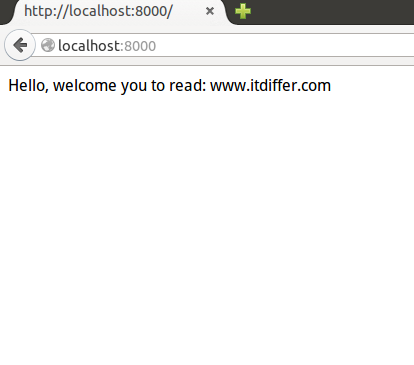
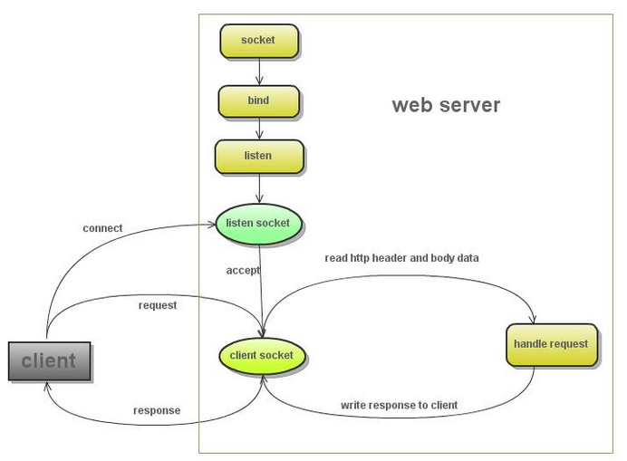
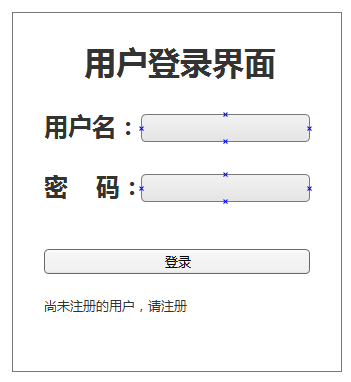
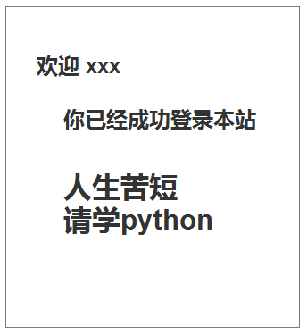
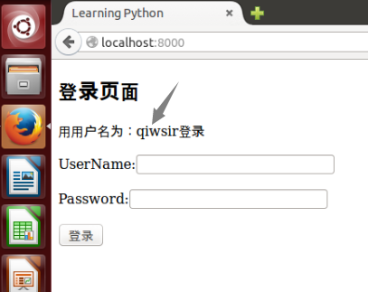
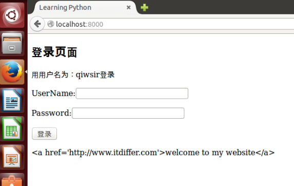
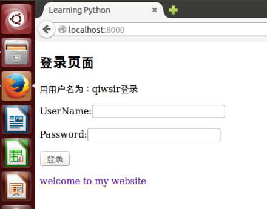
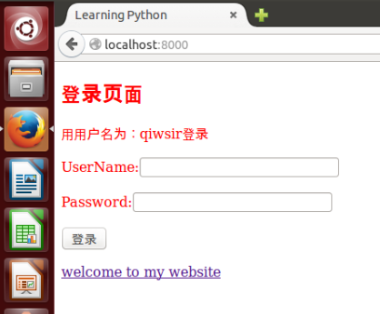
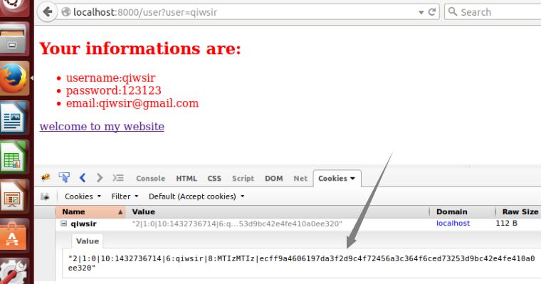

# 十、用 Tornado 做网站

## 为做网站而准备

作为一个程序猿一定要会做网站。这也不一定吧，貌似是，但是，如果被人问及此事，如果说自己不会，的确羞愧难当呀。所以，本教程要讲一讲如何做网站。

> 推荐阅读：[History of the World Wide Web](http://en.wikipedia.org/wiki/History_of_the_World_Wide_Web)

首先，为自己准备一个服务器。这个要求似乎有点过分，作为一个普通的穷苦聊到的程序员，哪里有铜钿来购买服务器呢？没关系，不够买服务器也能做网站，可以购买云服务空间或者虚拟空间，这个在网上搜搜，很多。如果购买这个的铜钿也没有，还可以利用自己的电脑（这总该有了）作为服务服务器。我就是利用一台装有 ubuntu 操作系统的个人电脑作为本教程的案例演示服务器。

然后，要在这个服务器上做一些程序配置。一些必备的网络配置这里就不说了，比如我用的 ubuntu 系统，默认情况都有了。如果读者遇到一些问题，可以搜一下，网上资料多多。另外的配置就是 Python 开发环境，这个应该也有了，前面已经在用了。

接下来，要安装一个框架。本教程中制作网站的案例采用 tornado 框架。

在安装这个框架之前，先了解一些相关知识。

### 开发框架

对框架的认识，由于工作习惯和工作内容的不同，有很大差异，这里姑且截取[维基百科中的一种定义](http://zh.wikipedia.org/wiki/%E8%BB%9F%E9%AB%94%E6%A1%86%E6%9E%B6)，之所以要给出一个定义，无非是让看官有所了解，但是是否知道这个定义，丝毫不影响后面的工作。

> 软件框架（Software framework），通常指的是为了实现某个业界标准或完成特定基本任务的软件组件规范，也指为了实现某个软件组件规范时，提供规范所要求之基础功能的软件产品。
> 
> 框架的功能类似于基础设施，与具体的软件应用无关，但是提供并实现最为基础的软件架构和体系。软件开发者通常依据特定的框架实现更为复杂的商业运用和业务逻辑。这样的软件应用可以在支持同一种框架的软件系统中运行。
> 
> 简而言之，框架就是制定一套规范或者规则（思想），大家（程序员）在该规范或者规则（思想）下工作。或者说就是使用别人搭好的舞台，你来做表演。

我比较喜欢最后一句的解释，别人搭好舞台，我来表演。这也就是说，如果在做软件开发的时候，能够减少工作量。就做网站来讲，其实需要做的事情很多，但是如果有了开发框架，很多底层的事情就不需要做了（都有哪些底层的事情呢？读者能否回答？）。

有高手工程师鄙视框架，认为自己编写的才是王道。这方面不争论，框架是开发中很流行的东西，我还是固执地认为用框架来开发，更划算。

### Python 框架

有人说 php(什么是 php，严肃的说法，这是另外一种语言，更高雅的说法，是某个活动的汉语拼音简称）框架多，我不否认，php 的开发框架的确很多很多。不过，Python 的 web 开发框架，也足够使用了，列举几种常见的 web 框架：

*   Django:这是一个被广泛应用的框架。在网上搜索，会发现很多公司在招聘的时候就说要会这个。框架只是辅助，真正的程序员，用什么框架，都应该是根据需要而来。当然不同框架有不同的特点，需要学习一段时间。
*   Flask：一个用 Python 编写的轻量级 Web 应用框架。基于 Werkzeug WSGI 工具箱和 Jinja2 模板引擎。
*   Web2py：是一个为 Python 语言提供的全功能 Web 应用框架，旨在敏捷快速的开发 Web 应用，具有快速、安全以及可移植的数据库驱动的应用，兼容 Google App Engine。
*   Bottle: 微型 Python Web 框架，遵循 WSGI，说微型，是因为它只有一个文件，除 Python 标准库外，它不依赖于任何第三方模块。
*   Tornado：全称是 Tornado Web Server，从名字上看就可知道它可以用作 Web 服务器，但同时它也是一个 Python Web 的开发框架。最初是在 FriendFeed 公司的网站上使用，FaceBook 收购了之后便开源了出来。
*   webpy: 轻量级的 Python Web 框架。webpy 的设计理念力求精简（Keep it simple and powerful），源码很简短，只提供一个框架所必须的东西，不依赖大量的第三方模块，它没有 URL 路由、没有模板也没有数据库的访问。

说明：以上信息选自：[`blog.jobbole.com/72306/`](http://blog.jobbole.com/72306/)，这篇文章中还有别的框架，由于不是 web 框架，我没有选摘，有兴趣的去阅读。

### Tornado

本教程中将选择使用 Tornado 框架。此前有朋友建议我用 Django，首先它是一个好东西。但是，我更愿意用 Tornado,为什么呢？因为......，看下边或许是理由，或许不是。

Tornado 全称 Tornado Web Server，是一个用 Python 语言写成的 Web 服务器兼 Web 应用框架，由 FriendFeed 公司在自己的网站 FriendFeed 中使用，被 Facebook 收购以后框架以开源软件形式开放给大众。看来 Tornado 的出身高贵呀，对了，某国可能风闻有 Facebook，但是要一睹其芳容，还要努力。

用哪个框架，一般是要结合项目而定。我之选用 Tornado 的原因，就是看中了它在性能方面的优异表现。

Tornado 的性能是相当优异的，因为它试图解决一个被称之为“C10k”问题，就是处理大于或等于一万的并发。一万呀，这可是不小的量。(关于 C10K 问题，看官可以浏览：[C10k problem](http://en.wikipedia.org/wiki/C10k_problem))

下表是和一些其他 Web 框架与服务器的对比，供看官参考（数据来源： [`developers.facebook.com/blog/post/301`](https://developers.facebook.com/blog/post/301) ）

条件：处理器为 AMD Opteron, 主频 2.4GHz, 4 核

| 服务 | 部署 | 请求/每秒 |
| --- | --- | --- |
| Tornado | nginx, 4 进程 | 8213 |
| Tornado | 1 个单线程进程 | 3353 |
| Django | Apache/mod_wsgi | 2223 |
| web.py | Apache/mod_wsgi | 2066 |
| CherryPy | 独立 | 785 |

看了这个对比表格，还有什么理由不选择 Tornado 呢？

就是它了——**Tornado**

### 安装 Tornado

Tornado 的官方网站：[`www.tornadoweb.org`](http://www.tornadoweb.org/en/latest/)

我在自己电脑中（是我目前使用的服务器），用下面方法安装，只需要一句话即可：

```py
pip install tornado 
```

这是因为 Tornado 已经列入 PyPI，因此可以通过 pip 或者 easy_install 来安装。

如果不用这种方式安装，下面的页面中有可以供看官下载的最新源码版本和安装方式：[`pypi.python.org/pypi/tornado/`](https://pypi.Python.org/pypi/tornado/)

此外，在 github 上也有托管，看官可以通过上述页面进入到 github 看源码。

我没有在 windows 操作系统上安装过这个东西，不过，在官方网站上有一句话，可能在告诉读者一些信息：

> Tornado will also run on Windows, although this configuration is not officially supported and is recommended only for development use.

特别建议，在真正的工程中，网站的服务器还是用 Linux 比较好，你懂得（吗？）。

### 技术准备

除了做好上述准备之外，还要有点技术准备：

*   HTML
*   CSS
*   JavaScript

我们在后面实例中，不会搞太复杂的界面和 JavaScript(JS) 操作，所以，只需要基本知识即可。

* * *

总目录

如果你认为有必要打赏我，请通过支付宝：**qiwsir@126.com**,不胜感激。

## 分析 Hello

打开你写 Python 代码用的编辑器，不要问为什么，把下面的代码一个字不差地录入进去，并命名保存为 hello.py(目录自己任意定)。

```py
#!/usr/bin/env Python
#coding:utf-8

import tornado.httpserver
import tornado.ioloop
import tornado.options
import tornado.web

from tornado.options import define, options
define("port", default=8000, help="run on the given port", type=int)

class IndexHandler(tornado.web.RequestHandler):
    def get(self):
        greeting = self.get_argument('greeting', 'Hello')
        self.write(greeting + ', welcome you to read: www.itdiffer.com')

if __name__ == "__main__":
    tornado.options.parse_command_line()
    app = tornado.web.Application(handlers=[(r"/", IndexHandler)])
    http_server = tornado.httpserver.HTTPServer(app)
    http_server.listen(options.port)
    tornado.ioloop.IOLoop.instance().start() 
```

进入到保存 hello.py 文件的目录，执行：

```py
$ python hello.py 
```

用 Python 运行这个文件，其实就已经发布了一个网站，只不过这个网站太简单了。

接下来，打开浏览器，在浏览器中输入：http://localhost:8000，得到如下界面：



我在 ubuntu 的 shell 中还可以用下面方式运行：

```py
$ curl http://localhost:8000/
Hello, welcome you to read: www.itdiffer.com 

$ curl http://localhost:8000/?greeting=Qiwsir
Qiwsir, welcome you to read: www.itdiffer.com 
```

此操作，读者可以根据自己系统而定。

恭喜你，迈出了决定性一步，已经可以用 Tornado 发布网站了。在这里似乎没有做什么部署，只是安装了 Tornado。是的，不需要多做什么，因为 Tornado 就是一个很好的 server，也是一个开发框架。

下面以这个非常简单的网站为例，对用 tornado 做的网站的基本结构进行解释。

### WEB 服务器工作流程

任何一个网站都离不开 Web 服务器，这里所说的不是指那个更计算机一样的硬件设备，是指里面安装的软件，有时候初次接触的看官容易搞混。就来伟大的[维基百科都这么说](http://zh.wikipedia.org/wiki/%E6%9C%8D%E5%8A%A1%E5%99%A8)：

> 有时，这两种定义会引起混淆，如 Web 服务器。它可能是指用于网站的计算机，也可能是指像 Apache 这样的软件，运行在这样的计算机上以管理网页组件和回应网页浏览器的请求。

在具体的语境中，看官要注意分析，到底指的是什么。

关于 Web 服务器比较好的解释，推荐看看百度百科的内容，我这里就不复制粘贴了，具体可以点击连接查阅：[WEB 服务器](http://baike.baidu.com/view/460250.htm)

在 WEB 上，用的最多的就是输入网址，访问某个网站。全世界那么多网站网页，如果去访问，怎么能够做到彼此互通互联呢。为了协调彼此，就制定了很多通用的协议，其中 http 协议，就是网络协议中的一种。关于这个协议的介绍，网上随处就能找到，请自己 google.

网上偷来的[一张图](http://kenby.iteye.com/blog/1159621)（从哪里偷来的，我都告诉你了，多实在呀。哈哈。），显示在下面，简要说明 web 服务器的工作过程



偷个彻底，把原文中的说明也贴上：

1.  创建 listen socket, 在指定的监听端口, 等待客户端请求的到来
2.  listen socket 接受客户端的请求, 得到 client socket, 接下来通过 client socket 与客户端通信
3.  处理客户端的请求, 首先从 client socket 读取 http 请求的协议头, 如果是 post 协议, 还可能要读取客户端上传的数据, 然后处理请求, 准备好客户端需要的数据, 通过 client socket 写给客户端

### 引入模块

```py
import tornado.httpserver
import tornado.ioloop
import tornado.options
import tornado.web 
```

这四个都是 Tornado 的模块，在本例中都是必须的。它们四个在一般的网站开发中，都要用到，基本作用分别是：

*   tornado.httpserver：这个模块就是用来解决 web 服务器的 http 协议问题，它提供了不少属性方法，实现客户端和服务器端的互通。Tornado 的非阻塞、单线程的特点在这个模块中体现。
*   tornado.ioloop：这个也非常重要，能够实现非阻塞 socket 循环，不能互通一次就结束呀。
*   tornado.options：这是命令行解析模块，也常用到。
*   tornado.web：这是必不可少的模块，它提供了一个简单的 Web 框架与异步功能，从而使其扩展到大量打开的连接，使其成为理想的长轮询。

读者看到这里可能有点莫名其妙，对一些属于不理解。没关系，你可以先不用管它，如果愿意管，就把不理解属于放到 google 立面查查看。一定要硬着头皮一字一句地读下去，随着学习和实践的深入，现在不理解的以后就会逐渐领悟理解的。

还有一个模块引入，是用 from...import 完成的

```py
from tornado.options import define, options
define("port", default=8000, help="run on the given port", type=int) 
```

这两句就显示了所谓“命令行解析模块”的用途了。在这里通过 `tornado.options.define()` 定义了访问本服务器的端口，就是当在浏览器地址栏中输入 `http:localhost:8000` 的时候，才能访问本网站，因为 http 协议默认的端口是 80，为了区分，我在这里设置为 8000,为什么要区分呢？因为我的计算机或许你的也是，已经部署了别（或许是 Nginx、Apache）服务器了，它的端口是 80,所以要区分开（也可能是故意不用 80 端口），并且，后面我们还会将 tornado 和 Nginx 联合起来工作，这样两个服务器在同一台计算机上，就要分开喽。

### 定义请求-处理程序类

```py
class IndexHandler(tornado.web.RequestHandler):
    def get(self):
        greeting = self.get_argument('greeting', 'Hello')
        self.write(greeting + ', welcome you to read: www.itdiffer.com') 
```

所谓“请求处理”程序类，就是要定义一个类，专门应付客户端（就是你打开的那个浏览器界面）向服务器提出的请求（这个请求也许是要读取某个网页，也许是要将某些信息存到服务器上），服务器要有相应的程序来接收并处理这个请求，并且反馈某些信息（或者是针对请求反馈所要的信息，或者返回其它的错误信息等）。

于是，就定义了一个类，名字是 IndexHandler，当然，名字可以随便取了，但是，按照习惯，类的名字中的单词首字母都是大写的，并且如果这个类是请求处理程序类，那么就最好用 Handler 结尾，这样在名称上很明确，是干什么的。

类 IndexHandler 继承 `tornado.web.RequestHandler`,其中再定义 `get()` 和 `post()` 两个在 web 中应用最多的方法的内容（关于这两个方法的详细解释，可以参考：[HTTP GET POST 的本质区别详解 href="https://github.com/qiwsir/ITArticles/blob/master/Tornado/DifferenceHttpGetPost.md")，作者在这篇文章中，阐述了两个方法的本质）。

在本例中，只定义了一个 `get()` 方法。

用 `greeting = self.get_argument('greeting', 'Hello')` 的方式可以得到 url 中传递的参数，比如

```py
$ curl http://localhost:8000/?greeting=Qiwsir
Qiwsir, welcome you to read: www.itdiffer.com 
```

就得到了在 url 中为 greeting 设定的值 Qiwsir。如果 url 中没有提供值，就是 Hello.

官方文档对这个方法的描述如下：

> RequestHandler.get_argument(name, default=, []strip=True)
> 
> Returns the value of the argument with the given name.
> 
> If default is not provided, the argument is considered to be required, and we raise a MissingArgumentError if it is missing.
> 
> If the argument appears in the url more than once, we return the last value.
> 
> The returned value is always unicode.

接下来的那句 `self.write(greeting + ',weblcome you to read: www.itdiffer.com)'`中，`write()` 方法主要功能是向客户端反馈信息。也浏览一下官方文档信息，对以后正确理解使用有帮助：

> RequestHandler.write(chunk)[source]
> 
> Writes the given chunk to the output buffer.
> 
> To write the output to the network, use the flush() method below.
> 
> If the given chunk is a dictionary, we write it as JSON and set the Content-Type of the response to be application/json. (if you want to send JSON as a different Content-Type, call set_header after calling write()).

### main() 方法

`if __name__ == "__main__"`,这个方法跟以往执行 Python 程序是一样的。

`tornado.options.parse_command_line()`,这是在执行 tornado 的解析命令行。在 tornado 的程序中，只要 import 模块之后，就会在运行的时候自动加载，不需要了解细节，但是，在 main（）方法中如果有命令行解析，必须要提前将模块引入。

### Application 类

下面这句是重点：

```py
app = tornado.web.Application(handlers=[(r"/", IndexHandler)]) 
```

将 tornado.web.Application 类实例化。这个实例化，本质上是建立了整个网站程序的请求处理集合，然后它可以被 HTTPServer 做为参数调用，实现 http 协议服务器访问。Application 类的`__init__`方法参数形式：

```py
def __init__(self, handlers=None, default_host="", transforms=None,**settings):
    pass 
```

在一般情况下，handlers 是不能为空的，因为 Application 类通过这个参数的值处理所得到的请求。例如在本例中，`handlers=[(r"/", IndexHandler)]`，就意味着如果通过浏览器的地址栏输入根路径（`http://localhost:8000` 就是根路径，如果是 `http://localhost:8000/qiwsir`，就不属于根，而是一个子路径或目录了），对应着就是让名字为 IndexHandler 类处理这个请求。

通过 handlers 传入的数值格式，一定要注意，在后面做复杂结构的网站是，这里就显得重要了。它是一个 list，list 里面的元素是 tuple，tuple 的组成包括两部分，一部分是请求路径，另外一部分是处理程序的类名称。注意请求路径可以用正则表达式书写(关于正则表达式，后面会进行简要介绍)。举例说明：

```py
handlers = [
    (r"/", IndexHandlers),              #来自根路径的请求用 IndesHandlers 处理
    (r"/qiwsir/(.*)", QiwsirHandlers),  #来自 /qiwsir/ 以及其下任何请求（正则表达式表示任何字符）都由 QiwsirHandlers 处理
] 
```

**注意**

在这里我使用了 `r"/"`的样式，意味着就不需要使用转义符，r 后面的都表示该符号本来的含义。例如，\n，如果单纯这么来使用，就以为着换行，因为符号“\”具有转义功能（关于转义详细阅读《字符串(1)》），当写成 `r"\n"` 的形式是，就不再表示换行了，而是两个字符，\ 和 n，不会转意。一般情况下，由于正则表达式和 \ 会有冲突，因此，当一个字符串使用了正则表达式后，最好在前面加上'r'。

关于 Application 类的介绍，告一段落，但是并未完全讲述了，因为还有别的参数设置没有讲，请继续关注后续内容。

### HTTPServer 类

实例化之后，Application 对象（用 app 做为标签的）就可以被另外一个类 HTTPServer 引用，形式为：

```py
http_server = tornado.httpserver.HTTPServer(app) 
```

HTTPServer 是 tornado.httpserver 里面定义的类。HTTPServer 是一个单线程非阻塞 HTTP 服务器，执行 HTTPServer 一般要回调 Application 对象，并提供发送响应的接口,也就是下面的内容是跟随上面语句的（options.port 的值在 IndexHandler 类前面通过 from...import.. 设置的）。

```py
http_server.listen(options.port) 
```

这种方法，就建立了单进程的 http 服务。

请看官牢记，如果在以后编码中，遇到需要多进程，请参考官方文档说明：[`tornado.readthedocs.org/en/latest/httpserver.html#http-server`](http://tornado.readthedocs.org/en/latest/httpserver.html#http-server)

### IOLoop 类

剩下最后一句了：

```py
tornado.ioloop.IOLoop.instance().start() 
```

这句话，总是在`__main()__`的最后一句。表示可以接收来自 HTTP 的请求了。

以上把一个简单的 hello.py 剖析。想必读者对 Tornado 编写网站的基本概念已经有了。

如果一头雾水，也不要着急，以来将上面的内容多看几遍。对整体结构有一个基本了解，不要拘泥于细节或者某些词汇含义。然后即继续学习。

* * *

总目录

如果你认为有必要打赏我，请通过支付宝：**qiwsir@126.com**,不胜感激。

## 用 tornado 做网站 (1)

从现在开始，做一个网站，当然，这个网站只能算是一个毛坯的，可能很简陋，但是网站的主要元素，它都会涉及到，读者通过此学习，能够了解网站的开发基本结构和内容，并且对前面的知识可以有综合应用。

### 基本结构

下面是一个网站的基本结构


**前端**

这是一个不很严格的说法，但是在日常开发中，都这么说。在网站中，所谓前端就是指用浏览器打开之后看到的那部分，它是呈现网站传过来的信息的界面，也是用户和网站之间进行信息交互的界面。撰写前端，一般使用 HTML/CSS/JS，当然，非要用 Python 也不是不可以（例如上节中的例子，就没有用 HTML/CSS/JS），但这势必造成以后维护困难。

MVC 模式是一个非常好的软件架构模式，在网站开发中，也常常要求遵守这个模式。请阅读维基百科的解释：

> MVC 模式（Model-View-Controller）是软件工程中的一种软件架构模式，把软件系统分为三个基本部分：模型（Model）、视图（View）和控制器（Controller）。
> 
> MVC 模式最早由 Trygve Reenskaug 在 1978 年提出，是施乐帕罗奥多研究中心（Xerox PARC）在 20 世纪 80 年代为程序语言 Smalltalk 发明的一种软件设计模式。MVC 模式的目的是实现一种动态的程式设计，使后续对程序的修改和扩展简化，并且使程序某一部分的重复利用成为可能。除此之外，此模式通过对复杂度的简化，使程序结构更加直观。软件系统通过对自身基本部分分离的同时也赋予了各个基本部分应有的功能。专业人员可以通过自身的专长分组：
> 
> *   （控制器 Controller）- 负责转发请求，对请求进行处理。
> *   （视图 View） - 界面设计人员进行图形界面设计。 -（模型 Model） - 程序员编写程序应有的功能（实现算法等等）、数据库专家进行数据管理和数据库设计(可以实现具体的功能)。

所谓“前端”，就对大概对应着 View 部分，之所以说是大概，因为 MVC 是站在一个软件系统的角度进行划分的，上图中的前后端，与其说是系统部分的划分，不如严格说是系统功能的划分。

前端所实现的功能主要有：

*   呈现内容。这些内容是根据 url，由后端从数据库中提取出来的。前端将其按照一定的样式呈现出来。另外，有一些内容，不是后端数据库提供的，是写在前端的。
*   用户与网站交互。现在的网站，这是必须的，比如用户登录。当用户在指定的输入框中输入信息之后，该信息就是被前端提交给后端，后端对这个信息进行处理之后，在一般情况下都要再反馈给前端一个处理结果，然后前端呈现给用户。

**后端**

这里所说的后端，对应着 MVC 中的 Controller 和 Model 的部分或者全部功能，因为在我们的图中，“后端”是一个狭隘的概念，没有把数据库放在其内。

不在这些术语上纠结。

在我们这里，后端就是用 Python 写的程序。主要任务就是根据需要处理由前端发过来的各种请求，根据请求的处理结果，一方面操作数据库（对数据库进行增删改查），另外一方面把请求的处理结果反馈给前端。

**数据库**

工作比较单一，就是面对后端的 Python 程序，任其增删改查。

关于 Python 如何操作数据库，在本教程的第贰季第柒章中已经有详细的叙述，请读者阅览。

### 一个基本框架

上节中，显示了一个只能显示一行字的网站，那个网站由于功能太单一，把所有的东西都写到一个文件中。在真正的工程开发中，如果那么做，虽然不是不可，但开发过程和后期维护会遇到麻烦，特别是不便于多人合作。

所以，要做一个基本框架。以后网站就在这个框架中开发。

建立一个目录，在这个目录中建立一些子目录和文件。

```py
/.
|
handlers
|
methods
|
statics
|
templates
|
application.py
|
server.py
|
url.py 
```

这个结构建立好，就摆开了一个做网站的架势。有了这个架势，后面的事情就是在这个基础上添加具体内容了。当然，还可以用另外一个更好听的名字，称之为设计。

依次说明上面的架势中每个目录和文件的作用（当然，这个作用是我规定的，读者如果愿意，也可以根据自己的意愿来任意设计）：

*   handlers：我准备在这个文件夹中放前面所说的后端 Python 程序，主要处理来自前端的请求，并且操作数据库。
*   methods：这里准备放一些函数或者类，比如用的最多的读写数据库的函数，这些函数被 handlers 里面的程序使用。
*   statics：这里准备放一些静态文件，比如图片，css 和 javascript 文件等。
*   templates：这里放模板文件，都是以 html 为扩展名的，它们将直接面对用户。

另外，还有三个 Python 文件，依次写下如下内容。这些内容的功能，已经在上节中讲过，只是这里进行分门别类。

**url.py** 文件

```py
#!/usr/bin/env Python
# coding=utf-8
"""
the url structure of website
"""

import sys     #utf-8，兼容汉字
reload(sys)
sys.setdefaultencoding("utf-8")

from handlers.index import IndexHandler    #假设已经有了

url = [
    (r'/', IndexHandler),
] 
```

url.py 文件主要是设置网站的目录结构。`from handlers.index import IndexHandler`，虽然在 handlers 文件夹还没有什么东西，为了演示如何建立网站的目录结构，假设在 handlers 文件夹里面已经有了一个文件 index.py，它里面还有一个类 IndexHandler。在 url.py 文件中，将其引用过来。

变量 url 指向一个列表，在列表中列出所有目录和对应的处理类。比如 `(r'/', IndexHandler),`，就是约定网站根目录的处理类是 IndexHandler，即来自这个目录的 get() 或者 post() 请求，均有 IndexHandler 类中相应方法来处理。

如果还有别的目录，如法炮制。

**application.py** 文件

```py
#!/usr/bin/env Python
# coding=utf-8

from url import url

import tornado.web
import os

settings = dict(
    template_path = os.path.join(os.path.dirname(__file__), "templates"),
    static_path = os.path.join(os.path.dirname(__file__), "statics")
    )

application = tornado.web.Application(
    handlers = url,
    **settings
    ) 
```

从内容中可以看出，这个文件完成了对网站系统的基本配置，建立网站的请求处理集合。

`from url import url` 是将 url.py 中设定的目录引用过来。

setting 引用了一个字典对象，里面约定了模板和静态文件的路径，即声明已经建立的文件夹"templates"和"statics"分别为模板目录和静态文件目录。

接下来的 application 就是一个请求处理集合对象。请注意 `tornado.web.Application()` 的参数设置：

> tornado.web.Application(handlers=None, default_host='', transforms=None, **settings)

关于 settings 的设置，不仅仅是文件中的两个，还有其它，比如，如果填上 `debug = True` 就表示出于调试模式。调试模式的好处就在于有利于开发调试，但是，在正式部署的时候，最好不要用调试模式。其它更多的 settings 可以参看官方文档：[tornado.web-RequestHandler and Application classes](http://tornado.readthedocs.org/en/latest/web.html)

**server.py** 文件

这个文件的作用是将 tornado 服务器运行起来，并且囊括前面两个文件中的对象属性设置。

```py
#!/usr/bin/env Python
# coding=utf-8

import tornado.ioloop
import tornado.options
import tornado.httpserver

from application import application

from tornado.options import define, options

define("port", default = 8000, help = "run on the given port", type = int)

def main():
    tornado.options.parse_command_line()
    http_server = tornado.httpserver.HTTPServer(application)
    http_server.listen(options.port)

    print "Development server is running at http://127.0.0.1:%s" % options.port
    print "Quit the server with Control-C"

    tornado.ioloop.IOLoop.instance().start()

if __name__ == "__main__":
    main() 
```

此文件中的内容，在上节已经介绍，不再赘述。

如此这般，就完成了网站架势的搭建。

后面要做的是向里面添加内容。

* * *

总目录

如果你认为有必要打赏我，请通过支付宝：**qiwsir@126.com**,不胜感激。

## 用 tornado 做网站 (2)

既然摆好了一个网站的架势，下面就可以向里面填内容。

### 连接数据库

要做的网站，有数据库支持，虽然这不是必须的，但是如果做一个功能强悍的网站，数据库就是必须的了。

接下来的网站，我暂且采用 mysql 数据库。

怎么连接 mysql 数据呢？其方法跟《mysql 数据库(1)》中的方法完全一致。为了简单，我也不新建数据库了，就利用已经有的那个数据库。

在上一节中已经建立的文件夹 methods 中建立一个文件 db.py，并且参考《mysql 数据库 (1)》的内容，分别建立起连接对象和游标对象。代码如下：

```py
#!/usr/bin/env Python
# coding=utf-8

import MySQLdb

conn = MySQLdb.connect(host="localhost", user="root", passwd="123123", db="qiwsirtest", port=3306, charset="utf8")    #连接对象

cur = conn.cursor()    #游标对象 
```

### 用户登录

#### 前端

很多网站上都看到用户登录功能，这里做一个简单的登录，其功能描述为：

> 当用户输入网址，呈现在眼前的是一个登录界面。在用户名和密码两个输入框中分别输入了正确的用户名和密码之后，点击确定按钮，登录网站，显示对该用户的欢迎信息。

用图示来说明，首先呈现下图：



用户点击“登录”按钮，经过验证是合法用户之后，就呈现这样的界面：



先用 HTML 写好第一个界面。进入到 templates 文件，建立名为 index.html 的文件：

```py
<!DOCTYPE html>
<head>
    <meta charset="UTF-8">
    <meta name="viewport" content="width=device-width, initial-scale=1" />
    <title>Learning Python</title>
</head>
<body>
    <h2>Login</h2>
    <form method="POST">
        <p><span>UserName:</span><input type="text" id="username"/></p>
        <p><span>Password:</span><input type="password" id="password" /></p>
        <p><input type="BUTTON" value="LOGIN" id="login" /></p>
    </form>
</body> 
```

这是一个很简单前端界面。要特别关注 `<meta name="viewport" content="width=device-width, initial-scale=1" />`，其目的在将网页的默认宽度(viewport)设置为设备的屏幕宽度(width=device-width)，并且原始缩放比例为 1.0(initial-scale=1)，即网页初始大小占屏幕面积的 100%。这样做的目的，是让在电脑、手机等不同大小的屏幕上，都能非常好地显示。

这种样式的网页，就是“自适应页面”。当然，自适应页面绝非是仅仅有这样一行代码就完全解决的。要设计自适应页面，也就是要进行“响应式设计”，还需要对 CSS、JS 乃至于其它元素如表格、图片等进行设计，或者使用一些响应式设计的框架。这个目前暂不讨论，读者可以网上搜索有关资料阅读。

> 一提到要能够在手机上，读者是否想到了 HTML5 呢，这个被一些人热捧、被另一些人蔑视的家伙，毋庸置疑，现在已经得到了越来越广泛的应用。
> 
> HTML5 是 HTML 最新的修订版本，2014 年 10 月由万维网联盟（W3C）完成标准制定。目标是取代 1999 年所制定的 HTML 4.01 和 XHTML 1.0 标准，以期能在互联网应用迅速发展的时候，使网络标准达到符合当代的网络需求。广义论及 HTML5 时，实际指的是包括 HTML、CSS 和 JavaScript 在内的一套技术组合。
> 
> 响应式网页设计（英语：Responsive web design，通常缩写为 RWD），又称为自适应网页设计、回应式网页设计。 是一种网页设计的技术做法，该设计可使网站在多种浏览设备（从桌面电脑显示器到移动电话或其他移动产品设备）上阅读和导航，同时减少缩放、平移和滚动。

如果要看效果，可以直接用浏览器打开网页，因为它是 .html 格式的文件。

#### 引入 jQuery

虽然完成了视觉上的设计，但是，如果点击那个 login 按钮，没有任何反应。因为它还仅仅是一个孤立的页面，这时候需要一个前端交互利器——javascript。

> 对于 javascript，不少人对它有误解，总认为它是从 java 演化出来的。的确，两个有相像的地方。但 javascript 和 java 的关系，就如同“雷峰塔”和“雷锋”的关系一样。详细读一读来自维基百科的诠释。
> 
> JavaScript，一种直译式脚本语言，是一种动态类型、弱类型、基于原型的语言，内置支持类。它的解释器被称为 JavaScript 引擎，为浏览器的一部分，广泛用于客户端的脚本语言，最早是在 HTML 网页上使用，用来给 HTML 网页增加动态功能。然而现在 JavaScript 也可被用于网络服务器，如 Node.js。
> 
> 在 1995 年时，由网景公司的布兰登·艾克，在网景导航者浏览器上首次设计实现而成。因为网景公司与昇阳公司合作，网景公司管理层希望它外观看起来像 Java，因此取名为 JavaScript。但实际上它的语义与 Self 及 Scheme 较为接近。
> 
> 为了获取技术优势，微软推出了 JScript，与 JavaScript 同样可在浏览器上运行。为了统一规格，1997 年，在 ECMA（欧洲计算机制造商协会）的协调下，由网景、昇阳、微软和 Borland 公司组成的工作组确定统一标准：ECMA-262。因为 JavaScript 兼容于 ECMA 标准，因此也称为 ECMAScript。

但是，我更喜欢用 jQuery，因为它的确让我省了不少事。

> jQuery 是一套跨浏览器的 JavaScript 库，简化 HTML 与 JavaScript 之间的操作。由约翰·雷西格（John Resig）在 2006 年 1 月的 BarCamp NYC 上发布第一个版本。目前是由 Dave Methvin 领导的开发团队进行开发。全球前 10,000 个访问最高的网站中，有 65% 使用了 jQuery，是目前最受欢迎的 JavaScript 库。

在 index.html 文件中引入 jQuery 的方法有多种。

原则上将，可以在 HTML 文件的任何地方引入 jQuery 库，但是通常放置的地方在 html 文件的开头 `<head>...</head>` 中，或者在文件的末尾 `</body>` 以内。放在开头，如果所用的库比较大、比较多，在载入页面时时间相对长点。

第一种引入方法，是国际化的一种：

```py
<script src="http://ajax.googleapis.com/ajax/libs/jquery/1.11.2/jquery.min.js"></script> 
```

这是直接从 jQuery CDN(Content Delivery Network)上直接引用，好处在于如果这个库更新，你不用任何操作，就直接使用最新的了。但是，如果在你的网页中这么用了，如果在某个有很多自信的国家上网，并且没有梯子，会发现网页几乎打不开，就是因为连接上面那个地址的通道是被墙了。

当然，jQuery CDN 不止一个，比如官方网站的：

```py
<script src="//code.jquery.com/jquery-1.11.3.min.js"></script> 
```

第二种引入方法，就是将 jQuery 下载下来，放在指定地方（比如，与自己网站在同一个存储器中，或者自己可以访问的另外服务器）。到官方网站（[`jqueryui.com/`](https://jqueryui.com/)）下载最新的库，然后将它放在已经建立的 statics 目录内，为了更清楚区分，可以在里面建立一个子目录 js，jquery 库放在 js 子目录里面。下载的时候，建议下载以 min.js 结尾的文件，因为这个是经过压缩之后，体积小。

我在 `statics/js` 目录中放置了下载的库，并且为了简短，更名为 jquery.min.js。

本来可以用下面的方法引入：

```py
<script src="statics/js/jquery.min.js"></script> 
```

如果这样写，也是可以的。但是，考虑到 tornado 的特点，用下面方法引入，更具有灵活性：

```py
<script src="{{static_url("js/jquery.min.js")}}"></script> 
```

不仅要引入 jquery，还需要引入自己写的 js 指令，所以要建立一个文件，我命名为 script.js，也同时引用过来。虽然目前这个文件还是空的。

```py
<script src="{{static_url("js/script.js")}}"></script> 
```

这里用的 static_url 是一个函数，它是 tornado 模板提供的一个函数。用这个函数，能够制定静态文件。之所以用它，而不是用上面的那种直接调用的方法，主要原因是如果某一天，将静态文件目录 statics 修改了，也就是不指定 statics 为静态文件目录了，定义别的目录为静态文件目录。只需要在定义静态文件目录那里修改（定义静态文件目录的方法请参看上一节），而其它地方的代码不需要修改。

#### 编写 js

先写一个测试性质的东西。

用编辑器打开 statics/js/script.js 文件，如果没有就新建。输入的代码如下：

```py
$(document).ready(function(){
    alert("good");
    $("#login").click(function(){
        var user = $("#username").val();
        var pwd = $("#password").val();
        alert("username: "+user);
    });
}); 
```

由于本教程不是专门讲授 javascript 或者 jquery，所以，在 js 代码部分，只能一带而过，不详细解释。

上面的代码主要实现获取表单中 id 值分别为 username 和 password 所输入的值，alert 函数的功能是把值以弹出菜单的方式显示出来。

### hanlers 里面的程序

是否还记得在上一节中，在 url.py 文件中，做了这样的设置：

```py
from handlers.index import IndexHandler    #假设已经有了

url = [
    (r'/', IndexHandler),
] 
```

现在就去把假设有了的那个文件建立起来，即在 handlers 里面建立 index.py 文件，并写入如下代码：

```py
#!/usr/bin/env Python
# coding=utf-8

import tornado.web

class IndexHandler(tornado.web.RequestHandler):
    def get(self):
        self.render("index.html") 
```

当访问根目录的时候（不论输入 `localhost:8000`，还是 `http://127.0.0.1:8000`，或者网站域名），就将相应的请求交给了 handlers 目录中的 index.py 文件中的 IndexHandler 类的 get() 方法来处理，它的处理结果是呈现 index.html 模板内容。

`render()` 函数的功能在于向请求者反馈网页模板，并且可以向模板中传递数值。关于传递数值的内容，在后面介绍。

上面的文件保存之后，回到 handlers 目录中。因为这里面的文件要在别处被当做模块引用，所以，需要在这里建立一个空文件，命名为`__init__.py`。这个文件非常重要。在编写模块一节中，介绍了引用模块的方法。但是，那些方法有一个弊端，就是如果某个目录中有多个文件，就显得麻烦了。其实 Python 已经想到这点了，于是就提供了`__init__.py` 文件，只要在该目录中加入了这个文件，该目录中的其它 .py 文件就可以作为模块被 Python 引入了。

至此，一个带有表单的 tornado 网站就建立起来了。读者可以回到上一级目录中，找到 server.py 文件，运行它：

```py
$ python server.py
Development server is running at http://127.0.0.1:8000
Quit the server with Control-C 
```

如果读者在前面的学习中，跟我的操作完全一致，就会在 shell 中看到上面的结果。

打开浏览器，输入 `http://localhost:8000` 或者 `http://127.0.0.1:8000`，看到的应该是：


这就是 script.js 中的开始起作用了，第一句是要弹出一个对话框。点击“确定”按钮之后，就是：


在这个页面输入用户名和密码，然后点击 Login 按钮，就是：


一个网站有了雏形。不过，当提交表单的反应，还仅仅停留在客户端，还没有向后端传递客户端的数据信息。请继续学习下一节。

* * *

总目录

如果你认为有必要打赏我，请通过支付宝：**qiwsir@126.com**,不胜感激。

## 用 tornado 做网站 (3)

### 数据传输

在已经建立了前端表单之后，就要实现前端和后端之间的数据传递。在工程中，常用到一个被称之为 ajax() 的方法。

关于 ajax 的故事，需要浓墨重彩，因为它足够精彩。

ajax 是“Asynchronous Javascript and XML”（异步 JavaScript 和 XML）的缩写，在它的发展历程中，汇集了众家贡献。比如微软的 IE 团队曾经将 XHR(XML HttpRequest) 用于 web 浏览器和 web 服务器间传输数据，并且被 W3C 标准采用。当然，也有其它公司为 Ajax 技术做出了贡献，虽然它们都被遗忘了，比如 Oddpost，后来被 Yahoo!收购并成为 Yahoo! Mail 的基础。但是，真正让 Ajax 大放异彩的 google 是不能被忽视的，正是 google 在 Gmail、Suggest 和 Maps 上大规模使用了 Ajax，才使得人们看到了它的魅力，程序员由此而兴奋。

技术总是在不断进化的，进化的方向就是用着越来越方便。

回到上一节使用的 jQuery，里面就有 ajax() 方法，能够让程序员方便的调用。

> ajax() 方法通过 HTTP 请求加载远程数据。
> 
> 该方法是 jQuery 底层 AJAX 实现。简单易用的高层实现见 $.get, $.post 等。$.ajax() 返回其创建的 XMLHttpRequest 对象。大多数情况下你无需直接操作该函数，除非你需要操作不常用的选项，以获得更多的灵活性。
> 
> 最简单的情况下，$.ajax() 可以不带任何参数直接使用。

在上文介绍 Ajax 的时候，用到了一个重要的术语——“异步”，与之相对应的叫做“同步”。我引用来自[阮一峰的网络日志](http://www.ruanyifeng.com/blog/2012/12/asynchronous%EF%BC%BFjavascript.html)中的通俗描述：

> "同步模式"就是上一段的模式，后一个任务等待前一个任务结束，然后再执行，程序的执行顺序与任务的排列顺序是一致的、同步的；"异步模式"则完全不同，每一个任务有一个或多个回调函数（callback），前一个任务结束后，不是执行后一个任务，而是执行回调函数，后一个任务则是不等前一个任务结束就执行，所以程序的执行顺序与任务的排列顺序是不一致的、异步的。
> 
> "异步模式"非常重要。在浏览器端，耗时很长的操作都应该异步执行，避免浏览器失去响应，最好的例子就是 Ajax 操作。在服务器端，"异步模式"甚至是唯一的模式，因为执行环境是单线程的，如果允许同步执行所有 http 请求，服务器性能会急剧下降，很快就会失去响应。

看来，ajax() 是前后端进行数据传输的重要角色。

承接上一节的内容，要是用 ajax() 方法，需要修改 script.js 文件内容即可：

```py
$(document).ready(function(){
    $("#login").click(function(){
        var user = $("#username").val();
        var pwd = $("#password").val();
        var pd = {"username":user, "password":pwd};
        $.ajax({
            type:"post",
            url:"/",
            data:pd,
            cache:false,
            success:function(data){
                alert(data);
            },
            error:function(){
                alert("error!");
            },
        });
    });
}); 
```

在这段代码中，`var pd = {"username":user, "password":pwd};`意即将得到的 user 和 pwd 值，放到一个 json 对象中（关于 json，请阅读《标准库(8)》），形成了一个 json 对象。接下来就是利用 ajax() 方法将这个 json 对象传给后端。

jQuery 中的 ajax() 方法使用比较简单，正如上面代码所示，只需要 `$.ajax()` 即可，不过需要对立面的参数进行说明。

*   type：post 还是 get。关于 post 和 get 的区别，可以阅读：[HTTP POST GET 本质区别详解 href="https://github.com/qiwsir/ITArticles/blob/master/Tornado/DifferenceHttpGetPost.md")
*   url：post 或者 get 的地址
*   data：传输的数据，包括三种：（1）html 拼接的字符串；（2）json 数据；（3）form 表单经 serialize() 序列化的。本例中传输的就是 json 数据，这也是经常用到的一种方式。
*   cache：默认为 true，如果不允许缓存，设置为 false.
*   success：请求成功时执行回调函数。本例中，将返回的 data 用 alert 方式弹出来。读者是否注意到，我在很多地方都用了 alert() 这个东西，目的在于调试，走一步看一步，看看得到的数据是否如自己所要。也是有点不自信呀。
*   error：如果请求失败所执行的函数。

### 后端接受数据

前端通过 ajax 技术，将数据已 json 格式传给了后端，并且指明了对象目录`"/"`，这个目录在 url.py 文件中已经做了配置，是由 handlers 目录的 index.py 文件的 IndexHandler 类来出来。因为是用 post 方法传的数据，那么在这个类中就要有 post 方法来接收数据。所以，要在 IndexHandler 类中增加 post()，增加之后的完善代码是：

```py
#!/usr/bin/env Python
# coding=utf-8

import tornado.web

class IndexHandler(tornado.web.RequestHandler):
    def get(self):
        self.render("index.html")

    def post(self):
        username = self.get_argument("username")
        password = self.get_argument("password")
        self.write(username) 
```

在 post() 方法中，使用 get_argument() 函数来接收前端传过来的数据，这个函数的完整格式是 `get_argument(name, default=[], strip=True)`，它能够获取 name 的值。在上面的代码中，name 就是从前端传到后端的那个 json 对象的键的名字，是哪个键就获取该键的值。如果获取不到 name 的值，就返回 default 的值，但是这个值默认是没有的，如果真的没有就会抛出 HTTP 400。特别注意，在 get 的时候，通过 get_argument() 函数获得 url 的参数，如果是多个参数，就获取最后一个的值。要想获取多个值，可以使用 `get_arguments(name, strip=true)`。

上例中分别用 get_argument() 方法得到了 username 和 password，并且它们都是 unicode 编码的数据。

tornado.web.RequestHandler 的方法 write()，即上例中的 `self.write(username)`，是后端向前端返回数据。这里返回的实际上是一个字符串，也可返回 json 字符串。

如果读者要查看修改代码之后的网站效果，最有效的方式先停止网站（ctrl+c），在从新执行 `Python server.py` 运行网站，然后刷新浏览器即可。这是一种较为笨拙的方法。一种灵巧的方法是开启调试模式。是否还记得？在设置 setting 的时候，写上 `debug = True` 就表示是调试模式了（参阅：用 tornado 做网站 (1)）。但是，调试模式也不是十全十美，如果修改模板，就不会加载，还需要重启服务。反正重启也不麻烦，无妨啦。

看看上面的代码效果：


这是前端输入了用户名和密码之后，点击 login 按钮，提交给后端，后端再向前端返回数据之后的效果。就是我们想要的结果。

### 验证用户名和密码

按照流程，用户在前端输入了用户名和密码，并通过 ajax 提交到了后端，后端借助于 get_argument() 方法得到了所提交的数据（用户名和密码）。下面要做的事情就是验证这个用户名和密码是否合法，其体现在：

*   数据库中是否有这个用户
*   密码和用户先前设定的密码（已经保存在数据库中）是否匹配

这个验证工作完成之后，才能允许用户登录，登录之后才能继续做某些事情。

首先，在 methods 目录中（已经有了一个 db.py）创建一个文件，我命名为 readdb.py，专门用来存储读数据用的函数（这种划分完全是为了明确和演示一些应用方法，读者也可以都写到 db.py 中）。这个文件的代码如下：

```py
#!/usr/bin/env Python
# coding=utf-8

from db import *

def select_table(table, column, condition, value ):
    sql = "select " + column + " from " + table + " where " + condition + "='" + value + "'"
    cur.execute(sql)
    lines = cur.fetchall()
    return lines 
```

上面这段代码，建议读者可以写上注释，以检验自己是否能够将以往的知识融会贯通地应用。恕我不再解释。

有了这段代码之后，就进一步改写 index.py 中的 post() 方法。为了明了，将 index.py 的全部代码呈现如下：

```py
#!/usr/bin/env Python
# coding=utf-8

import tornado.web
import methods.readdb as mrd

class IndexHandler(tornado.web.RequestHandler):
    def get(self):
        self.render("index.html")

    def post(self):
        username = self.get_argument("username")
        password = self.get_argument("password")
        user_infos = mrd.select_table(table="users",column="*",condition="username",value=username)
        if user_infos:
            db_pwd = user_infos[0][2]
            if db_pwd == password:
                self.write("welcome you: " + username)
            else:
                self.write("your password was not right.")
        else:
            self.write("There is no thi user.") 
```

特别注意，在 methods 目录中，不要缺少了`__init__.py`文件，才能在 index.py 中实现 `import methods.readdb as mrd`。

代码修改到这里，看到的结果是：


这是正确输入用户名（所谓正确，就是输入的用户名和密码合法，即在数据库中有该用户名，且密码匹配），并提交数据后，反馈给前端的欢迎信息。


如果输入的密码错误了，则如此提示。


这是随意输入的结果，数据库中无此用户。

需要特别说明一点，上述演示中，数据库中的用户密码并没有加密。关于密码加密问题，后续要研究。

* * *

总目录

如果你认为有必要打赏我，请通过支付宝：**qiwsir@126.com**,不胜感激。

## 用 tornado 做网站 (4)

### 模板

已经基本了解前端向和后端如何传递数据，以及后端如何接收数据的过程和方法之后。我突然发现，前端页面写的太难看了。俗话说“外行看热闹，内行看门道”。程序员写的网站，在更多时候是给“外行”看的，他们可没有耐心来看代码，他们看的就是界面，因此界面是否做的漂亮一点点，是直观重要的。

其实，也不仅仅是漂亮的原因，因为前端页面，还要显示从后端读取出来的数据呢。

恰好，tornado 提供比较好用的前端模板(tornado.template)。通过这个模板，能够让前端编写更方便。

#### render()

render() 方法能够告诉 tornado 读入哪个模板，插入其中的模板代码，并返回结果给浏览器。比如在 IndexHandler 类中 get() 方法里面的 `self.render("index.html")`，就是让 tornado 到 templates 目中找到名为 index.html 的文件，读出它的内容，返回给浏览器。这样用户就能看到 index.html 所规定的页面了。当然，在前面所写的 index.html 还仅仅是 html 标记，没有显示出所谓“模板”的作用。为此，将 index.html 和 index.py 文件做如下改造。

```py
#!/usr/bin/env Python
# coding=utf-8

import tornado.web
import methods.readdb as mrd

class IndexHandler(tornado.web.RequestHandler):
    def get(self):
        usernames = mrd.select_columns(table="users",column="username")
        one_user = usernames[0][0]
        self.render("index.html", user=one_user) 
```

index.py 文件中，只修改了 get() 方法，从数据库中读取用户名，并且提出一个用户（one_user），然后通过 `self.render("index.html", user=one_user)` 将这个用户名放到 index.html 中，其中 `user=one_user` 的作用就是传递对象到模板。

提醒读者注意的是，在上面的代码中，我使用了 `mrd.select_columns(table="users",column="username")`，也就是说必须要在 methods 目录中的 readdb.py 文件中有一个名为 select_columns 的函数。为了使读者能够理解，贴出已经修改之后的 readdb.py 文件代码，比上一节多了函数 select_columns：

```py
#!/usr/bin/env Python
# coding=utf-8

from db import *

def select_table(table, column, condition, value ):
    sql = "select " + column + " from " + table + " where " + condition + "='" + value + "'"
    cur.execute(sql)
    lines = cur.fetchall()
    return lines

def select_columns(table, column ):
    sql = "select " + column + " from " + table
    cur.execute(sql)
    lines = cur.fetchall()
    return lines 
```

下面是 index.html 修改后的代码：

```py
<!DOCTYPE html>
<head>
    <meta charset="UTF-8">
    <meta name="viewport" content="width=device-width, initial-scale=1" />
    <title>Learning Python</title>
</head>
<body>
    <h2> 登录页面</h2>
    <p>用用户名为：{{user}}登录</p>
    <form method="POST">
        <p><span>UserName:</span><input type="text" id="username"/></p>
        <p><span>Password:</span><input type="password" id="password" /></p>
        <p><input type="BUTTON" value="登录" id="login" /></p>
    </form>
    <script src="{{static_url("js/jquery.min.js")}}"></script>
    <script src="{{static_url("js/script.js")}}"></script>
</body> 
```

`<p> 用用户名为：{{user}}登录</p>`，这里用了`{{ }}`方式，接受对应的变量引导来的对象。也就是在首页打开之后，用户应当看到有一行提示。如下图一样。



图中箭头是我为了强调后来加上去的，箭头所指的，就是从数据库中读取出来的用户名，借助于模板中的双大括号`{{ }}`显示出来。

`{{ }}`本质上是占位符。当这个 html 被执行的时候，这个位置会被一个具体的对象（例如上面就是字符串 qiwsir）所替代。具体是哪个具体对象替代这个占位符，完全是由 render() 方法中关键词来指定，也就是 render() 中的关键词与模板中的占位符包裹着的关键词一致。

用这种方式，修改一下用户正确登录之后的效果。要求用户正确登录之后，跳转到另外一个页面，并且在那个页面中显示出用户的完整信息。

先修改 url.py 文件，在其中增加一些内容。完整代码如下：

```py
#!/usr/bin/env Python
# coding=utf-8
"""
the url structure of website
"""
import sys
reload(sys)
sys.setdefaultencoding("utf-8")

from handlers.index import IndexHandler
from handlers.user import UserHandler

url = [
    (r'/', IndexHandler),
    (r'/user', UserHandler),
] 
```

然后就建立 handlers/user.py 文件，内容如下：

```py
#!/usr/bin/env Python
# coding=utf-8

import tornado.web
import methods.readdb as mrd

class UserHandler(tornado.web.RequestHandler):
    def get(self):
        username = self.get_argument("user")
        user_infos = mrd.select_table(table="users",column="*",condition="username",value=username)
        self.render("user.html", users = user_infos) 
```

在 get() 中使用 `self.get_argument("user")`，目的是要通过 url 获取参数 user 的值。因此，当用户登录后，得到正确返回值，那么 js 应该用这样的方式载入新的页面。

注意：上述的 user.py 代码为了简单突出本将要说明的，没有对 user_infos 的结果进行判断。在实际的编程中，这要进行判断或者使用 try...except。

```py
$(document).ready(function(){
    $("#login").click(function(){
        var user = $("#username").val();
        var pwd = $("#password").val();
        var pd = {"username":user, "password":pwd};
        $.ajax({
            type:"post",
            url:"/",
            data:pd,
            cache:false,
            success:function(data){
                window.location.href = "/user?user="+data;
            },
            error:function(){
                alert("error!");
            },
        });
    });
}); 
```

接下来是 user.html 模板。注意上面的代码中，user_infos 引用的对象不是一个字符串了，也就是传入模板的不是一个字符串，是一个元组。对此，模板这样来处理它。

```py
<!DOCTYPE html>
<head>
    <meta charset="UTF-8">
    <meta name="viewport" content="width=device-width, initial-scale=1" />
    <title>Learning Python</title>
</head>
<body>
    <h2>Your informations are:</h2>
    <ul>
        
            <li>username:{{one[1]}}</li>
            <li>password:{{one[2]}}</li>
            <li>email:{{one[3]}}</li>
        
    </ul>
</body> 
```

显示的效果是：


在上面的模板中，其实用到了模板语法。

#### 模板语法

在模板的双大括号中，可以写类似 Python 的语句或者表达式。比如：

```py
>>> from tornado.template import Template
>>> print Template("{{ 3+4 }}").generate()
7
>>> print Template("{{ 'python'[0:2] }}").generate()
py
>>> print Template("{{ '-'.join(str(i) for i in range(10)) }}").generate()
0-1-2-3-4-5-6-7-8-9 
```

意即如果在模板中，某个地方写上`{{ 3+4 }}`，当那个模板被 render() 读入之后，在页面上该占位符的地方就显示 `7`。这说明 tornado 自动将双大括号内的表达式进行计算，并将其结果以字符串的形式返回到浏览器输出。

除了表达式之外，Python 的语句也可以在表达式中使用，包括 if、for、while 和 try。只不过要有一个语句开始和结束的标记，用以区分那里是语句、哪里是 HTML 标记符。

语句的形式：`{}`

例如：

```py
{}
    {{ user }}
{} 
```

上面的举例中，第一行虽然是 if 语句，但是不要在后面写冒号了。最后一行一定不能缺少，表示语句块结束。将这一个语句块放到模板中，当被 render 读取此模板的时候，tornado 将执行结果返回给浏览器显示，跟前面的表达式一样。实际的例子可以看上图输出结果和对应的循环语句。

### 转义字符

虽然读者现在已经对字符转义问题不陌生了，但是在网站开发中，它还将是一个令人感到麻烦的问题。所谓转义字符（Escape Sequence）也称字符实体(Character Entity)，它的存在是因为在网页中 `<, >` 之类的符号，是不能直接被输出的，因为它们已经被用作了 HTML 标记符了，如果在网页上用到它们，就要转义。另外，也有一些字符在 ASCII 字符集中没有定义（如版权符号“©”），这样的符号要在 HTML 中出现，也需要转义字符（如“©”对应的转义字符是“＆copy;”）。

上述是指前端页面的字符转义，其实不仅前端，在后端程序中，因为要读写数据库，也会遇到字符转义问题。

比如一个简单的查询语句：`select username, password from usertable where username='qiwsir'`，如果在登录框中没有输入 qiwsir，而是输入了 `a;drop database;`，这个查询语句就变成了 `select username, password from usertable where username=a; drop database;`，如果后端程序执行了这条语句会怎么样呢？后果很严重，因为会 `drop database`，届时真的是欲哭无泪了。类似的情况还很多，比如还可以输入 `<input type="text" />`，结果出现了一个输入框，如果是 `<form action="..."`，会造成跨站攻击了。这方面的问题还不少呢，读者有空可以到网上搜一下所谓 sql 注入问题，能了解更多。

所以，后端也要转义。

转义是不是很麻烦呢？

Tornado 为你着想了，因为存在以上转义问题，而且会有粗心的程序员忘记了，于是 Tornado 中，模板默认为自动转义。这是多么好的设计呀。于是所有表单输入的，你就不用担心会遇到上述问题了。

为了能够体会自动转义，不妨在登录框中输入上面那样字符，然后可以用 print 语句看一看，后台得到了什么。

> print 语句，在 Python3 中是 print() 函数，在进行程序调试的时候非常有用。经常用它把要看个究竟的东西打印出来。

自动转义是一个好事情，但是，有时候会不需要转义，比如想在模板中这样做：

```py
<!DOCTYPE html>
<head>
    <meta charset="UTF-8">
    <meta name="viewport" content="width=device-width, initial-scale=1" />
    <title>Learning Python</title>
</head>
<body>
    <h2>登录页面</h2>
    <p>用用户名为：{{user}}登录</p>
    <form method="POST">
        <p><span>UserName:</span><input type="text" id="username"/></p>
        <p><span>Password:</span><input type="password" id="password" /></p>
        <p><input type="BUTTON" value="登录" id="login" /></p>
    </form>
    
    {{ website }}
    <script src="{{static_url("js/jquery.min.js")}}"></script>
    <script src="{{static_url("js/script.js")}}"></script>
</body> 
```

这是 index.html 的代码，我增加了 ``，作用是设置一个变量，名字是 website，它对应的内容是一个做了超链接的文字。然后在下面使用这个变量`{{ website }}`，本希望能够出现的是有一行字“welcome to my website”，点击这行字，就可以打开对应链接的网站。可是，看到了这个：



下面那一行，把整个源码都显示出来了。这就是因为自动转义的结果。这里需要的是不转义。于是可以将`{{ website }}`修改为：

```py
 
```

表示这一行不转义。但是别的地方还是转义的。这是一种最推荐的方法。



如果你要全转义，可以使用：

```py

{{ website }} 
```

貌似省事，但是我不推荐。

### 几个备查函数

下面几个函数，放在这里备查，或许在某些时候用到。都是可以使用在模板中的。

*   escape(s)：替换字符串 s 中的 &、<、> 为他们对应的 HTML 字符。
*   url_escape(s)：使用 urllib.quote_plus 替换字符串 s 中的字符为 URL 编码形式。
*   json_encode(val)：将 val 编码成 JSON 格式。
*   squeeze(s)：过滤字符串 s，把连续的多个空白字符替换成一个空格。

此外，在模板中也可以使用自己编写的函数。但不常用。所以本教程就不啰嗦这个了。

* * *

总目录

如果你认为有必要打赏我，请通过支付宝：**qiwsir@126.com**,不胜感激。

## 用 tornado 做网站 (5)

### 模板继承

用前面的方法，已经能够很顺利地编写模板了。读者如果留心一下，会觉得每个模板都有相同的部分内容。在 Python 中，有一种被称之为“继承”的机制（请阅读本教程第贰季第肆章中的类 (4)中有关“继承”讲述]），它的作用之一就是能够让代码重用。

在 tornado 的模板中，也能这样。

先建立一个文件，命名为 base.html，代码如下：

```py
<!DOCTYPE html>
<html>
<head>
    <meta charset="UTF-8">
    <meta name="viewport" content="width=device-width, initial-scale=1" />
    <title>Learning Python</title>
</head>
<body>
    <header>
        
    </header>
    <content>
        
    </content>
    <footer>
        
        
    </footer>
    <script src="{{static_url("js/jquery.min.js")}}"></script>
    <script src="{{static_url("js/script.js")}}"></script>
</body>
</html> 
```

接下来就以 base.html 为父模板，依次改写已经有的 index.html 和 user.html 模板。

index.html 代码如下：

```py



    <h2>登录页面</h2>
    <p>用用户名为：{{user}}登录</p> 


    <form method="POST">
        <p><span>UserName:</span><input type="text" id="username"/></p>
        <p><span>Password:</span><input type="password" id="password" /></p>
        <p><input type="BUTTON" value="登录" id="login" /></p>
    </form>
 
```

user.html 的代码如下：

```py



    <h2>Your informations are:</h2>



    <ul>
        
            <li>username:{{one[1]}}</li>
            <li>password:{{one[2]}}</li>
            <li>email:{{one[3]}}</li>
        
    </ul>
 
```

看以上代码，已经没有以前重复的部分了。``意味着以 base.html 为父模板。在 base.html 中规定了形式如同``这样的块语句。在 index.html 和 user.html 中，分别对块语句中的内容进行了重写（或者说填充）。这就相当于在 base.html 中做了一个结构，在子模板中按照这个结构填内容。

### CSS

基本上的流程已经差不多了，如果要美化前端，还需要使用 css，它的使用方法跟 js 类似，也是在静态目录中建立文件即可。然后把下面这句加入到 base.html 的 `<head></head>` 中：

```py
 <link rel="stylesheet" type="text/css" href="{{static_url("css/style.css")}}"> 
```

当然，要在 style.css 中写一个样式，比如：

```py
body {
    color:red;
} 
```

然后看看前端显示什么样子了，我这里是这样的：



关注字体颜色。

至于其它关于 CSS 方面的内容，本教程就不重点讲解了。读者可以参考关于 CSS 的资料。

至此，一个简单的基于 tornado 的网站就做好了，虽然它很丑，但是它很有前途。因为读者只要按照上述的讨论，可以在里面增加各种自己认为可以增加的内容。

建议读者在上述学习基础上，可以继续完成下面的几个功能：

*   用户注册
*   用户发表文章
*   用户文章列表，并根据文章标题查看文章内容
*   用户重新编辑文章

在后续教程内容中，也会涉及到上述功能。

### cookie 和安全

cookie 是现在网站重要的内容，特别是当有用户登录的时候。所以，要了解 cookie。维基百科如是说：

> Cookie（复数形態 Cookies），中文名稱為小型文字檔案或小甜餅，指某些网站为了辨别用户身份而储存在用户本地终端（Client Side）上的数据（通常经过加密）。定義於 RFC2109。是网景公司的前雇员 Lou Montulli 在 1993 年 3 月的發明。

关于 cookie 的作用，维基百科已经说的非常详细了（读者还能正常访问这么伟大的网站吗？）：

> 因为 HTTP 协议是无状态的，即服务器不知道用户上一次做了什么，这严重阻碍了交互式 Web 应用程序的实现。在典型的网上购物场景中，用户浏览了几个页面，买了一盒饼干和两瓶饮料。最后结帐时，由于 HTTP 的无状态性，不通过额外的手段，服务器并不知道用户到底买了什么。 所以 Cookie 就是用来绕开 HTTP 的无状态性的“额外手段”之一。服务器可以设置或读取 Cookies 中包含信息，借此维护用户跟服务器会话中的状态。
> 
> 在刚才的购物场景中，当用户选购了第一项商品，服务器在向用户发送网页的同时，还发送了一段 Cookie，记录着那项商品的信息。当用户访问另一个页面，浏览器会把 Cookie 发送给服务器，于是服务器知道他之前选购了什么。用户继续选购饮料，服务器就在原来那段 Cookie 里追加新的商品信息。结帐时，服务器读取发送来的 Cookie 就行了。
> 
> Cookie 另一个典型的应用是当登录一个网站时，网站往往会请求用户输入用户名和密码，并且用户可以勾选“下次自动登录”。如果勾选了，那么下次访问同一网站时，用户会发现没输入用户名和密码就已经登录了。这正是因为前一次登录时，服务器发送了包含登录凭据（用户名加密码的某种加密形式）的 Cookie 到用户的硬盘上。第二次登录时，（如果该 Cookie 尚未到期）浏览器会发送该 Cookie，服务器验证凭据，于是不必输入用户名和密码就让用户登录了。

和任何别的事物一样，cookie 也有缺陷，比如来自伟大的维基百科也列出了三条：

1.  cookie 会被附加在每个 HTTP 请求中，所以无形中增加了流量。
2.  由于在 HTTP 请求中的 cookie 是明文传递的，所以安全性成问题。（除非用 HTTPS）
3.  Cookie 的大小限制在 4KB 左右。对于复杂的存储需求来说是不够用的。

对于用户来讲，可以通过改变浏览器设置，来禁用 cookie，也可以删除历史的 cookie。但就目前而言，禁用 cookie 的可能不多了，因为她总要在网上买点东西吧。

Cookie 最让人担心的还是由于它存储了用户的个人信息，并且最终这些信息要发给服务器，那么它就会成为某些人的目标或者工具，比如有 cookie 盗贼，就是搜集用户 cookie，然后利用这些信息进入用户账号，达到个人的某种不可告人之目的；还有被称之为 cookie 投毒的说法，是利用客户端的 cookie 传给服务器的机会，修改传回去的值。这些行为常常是通过一种被称为“跨站指令脚本(Cross site scripting)”（或者跨站指令码）的行为方式实现的。伟大的维基百科这样解释了跨站脚本：

> 跨网站脚本（Cross-site scripting，通常简称为 XSS 或跨站脚本或跨站脚本攻击）是一种网站应用程序的安全漏洞攻击，是代码注入的一种。它允许恶意用户将代码注入到网页上，其他用户在观看网页时就会受到影响。这类攻击通常包含了 HTML 以及用户端脚本语言。
> 
> XSS 攻击通常指的是通过利用网页开发时留下的漏洞，通过巧妙的方法注入恶意指令代码到网页，使用户加载并执行攻击者恶意制造的网页程序。这些恶意网页程序通常是 JavaScript，但实际上也可以包括 Java， VBScript， ActiveX， Flash 或者甚至是普通的 HTML。攻击成功后，攻击者可能得到更高的权限（如执行一些操作）、私密网页内容、会话和 cookie 等各种内容。

cookie 是好的，被普遍使用。在 tornado 中，也提供对 cookie 的读写函数。

`set_cookie()` 和 `get_cookie()` 是默认提供的两个方法，但是它是明文不加密传输的。

在 index.py 文件的 IndexHandler 类的 post() 方法中，当用户登录，验证用户名和密码后，将用户名和密码存入 cookie，代码如下： def post(self): username = self.get_argument("username") password = self.get_argument("password") user_infos = mrd.select_table(table="users",column="*",condition="username",value=username) if user_infos: db_pwd = user_infos[0][2] if db_pwd == password: self.set_cookie(username,db_pwd) #设置 cookie self.write(username) else: self.write("your password was not right.") else: self.write("There is no thi user.")

上面代码中，较以前只增加了一句 `self.set_cookie(username,db_pwd)`，在回到登录页面，等候之后就成为：


看图中箭头所指，从左开始的第一个是用户名，第二个是存储的该用户密码。将我在登录是的密码就以明文的方式存储在 cookie 里面了。

明文存储，显然不安全。

tornado 提供另外一种安全的方法：set_secure_cookie() 和 get_secure_cookie()，称其为安全 cookie，是因为它以明文加密方式传输。此外，跟 set_cookie() 的区别还在于， set_secure_cookie() 执行后的 cookie 保存在磁盘中，直到它过期为止。也是因为这个原因，即使关闭浏览器，在失效时间之间，cookie 都一直存在。

要是用 set_secure_cookie() 方法设置 cookie，要先在 application.py 文件的 setting 中进行如下配置：

```py
setting = dict(
    template_path = os.path.join(os.path.dirname(__file__), "templates"),
    static_path = os.path.join(os.path.dirname(__file__), "statics"),
    cookie_secret = "bZJc2sWbQLKos6GkHn/VB9oXwQt8S0R0kRvJ5/xJ89E=",
    ) 
```

其中 `cookie_secret = "bZJc2sWbQLKos6GkHn/VB9oXwQt8S0R0kRvJ5/xJ89E="`是为此增加的，但是，它并不是这正的加密，仅仅是一个障眼法罢了。

因为 tornado 会将 cookie 值编码为 Base-64 字符串，并增加一个时间戳和一个 cookie 内容的 HMAC 签名。所以，cookie_secret 的值，常常用下面的方式生成（这是一个随机的字符串）：

```py
>>> import base64, uuid
>>> base64.b64encode(uuid.uuid4().bytes)
'w8yZud+kRHiP9uABEXaQiA==' 
```

如果嫌弃上面的签名短，可以用 `base64.b64encode(uuid.uuid4().bytes + uuid.uuid4().bytes)` 获取。这里得到的是一个随机字符串，用它作为 cookie_secret 值。

然后修改 index.py 中设置 cookie 那句话，变成：

```py
self.set_secure_cookie(username,db_pwd) 
```

从新跑一个，看看效果。



啊哈，果然“密”了很多。

如果要获取此 cookie，用 `self.get_secure_cookie(username)` 即可。

这是不是就安全了。如果这样就安全了，你太低估黑客们的技术实力了，甚至于用户自己也会修改 cookie 值。所以，还不安全。所以，又有了 httponly 和 secure 属性，用来防范 cookie 投毒。设置方法是：

```py
self.set_secure_cookie(username, db_pwd, httponly=True, secure=True) 
```

要获取 cookie，可以使用 `self.set_secure_cookie(username)` 方法，将这句放在 user.py 中某个适合的位置，并且可以用 print 语句打印出结果，就能看到变量 username 对应的 cookie 了。这时候已经不是那个“密”过的，是明文显示。

用这样的方法，浏览器通过 SSL 连接传递 cookie，能够在一定程度上防范跨站脚本攻击。

### XSRF

XSRF 的含义是 Cross-site request forgery，即跨站请求伪造，也称之为"one click attack"，通常缩写成 CSRF 或者 XSRF，可以读作"sea surf"。这种对网站的攻击方式跟上面的跨站脚本（XSS）似乎相像，但攻击方式不一样。XSS 利用站点内的信任用户，而 XSRF 则通过伪装来自受信任用户的请求来利用受信任的网站。与 XSS 攻击相比，XSRF 攻击往往不大流行（因此对其 进行防范的资源也相当稀少）和难以防范，所以被认为比 XSS 更具危险性。

读者要详细了解 XSRF，推荐阅读：[CSRF | XSRF 跨站请求伪造](http://www.cnblogs.com/lsk/archive/2008/05/26/1207467.html)

对于防范 XSRF 的方法，上面推荐阅读的文章中有明确的描述。还有一点需要提醒读者，就是在开发应用时需要深谋远虑。任何会产生副作用的 HTTP 请求，比如点击购买按钮、编辑账户设置、改变密码或删除文档，都应该使用 post() 方法。这是良好的 RESTful 做法。

> 又一个新名词：REST。这是一种 web 服务实现方案。伟大的维基百科中这样描述：
> 
> 表徵性狀態傳輸（英文：Representational State Transfer，简称 REST）是 Roy Fielding 博士在 2000 年他的博士论文中提出来的一种软件架构风格。目前在三种主流的 Web 服务实现方案中，因为 REST 模式与复杂的 SOAP 和 XML-RPC 相比更加简洁，越来越多的 web 服务开始采用 REST 风格设计和实现。例如，Amazon.com 提供接近 REST 风格的 Web 服务进行图书查找；雅虎提供的 Web 服务也是 REST 风格的。
> 
> 更详细的内容，读者可网上搜索来了解。

此外，在 tornado 中，还提供了 XSRF 保护的方法。

在 application.py 文件中，使用 xsrf_cookies 参数开启 XSRF 保护。

```py
setting = dict(
    template_path = os.path.join(os.path.dirname(__file__), "templates"),
    static_path = os.path.join(os.path.dirname(__file__), "statics"),
    cookie_secret = "bZJc2sWbQLKos6GkHn/VB9oXwQt8S0R0kRvJ5/xJ89E=",
    xsrf_cookies = True,
) 
```

这样设置之后，Tornado 将拒绝请求参数中不包含正确的`_xsrf` 值的 post/put/delete 请求。tornado 会在后面悄悄地处理`_xsrf` cookies，所以，在表单中也要包含 XSRF 令牌以却表请求合法。比如 index.html 的表单，修改如下：

```py



    <h2>登录页面</h2>
    <p>用用户名为：{{user}}登录</p> 


    <form method="POST">
        
        <p><span>UserName:</span><input type="text" id="username"/></p>
        <p><span>Password:</span><input type="password" id="password" /></p>
        <p><input type="BUTTON" value="登录" id="login" /></p>
    </form>
 
```

``是新增的，目的就在于实现上面所说的授权给前端以合法请求。

前端向后端发送的请求是通过 ajax()，所以，在 ajax 请求中，需要一个 _xsrf 参数。

以下是 script.js 的代码

```py
 function getCookie(name){
    var x = document.cookie.match("\\b" + name + "=([^;]*)\\b");
    return x ? x[1]:undefined;
}

$(document).ready(function(){
    $("#login").click(function(){
        var user = $("#username").val();
        var pwd = $("#password").val();
        var pd = {"username":user, "password":pwd, "_xsrf":getCookie("_xsrf")};
        $.ajax({
            type:"post",
            url:"/",
            data:pd,
            cache:false,
            success:function(data){
                window.location.href = "/user?user="+data;
            },
            error:function(){
                alert("error!");
            },
        });
    });
}); 
```

函数 getCookie() 的作用是得到 cookie 值，然后将这个值放到向后端 post 的数据中 `var pd = {"username":user, "password":pwd, "_xsrf":getCookie("_xsrf")};`。运行的结果：


这是 tornado 提供的 XSRF 防护方法。是不是这样做就高枕无忧了呢？ **没这么简单。要做好一个网站，需要考虑的事情还很多** 。特别推荐阅读[WebAppSec/Secure Coding Guidelines](https://wiki.mozilla.org/WebAppSec/Secure_Coding_Guidelines)

常常听到人说做个网站怎么怎么简单，客户用这种说辞来压低价格，老板用这种说辞来缩短工时成本，从上面的简单叙述中，你觉得网站还是随便几个页面就完事了吗？除非那个网站不是给人看的，是在那里摆着的。

* * *

总目录

如果你认为有必要打赏我，请通过支付宝：**qiwsir@126.com**,不胜感激。

## 用 tornado 做网站 (6)

在上一节中已经对安全问题进行了描述，另外一个内容是不能忽略的，那就是用户登录之后，对当前用户状态（用户是否登录）进行判断。

### 用户验证

用户登录之后，当翻到别的目录中时，往往需要验证用户是否处于登录状态。当然，一种比较直接的方法，就是在转到每个目录时，都从 cookie 中把用户信息，然后传到后端，跟数据库验证。这不仅是直接的，也是基本的流程。但是，这个过程如果总让用户自己来做，框架的作用就显不出来了。tornado 就提供了一种用户验证方法。

为了后面更工程化地使用 tornado 编程。需要将前面的已经有的代码进行重新梳理。我只是将有修改的文件代码写出来，不做过多解释，必要的有注释，相信读者在前述学习基础上，能够理解。

在 handler 目录中增加一个文件，名称是 base.py，代码如下：

```py
#! /usr/bin/env python
# coding=utf-8

import tornado.web

class BaseHandler(tornado.web.RequestHandler):
    def get_current_user(self):
        return self.get_secure_cookie("user") 
```

在这个文件中，目前只做一个事情，就是建立一个名为 BaseHandler 的类，然后在里面放置一个方法，就是得到当前的 cookie。在这里特别要向读者说明，在这个类中，其实还可以写不少别的东西，比如你就可以将数据库连接写到这个类的初始化`__init__()`方法中。因为在其它的类中，我们要继承这个类。所以，这样一个架势，就为读者以后的扩展增加了冗余空间。

然后把 index.py 文件改写为：

```py
#!/usr/bin/env Python
# coding=utf-8

import tornado.escape
import methods.readdb as mrd
from base import BaseHandler

class IndexHandler(BaseHandler):    #继承 base.py 中的类 BaseHandler
    def get(self):
    usernames = mrd.select_columns(table="users",column="username")
    one_user = usernames[0][0]
    self.render("index.html", user=one_user)

    def post(self):
        username = self.get_argument("username")
        password = self.get_argument("password")
        user_infos = mrd.select_table(table="users",column="*",condition="username",value=username)
        if user_infos:
            db_pwd = user_infos[0][2]
            if db_pwd == password:
                self.set_current_user(username)    #将当前用户名写入 cookie，方法见下面
                self.write(username)
            else:
                self.write("-1")
        else:
            self.write("-1")

    def set_current_user(self, user):
        if user:
            self.set_secure_cookie('user', tornado.escape.json_encode(user))    #注意这里使用了 tornado.escape.json_encode() 方法
        else:
            self.clear_cookie("user")

class ErrorHandler(BaseHandler):    #增加了一个专门用来显示错误的页面
    def get(self):                                        #但是后面不单独讲述，读者可以从源码中理解
        self.render("error.html") 
```

在 index.py 的类 IndexHandler 中，继承了 BaseHandler 类，并且增加了一个方法 set_current_user() 用于将用户名写入 cookie。请读者特别注意那个 tornado.escape.json_encode() 方法，其功能是：

> tornado.escape.json_encode(value) JSON-encodes the given Python object.

如果要查看源码，可以阅读：[`www.tornadoweb.org/en/branch2.3/escape.html`](http://www.tornadoweb.org/en/branch2.3/escape.html)

这样做的本质是把 user 转化为 json，写入到了 cookie 中。如果从 cookie 中把它读出来，使用 user 的值时，还会用到：

> tornado.escape.json_decode(value) Returns Python objects for the given JSON string

它们与 json 模块中的 dump()、load()功能相仿。

接下来要对 user.py 文件也进行重写：

```py
#!/usr/bin/env Python
# coding=utf-8

import tornado.web
import tornado.escape
import methods.readdb as mrd
from base import BaseHandler

class UserHandler(BaseHandler):
    @tornado.web.authenticated
    def get(self):
        #username = self.get_argument("user")
        username = tornado.escape.json_decode(self.current_user)
        user_infos = mrd.select_table(table="users",column="*",condition="username",value=username)
        self.render("user.html", users = user_infos) 
```

在 get() 方法前面添加 `@tornado.web.authenticated`，这是一个装饰器，它的作用就是完成 tornado 的认证功能，即能够得到当前合法用户。在原来的代码中，用 `username = self.get_argument("user")` 方法，从 url 中得到当前用户名，现在把它注释掉，改用 `self.current_user`，这是和前面的装饰器配合使用的，如果它的值为假，就根据 setting 中的设置，寻找 login_url 所指定的目录（请关注下面对 setting 的配置）。

由于在 index.py 文件的 set_current_user() 方法中，是将 user 值转化为 json 写入 cookie 的，这里就得用 `username = tornado.escape.json_decode(self.current_user)` 解码。得到的 username 值，可以被用于后一句中的数据库查询。

application.py 中的 setting 也要做相应修改：

```py
#!/usr/bin/env Python
# coding=utf-8

from url import url

import tornado.web
import os

setting = dict(
    template_path = os.path.join(os.path.dirname(__file__), "templates"),
    static_path = os.path.join(os.path.dirname(__file__), "statics"),
    cookie_secret = "bZJc2sWbQLKos6GkHn/VB9oXwQt8S0R0kRvJ5/xJ89E=",
    xsrf_cookies = True,
    login_url = '/',
)

application = tornado.web.Application(
    handlers = url,
    **setting
) 
```

与以前代码的重要区别在于 `login_url = '/',`，如果用户不合法，根据这个设置，会返回到首页。当然，如果有单独的登录界面，比如是 `/login`，也可以 `login_url = '/login'`。

如此完成的是用户登录到网站之后，在页面转换的时候实现用户认证。

为了演示本节的效果，我对教程的源码进行修改。读者在阅读的时候，可以参照源码。

* * *

总目录

如果你认为有必要打赏我，请通过支付宝：**qiwsir@126.com**,不胜感激。

## 用 tornado 做网站 (7)

到上一节结束，其实读者已经能够做一个网站了，但是，仅仅用前面的技术来做的网站，仅能算一个小网站，在《为做网站而准备》中，说明之所以选 tornado，就是因为它能够解决 c10k 问题，即能够实现大用户量访问。

要实现大用户量访问，必须要做的就是：异步。除非你是很土的土豪。

### 相关概念

#### 同步和异步

有不少资料对这两个概念做了不同角度和层面的解释。在我来看，一个最典型的例子就是打电话和发短信。

*   打电话就是同步。张三给李四打电话，张三说：“是李四吗？”。当这个信息被张三发出，提交给李四，就等待李四的响应（一般会听到“是”，或者“不是”），只有得到了李四返回的信息之后，才能进行后续的信息传送。
*   发短信是异步。张三给李四发短信，编辑了一句话“今晚一起看老齐的零基础学 Python”，发送给李四。李四或许马上回复，或许过一段时间，这段时间多长也不定，才回复。总之，李四不管什么时候回复，张三会以听到短信铃声为提示查看短信。

以上方式理解“同步”和“异步”不是很精准，有些地方或有牵强。要严格理解，需要用严格一点的定义表述（以下表述参照了[知乎](http://www.zhihu.com/question/19732473)上的回答）：

> 同步和异步关注的是消息通信机制 (synchronous communication/ asynchronous communication)
> 
> 所谓同步，就是在发出一个“调用”时，在没有得到结果之前，该“调用”就不返回。但是一旦调用返回，就得到返回值了。 换句话说，就是由“调用者”主动等待这个“调用”的结果。
> 
> 而异步则是相反，“调用”在发出之后，这个调用就直接返回了，所以没有返回结果。换句话说，当一个异步过程调用发出后，调用者不会立刻得到结果。而是在“调用”发出后，“被调用者”通过状态、通知来通知调用者，或通过回调函数处理这个调用。

可能还是前面的打电话和发短信更好理解。

#### 阻塞和非阻塞

“阻塞和非阻塞”与“同步和异步”常常被换为一谈，其实它们之间还是有差别的。如果按照一个“差不多”先生的思维方法，你也可以不那么深究它们之间的学理上的差距，反正在你的程序中，会使用就可以了。不过，必要的严谨还是需要的，特别是我写这个教程，要装扮的让别人看来自己懂，于是就再引用[知乎](http://www.zhihu.com/question/19732473)上的说明（我个人认为，别人已经做的挺好的东西，就别重复劳动了，“拿来主义”，也不错。或许你说我抄袭和山寨，但是我明确告诉你来源了）：

> 阻塞和非阻塞关注的是程序在等待调用结果（消息，返回值）时的状态.
> 
> 阻塞调用是指调用结果返回之前，当前线程会被挂起。调用线程只有在得到结果之后才会返回。非阻塞调用指在不能立刻得到结果之前，该调用不会阻塞当前线程。

按照这个说明，发短信就是显然的非阻塞，发出去一条短信之后，你利用手机还可以干别的，乃至于再发一条“老齐的课程没意思，还是看 PHP 刺激”也是可以的。

关于这两组基本概念的辨析，不是本教程的重点，读者可以参阅这篇文章：[`www.cppblog.com/converse/archive/2009/05/13/82879.html`](http://www.cppblog.com/converse/archive/2009/05/13/82879.html)，文章作者做了细致入微的辨析。

### tornado 的同步

此前，在 tornado 基础上已经完成的 web，就是同步的、阻塞的。为了更明显的感受这点，不妨这样试一试。

在 handlers 文件夹中建立一个文件，命名为 sleep.py

```py
#!/usr/bin/env python
# coding=utf-8

from base import BaseHandler

import time

class SleepHandler(BaseHandler):
    def get(self):
        time.sleep(17)
        self.render("sleep.html")

class SeeHandler(BaseHandler):
    def get(self):
        self.render("see.html") 
```

其它的事情，如果读者对我在《用 tornado 做网站 (1)》中所讲述的网站框架熟悉，应该知道如何做了，不熟悉，请回头复习。

sleep.html 和 see.html 是两个简单的模板，内容可以自己写。别忘记修改 url.py 中的目录。

然后的测试稍微复杂一点点，就是打开浏览器之后，打开两个标签，分别在两个标签中输入 `localhost:8000/sleep`（记为标签 1）和 `localhost:8000/see`（记为标签 2），注意我用的是 8000 端口。输入之后先不要点击回车去访问。做好准备，记住切换标签可以用“ctrl-tab”组合键。

1.  执行标签 1，让它访问网站；
2.  马上切换到标签 2，访问网址。
3.  注意观察，两个标签页面，是不是都在显示正在访问，请等待。
4.  当标签 1 不呈现等待提示（比如一个正在转的圆圈）时，标签 2 的表现如何？几乎同时也访问成功了。

建议读者修改 sleep.py 中的 time.sleep(17) 这个值，多试试。很好玩的吧。

当然，这是比较笨拙的方法，本来是可以通过测试工具完成上述操作比较的。怎奈要用别的工具，还要进行介绍，又多了一个分散精力的东西，故用如此笨拙的方法，权当有一个体会。

### 异步设置

tornado 本来就是一个异步的服务框架，体现在 tornado 的服务器和客户端的网络交互的异步上，起作用的是 tornado.ioloop.IOLoop。但是如果的客户端请求服务器之后，在执行某个方法的时候，比如上面的代码中执行 get() 方法的时候，遇到了 `time.sleep(17)` 这个需要执行时间比较长的操作，耗费时间，就会使整个 tornado 服务器的性能受限了。

为了解决这个问题，tornado 提供了一套异步机制，就是异步装饰器 `@tornado.web.asynchronous`：

```py
#!/usr/bin/env Python
# coding=utf-8

import tornado.web
from base import BaseHandler

import time

class SleepHandler(BaseHandler):
    @tornado.web.asynchronous
    def get(self):
        tornado.ioloop.IOLoop.instance().add_timeout(time.time() + 17, callback=self.on_response)
    def on_response(self):
        self.render("sleep.html")
        self.finish() 
```

将 sleep.py 的代码如上述一样改造，即在 get() 方法前面增加了装饰器 `@tornado.web.asynchronous`，它的作用在于将 tornado 服务器本身默认的设置`_auto_fininsh` 值修改为 false。如果不用这个装饰器，客户端访问服务器的 get() 方法并得到返回值之后，两只之间的连接就断开了，但是用了 `@tornado.web.asynchronous` 之后，这个连接就不关闭，直到执行了 `self.finish()` 才关闭这个连接。

`tornado.ioloop.IOLoop.instance().add_timeout()` 也是一个实现异步的函数，`time.time()+17` 是给前面函数提供一个参数，这样实现了相当于 `time.sleep(17)` 的功能，不过，还没有完成，当这个操作完成之后，就执行回调函数 `on_response()` 中的 `self.render("sleep.html")`，并关闭连接 `self.finish()`。

过程清楚了。所谓异步，就是要解决原来的 `time.sleep(17)` 造成的服务器处理时间长，性能下降的问题。解决方法如上描述。

读者看这个代码，或许感觉有点不是很舒服。如果有这么一点感觉，是正常的。因为它里面除了装饰器之外，用到了一个回调函数，它让代码的逻辑不是平铺下去，而是被分割为了两段。第一段是 `tornado.ioloop.IOLoop.instance().add_timeout(time.time() + 17, callback=self.on_response)`，用`callback=self.on_response` 来使用回调函数，并没有如同改造之前直接 `self.render("sleep.html")`；第二段是回调函数 on_response(self)`，要在这个函数里面执行`self.render("sleep.html")`，并且以`self.finish()`结尾以关闭连接。

这还是执行简单逻辑，如果复杂了，不断地要进行“回调”，无法让逻辑顺利延续，那面会“眩晕”了。这种现象被业界成为“代码逻辑拆分”，打破了原有逻辑的顺序性。为了让代码逻辑不至于被拆分的七零八落，于是就出现了另外一种常用的方法：

```py
#!/usr/bin/env Python
# coding=utf-8

import tornado.web
import tornado.gen
from base import BaseHandler

import time

class SleepHandler(tornado.web.RequestHandler):
    @tornado.gen.coroutine
    def get(self):
        yield tornado.gen.Task(tornado.ioloop.IOLoop.instance().add_timeout, time.time() + 17)
        #yield tornado.gen.sleep(17)
        self.render("sleep.html") 
```

从整体上看，这段代码避免了回调函数，看着顺利多了。

再看细节部分。

首先使用的是 `@tornado.gen.coroutine` 装饰器，所以要在前面有 `import tornado.gen`。跟这个装饰器类似的是 `@tornado.gen.engine` 装饰器，两者功能类似，有一点细微差别。请阅读[官方对此的解释](http://www.tornadoweb.org/en/stable/gen.html)：

> This decorator(指 engine) is similar to coroutine, except it does not return a Future and the callback argument is not treated specially.

`@tornado.gen.engine` 是古时候用的，现在我们都使用 `@tornado.gen.corroutine` 了，这个是在 tornado 3.0 以后开始。在网上查阅资料的时候，会遇到一些使用 `@tornado.gen.engine` 的，但是在你使用或者借鉴代码的时候，就勇敢地将其修改为 `@tornado.gen.coroutine` 好了。有了这个装饰器，就能够控制下面的生成器的流程了。

然后就看到 get() 方法里面的 yield 了，这是一个生成器（参阅本教程《生成器》）。`yield tornado.gen.Task(tornado.ioloop.IOLoop.instance().add_timeout, time.time() + 17)` 的执行过程，应该先看括号里面，跟前面的一样，是来替代 `time.sleep(17)` 的，然后是 `tornado.gen.Task()` 方法，其作用是“Adapts a callback-based asynchronous function for use in coroutines.”（由于怕翻译后遗漏信息，引用[原文](http://tornado.readthedocs.org/en/latest/gen.html)）。返回后，最后使用 yield 得到了一个生成器，先把流程挂起，等完全完毕，再唤醒继续执行。要提醒读者，生成器都是异步的。

其实，上面啰嗦一对，可以用代码中注释了的一句话来代替 `yield tornado.gen.sleep(17)`，之所以扩所，就是为了顺便看到 `tornado.gen.Task()` 方法，因为如果读者在看古老的代码时候，会遇到。但是，后面你写的时候，就不要那么啰嗦了，请用 `yield tornado.gen.sleep()`。

至此，基本上对 tornado 的异步设置有了概览，不过，上面的程序在实际中没有什么价值。在工程中，要让 tornado 网站真正异步起来，还要做很多事情，不仅仅是如上面的设置，因为很多东西，其实都不是异步的。

### 实践中的异步

以下各项同步（阻塞）的，如果在 tornado 中按照之前的方式只用它们，就是把 tornado 的非阻塞、异步优势削减了。

*   数据库的所有操作，不管你的数据是 SQL 还是 noSQL，connect、insert、update 等
*   文件操作，打开，读取，写入等
*   time.sleep，在前面举例中已经看到了
*   smtplib，发邮件的操作
*   一些网络操作，比如 tornado 的 httpclient 以及 pycurl 等

除了以上，或许在编程实践中还会遇到其他的同步、阻塞实践。仅仅就上面几项，就是编程实践中经常会遇到的，怎么解决？

聪明的大牛程序员帮我们做了扩展模块，专门用来实现异步/非阻塞的。

*   在数据库方面，由于种类繁多，不能一一说明，比如 mysql，可以使用[adb](https://github.com/ovidiucp/pymysql-benchmarks)模块来实现 python 的异步 mysql 库；对于 mongodb 数据库，有一个非常优秀的模块，专门用于在 tornado 和 mongodb 上实现异步操作，它就是 motor。特别贴出它的 logo，我喜欢。官方网站：[`motor.readthedocs.org/en/stable/`](http://motor.readthedocs.org/en/stable/)上的安装和使用方法都很详细。


*   文件操作方面也没有替代模块，只能尽量控制好 IO，或者使用内存型（Redis）及文档型（MongoDB）数据库。
*   time.sleep() 在 tornado 中有替代：`tornado.gen.sleep()` 或者 `tornado.ioloop.IOLoop.instance().add_timeout`，这在前面代码已经显示了。
*   smtp 发送邮件，推荐改为 tornado-smtp-client。
*   对于网络操作，要使用 tornado.httpclient.AsyncHTTPClient。

其它的解决方法，只能看到问题具体说了，甚至没有很好的解决方法。不过，这里有一个列表，列出了足够多的库，供使用者选择：[Async Client Libraries built on tornado.ioloop](https://github.com/tornadoweb/tornado/wiki/Links)，同时这个页面里面还有很多别的链接，都是很好的资源，建议读者多看看。

教程到这里，读者是不是要思考一个问题，既然对于 mongodb 有专门的 motor 库来实现异步，前面对于 tornado 的异步，不管是哪个装饰器，都感觉麻烦，有没有专门的库来实现这种异步呢？这不是异想天开，还真有。也应该有，因为这才体现 python 的特点。比如[greenlet-tornado](https://github.com/mopub/greenlet-tornado)，就是一个不错的库。读者可以浏览官方网站深入了解（为什么对 mysql 那么不积极呢？按理说应该出来好多支持 mysql 异步的库才对）。

必须声明，前面演示如何在 tornado 中设置异步的代码，仅仅是演示理解设置方法。在工程实践中，那个代码的意义不到。为此，应该有一个近似于实践的代码示例。是的，的确应该有。当我正要写这样的代码时候，在网上发现一篇文章，这篇文章阻止了我写，因为我要写的那篇文章的作者早就写好了，而且我认为表述非常到位，示例也详细。所以，我不得不放弃，转而推荐给读者这篇好文章：

举例：[`emptysqua.re/blog/refactoring-tornado-coroutines/`](http://emptysqua.re/blog/refactoring-tornado-coroutines/)

* * *

总目录

如果你认为有必要打赏我，请通过支付宝：**qiwsir@126.com**,不胜感激。