# 十一、科学计算

## 为计算做准备

### 闲谈

计算机姑娘是擅长进行科学计算的，本来她就是做这个的，只不过后来人们让她处理了很多文字内容罢了，乃至于现在有一些人认为她是用来打字写文章的（变成打字机了），忘记了她最擅长的计算。

每种编程语言都能用来做计算，区别在于编程过程中，是否有足够的工具包供给。比如用汇编，就得自己多劳动，如果用 Fortran，就方便得多了。不知道读者是否听说过 Fortran，貌似古老，现在仍被使用。（以下引文均来自维基百科）

> Fortran 语言是为了满足数值计算的需求而发展出來的。1953 年 12 月，IBM 公司工程师约翰·巴科斯（J. Backus）因深深体会编写程序很困难，而写了一份备忘录给董事长斯伯特·赫德（Cuthbert Hurd），建议论为 IBM704 系統设计全新的电脑语言以提升开发效率。当时 IBM 公司的顾问冯·诺伊曼强烈反对，因为他任认为不切实际而且根本不必要。但赫德批准了这项计划。1957 年，IBM 公司开发出第一套 FORTRAN 语言，在 IBM704 电脑上运作。历史上第一支 FORTRAN 程式在马里兰州的西屋貝地斯核电厂实验室。1957 年 4 月 20 日星期五的下午，一位 IBM 软件工程师決定在电厂內编译第一支 FORTRAN 程式，当程式码输入后，经过编译，印表机列出一行讯息：“原始程式错误……右侧括号后面沒有逗号”，这让现场人员都感到讶异，修正这个错误后，印表机输出了正确結果。而西屋电器公司因此意外地成为 FORTRAN 的第一个商业用戶。1958 年推出 FORTRAN Ⅱ，几年后又推出 FORTRAN Ⅲ，1962 年推出 FORTRAN Ⅳ 后，开始广泛被使用。目前最新版是 Fortran 2008。

还有一个广为应用的不得不说，那就是 matlab，一直以来被人称赞。

> MATLAB（矩阵实验室）是 MATrix LABoratory 的缩写，是一款由美国 The MathWorks 公司出品的商业数学软件。MATLAB 是一种用于算法开发、数据可视化、数据分析以及数值计算的高级技术计算语言和交互式环境。除了矩阵运算、绘制函数/数据图像等常用功能外，MATLAB 还可以用来创建用户界面及与调用其它语言（包括 C,C++,Java,Python 和 FORTRAN）编写的程序。

但是，它是收费的商业软件，虽然在某国这个无所谓。

还有 R 语言，也是在计算领域被多多使用的。

> R 语言，一种自由软件程式语言与操作环境，主要用于统计分析、绘图、数据挖掘。R 本來是由来自新西兰奥克兰大学的 Ross Ihaka 和 Robert Gentleman 开发（也因此称为 R），现在由“R 开发核心团队”负责开发。R 是基于 S 语言的一个 GNU 计划项目，所以也可以当作 S 语言的一种实现，通常用 S 语言编写的代码都可以不作修改的在 R 环境下运行。R 的语法是來自 Scheme。

最后要说的就是 Python，近几年使用 Python 的领域不断扩张，包括在科学计算领域，它已经成为了一种趋势。在这个过程中，虽然有不少人诟病 Python 的这个慢那个解释动态语言之类（这种说法是值得讨论的），但是，依然无法阻挡 Python 在科学计算领域大行其道。之所以这样，就是因为它是 Python。

*   开源，就这一条就已经足够了，一定要用开源的东西。至于为什么，本教程前面都阐述过了。
*   因为开源，所以有非常棒的社区，里面有相当多支持科学计算的库，不用还等待何时？
*   简单易学，这点对那些不是专业程序员来讲非常重要。我就接触到一些搞天文学和生物学的研究者，他们正在使用 Python 进行计算。
*   在科学计算上如果用了 Python，能够让数据跟其它的比如 web 无缝对接，这不是很好的吗？

当然，最重要一点，就是本教程是讲 Python 的，所以，在科学计算这块肯定不会讲 Fortran 或者 R，一定得是 Python。

### 安装

如果读者使用 Ubuntu 或者 Debian，可以这样来安装：

```
sudo apt-get install Python-numpy Python-scipy Python-matplotlib ipython ipython-notebook Python-pandas Python-sympy Python-nose 
```

一股脑把可能用上的都先装上。在安装的时候，如果需要其它的依赖，你会明显看到的。

如果是别的系统，比如 windows 类，请自己网上查找安装方法吧，这里内容不少，最权威的是看官方网站列出的安装：[`www.scipy.org/install.html`](http://www.scipy.org/install.html)

### 基本操作

在科学计算中，业界比较喜欢使用 ipython notebook，前面已经安装。在 shell 中执行

```
ipython notebook --pylab=inline 
```

得到下图的界面，这是在浏览器中打开的：

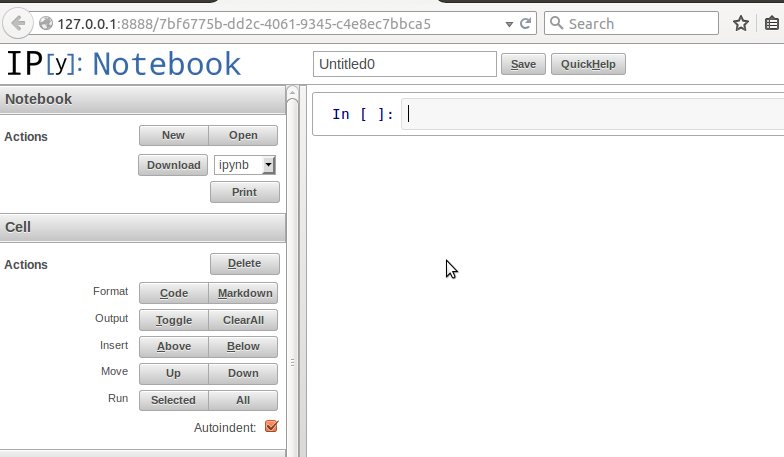

在 In 后面的编辑去，可以写 Python 语句。然后按下 `SHIFT+ENTER` 或者 `CTRL+ENTER` 就能执行了，如果按下 `ENTER`，不是执行，是在当前编辑区换行。

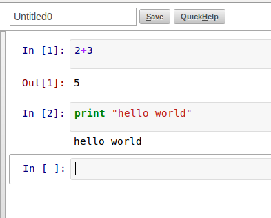

Ipython Notebook 是一个非常不错的编辑器，执行之后，直接显示出来输入内容和输出的结果。当然，错误是难免的，它会：


注意观察图中的箭头所示，直接标出有问题的行。返回编辑区，修改之后可继续执行。


不要忽视左边的辅助操作，能够让你在使用 ipython notebook 的时候更方便。

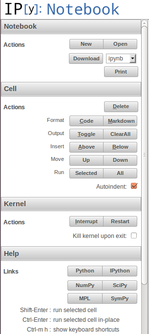

除了在网页中之外，如果你已经喜欢上了 Python 的交互模式，特别是你用的计算机中有一个 shell 的东西，更是棒了。于是可以：

```
$ ipython 
```

进入了一个类似于 Python 的交互模式中，如下所示：

```
In [1]: print "hello, pandas"
hello, pandas

In [2]: 
```

或者说 ipython 同样是一个不错的交互模式。

* * *

总目录

如果你认为有必要打赏我，请通过支付宝：**qiwsir@126.com**,不胜感激。

## Pandas 使用 (1)

Pandas 是基于 NumPy 的一个非常好用的库，正如名字一样，人见人爱。之所以如此，就在于不论是读取、处理数据，用它都非常简单。

### 基本的数据结构

Pandas 有两种自己独有的基本数据结构。读者应该注意的是，它固然有着两种数据结构，因为它依然是 Python 的一个库，所以，Python 中有的数据类型在这里依然适用，也同样还可以使用类自己定义数据类型。只不过，Pandas 里面又定义了两种数据类型：Series 和 DataFrame，它们让数据操作更简单了。

以下操作都是基于：


为了省事，后面就不在显示了。并且如果你跟我一样是使用 ipython notebook，只需要开始引入模块即可。

#### Series

Series 就如同列表一样，一系列数据，每个数据对应一个索引值。比如这样一个列表：[9, 3, 8]，如果跟索引值写到一起，就是：

| data | 9 | 3 | 8 |
| --- | --- | --- | --- |
| index | 0 | 1 | 2 |

这种样式我们已经熟悉了，不过，在有些时候，需要把它竖过来表示：

| index | data |
| --- | --- |
| 0 | 9 |
| 1 | 3 |
| 2 | 8 |

上面两种，只是表现形式上的差别罢了。

Series 就是“竖起来”的 list：


另外一点也很像列表，就是里面的元素的类型，由你任意决定（其实是由需要来决定）。

这里，我们实质上创建了一个 Series 对象，这个对象当然就有其属性和方法了。比如，下面的两个属性依次可以显示 Series 对象的数据值和索引：


列表的索引只能是从 0 开始的整数，Series 数据类型在默认情况下，其索引也是如此。不过，区别于列表的是，Series 可以自定义索引：


自定义索引，的确比较有意思。就凭这个，也是必须的。

每个元素都有了索引，就可以根据索引操作元素了。还记得 list 中的操作吗？Series 中，也有类似的操作。先看简单的，根据索引查看其值和修改其值：

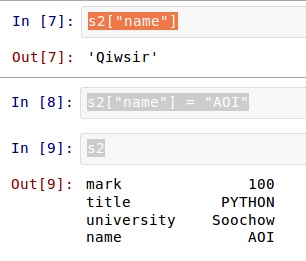

这是不是又有点类似 dict 数据了呢？的确如此。看下面就理解了。

读者是否注意到，前面定义 Series 对象的时候，用的是列表，即 Series() 方法的参数中，第一个列表就是其数据值，如果需要定义 index，放在后面，依然是一个列表。除了这种方法之外，还可以用下面的方法定义 Series 对象：


现在是否理解为什么前面那个类似 dict 了？因为本来就是可以这样定义的。

这时候，索引依然可以自定义。Pandas 的优势在这里体现出来，如果自定义了索引，自定的索引会自动寻找原来的索引，如果一样的，就取原来索引对应的值，这个可以简称为“自动对齐”。


在 sd 中，只有`'python':8000, 'c++':8100, 'c#':4000`，没有"java"，但是在索引参数中有，于是其它能够“自动对齐”的照搬原值，没有的那个"java"，依然在新 Series 对象的索引中存在，并且自动为其赋值 `NaN`。在 Pandas 中，如果没有值，都对齐赋给 `NaN`。来一个更特殊的：

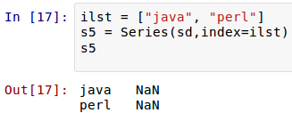

新得到的 Series 对象索引与 sd 对象一个也不对应，所以都是 `NaN`。

Pandas 有专门的方法来判断值是否为空。

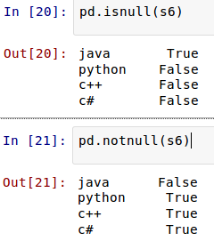

此外，Series 对象也有同样的方法：

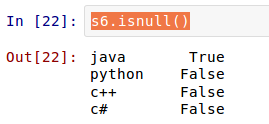

其实，对索引的名字，是可以从新定义的：

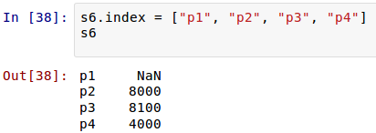

对于 Series 数据，也可以做类似下面的运算（关于运算，后面还要详细介绍）：

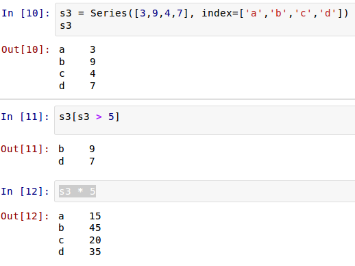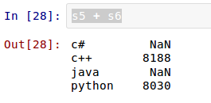

上面的演示中，都是在 ipython notebook 中进行的，所以截图了。在学习 Series 数据类型同时了解了 ipyton notebook。对于后面的所有操作，读者都可以在 ipython notebook 中进行。但是，我的讲述可能会在 Python 交互模式中进行。

#### DataFrame

DataFrame 是一种二维的数据结构，非常接近于电子表格或者类似 mysql 数据库的形式。它的竖行称之为 columns，横行跟前面的 Series 一样，称之为 index，也就是说可以通过 columns 和 index 来确定一个主句的位置。（有人把 DataFrame 翻译为“数据框”，是不是还可以称之为“筐”呢？向里面装数据嘛。)


下面的演示，是在 Python 交互模式下进行，读者仍然可以在 ipython notebook 环境中测试。

```
>>> import pandas as pd 
>>> from pandas import Series, DataFrame 

>>> data = {"name":["yahoo","google","facebook"], "marks":[200,400,800], "price":[9, 3, 7]} 
>>> f1 = DataFrame(data) 
>>> f1 
     marks  name      price 
0    200    yahoo     9 
1    400    google    3 
2    800    facebook  7 
```

这是定义一个 DataFrame 对象的常用方法——使用 dict 定义。字典的“键”（"name"，"marks"，"price"）就是 DataFrame 的 columns 的值（名称），字典中每个“键”的“值”是一个列表，它们就是那一竖列中的具体填充数据。上面的定义中没有确定索引，所以，按照惯例（Series 中已经形成的惯例）就是从 0 开始的整数。从上面的结果中很明显表示出来，这就是一个二维的数据结构（类似 excel 或者 mysql 中的查看效果）。

上面的数据显示中，columns 的顺序没有规定，就如同字典中键的顺序一样，但是在 DataFrame 中，columns 跟字典键相比，有一个明显不同，就是其顺序可以被规定，向下面这样做：

```
>>> f2 = DataFrame(data, columns=['name','price','marks']) 
>>> f2 
       name     price  marks 
0     yahoo     9      200 
1    google     3      400 
2  facebook     7      800 
```

跟 Series 类似的，DataFrame 数据的索引也能够自定义。

```
>>> f3 = DataFrame(data, columns=['name', 'price', 'marks', 'debt'], index=['a','b','c','d']) 
Traceback (most recent call last): 
  File "<stdin>", line 1, in <module> 
  File "/usr/lib/pymodules/python2.7/pandas/core/frame.py", line 283, in __init__ 
    mgr = self._init_dict(data, index, columns, dtype=dtype) 
  File "/usr/lib/pymodules/python2.7/pandas/core/frame.py", line 368, in _init_dict 
    mgr = BlockManager(blocks, axes) 
  File "/usr/lib/pymodules/python2.7/pandas/core/internals.py", line 285, in __init__ 
    self._verify_integrity() 
  File "/usr/lib/pymodules/python2.7/pandas/core/internals.py", line 367, in _verify_integrity 
    assert(block.values.shape[1:] == mgr_shape[1:]) 
AssertionError 
```

报错了。这个报错信息就太不友好了，也没有提供什么线索。这就是交互模式的不利之处。修改之，错误在于 index 的值——列表——的数据项多了一个，data 中是三行，这里给出了四个项（['a','b','c','d']）。

```
>>> f3 = DataFrame(data, columns=['name', 'price', 'marks', 'debt'], index=['a','b','c']) 
>>> f3 
       name      price  marks  debt 
a     yahoo      9      200     NaN 
b    google      3      400     NaN 
c  facebook      7      800     NaN 
```

读者还要注意观察上面的显示结果。因为在定义 f3 的时候，columns 的参数中，比以往多了一项('debt')，但是这项在 data 这个字典中并没有，所以 debt 这一竖列的值都是空的，在 Pandas 中，空就用 NaN 来代表了。

定义 DataFrame 的方法，除了上面的之外，还可以使用“字典套字典”的方式。

```
>>> newdata = {"lang":{"firstline":"python","secondline":"java"}, "price":{"firstline":8000}} 
>>> f4 = DataFrame(newdata) 
>>> f4 
              lang     price 
firstline     python   8000 
secondline    java     NaN 
```

在字典中就规定好数列名称（第一层键）和每横行索引（第二层字典键）以及对应的数据（第二层字典值），也就是在字典中规定好了每个数据格子中的数据，没有规定的都是空。

```
>>> DataFrame(newdata, index=["firstline","secondline","thirdline"]) 
              lang     price 
firstline     python   8000 
secondline    java     NaN 
thirdline     NaN      NaN 
```

如果额外确定了索引，就如同上面显示一样，除非在字典中有相应的索引内容，否则都是 NaN。

前面定义了 DataFrame 数据（可以通过两种方法），它也是一种对象类型，比如变量 f3 引用了一个对象，它的类型是 DataFrame。承接以前的思维方法：对象有属性和方法。

```
>>> f3.columns 
Index(['name', 'price', 'marks', 'debt'], dtype=object) 
```

DataFrame 对象的 columns 属性，能够显示素有的 columns 名称。并且，还能用下面类似字典的方式，得到某竖列的全部内容（当然包含索引）：

```
>>> f3['name'] 
a       yahoo 
b      google 
c    facebook 
Name: name 
```

这是什么？这其实就是一个 Series，或者说，可以将 DataFrame 理解为是有一个一个的 Series 组成的。

一直耿耿于怀没有数值的那一列，下面的操作是统一给那一列赋值：

```
>>> f3['debt'] = 89.2 
>>> f3 
       name     price  marks  debt 
a     yahoo     9        200  89.2 
b    google     3        400  89.2 
c  facebook     7        800  89.2 
```

除了能够统一赋值之外，还能够“点对点”添加数值，结合前面的 Series，既然 DataFrame 对象的每竖列都是一个 Series 对象，那么可以先定义一个 Series 对象，然后把它放到 DataFrame 对象中。如下：

```
>>> sdebt = Series([2.2, 3.3], index=["a","c"])    #注意索引 
>>> f3['debt'] = sdebt 
```

将 Series 对象(sdebt 变量所引用) 赋给 f3['debt']列，Pandas 的一个重要特性——自动对齐——在这里起做用了，在 Series 中，只有两个索引（"a","c"），它们将和 DataFrame 中的索引自动对齐。于是乎：

```
>>> f3 
       name  price  marks  debt 
a     yahoo  9        200   2.2 
b    google  3        400   NaN 
c  facebook  7        800   3.3 
```

自动对齐之后，没有被复制的依然保持 NaN。

还可以更精准的修改数据吗？当然可以，完全仿照字典的操作：

```
>>> f3["price"]["c"]= 300 
>>> f3 
       name   price   marks  debt 
a     yahoo   9       200    2.2 
b    google   3       400    NaN 
c  facebook   300     800    3.3 
```

这些操作是不是都不陌生呀，这就是 Pandas 中的两种数据对象。

* * *

总目录

如果你认为有必要打赏我，请通过支付宝：**qiwsir@126.com**,不胜感激。

## Pandas 使用 (2)

特别向读者生命，本教程因为篇幅限制，不能将有关 pandas 的内容完全详细讲述，只能“抛砖引玉”，向大家做一个简单介绍，说明其基本使用方法。当读者在实践中使用的时候，如果遇到问题，可以结合相关文档或者 google 来解决。

### 读取 csv 文件

#### 关于 csv 文件

csv 是一种通用的、相对简单的文件格式，在表格类型的数据中用途很广泛，很多关系型数据库都支持这种类型文件的导入导出，并且 excel 这种常用的数据表格也能和 csv 文件之间转换。

> 逗号分隔值（Comma-Separated Values，CSV，有时也称为字符分隔值，因为分隔字符也可以不是逗号），其文件以纯文本形式存储表格数据（数字和文本）。纯文本意味着该文件是一个字符序列，不含必须象二进制数字那样被解读的数据。CSV 文件由任意数目的记录组成，记录间以某种换行符分隔；每条记录由字段组成，字段间的分隔符是其它字符或字符串，最常见的是逗号或制表符。通常，所有记录都有完全相同的字段序列。

从上述维基百科的叙述中，重点要解读出“字段间分隔符”“最常见的是逗号或制表符”，当然，这种分隔符也可以自行制定。比如下面这个我命名为 marks.csv 的文件，就是用逗号（必须是半角的）作为分隔符：

```
name,physics,python,math,english
Google,100,100,25,12
Facebook,45,54,44,88
Twitter,54,76,13,91
Yahoo,54,452,26,100 
```

其实，这个文件要表达的事情是（如果转化为表格形式）：


#### 普通方法读取

最简单、最直接的就是 open() 打开文件：

```
>>> with open("./marks.csv") as f:
...     for line in f:
...         print line
... 
name,physics,python,math,english

Google,100,100,25,12

Facebook,45,54,44,88

Twitter,54,76,13,91

Yahoo,54,452,26,100 
```

此方法可以，但略显麻烦。

Python 中还有一个 csv 的标准库，足可见 csv 文件的使用频繁了。

```
>>> import csv 
>>> dir(csv)
['Dialect', 'DictReader', 'DictWriter', 'Error', 'QUOTE_ALL', 'QUOTE_MINIMAL', 'QUOTE_NONE', 'QUOTE_NONNUMERIC', 'Sniffer', 'StringIO', '_Dialect', '__all__', '__builtins__', '__doc__', '__file__', '__name__', '__package__', '__version__', 'excel', 'excel_tab', 'field_size_limit', 'get_dialect', 'list_dialects', 're', 'reader', 'reduce', 'register_dialect', 'unregister_dialect', 'writer'] 
```

什么时候也不要忘记这种最佳学习方法。从上面结果可以看出，csv 模块提供的属性和方法。仅仅就读取本例子中的文件：

```
>>> import csv 
>>> csv_reader = csv.reader(open("./marks.csv"))
>>> for row in csv_reader:
...     print row
... 
['name', 'physics', 'python', 'math', 'english']
['Google', '100', '100', '25', '12']
['Facebook', '45', '54', '44', '88']
['Twitter', '54', '76', '13', '91']
['Yahoo', '54', '452', '26', '100'] 
```

算是稍有改善。

#### 用 Pandas 读取

如果对上面的结果都有点不满意的话，那么看看 Pandas 的效果：

```
>>> import pandas as pd
>>> marks = pd.read_csv("./marks.csv")
>>> marks
       name  physics  python  math  english
0    Google      100     100    25       12
1  Facebook       45      54    44       88
2   Twitter       54      76    13       91
3     Yahoo       54     452    26      100 
```

看了这样的结果，你还不感觉惊讶吗？你还不喜欢上 Pandas 吗？这是多么精妙的显示。它是什么？它就是一个 DataFrame 数据。

还有另外一种方法：

```
>>> pd.read_table("./marks.csv", sep=",")
       name  physics  python  math  english
0    Google      100     100    25       12
1  Facebook       45      54    44       88
2   Twitter       54      76    13       91
3     Yahoo       54     452    26      100 
```

如果你有足够的好奇心来研究这个名叫 DataFrame 的对象，可以这样：

```
>>> dir(marks)
['T', '_AXIS_ALIASES', '_AXIS_NAMES', '_AXIS_NUMBERS', '__add__', '__and__', '__array__', '__array_wrap__', '__class__', '__contains__', '__delattr__', '__delitem__', '__dict__', '__div__', '__doc__', '__eq__', '__floordiv__', '__format__', '__ge__', '__getattr__', '__getattribute__', '__getitem__', '__getstate__', '__gt__', '__hash__', '__init__', '__iter__', '__le__', '__len__', '__lt__', '__module__', '__mul__', '__ne__', '__neg__', '__new__', '__nonzero__', '__or__', '__pow__', '__radd__', '__rdiv__', '__reduce__', '__reduce_ex__', '__repr__', '__rfloordiv__', '__rmul__', '__rpow__', '__rsub__', '__rtruediv__', '__setattr__', '__setitem__', '__setstate__', '__sizeof__', '__str__', '__sub__', '__subclasshook__', '__truediv__', '__weakref__', '__xor__', '_agg_by_level', '_align_frame', '_align_series', '_apply_broadcast', '_apply_raw', '_apply_standard', '_auto_consolidate', '_bar_plot', '_boolean_set', '_box_item_values', '_clear_item_cache', '_combine_const', '_combine_frame', '_combine_match_columns', '_combine_match_index', '_combine_series', '_combine_series_infer', '_compare_frame', '_consolidate_inplace', '_constructor', '_count_level', '_cov_helper', '_data', '_default_stat_axis', '_expand_axes', '_from_axes', '_get_agg_axis', '_get_axis', '_get_axis_name', '_get_axis_number', '_get_item_cache', '_get_numeric_data', '_getitem_array', '_getitem_multilevel', '_helper_csvexcel', '_het_axis', '_indexed_same', '_init_dict', '_init_mgr', '_init_ndarray', '_is_mixed_type', '_item_cache', '_ix', '_join_compat', '_reduce', '_reindex_axis', '_reindex_columns', '_reindex_index', '_reindex_with_indexers', '_rename_columns_inplace', '_rename_index_inplace', '_sanitize_column', '_series', '_set_axis', '_set_item', '_set_item_multiple', '_shift_indexer', '_slice', '_unpickle_frame_compat', '_unpickle_matrix_compat', '_verbose_info', '_wrap_array', 'abs', 'add', 'add_prefix', 'add_suffix', 'align', 'append', 'apply', 'applymap', 'as_matrix', 'asfreq', 'astype', 'axes', 'boxplot', 'clip', 'clip_lower', 'clip_upper', 'columns', 'combine', 'combineAdd', 'combineMult', 'combine_first', 'consolidate', 'convert_objects', 'copy', 'corr', 'corrwith', 'count', 'cov', 'cummax', 'cummin', 'cumprod', 'cumsum', 'delevel', 'describe', 'diff', 'div', 'dot', 'drop', 'drop_duplicates', 'dropna', 'dtypes', 'duplicated', 'fillna', 'filter', 'first_valid_index', 'from_csv', 'from_dict', 'from_items', 'from_records', 'get', 'get_dtype_counts', 'get_value', 'groupby', 'head', 'hist', 'icol', 'idxmax', 'idxmin', 'iget_value', 'index', 'info', 'insert', 'irow', 'iteritems', 'iterkv', 'iterrows', 'ix', 'join', 'last_valid_index', 'load', 'lookup', 'mad', 'max', 'mean', 'median', 'merge', 'min', 'mul', 'ndim', 'pivot', 'pivot_table', 'plot', 'pop', 'prod', 'product', 'quantile', 'radd', 'rank', 'rdiv', 'reindex', 'reindex_axis', 'reindex_like', 'rename', 'rename_axis', 'reorder_levels', 'reset_index', 'rmul', 'rsub', 'save', 'select', 'set_index', 'set_value', 'shape', 'shift', 'skew', 'sort', 'sort_index', 'sortlevel', 'stack', 'std', 'sub', 'sum', 'swaplevel', 'tail', 'take', 'to_csv', 'to_dict', 'to_excel', 'to_html', 'to_panel', 'to_records', 'to_sparse', 'to_string', 'to_wide', 'transpose', 'truncate', 'unstack', 'values', 'var', 'xs'] 
```

一个一个浏览一下，通过名字可以直到那个方法或者属性的大概，然后就可以根据你的喜好和需要，试一试：

```
>>> marks.index
Int64Index([0, 1, 2, 3], dtype=int64)
>>> marks.columns
Index([name, physics, python, math, english], dtype=object)
>>> marks['name'][1]
'Facebook' 
```

这几个是让你回忆一下上一节的。从 DataFrame 对象的属性和方法中找一个，再尝试：

```
>>> marks.sort(column="python")
       name  physics  python  math  english
1  Facebook       45      54    44       88
2   Twitter       54      76    13       91
0    Google      100     100    25       12
3     Yahoo       54     452    26      100 
```

按照竖列"Python"的值排队，结果也是很让人满意的。下面几个操作，也是常用到的，并且秉承了 Python 的一贯方法：

```
>>> marks[:1]
     name  physics  python  math  english
0  Google      100     100    25       12
>>> marks[1:2]
       name  physics  python  math  english
1  Facebook       45      54    44       88
>>> marks["physics"]
0    100
1     45
2     54
3     54
Name: physics 
```

可以说，当你已经掌握了通过 dir() 和 help() 查看对象的方法和属性时，就已经掌握了 pandas 的用法，其实何止 pandas，其它对象都是如此。

### 读取其它格式数据

csv 是常用来存储数据的格式之一，此外常用的还有 MS excel 格式的文件，以及 json 和 xml 格式的数据等。它们都可以使用 pandas 来轻易读取。

#### .xls 或者 .xlsx

在下面的结果中寻觅一下，有没有跟 excel 有关的方法？

```
>>> dir(pd)
['DataFrame', 'DataMatrix', 'DateOffset', 'DateRange', 'ExcelFile', 'ExcelWriter', 'Factor', 'HDFStore', 'Index', 'Int64Index', 'MultiIndex', 'Panel', 'Series', 'SparseArray', 'SparseDataFrame', 'SparseList', 'SparsePanel', 'SparseSeries', 'SparseTimeSeries', 'TimeSeries', 'WidePanel', '__builtins__', '__doc__', '__docformat__', '__file__', '__name__', '__package__', '__path__', '__version__', '_engines', '_sparse', '_tseries', 'concat', 'core', 'crosstab', 'datetime', 'datetools', 'debug', 'ewma', 'ewmcorr', 'ewmcov', 'ewmstd', 'ewmvar', 'ewmvol', 'fama_macbeth', 'groupby', 'info', 'io', 'isnull', 'lib', 'load', 'merge', 'notnull', 'np', 'ols', 'pivot', 'pivot_table', 'read_clipboard', 'read_csv', 'read_table', 'reset_printoptions', 'rolling_apply', 'rolling_corr', 'rolling_corr_pairwise', 'rolling_count', 'rolling_cov', 'rolling_kurt', 'rolling_max', 'rolling_mean', 'rolling_median', 'rolling_min', 'rolling_quantile', 'rolling_skew', 'rolling_std', 'rolling_sum', 'rolling_var', 'save', 'set_eng_float_format', 'set_printoptions', 'sparse', 'stats', 'tools', 'util', 'value_range', 'version'] 
```

虽然没有类似 `read_csv()` 的方法（在网上查询，有的资料说有 `read_xls()` 方法，那时老黄历了），但是有 `ExcelFile` 类，于是乎：

```
>>> xls = pd.ExcelFile("./marks.xlsx")
Traceback (most recent call last):
  File "<stdin>", line 1, in <module>
  File "/usr/lib/pymodules/python2.7/pandas/io/parsers.py", line 575, in __init__
    from openpyxl import load_workbook
ImportError: No module named openpyxl 
```

我这里少了一个模块，看报错提示， 用 pip 安装 openpyxl 模块：`sudo pip install openpyxl`。继续：

```
>>> xls = pd.ExcelFile("./marks.xlsx")
>>> dir(xls)
['__class__', '__delattr__', '__dict__', '__doc__', '__format__', '__getattribute__', '__hash__', '__init__', '__module__', '__new__', '__reduce__', '__reduce_ex__', '__repr__', '__setattr__', '__sizeof__', '__str__', '__subclasshook__', '__weakref__', '_parse_xls', '_parse_xlsx', 'book', 'parse', 'path', 'sheet_names', 'use_xlsx']
>>> xls.sheet_names
['Sheet1', 'Sheet2', 'Sheet3']
>>> sheet1 = xls.parse("Sheet1")
>>> sheet1
   0    1    2   3    4
0  5  100  100  25   12
1  6   45   54  44   88
2  7   54   76  13   91
3  8   54  452  26  100 
```

结果中，columns 的名字与前面 csv 结果不一样，数据部分是同样结果。从结果中可以看到，sheet1 也是一个 DataFrame 对象。

对于单个的 DataFrame 对象，如何通过属性和方法进行操作，如果读者理解了本教程从一开始就贯穿进来的思想——利用 dir() 和 help() 或者到官方网站，看文档！——此时就能比较轻松地进行各种操作了。下面的举例，纯属是为了增加篇幅和向读者做一些诱惑性广告，或者给懒惰者看看。当然，肯定是不完全，也不能在实践中照搬。基本方法还在刚才交代过的思想。

如果遇到了 json 或者 xml 格式的数据怎么办呢？直接使用本教程第贰季第陆章中《标准库 (7)中的方法，再结合 Series 或者 DataFrame 数据特点读取。

此外，还允许从数据库中读取数据，首先就是使用本教程第贰季第柒章中阐述的各种数据库（《MySQL 数据库 (1)》）连接和读取方法，将相应数据查询出来，并且将结果（结果通常是列表或者元组类型，或者是字符串）按照前面讲述的 Series 或者 DataFrame 类型数据进行组织，然后就可以对其操作。

* * *

总目录

如果你认为有必要打赏我，请通过支付宝：**qiwsir@126.com**,不胜感激。

## 处理股票数据

这段时间某国股市很火爆，不少砖家在分析股市火爆的各种原因，更有不少人看到别人挣钱眼红了，点钞票杀入股市。不过，我还是很淡定的，因为没钱，所以不用担心任何股市风险临到。

但是，为了体现本人也是与时俱进的，就以股票数据为例子，来简要说明 pandas 和其它模块在处理数据上的应用。

### 下载 yahoo 上的数据

或许你稀奇，为什么要下载 yahoo 上的股票数据呢？国内网站上不是也有吗？是有。但是，那时某国内的。我喜欢 yahoo，因为她曾经吸引我，注意我说的是[www.yahoo.com](http://www.yahoo.com)，不是后来被阿里巴巴收购并拆散的那个。


虽然 yahoo 的世代渐行渐远，但她终究是值得记忆的。所以，我要演示如何下载 yahoo 财经栏目中的股票数据。

```
In [1]: import pandas 
In [2]: import pandas.io.data

In [3]: sym = "BABA"

In [4]: finace = pandas.io.data.DataReader(sym, "yahoo", start="2014/11/11")
In [5]: print finace.tail(3)
                 Open       High        Low      Close    Volume  Adj Close
Date                                                                       
2015-06-17  86.580002  87.800003  86.480003  86.800003  10206100  86.800003
2015-06-18  86.970001  87.589996  86.320000  86.750000  11652600  86.750000
2015-06-19  86.510002  86.599998  85.169998  85.739998  10207100  85.739998 
```

下载了阿里巴巴的股票数据（自 2014 年 11 月 11 日以来），并且打印最后三条。

### 画图

已经得到了一个 DataFrame 对象，就是前面已经下载并用 finace 变量引用的对象。

```
In[6]: import matplotlib.pyplot as plt
In [7]: plt.plot(finace.index, finace["Open"])
Out[]: [<matplotlib.lines.Line2D at 0xa88e5cc>]

In [8]: plt.show() 
```

于是乎出来了下图：

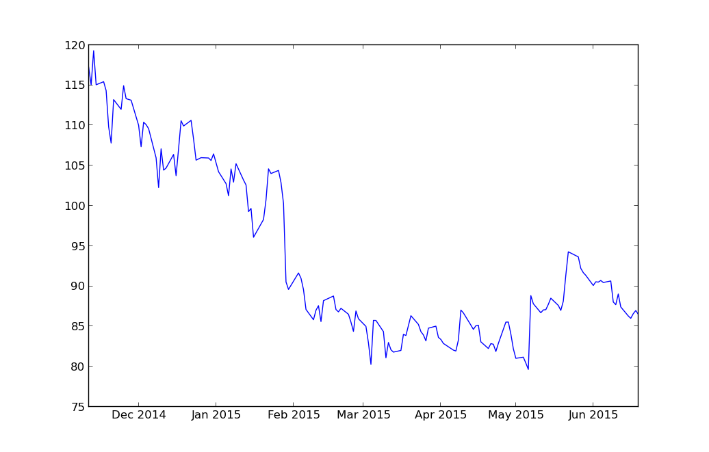

从图中可以看出阿里巴巴的股票自从 2014 年 11 月 11 日到 2015 年 6 月 19 日的股票开盘价变化。看来那个所谓的“光棍节”得到了股市的认可，所以，在此我郑重地建议阿里巴巴要再造一些节日，比如 3 月 3 日、4 月 4 日，还好，某国还有农历，阳历用完了用农历。可以维持股票高开高走了。

阿里巴巴的事情，我就不用操心了。

上面指令中的 `import matplotlib.pyplot as plt` 是个此前没有看到的。`matplotlib` 模块是 Python 中绘制二维图形的模块，是最好的模块。本教程在这里展示了它的一个小小地绘图功能，读者就一下看到阿里巴巴“光棍节”的力量，难道还不能说明 matplotlib 的强悍吗？很可惜，matplotlib 的发明者——John Hunter 已经于 2012 年 8 月 28 日因病医治无效英年早逝，这真是天妒英才呀。为了缅怀他，请读者访问官方网站：[matplotlib.org](http://matplotlib.org)，并认真学习这个模块的使用。

经过上面的操作，读者可以用 `dir()` 这个以前常用的法宝，来查看 finace 所引用的 DataFrame 对象的方法和属性等。只要运用此前不断向大家演示的方法——`dir+help`——就能够对这个对象进行操作，也就是能够对该股票数据进行各种操作。

再次声明，本课程仅仅是稍微演示一下相关操作，如果读者要深入研习，恭请寻找相关的专业书籍资料阅读学习。

总目录   |   上节：Pandas 使用 (2)   

如果你认为有必要打赏我，请通过支付宝：**qiwsir@126.com**,不胜感激。