# 第二十二章　扩展 Python

本章主题

♦　引言/动机

♦　扩展 Python

♦　创建应用程序代码

♦　用样板包装你的代码

♦　编译

♦　导入并测试

♦　引用计数

♦　线程和 GIL

♦　相关话题

在本章中，我们将讨论如何编写扩展代码并将它们的功能整合到 Python 编程环境中来。首先我们会给出这样做的原因，然后一步步地教您如何做。应当指出的是，虽然大部分 Python 的扩展都是用 C 语言写的，并且下面的所有样例代码也都是由纯 C 语言写的，但请放心，这些代码很容易就可以移植到 C++中。

## 22.1　引言/动机

### 22.1.1　什么是扩展

一般来说，所有能被整合或导入到其他 Python 脚本的代码，都可以称为扩展。您可以用纯 Python 来写扩展，也可以用 C 和 C++之类的编译型语言来写扩展（或者也可以用 Java 给 Jython 写扩展，也可以用 C#或 Visual Basic.NET 给 IronPython 写扩展）。

Python 的一大特点就是，扩展和解释器之间的交互方式与普通的 Python 模块完全一样。Python 在设计之初就考虑到要让模块的导入机制足够抽象，抽象到让使用模块的代码无法了解到模块的具体实现细节。除非那个程序员在磁盘中搜索这个模块文件，否则，他就连这个模块到底是用 Python 写的，还是用某种编译语言写的都分辨不出来。

核心笔记：在不同平台上创建扩展

* * *

我们要注意的是，如果你曾自己编译过 Python 解释器，那么，在这样的环境中，扩展一般都是可以使用的。自己手动编译扩展，和获取扩展的二进制文件是有些不同的。虽然自己编译比简单地下载安装复杂一些，但由此得来的好处就是，你可以自由选择你想使用的 Python 版本。虽然本章中的例子都是在 Unix 系统中开发的（一般的 Unix 中都自带编译器）。但只要你能使用 C/C++（或 Java）的编译器并且在 C/C++（或 Java）中有 Python 的开发环境，那唯一的区别只是怎样来编译而已。无论在哪一个平台上，真正起作用的代码都是一样的。如果你在 Win32 平台上进行开发，你需要有 Visual C++开发环境。Python 的发布包中自带了 7.1 版本的项目文件。当然，你也可以使用老版本的 VC。想了解更多的关于如何在 Win32 上开发扩展的信息，你可以访问如下网页

* * *

http://docs.python.org/ext/building-on-windows.html

警告：就算是相同架构的两台电脑之间最好也不要互相共享二进制文件。最好是在各自的电脑上编译 Python 和扩展，因为有时就算是编译器或是 CPU 之间的些许差异，也会导致代码不能正常工作。

### 22.1.2　为什么要扩展 Python

纵观软件工程的历史，编程语言都不具备可扩展性，你只能使用已有的功能，而不能为语言增加新功能。现如今的编程环境中，可定制性也是一个很大的卖点，它可以促进代码的复用。TCL 和 Python 等语言是第一批提供可扩展性的语言。那么，为什么我们会想要扩展像 Python 这种已经很完善的语言呢？有以下几点好理由。

•　添加/额外的（非 Python）功能

扩展 Python 的一个原因就是对一些新功能的需要，而 Python 语言的核心部分并没有提供这些功能。这时，通过纯 Python 代码或者编译扩展都可以做到。但是有些情况，比如创建新的数据类型或者将 Python 嵌入到其他已经存在的应用程序中，则必须得编译。

•　性能瓶颈的效率提升

众所周知，由于解释型的语言是在运行时动态地翻译解释代码，这导致其运行速度比编译型的语言慢。一般说来，把所有代码都放到扩展中，可以提升软件的整体性能。但有时由于时间与精力有限，这样做并不划算。

通常，先做一个简单的代码性能测试，看看瓶颈在哪里，然后把瓶颈部分在扩展中实现会是一个比较简单有效的做法。效果立竿见影不说，而且还不用花费太多的时间与精力。

•　保持专有源代码私密

创建扩展的另一个很重要的原因是脚本语言都有一个共同的缺陷，那就是所有的脚本语言执行的都是源代码，这样一来源代码的保密性便无从谈起了。

把一部分代码从 Python 转到编译语言就可以保持专有源代码私密，因为你只要发布二进制文件就可以了。编译后的文件相对来说更不容易被反向工程出来。因此，代码能实现保密。尤其是涉及到特殊的算法、加密方法及软件安全的时候，这样做就显得非常至关重要了。

另一种对代码保密的方法是只发布预编译后的。pyc 文件。这是介于发布源代码（.py 文件）和把代码移植到扩展这两种方法之间的一种较好的折中方法。

## 22.2　创建 Python 扩展

为 Python 创建扩展需要 3 个主要的步骤：

1.创建应用程序代码；

2.利用样板来包装代码；

3.编译与测试。

在这一节中，我们会将这 3 步逐一介绍给大家。

### 22.2.1　创建您的应用程序代码

首先，我们要建立的是一个“库”，要记住，我们要建立的是将在 Python 内运行的一个模块。所以在设计你所需要的函数与对象的时候要注意到，你的 C 代码要能够很好地与 Python 的代码进行双向的交互和数据共享。

然后，写一些测试代码来保障你的代码的正确性。你可以在 C 代码中放一个 main()函数，使得你的代码可以被编译并链接成一个可执行文件（而不是一个动态库），当你运行这个可执行文件时，程序可以对你的软件库进行回归测试。这是一种很符合 Python 风格的做法。

在下面的例子中，我们就将釆用这种做法。测试用例分别针对我们想要导出到 Python 世界的两个函数。一个是递归求阶乘的函数 fac()。另一个 reverse()函数则实现了一个简单的字符串反转算法，其主要目的是修改传入的字符串，使其内容完全反转，但不需要用申请内存后反着复制的方法。由于涉及到指针的使用，我们务必要在设计和调试时小心谨慎，以防把问题带入 Python.

例 22.1 中所列出的 Extestl.c 是我们的第一个版本。

代码中，包含了两个函数 fac()和 reverse()。分别实现了我们刚刚所说的两个功能。fac()接受一个整型参数并递归计算结果，在退出最后一层调用后最终返回到调用代码中。

最后一段代码是必要的 main()函数。我们在这里面写测试代码，传不同的参数给 fac()和 reverse()。有了这个函数，我们就可以了解我们的代码是否能得到正确的结果。

现在，我们就可以编译这段代码了。在大部分有 gcc 编译器的 Unix 系统中，我们都可以用以下指令进行编译：

我们可以输入一下命令来运行我们的程序，并得到如下输出

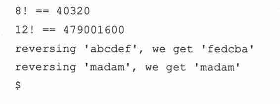

例 22.1　纯 C 版本库（Extestl.c）

下面列出了我们想要包装并在 Python 解释器中使用的 C 函数的代码，main()是测试函数。

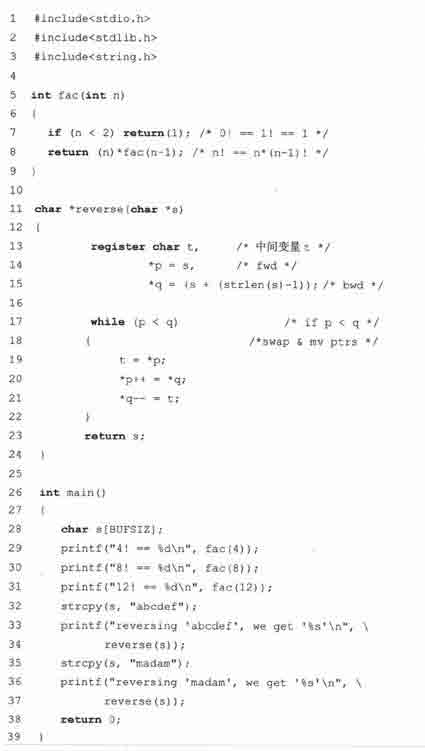

我们要再强调一次，你应该尽可能地完善你的代码。因为，在把代码集成到 Python 中后再来调试你的核心代码，查找潜在的 bug 是件很痛苦的事情。也就是说，调试核心代码与调试集成这两件事应该分开来做。要知道，与 Python 的接口代码写得越完善，集成的正确性就越容易保证。

我们的两个函数都只接受一个参数，并返回一个值。这是很标准的情况，与 Python 集成的时候应该不会有什么问题。注意，到现在为止，我们所做的都还与 Python 没什么关系。我们只是简单地创建了一个 C/C++的应用程序而已。

### 22.2.2　用样板来包装你的代码

整个扩展的实现都是围绕着 13.15.1 节所说的“包装”这个概念进行的。你的设计要尽可能让你的实现语言与 Python 无缝结合。接口的代码被称为“样板”代码，它是你的代码与 Python 解释器之间进行交互所必不可少的一部分。

我们的样板主要分为 4 步。

1.包含 Python 的头文件。

2.为每个模块的每一个函数增加一个形如 PyObject* Module_func()的包装函数。

3.为每个模块增加一个形如 PyMethodDefModuleMethods[]的数组。

4.增加模块初始化函数 void initModule().

1.包含 Python 头文件

首先，你要找到 Python 的头文件在哪，并且确保你的编译器有权限访问它们。在大多数类 Unix 的系统里，它们都会在/usr/local/include/python2.x 或/usr/include/python2.x 目录中。其中，“2.x”是你所使用的 Python 的版本号。如果你曾编译并安装过 Python 解释器，那应该不会碰到什么问题，因为这时，系统一般都会知道你的文件安装在哪。像下面这样在你的代码里加入一行：

这部分比较简单。接下来再看看怎么在样板中加入其他的部分。

2.为每个模块的每一个函数增加一个型如 PyObject* Module_func()的包装函数

这一部分最需要技巧。你需要为所有想被 Python 环境访问的函数都增加一个静态的函数，函数的返回值类型为 PyObject*，函数名前面要加上模块名和一个下划线（_）.

比方说，我们希望在 Python 中，能够导入（import）我们的 fac()函数，其所在的模块名为 Extest，那么我们就要创建一个包装函数叫 Extest_fac().在使用这个函数的 Python 脚本中，使用方法是先“import Extest”然后调用“Extest. fac() ”（或者先“from Extest import fac”，然后直接调用“fac()”）

包装函数的用处就是先把 Python 的值传递给 C，然后调用我们想要调用的相关函数。当这个函数完成要返回 Python 的时候，把函数的计算结果转换成 Python 的对象，然后返回给 Python.

对于 fac()函数来说，当客户程序调用 Extestfac()的时候，我们的包装函数就会被调用。它接受一个 Python 的整型参数，把它转为 C 的整型，然后调用 C 的 fac()函数，得到一个整型的返回值，最后把这个返回值转为 Python 的整型数作为整个函数调用的结果返回（在你头脑中，要保持一个想法：我们所写的其实就是“deffac（n）”这段声明的一个代理函数，当代理函数返回的时候，就像是这个想像中 Python 的 fac()函数在返回一样）.

那么怎样才能完成这样的转换呢？答案是，在从 Python 到 C 的转换就用 PyArg_Parse*()系列函数；在从 C 转到 Python 的时候，就用 Py_BuildValue()函数。

PyArg_Parse()系列函数的用法跟 C 的 sscanf()函数很像，都接受一个字符串流，并根据一个指定的格式字符串进行解析，把结果放入到相应的指针所指的变量中去。它们的返回值为 1 表示解析成功，返回值为 0 表示失败。

Py_BuildValue()的用法跟 sprintf()很像，把所有的参数按格式字符串所指定的格式转换成一个 Python 的对象。

表 22.1 罗列了这些函数的概要。

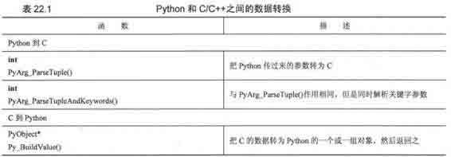

表 22.2 所列出的转换代码用于在Ｃ与 Python 之间做数据的转换。

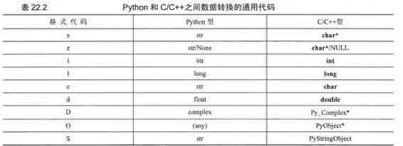

这些转换代码出现在格式字符串当中，用于指定各个值的数据类型，以便于在两种语言之间做转换。注：由于 Java 的所有数据类型都是类，所以 Java 的转换类型不一样。Python 对象在 Java 中所对应的数据类型请参考 Jython 的相关文档。C#也有同样的问题。

下面是完整的 Extest_fac()包装函数：

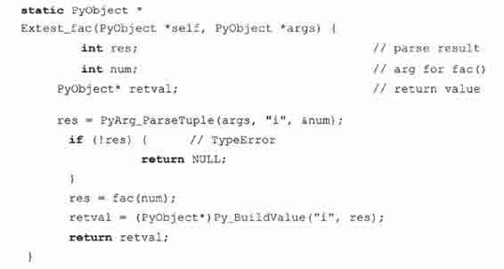

首先，我们要解析 Python 传过来的数据。例子中，我们使用格式字符串“i”，表示我们期望得到一个整型的变量。如果传进来的的确是一个整型的变量，那就把它保存到 num 变量中。否则， PyArg—ParseTuple()会返回 NULL，同时，我们的函数也返回一个 NULL。这时，就会产生一个 TypeError 异常，通知客户我们期望传入一个整型变量。

然后，我们会调用 fac()函数，其参数为 num，把返回结果放在 res 变量中。最后，通过调用 Py_BuildValue()函数，格式字符串为“i”，把结果转为 Python 的整型类型并返回。这样，我们就完成了整个调用过程。

事实上，包装函数写得多了之后，你会慢慢地把代码写得越来越短，以减少中间变量的使用，同时也会增加代码的可读性。我们以 Extest_fac()函数为例，把它改写得短小一些，只使用一个变量 num:

那么 reverse()怎么实现呢？既然你已经知道怎么返回一个值了，那我们把 reverse()的需求稍微改一下，变成返回两个值。我们将返回一个包含两个字符串的元组。第一个值是传进来的字符串，第二个值是反转后的字符串。

我们将把这个函数命名为 Extest.doppel()，以示与 reverse()函数的区别。把代码包装到 Extest_doppel()函数后，我们得到如下代码：

跟 Extest_fac()类似，我们接收一个字符串型的参数，保存到 orig_str 中。注意，这次，我们要使用“s”格式字符串。然后调用 strdup()函数把这个字符串复制一份（由于我们要同时返回原始字符串和反转后的字符串，所以我们需要复制一份）。把新复制的字符串传给 reverse 函数，我们就得到了反转后的字符串。

如你所见，我们用“ss”格式字符串让 Py_BuildVahie()函数生成了一个含有两个字符串的元组，分别放了原始字符串和反转后的字符串。这样就完成所有的工作了吗？很不幸，还没有。

我们碰到了 C 语言的一个陷阱：内存泄漏。即内存被申请了，但没有被释放。就像去图书馆借了书，但是没有还一样。无论何时，你都应该释放所有你申请的，不再需要的内存。看，我们写的代码犯了多大的罪过啊（虽然看上去好像很无辜的样子）!

Py_BuildValue()函数生成要返回的 Python 对象的时候，会把转入的数据复制一份。上例中，那两个字符串就会被复制出来。问题就在于，我们申请了用于存放第二个字符串的内存，但是，在退出的时候没有释放它。于是，这片内存就泄漏了。正确的做法是：先生成要返回的对象，然后释放在包装函数中申请的内存。我们必须要这样修改我们的代码：

我们用 dupe_str 变量指向了新申请的字符串，并依此生成了要返回的对象。然后，我们调用 free()函数释放这个字符串，最后返回到调用程序，终于完成了我们要做的事情。

为每个模块增加一个形如 PyMethodDef ModuleMethods[]的数组。

现在，我们己经完成了两个包装函数。我们需要把它们列在某个地方，以便于 Python 解释器能够导入并调用它们。这就是 ModuleMethods[]数组要做的事情。

这个数组由多个数组组成。其中的每一个数组都包含了一个函数的信息。最后放一个 NULL 数组表示列表的结束。我们为 Extest 模块创建一个 ExtestMethods[]数组：

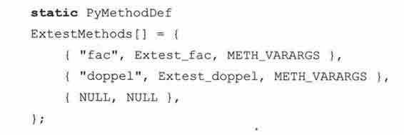

每一个数组都包含了函数在 Python 中的名字，相应的包装函数的名字以及一个 METH_VARARGS 常量。其中，METH_VARARGS 常量表示参数以元组形式传入。如果我们要使用 PyArg_ParseTupleAndKeywords()函数来分析命名参数的话，我们还需要让这个标志常量与 METH KEYWORDS 常量进行逻辑与运算常量。最后，用两个 NULL 来结束我们的函数信息列表。

3.增加模块初始化函数 void initModule()

所有工作的最后一部分就是模块的初始化函数。这部分代码在模块导入的时候被解释器调用。在这段代码中，我们需要调用 Py_InitModule()函数，并把模块名和 ModuleMethods[]数组的名字传递进去，以便解释器能正确地调用我们模块中的函数。对 Extest 模块来说，initExtest()函数应该是这个样子的：

这样，所有的包装都已经完成了。我们把以上代码与之前的 Extestl.c 合并到一个新文件~Extest2.c 中。到此为止，我们的开发阶段就已经结束了。

创建扩展的另一种方法是先写包装代码，使用桩函数、测试函数或哑函数。在开发过程中慢慢地把这些函数用有实际功能的函数替换。这样，你可以确保 Python 和 C 之间的接口函数是正确的，并用它们来测试你的 C 代码。

### 22.2.3　编译

现在，我们己经到了编译阶段。为了让你的新 Python 扩展能被创建，你需要把它们与 Python 库放在一起编译。现在已经有了一套跨 30 多个平台的规范，它极大地方便了编写扩展的人。distutils 包被用来编译、安装和分发这些模块、扩展和包。这个模块在 Python2.0 的时候就已经出现了，并用于代替 1.x 版本时的用 Makefile 来编译扩展的方法。使用 distutils 包的时候我们可以方便地按以下步骤来做：

1.创建 setup.py；

2.通过运行 setup.py 来编译和连接您的代码；

3.从 Python 中导入您的模块；

4.测试功能。

1.创建 setup.py

下一步就是要创建一个 setup.py 文件。编译最主要的工作由 setup()函数来完成。在这个函数调用之前的所有代码，都是一些预备动作。为了能编译扩展，你要为每一个扩展创建一个 Extension 实例，在这里，我们只有一个扩展，所以只要创建一个 Extension 实例：

第一个参数是（完整的）扩展的名字，如果模块是包的一部分的话，还要加上用“.”分隔的完整的包的名字。我们这里的扩展是独立的，所以名字只要写“Extest“就好了。sources 参数是所有源代码的文件列表。同样，我们也只有一个文件 Extest2.c。

现在，我们可以调用 setup()了。Setup()需要两个参数: 一个名字参数表示要编译哪个东西，一个列表列出要编译的对象。由于我们要编译的是一个扩展，我们把 ext_modules 参数的值设为扩展模块的列表。语法如下：

例 22.2

这个脚本会把我们的扩展编译到 build/lib.*子目录中。

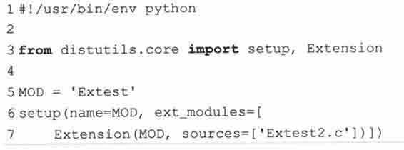

由于我们只有一个模块，我们把我们扩展模块对象的实例化操作放到了 setup()的调用代码中。模块的名字我们就传预先定义的“常量” MOD:

setup()函数还有很多选项可以设置。限于篇幅，不能完全罗列。读者可以在本章最后所列的官方文档中找到 setup.py 和 setup()函数相关的信息。例 22.2 给出了我们例子所要用的完整的脚本代码。

2.通过运行 setup.py 来编译和连接代码

现在，我们已经有了 setup.py 文件。运行 setup.py build 命令就可以开始编译我们的扩展了。在我们的 Mac 机上的输出如下（使用不同版本的 Python 或是不一样的操作系统时，输出会有一些不同）:

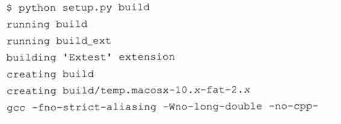

### 22.2.4　导入和测试

1.从 Python 中导入您的模块

你的扩展会被创建在你运行 setup.py 脚本所在目录下的 build/lib.*目录中。你可以切换到那个目录中来测试你的模块，或者也可以用以下命令把它安装到你的 Python 中。

如果安装成功，你会看到：

现在，我们可以在解释器里测试我们的模块了：

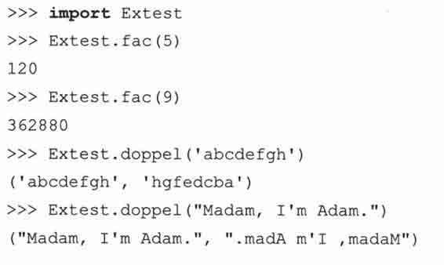

2.测试功能

我们想要做的最后一件事就是加上一个测试函数。事实上，我们已经写好一个了，就是 main()函数。现在，在我们代码中放一个 main()函数是一件比较危险的事，因为一个系统中只能有一个 main()函数。我们把 main()函数改名为 test()，加个 Extest_test()函数把它包装起来，然后在 ExtestMethods 中加入这个函数就不会有这样的问题了。代码如下：

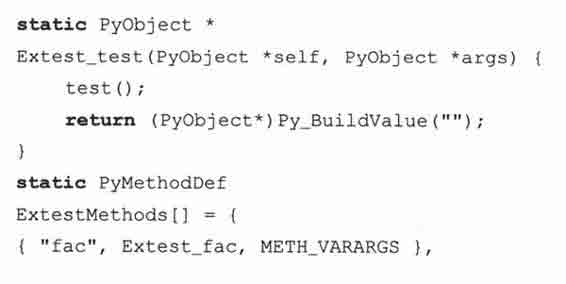

Extest_test()模块函数只负责运行 test()函数，并返回一个空字符串。Python 的 None 作为返回值，传给了调用者。现在，我们可以在 Python 中调用同样的 test()函数了：

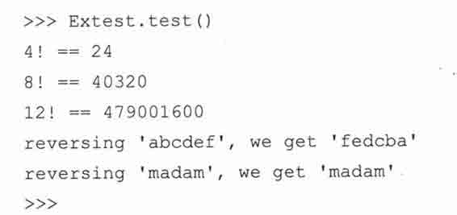

在例 22.3 中，我们给出了 Extest2.c 的最终版本。这个版本会输出我们刚才所看到的结果。

在本例中，我们把我们的 C 代码和 Python 相关的代码分开放，一段在上面，一段在下面。

这样可以让代码更具可读性。对于小程序来说，没有任何问题。但在实际应用中，源代码会越写越大。一部分人就会考虑把他们的包装函数放在另一个源文件中。起个诸如 ExtestWrappers.c 之类好记的名字。

### 22.2.5　引用计数

也许你还记得，Python 使用引用计数作为跟踪一个对象是否不再被使用，所占内存是否应该被回收的手段。它是垃圾回收机制的一部分。当创建扩展时，你必需对如何操作 Python 对象格外小心。你时时刻刻都要注意是否要改变某个对象的引用计数。

一个对象可能有两类引用。一种是拥有引用，你要对这个对象的引用计数加 1，以表示你也拥有这个对象的所有权。如果这个 Python 对象是你自己创建的，那么这时你肯定拥有这个对象的所有权。

当你不再需要一个 Python 对象时，你必须要交出你的所有权，要么把引用计数减 1，要么把所有权交给别人，要么就把这个对象存到其他的容器中（元组、列表等）。没有交出所有权就会导致内存泄漏。

你也可以拥有对象的借引用。相对来说，这种方式的责任就小一些。除非是别人在外面把对象传递给你。否则，不要用任何方式修改对象里的数据。你也不用时刻考虑对象引用计数的问题，只要你不会在对象的引用计数减为 0 之后再去使用这个对象。你也可以把借引用对象用的数量加 1，从而真正地引用这个对象。

例 22.3　C 库的 Python 包装版本（Extest2\. c）

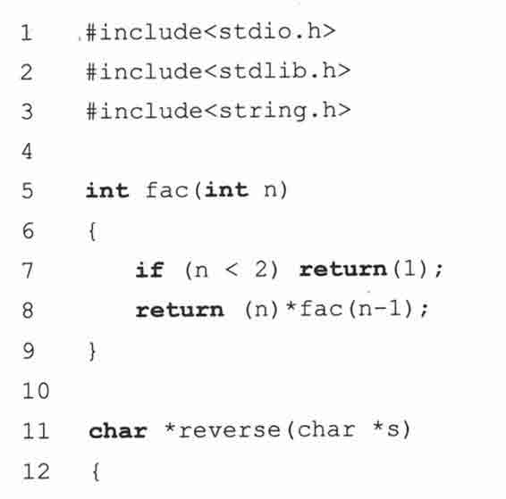

Python 提供了一对 C 的宏，可以用来改变 Python 对象的引用计数，见表 22.3.

在上面的 Extest_test()函数中，我们创建了一个空字符串的 PyObject 对象，用以返回 None。或者，你也可以对空对象（PyNone）的引用计数加 1，成为 PyNone 的拥有者，然后直接返回 PyNone，见下例。

Py_INCREF()和 Py_DECREF()两个函数也有一个先检查对象是否为空的版本，分别为 Py_XINCREF()和 Py_XDECREF0。

我们强烈建议读者阅读 Python 文档的扩展和嵌入 Python 部分中的关于引用计数的内容（见附录中的文档参考部分）。

### 22.2.6　线程和全局解释器锁（GIL）

编译扩展的人必须要注意，他们的代码有可能会被运行在一个多线程的 Python 环境中。早在 18.3.1 节，我们就介绍了 Python 虚拟机（PVM）和全局解释器锁（GIL），并描述了在 PVM 中，任何情况下同时只会有一个线程被运行，其他线程会被 GIL 停下来。而且，我们指出调用扩展代码等外部函数时，代码会被 GIL 锁住，直到函数返回为止。

前面我们也提到过一种折衷方案，可以让编写扩展的程序员释放 GIL，例如在系统调用前就可以做到。这是通过将你的代码和线程隔离实现的，这些线程使用了另外两个 C 宏 Py_BEGIN_ALLOW_ THREADS 和 Py_END_ALLOW_THREADS，保证了运行和非运行时的安全性。由这些宏包裹的代码将会允许其他线程的运行。

同引用计数宏一样，我们强烈建议阅读关于扩展和嵌入 Python 的文档和 Python/C API 参考手册。

## 22.3　相关话题

1\. SWIG

有一个外部工具叫 SWIG，是 Simplified Wrapper and Interface Generator 的缩写。其作者为大卫•比兹利（David Beazley），同时也是《Python Essential Referenc》一书的作者。这个工具可以根据特别注释过的 C/C++头文件生成能给 Python、Tel 和 Perl 使用的包装代码。使用 SWIG 可以省去你写前面所说的样板代码的时间，你只要关心怎么用 C/C++解决你的实际问题就好了。你所要做的就是按 SWIG 的格式编写文件，其余的就都由 SWIG 来完成。你可以通过下面的网址找到关于 SWIG 的更多信息。

http://swig.org

2\. Pyrex

创建 C/C++扩展的一个很明显的缺点是你必须要写 C/C++代码。你能利用它们的优点，但更重要的是，你也会碰到它们的缺点。Pyrex 可以让你只取扩展的优点，而完全没有后顾之忧。它是一种更偏向 Python 的 C 语言和 Python 语言的混合语言。事实上，Pyrex 的官方网站上就说“Pyrex 是具有 C 数据类型的 Python“。你只要用 Pyrex 的语法写代码，然后运行 Pyrex 编译器去编译源代码。Pyrex 会生成相应的 C 代码，这些代码可以被编译成普通的扩展。你可以在它的官方网站下载到 Pyrex:

http://cosc.canterbury.ac.nz/~greg/python/Pyrex

3\. Psyco

Pyrex 免去了我们再去写纯 C 代码的麻烦。不过，你要去学会它的那一套与众不同的语法。最后，你的 Pyrex 代码还是会被转成 C 的代码。无论你用 C/C++、C/C++加上 SWIG，或者是 Pyrex，都是因为你想要加快你的程序的速度。如果你可以在不改动你的 Python 代码的同时，又能获得速度的提升，那该多好啊。

Psyco 的理念与其他的方法截然不同。与其改成 C 的代码，为何不让你已有的 Python 代码运行的更快一些呢？

Psyco 是一个 just-in-time（JIT）编译器，它能在运行时自动把字节码转为本地代码运行。所以，你只要（在运行时）导入 Psyco 模块，然后告诉它要开始优化代码就可以了，而不用修改自己的代码。

Psyco 也可以检查你代码各个部分的运行时间，以找出瓶颈所在。你甚至可以打开日志功能，来查看 Psyco 在优化你的代码的时候都做了些什么。你可以访问以下网站获取更多的信息：

http://psyco.sf.net

4.嵌入

嵌入是 Python 的另一功能。与把 C 代码包装到 Python 中的扩展相对的，嵌入是把 Python 解释器包装到 C 的程序中。这样做可以给大型的、单一的、要求严格的、私有的并且（或者）极其重要的应用程序内嵌 Python 解释器的能力。一旦内嵌了 Python，世界完全不一样了。

Python 提供了很多官方文档供写扩展的人参考。

下面是一些与本章相关的 Python 文档：

扩展与嵌入

> > > > http://docs.python.org/ext

Python/C API

> > > > http://docs.python.org/api

分发 Python 模块

> > > > http://docs.python.org/dist

## 22.4　练习

> > 22-1.扩展 Python。编写 Python 扩展有什么好处？

> > 22-2.扩展 Python。编写 Python 扩展有什么不好或是危险的地方？

> > 22-3.编写扩展。下载或找到一个 C/C++编译器，并写一个小程序（重新）熟悉一下 C/C++编程。找到你的 Python 所在的目录，并找到 Misc/Makefile.pre.in 文件。把你刚写的程序包装到 Python 当中。按步骤把你的模块编译成动态库，从 Python 中调用你的模块并测试一下是否正确。

> > 22-4.把 Python 移植到 C。选几个你在前几章写的代码，并把它们作为模块移植到 C/C++中。

> > 22-5.包装 C 代码。找一段你之前写的，想移植到 Python 的 C/C++代码。不要去移植，把这段代码改成扩展模块。

> > 22-6.编写扩展。在 13-3 的练习中，你写了一个 dollarize()函数，它能把浮点型转为前置美元符号，逗号分隔的货币金额字符串。请创建一个扩展，包装 dollarize()函数，并在模块中增加一个回归测试函数 test()。附加题：除了创建 C 扩展外，再用 Pyrex 重写 dollarize()函数。

> > 22-7.扩展和嵌入。扩展和嵌入的区别是什么？