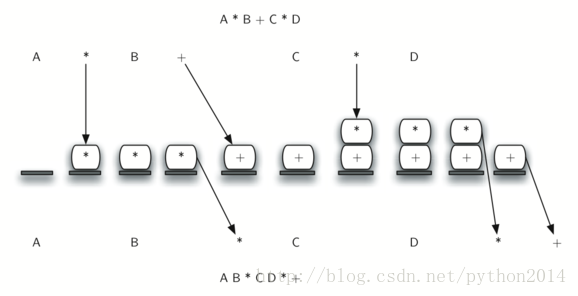

# python 数据结构与算法 10 栈的应用之中缀转后缀表达式算法的实现

### General Infix-to-Postfix Conversion
中缀转后缀的算法

We need todevelop an algorithm to convert any infix expression to a postfix expression.To do this we will look closer at the conversion process.

现在我们要开发一个算法，能把任何中缀式转成后缀式。那么再仔细研究一下转换过程。

Consider onceagain the expression A + B * C. As shown above, A B C * + is the postfixequivalent. We have already noted that the operands A, B,and C stay in their relative positions. It is only the operators that changeposition. Let’s look again at the operators in the infix expression. The firstoperator that appears from left to right is +. However, in the postfixexpression, + is at the end since the next operator, *, has precedence overaddition. The order of the operators in the original expression is reversed inthe resulting postfix expression.

还是这个表达式，A + B * C，如前所述，等价后缀式是 A B C * +，而且 A、B 和 C 保留了原来的相对位置，只有操作符变了地方。在中缀式中，从左到右第一个出现的是+，而在后缀式中，+最后出现，因为*的优先级高于+。就是说，操作符在中缀式中的顺序和后缀式中相反。。

As we processthe expression, the operators have to be saved somewhere since theircorresponding right operands are not seen yet. Also, the order of these savedoperators may need to be reversed due to their precedence. This is the casewith the addition and the multiplication in this example. Since the additionoperator comes before the multiplication operator and has lower precedence, itneeds to appear after the multiplication operator is used. Because of thisreversal of order, it makes sense to consider using a stack to keep theoperators until they are needed.

在处理表达式的时候，操作符应该先保存在某处，因为操作符读进来的时候，它右边的操作数还没到。另外因为优先级的关系，保存的顺序要反转。就象上面说的乘号和加号一样，加号先出现，但因为乘法优先，加法先来也得靠后站。因为顺序反转的关系，考虑使用栈来保存操作符。

What about (A +B) * C? Recall that A B + C * is the postfix equivalent. Again, processing thisinfix expression from left to right, we see + first. In this case, when we see *,+ has already been placed in the result expression because it has precedenceover * by virtue of the parentheses. We can now start to see how the conversionalgorithm will work. When we see a left parenthesis, we will save it to denotethat another operator of high precedence will be coming. That operator willneed to wait until the corresponding right parenthesis appears to denote itsposition (recall the fully parenthesized technique). When that rightparenthesis does appear, the operator can be popped from the stack.

象（A + B） * C 怎么办呢？它的等价式是 A B + C * 。从左到右的顺序，先读到了+，但是当读到*的时候，+已经找好位置。因为括号的优先级高于*。上一段的规则遇到了新问题。这里就要考虑有括号的时候怎么办。当读到左括号的时候，我们把左括号作为操作符保存起来，标志着一个高优先级的操作就要到了，直到匹配的右括号出现，左括号才能出栈。

As we scan theinfix expression from left to right, we will use a stack to keep the operators.This will provide the reversal that we noted in the first example. The top ofthe stack will always be the most recently saved operator. Whenever we read anew operator, we will need to consider how that operator compares in precedencewith the operators, if any, already on the stack.

算法扫描中缀式的时候，要用一个栈来保存操作符，栈的特性提供了反转功能，就如我们已经多次提到的。栈顶项总是我们最近一次压栈的操作符。每当读到一个新操作符，总要与栈顶的符号比较一下优先级。

Assume the infixexpression is a string of tokens delimited by spaces. The operator tokens are*, /, +, and -, along with the left and right parentheses, ( and ). The operandtokens are the single-character identifiers A, B, C, and so on. The followingsteps will produce a string of tokens in postfix order.

我们把中缀表达式作为两种符号组成的字符串，一种符号是操作符，如* / +-还有左右括号（，）。操作数则包括单个字母，如 A、B、C 等等。按以下操作，中缀式转成后缀式。

1.  Create an empty stack called opstack for keeping operators. Create an empty list for output.
2.  Convert the input infix string to a list by using the string method split.
3.  Scan the token list from left to right.
    *   If the token is an operand, append it to the end of the output list.
    *   If the token is a left parenthesis, push it on the opstack.
    *   If the token is a right parenthesis, pop the opstack until the corresponding left parenthesis is removed. Append each operator to the end of the output list.
    *   If the token is an operator, *, /, +, or -, push it on the opstack. However, first remove any operators already on the opstack that have higher or equal precedence and append them to the output list.
4.  When the input expression has been completely processed, check the opstack. Any operators still on the stack can be removed and appended to the end of the output list.

1 建立一个空栈，名为 opstack 保存操作符。建立空列表保存输出项。

2 把中缀表达式转为列表，使用 split()方法。

3 从左到右扫描列表，对于每个元素：

       如果是一个操作数，追加到输出列表

如果是左括号（，压栈到 opstack

如果是右括号），循环出栈，直到左括号出栈。此前出栈的元素追加到输出列表

如果是操作符+-*/，先把栈内优先级大于当前操作符的项目全部出栈并追加到输出列表，然后把当前操作符压栈。

4 输入列表检索完成，检查栈，把剩下的元素全部出栈并加到输出列表尾部。

[*Figure 9*](http://interactivepython.org/courselib/static/pythonds/BasicDS/stacks.html#fig-intopost) shows theconversion algorithm working on the expression A * B + C * D. Note that thefirst * operator is removed upon seeing the + operator. Also, + stays on thestack when the second * occurs, since multiplication has precedence overaddition. At the end of the infix expression the stack is popped twice,removing both operators and placing + as the last operator in the postfixexpression.

图 9 显示了转换 A*B +C*D 的转换过程。注意第一个*，它在收到+的时候被弹出到输出列表，+存栈，直到第二个*出现，但是*的优先级高于+，所以+没有被弹出，*被压栈，直到最后输入列表结束，清空栈的时候，这两个操作符才被连弹两次，扔到输出串的最后。



Figure 9:Converting A * B + C * D to Postfix Notation

In order to codethe algorithm in Python, we will use a dictionary called prec to holdthe precedence values for the operators. This dictionary will map each operatorto an integer that can be compared against the precedence levels of otheroperators (we have arbitrarily used the integers 3, 2, and 1). The leftparenthesis will receive the lowest value possible. This way any operator thatis compared against it will have higher precedence and will be placed on top ofit. Line 15 defines the operands to be any upper-case character or digit. Thecomplete conversion function is shown in [*ActiveCode 8*](http://interactivepython.org/courselib/static/pythonds/BasicDS/stacks.html#lst-intopost).

终于到了算法实现的时候。代码中，我们用了一个名为 prec 的字典保存操作符的优先级，每个操作符映射一个整数以便作优先级的比较。注意左括号（也被定义为最低的优先级 1，这样每个操作符与之比较的时候，都会高于它。第 15 行定义了操作符为任意大写字母或数字。完整的代码如下：

```
from pythonds.basic.stack import Stack

def infixToPostfix(infixexpr):
    prec = {}
    prec["*"] = 3
    prec["/"] = 3
    prec["+"] = 2
    prec["-"] = 2
    prec["("] = 1
    opStack = Stack()
    postfixList = []
    tokenList =infixexpr.split()

    for token in tokenList:
        if token in"ABCDEFGHIJKLMNOPQRSTUVWXYZ" or token in "0123456789":
           postfixList.append(token)
        elif token == '(':
           opStack.push(token)
        elif token == ')':
            topToken =opStack.pop()
            while topToken !='(':
               postfixList.append(topToken)
                topToken =opStack.pop()
        else:
            while (not opStack.isEmpty()) and \
              (prec[opStack.peek()] >= prec[token]):
                 postfixList.append(opStack.pop())
           opStack.push(token)

    while notopStack.isEmpty():
       postfixList.append(opStack.pop())
    return "".join(postfixList)

print(infixToPostfix("A * B + C * D"))
print(infixToPostfix("( A + B ) * C - ( D - E ) * ( F + G)"))
```