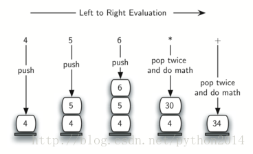

# python 数据结构与算法 11 后缀表达式求值

从本节开始，删除原版的英文，直接发译后的文稿。

## 后缀表达式求值

栈的最一个应用例子，计算一个后缀表达式的值。这个例子中仍然用栈的数据结构。不过，当扫描表达式的时候，这次是操作数压栈等待，不是转换算法中那样让操作符等待。另一条思路是，无论何时看到输入一个操作符，最近的两个操作数就是操作对象。

为了说清楚一点，考虑表达式 4 5 6 * +。从左到右扫描时，首先得到 4 和 5，不过此时，并不知道怎样处理这两个数，直到看到后面的操作符。所以要把这两个数先压栈，得到操作符以后再出栈。

这个例子中，下一个符号仍然是操作数，所以照旧压栈，并检查下一个。现在看到操作符*，这意味着最近两个操作数要用来做乘法。出栈两次，得到两个操作数并相乘（在本例中是结果是 30）

这个计算结果要压回到栈内，并作为下一个操作符的对象。当最后一个操作符工作结束，栈内应该只有一个数值，出栈并作为计算结果返回。图 10 显示了这个求值过程中，栈内容的变化。



图 11 显示了一个稍微复杂的表达式求值过程。 7 8 + 3 2 + /。这个例子中有两点要注意。第一，栈的大小，随着子表达式的计算过程而膨胀，收缩，再膨胀。第二，除法操作符要小心处理，因为后缀表达式的操作数顺序不变，但当两个操作数出栈时，顺序反了。因为除法不支持交换律，所以 15/5 与 5/15 不同，必须保证顺序没有交错。


算法假定后缀表达式是一系列被空格分隔的字符，操作符是 * /+ -，操作数假定是一位整数。最终结果也是整数。

1 建立一个空栈，operandStack

2 字符串使用 split 转为列表

3 从左到右检索列表

       如果是操作数，字符转为整数，压栈

       如果是操作符，出栈两次。第一次出栈的是第二个操作数，第二次出栈的是第一个操作数。计算结果，并压回栈。

4 检索结束，出栈结果就是返回值。

完整的函数代码如下，其中的 doMath 是算法辅助函数，定义为两个操作数和一个操作符的计算。

```
from pythonds.basic.stack import Stack

def postfixEval(postfixExpr):
    operandStack = Stack()
    tokenList =postfixExpr.split()

    for token in tokenList:
        if token in"0123456789":
           operandStack.push(int(token))
        else:
            operand2 =operandStack.pop()
            operand1 =operandStack.pop()
            result =doMath(token,operand1,operand2)
           operandStack.push(result)
    return operandStack.pop()

def doMath(op, op1, op2):
    if op == "*":
        return op1 * op2
    elif op == "/":
        return op1 / op2
    elif op == "+":
        return op1 + op2
    else:
        return op1 - op2

print(postfixEval('7 8 + 3 2 + /'))

```