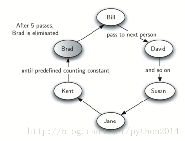
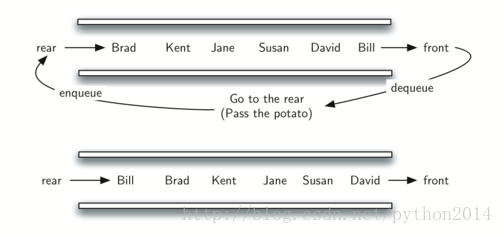

# python 数据结构与算法 15 队列应用之烫手的山芋

为了展示队列的应用，我们模拟一种真实的先进先出的情形。作为开始，我们观察一种儿童游戏，叫烫手的山芋（hotpotato），在这个游戏中（图 2），孩子们排成一圈，把手里的东西一个传一个，在某种情形下，停止传递，手上拿着烫手的山芋的人就要被清出来，其他的人继续玩，直到只剩一个人。



从现代意义上说，这个游戏等价于著名的约瑟夫问题。据说，一世纪左右，历史学家弗拉维约瑟夫与犹太人一起反抗罗马。一次，约瑟夫和他的 39 个同志一起在山洞里抵抗，不过眼看就要失败了，他们决定宁死也不做罗马的奴隶。他们围坐成一圈，一个人一个编号，按时针方向，每第七个人就要被杀死。据说约瑟夫是个数学家，他马上就知道按这规则，应该坐在哪个位置会留到最后。看来约瑟夫最后没有自杀，相反却投降了。这个故事有很多版本，有的版本说是每 3 个人杀一个，有的说最后一个人可以骑马逃脱，但不管怎样，思想是相同的。

我们引入一个烫手的山芋的模拟过程，参数是一个名字列表和一个常数 num。num 用来计数，最后函数返回经多轮计数后，剩下的最后一个人的名字。后来发生什么，就看你的了。

为了模拟这个圆圈，我们使用队列（图 3）。假定开始拿着山芋的孩子站在队伍的前端，一经传出山芋后，模拟程序只需要简单地把这个孩子移出队列，然后再将他加入尾部，然后他在尾部再逐步前移，直到再次轮到他。

经过 num 次出队入队之后，前端的孩子最终被完全清出队列，然后剩余的人继续游戏，直到最后一个。



下面是实现代码，最后面是用 7 个名字和数字 3 来调用这个方法，最后剩下那个叫 Susan。

```
from pythonds.basic.queue import Queue

def hotPotato(namelist, num):
    simqueue = Queue()
    for name in namelist:
        simqueue.enqueue(name)

    while simqueue.size() >1:
        for i in range(num):
           simqueue.enqueue(simqueue.dequeue())

        simqueue.dequeue()

    return simqueue.dequeue()

print(hotPotato(["Bill","David","Susan","Jane","Kent","Brad"],7))

```

（译者注）译者认为这个算法与约瑟夫问题差别明显，具体讨论在 http://blog.csdn.net/python2014/article/details/21231985