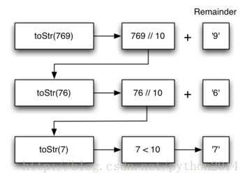
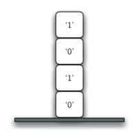

# python 数据结构与算法 21 递归的实现和应用

## 把一个整数变成一个任意进制的字符串

假设你要把一个整数转变成一个从 2 到 16 进制的数字组成的字符串，例如，把整数 10 变成十进制是“10”，二进制就是“1010”。虽然很多算法能够实现，包括在栈的应用中我们讨论过一个算法，但是递归的算法仍然是最简洁的。

先来看个例子，十进制数 769。我们有一个字符串，含有 10 个数字的字符串，类似 covString=”0123456789”。那么把一个小于 10 的数字变成串很简单，如果是数字 9，字符串就是 convString[9]或“9”。如果我们 769 分解成 3 个单数，就是 7，6 和 9，然后分别转成字符串，这样小于 10 的数字转起来很简单。

估计基点算法要包括三个部分

1.   把原数字转成一串的个位数

2.   把个位数查表转成单个数的字符串

3.   把各个字符串合并

下一步就要考虑怎样改变状态趋向基点。既然处理对象是整数，我们来看一下在数学上是怎么办的。最可能选项是减法和除法，减法也许能行？拿什么减什么呢？不太清楚。然而除法和余数的想法给了一个明确的方向。来看一下，如果用基数来除整数，是什么情况.

用整数 10 去除 769，得到 76 余 9，得到两个数。首先，余数 9 是小于基数（10）的个位数，能够通过查表迅速转成字符串。其次，得到的商（76）小于原来的 769，并朝向基点变动.现在的工作是把 76 变成字符串，再次用 10 去除 76，得到 7 余 6，现在我们把数字变成了个位数 7，小于基数 10，可以很容易处理成字符串。

这一连串的操作如图 3 所示，注意我们要的数字是图解右边的余数。



图 3：转换整数为十进制字符串

代码段是算法的实现，基数可以是 2-16 之间的整数。

```
def toStr(n,base):
   convertString = "0123456789ABCDEF"
   ifn<base:
      returnconvertString[n]
   else:
      returntoStr(n//base,base)+convertString[n%base]

print(toStr(1453,16))

```

注意第 3 行我们检查 n 是否小于进制的基数,，如果是，不用递归，直接从字符串上获得结果。第 6 行包括了第二和第三定律——自我调用和趋向基点改变状态——使用除法。

我们再跟踪一次算法，这次转化数字 10 为二进制。


图 4 整数 10 转为二进制字符串

图 4 所示为求得结果的过程，但是看起来顺序似乎不对，但是计算结果又是对的。这是因为我们的递归计算放在前面，这样直到递归结束才会去加余数。如果我们把 convertString[n%base]这个式子放在前面，先查找余数的字符串再去计算递归，那么结果就完全反了顺序！但是我们先做递归，直接递归结束返回结果再去和余数相加，结果的顺序就是正确的。这应该让你想起我们在讨论栈时候计算的过程。

## 堆栈帧：递归的实现

假设我们要把上节递归调用中的 toStr 和 convertString 换一下位置，就要修改算法，把字符串压栈，以优先做递归调用。这个修改后的算法如下：

```
frompythonds.basic.stackimportStack

rStack = Stack()

deftoStr(n,base):
    convertString ="0123456789ABCDEF"
    whilen>0:
        ifn<base:
            rStack.push(convertString[n])
        else:
            rStack.push(convertString[n%base])
        n = n//base
    res = ""
    whilenotrStack.isEmpty():
        res = res+str(rStack.pop())
    returnres

print(toStr(1453,16))

```

每次调用 toStr，我们都把一个字符压栈。回到此前的例子，我们看到经过四次调用 toStr，栈内容如图 5 所示。注意现在我们可以简单地把字符出栈并合并成为答案：“1010”。



图 5 转化过程中栈内的字符

这个例子让我们得以窥到 python 是如何实现递归函数调用的。当调用一次函数，系统分配一个堆栈帧来存储函数的变量，当函数返回时，返回值就存在栈顶等待调用函数访问。图 6 所示是第 4 行返回语句之后的调用栈情况。


图 6 toStr（10，2）产生的调用栈

注意对 toStr(2//2,2)的调用，留下“1”在栈内，这个值陏后在调用 toStr(1,2)时，表达式"1" + convertString[2%2]用到。然后它又留下"10"在栈顶。这样，python 调用栈的过程和我们在递归求和时所有过程明显一样。在求和算法中，你可以认为栈内返回值替换了累加器变量。

堆栈帧也提示了 python 语言变量作用域的概念，虽然我们一遍又一遍调用函数，但每次都为函数变量开辟了独立的变量作用域。

如果牢牢记住这个栈的思想，你将会发现写递归函数变得容易多了。