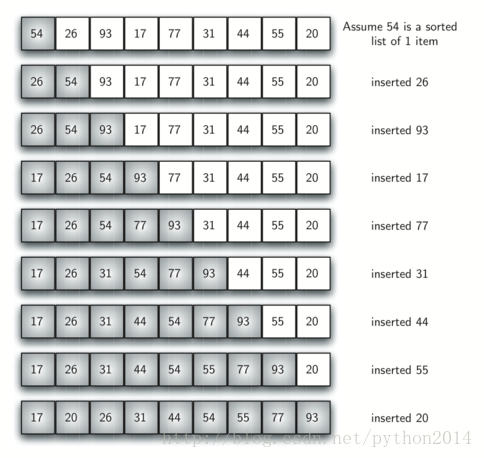

# python 数据结构与算法 32 插入排序

## 插入排序

插入排序虽然仍然是*O*(*n*²)，但工作模式就有稍微不同。它总是在列表的低端保持一个有序的子列表，后面的元素被逐个“插入”到前面的有序子表，这样有序的子表就逐渐变大。图 4 是插入排序的过程，阴影部分是排好序的子列表。



开始的时候我们假设一个只有一个元素（在 0 位上）的列表而且是有序的，每次遍历的时候，从 1 到 n-1 的每个元素，与有序的子列表进行比较。当回顾已经排序的子表时候，比当前元素大的向前移，当遇到一个比它小的元素或到达子表的终点时，当前元素就插在这个位置上。

如图 5 所示为一个第 5 次遍历的细节。这时已经生成一个有序的子表，包含 17，26，54，77 和 93 五个元素。下面要把 31 插入到这个子表中。先与 93 比较，93 向右移动一个位置，然后是 77 和 54 也移动了，当遇到 26 时，停止移动，31 放在空白位置上，这时就有序子表有 6 个元素了。


下面的实现代码`insertionSort``显示，``仍然需要``n-1``次遍历来移动``n``个元素。迭代过程从``1``开始，到``n-1``，因为这些位置上的元素是需要向后插入到有序子表中的。第``8``行执行将元素向后移动的操作。记住这个操作与前面的算法相比，不是一个完整的交换过程。`

插入排序最大需要前 n-1 个整数和次比对。所以这是一个*O*(*n*²)，不过在最好的情况即有序列表的情况下，只需要一次遍历。另外要注意的是，移动元素位置相对交换两个元素的消耗。一般情况下，移动操作大概需要交换操作三分之一资源，因为移动只需要一次赋值操作。在性能测试中，插入排序显示了很好的性能。

```
def insertionSort(alist):
   for index in range(1,len(alist)):

     currentvalue = alist[index]
     position = index

     while position>0 and alist[position-1]>currentvalue:
         alist[position]=alist[position-1]
         position = position-1

     alist[position]=currentvalue

alist = [54,26,93,17,77,31,44,55,20]
insertionSort(alist)
print(alist)

```