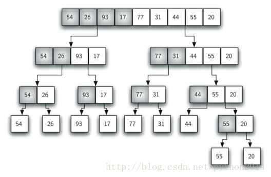

# python 数据结构与算法 34 归并排序

## 归并排序

在提高排序算法性能的方法中，有一类叫做分而治之。我们先研究其中第一种叫做归并排序。归并排序使用递归的方法，不停地把列表一分为二。如果列表是空或只有一个元素，那么就是排好序的（递归基点），如果列表有超过 1 个的元素，那么切分列表并对两个子列表递归使用归并排序。一旦这两个列表排序完成，称为“归并”的基本操作开始执行。归并是把两个有序列表合并成一个新的有序列表的过程。图 10 是我们熟悉的列表样例分解过程，图 11 是归并的过程。


图 10  切分过程
图 11  归并过程

以下是 mergeSort 函数。函数开始查询基点，如果列表长度小于等于 1，那么已经是有序的不需要进一步处理，否则，长度大于 1，就要用列表的切片操作分拆成左半部和右半部。注意列表的元素数量未必是个偶数，那没关系，长度相关最大也不超过 1 个。

```
def mergeSort(alist):
    print("Splitting ",alist)
    if len(alist)>1:
        mid = len(alist)//2
        lefthalf = alist[:mid]
        righthalf = alist[mid:]

        mergeSort(lefthalf)
        mergeSort(righthalf)

        i=0
        j=0
        k=0
        while i<len(lefthalf) and j<len(righthalf):
            if lefthalf[i]<righthalf[j]:
                alist[k]=lefthalf[i]
                i=i+1
            else:
                alist[k]=righthalf[j]
                j=j+1
            k=k+1

        while i<len(lefthalf):
            alist[k]=lefthalf[i]
            i=i+1
            k=k+1

        while j<len(righthalf):
            alist[k]=righthalf[j]
            j=j+1
            k=k+1
    print("Merging ",alist)

alist = [54,26,93,17,77,31,44,55,20]
mergeSort(alist)
print(alist)

```

mergeSoft 函数被调用处理左半个表和右半个表时（8-9 行），假设他们是排好序的。函数的其他部分（11-31 行）负责把两个排好序的列表合并成一个有序表。注意合并的操作把元素放在原表（alist）的后面，一次取一个最小的元素。

mergeSort 函数在第 2 行使用了一个 print 语句来显示每次调用的列表的内容。在 32 行也有一个 print 语句来显示归并处理。它的副本显示了函数处理样例列表的结果（最行一行？）。注意列表里 44，55 和 20 没有平均切分，第一次切分多出了[44]，第二次多出了[55,20]。容易看得出，切分过程产生的列表可以立即与另一个有序表合并。

要分析 mergeSort 函数，需要考虑函数中两个分立的过程。第一个，把列表一分为二，我们已经在二分查找中计算过了，对于长为 n 的列表，需要 logn 的时间来切分。第二个是归并过程。列表中每个元素都要被处理并放在有序表中，所有归并操作 n 个元素的列表，需要 n 步操作。这样结果就是，logn 步操作，每步操作包括 n 步归并，所以最终为*n*log*n。*

回想列表切片的操作，如果切片大小是 k，那么这个操作的性能是*O*(*k*)，为了保证 mergeSoft 的性能是*O*(*n*log*n*) ，我们需要清除切片操作。这样，我们需要简单地将开始和结束的索引值连同列表一起传递给递归过程。这个修改留作练习。

要注意的是，mergeSoft 函数需要额外的内存来保存切出的两个子表，当数据集很大时，问题会变得很严重。