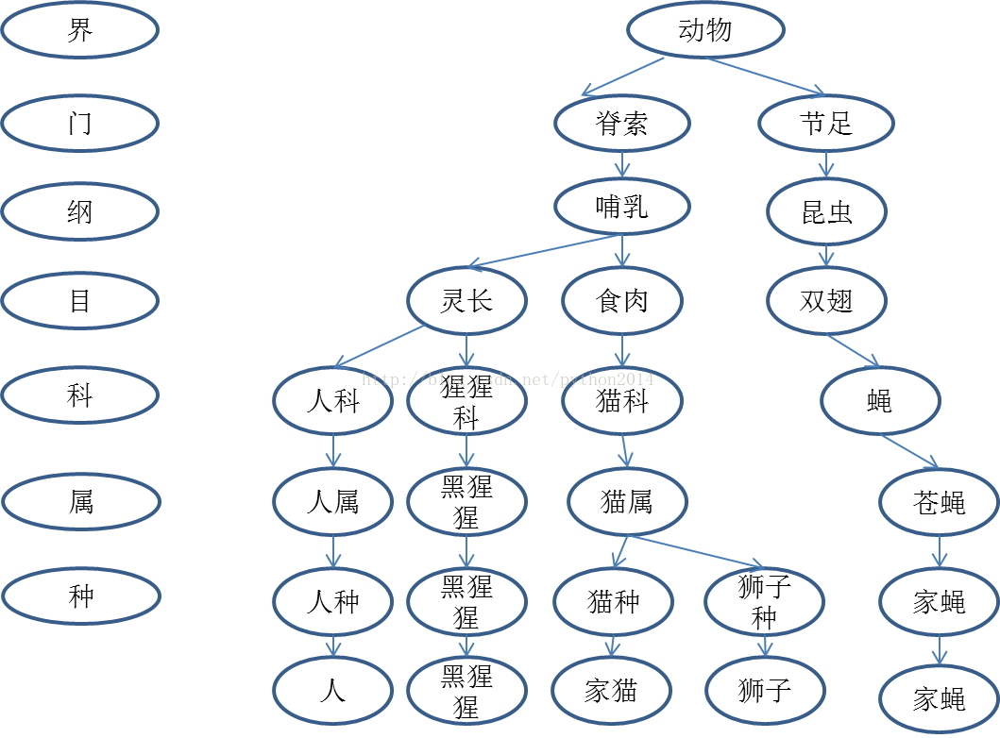
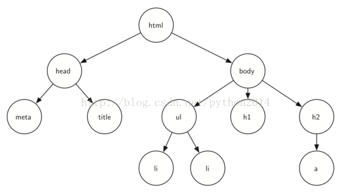
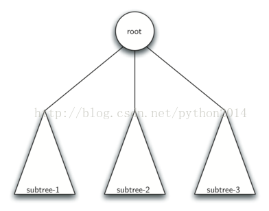

# python 数据结构与算法 36 树的基本概念

## 树

## 学习目标

*   理解什么是树及使用方法
*   学会使用树实现映射
*   用列表实现树
*   用类和引用实现树
*   用递归实现树
*   用堆实现优先队列

## 树的例子

前面我们学习过栈和队列这类线性数据结构，并且体验过递归，现在我们学习另一种通用数据结构，叫做树。树在计算机科学中应用广泛，象操作系统、图形学、数据库系统、网络等都要用到树。树和他们在自然界中的表哥——植物树——非常相似，树也有根，有分枝，有叶子。不同之处是，数据结构的树，根在顶上，而叶子在底部。

在开始学习之前，我们来研究几个普通的例子。第一个是生物学上的分级树。图 1 所示为部分动物的分级树，从这个例子中，我们可以看到树的一些性质。图中显示的第一个性质就是树是分级的，通过分级，形成层级结构，越接近上层的越是一般的共性，底部则是一些具体的东西，顶级的是“界”，第二级是“门”，然后是“纲”，如此等等。不管到分级树的多少层，所有的生物体都是动物界。


图 1 生物层级图（看不懂写参考下图）
图 1 中文版的生物层级图

你查以从顶部开始，沿着圆圈和箭头组成的路径一直下到底部。在树的每层上，我们都可以问自己一个问题，而且沿着同意的答案走。例如你可以问：“这个动物是脊索动物还是节足动物？”，如果答案是“脊索动物”，那么就沿着脊索动物向下，“这个脊索动物是哺乳动物吗？”如果不是，我们就被困住了（当然，仅限于图中的资料才会困住），如果是在哺乳动物层次上问，“这个哺乳动物是灵长类还是食肉类？”，这种问题可以一直问下去，直到最底层找到动物的名字。

树的另一个性质是，一个节点的所有孩子独立于另一个节点的孩子，例如，猫属有两个孩子，家猫种和狮子种，蝇属也有一个孩子叫家蝇种，但是它的节点不同，与猫属的孩子完全独立。这意味着，我们改变蝇属的孩子不会影响到猫属的孩子。

第三个性质是，每个叶子节点是唯一的，我们可以从动物“界”开始，从根到叶沿着规定的路线唯一地定义每一个物种。例如动物界→脊索动物门→哺乳动物纲→食肉目→猫科→猫属→猫种→家猫

另外一个树形数据结构的例子是我们天天要用的文件系统。文件系统里，目录或文件夹，是树形结构的。图 2 是 unix 文件系统的部分结构。


图 2 unix 文件系统的层级图

文件系统与生物层级系统很相似，也可以沿着一条路径从根到任何目录，路径可以唯一地确定一个子目标和他下面的所有文件。

树的另一个性质，出自它的层次特性，即可以把的一棵子树移动到另一个位置，而不会影响到它下面的层级。例如，我们可以把整个的/etc/从根目录移动到 usr/下面，这会将到达 httpd 的路径从/etc/httpd 到/usr/etc/httpd，但不是会影响 httpd 目录的内容和子目录。

树的最后一个例子是网页，这面是用 HTML 写的一个简章网页，图 3 是文中 HTML 标志的结构关系：

```
<html 
      xml:lang="en" lang="en">
<head>
    <meta http-equiv="Content-Type"
          content="text/html; charset=utf-8" />
    <title>simple</title>
</head>
<body>
<h1>A simple web page</h1>
<ul>
    <li>List item one</li>
    <li>List item two</li>
</ul>
<h2><a href="http://www.cs.luther.edu">Luther CS </a><h2>
</body>
</html>

```


图 3 HTML 标志符的嵌套树形结构

HTML 源码和相应的树形结构是另一个层级实例。注意，树中每一个层级也就是 HTML 标志的嵌套深度。第一对标签是<html></html>，所有其他标签就嵌在它们里面。检查一遍你将在树的每一层级上发现这种性质。

## 词汇和定义

我们已经看到树的几个例子，现在正式定义树和树的组成。

**节点**

节点是树的基本元素。它可以有个名字，叫做“键值”。节点也许有更多的附加信息，称为“负载”。在树的算法中，负载不是核心问题，但在实际问题中用到树的时候，负载经常成为关键元素。

**边**

边是树的另一个基本元素，一条边把两个节点连起来表示他们之间的关系。每个节点（除根节点外）都有一条从其他节点伸过来的入边连着，而且每个节点可能伸出去好几条出边。

**根**

根是树结构中，唯一没有入边的节点。图 2 中，/就是树的根。

 **路径**

路径就是边连接而成的有序列表，元素是节点。例如：哺乳 纲→ 肉食目 → 猫科 → 猫属 → 家猫种就是一条路径。

**孩子**

“入边来自同一个节点”的节点集合，叫做那个节点的孩子。图 2 中，log/,spool/和 yp/是节点 var/的孩子。

**父母**

一个节点的出边指向其他节点，它就是这些节点的父母。图 2 中，var/是 log/,spool/和 yp/的父母。

**兄弟**

同一父母的节点叫做兄弟。节点 etc/和 usr/是文件系统树的兄弟。

**子树**

子树是指一个父母节点和他们的子子孙孙节点和边组成的集合。

**叶子节点**

叶子节点指没有孩子的节点。如生物层级树中的人和黑猩猩都是叶子节点。

**层次**

节点的层次，是指从根到这个节点经过的边的数量。例如图 1 中，Felis 的层次是 5，根据定义，根节点是 0 层。

**高度**

树的高度是指它所有节点层次的最大值。图 2 中树的高度是 2

基本词汇定义完成，我们要对树做一个正式定义。事实上，我们要对做两个正式定义，一个定义包括节点和边，另一个定义是递归定义。递归定义的价值已经被证实。

第一个定义：树包括节点的集合以及连接节点的边的集合。树有以下性质：

*   一个节点的树称为根节点
*   任意节点 n,除了根节点，都要被另外的唯一节点 p 所连接，这时 p 是 n 的父母。
*   从根到任意节点有一条唯一的路径
*   如果每个节点最多有两个孩子，我们把这种树称为二叉树。

图 4 是第一个定义的树，边用箭头表明连接的方向。


图 4 树的定义：节点和边

第二个定义：树或者是一个空集，或者是包括一个根节点和 0 个或多个子树，每个子树也是树。每个子树的根连到父母树的根。图 4 所表明的树的递归定义。应用递归定义，我们知道图中至少有 4 个节点，因为每个三角形代表一个子树，子树中至少包括一个根节点。也许有更多的节点，但是在深入到子树之前无法知晓。

