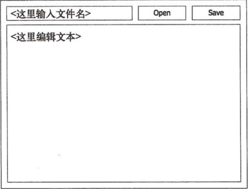
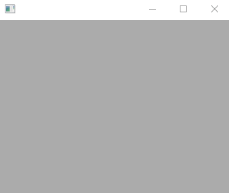
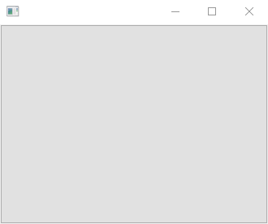
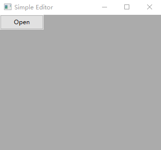
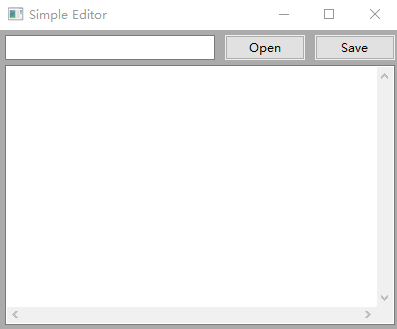

# 第十二章 图形用户界面

# 第十二章 图形用户界面

> 来源：[`www.cnblogs.com/Marlowes/p/5520948.html`](http://www.cnblogs.com/Marlowes/p/5520948.html)
> 
> 作者：Marlowes

本章将会介绍如何创建 Python 程序的图形用户界面(GUI)，也就是那些带有按钮和文本框的窗口等。很酷吧？

目前支持 Python 的所谓“GUI 工具包”(GUI Toolkit)有很多，但是没有一个被认为是标注你的 GUI 工具包。这样的情况也好(自由选择的空间较大)也不好(其他人没法用程序，除非他们也安装了相同的 GUI 工具包)，幸好 Python 的 GUI 工具包之间没有冲突，想装多少个就可以装多少个。

本章简要介绍最成熟的跨平台 Python GUI 工具包——wxPython。有关更多 wxPython 程序的介绍，请参考[官方文档](http://wxpython.org)。关于 GUI 程序设计的更多信息请参见第二十八章。

## 12.1 丰富的平台

在编写 Python GUI 程序前，需要决定使用哪个 GUI 平台。简单来说，平台是图形组件的一个特定集合，可以通过叫做 GUI 工具包的给定 Python 模块进行访问。Python 可用的工具包很多。其中一些最流行的如表 12-1 所示。要获取更加详细的列表，可以在[Vaults of Parnassus](http://py.vaults.ca/)上面以关键字"GUI"进行搜索。也可以在[Python Wiki](http://wiki.python.org/moin/GuiProgramming)上找到完全的工具列表。Guiherme Polo 也撰写过一篇有关 4 个主要平台对比的论文("PyGTK,PyQt,Tkinter and wxPython comparison"(PyGTK、PyQt、Tkinter 和 wxPython 的比较)，The Python Papers， 卷 3，第 1 期 26~37 页。这篇文章可以从 [`pythonpapers.org`](http://pythonpapers.org) 上获得)。

表 12-1 一些支持 Python 的流行 GUI 工具包

```
Tkinter          使用 Tk 平台，很容易得到，半标准。                     http://wiki.python.org/moin/TkInter
wxpython         基于 wxWindows，跨平台越来越流行。　　　　　        　http://wxpython.org
PythonWin　　　　只能在 Windows 上使用，使用了本机的 Windows GUI 功能　　 http://starship.python.net/crew/mhammond
Java Swing　　　 只能用于 Jython，使用本机的 Java GUI。                 http://java.sun.com/docs/books/tutorial/uiswing
PyGTK　　　　　　使用 GTK 平台，在 Linux 上很流行。　　　　　　　　　　　 http://pygtk.org
PyQt　　　　　　 使用 Qt 平台，跨平台。　　　　　　　　　　　　         http://wiki.python.org/moin/PyQt 
```

可选的包太多了，那么应该用哪个呢？尽管每个工具包都有利弊，但很大程度上取决于个人喜好。Tkinter 实际上类似于标准，因为它被用于大多数“正式的”Python GUI 程序，而且它是 Windows 二进制发布版的一部分。但是在 UNIX 上要自己编译安装。Tkinter 和 Swing Jython 将在 12.4 节进行介绍。

另外一个越来越受欢迎的工具是 wxPython。这是个成熟而且特性丰富的包，也是 Python 之父 Guido van Rossum 的最爱。在本章的例子中，我们将使用 wxPython。

关于 Pythonwin、PyGTK 和 PyQt 的更多信息，请查看这些项目的主页(见表 12-1)。

## 12.2 下载和安装 wxPython

要下载 wxPython，只要访问它的[下载页面](http://wxpython.org/download.php)即可。这个网页提供了关于下载哪个版本的详细指导，还有使用不同版本的先决条件。

如果使用 Windows 系统，应该下载预建的二进制版本。可以选择支持 Unicode 或不支持 Unicode 的版本，除非要用到 Unicode，否则选择哪个版本区别并不大。确保所选择的二进制版本要对应 Python 的版本。例如，针对 Python2.3 进行编译的 wxPython 并不能用于 Python2.4。

对于 Mac OS X 来说，也应该选择对应 Python 版本的 wxPython。可能还需要考虑操作系统版本。同样，你也可以选择支持 Unicode 和不支持 Unicode 的版本。下载链接和相关的解释能非常明确地告诉你应该下载哪个版本。

如果读者正在使用 Linux，那么可以查看包管理器中是否包括 wxPython，它存在于很多主流发布版本中。对于不同版本的 Linux 来说也有不同的 RPM 包。如果运行包含 RPM 的 Linux 发行版，那么至少应该下载 wxPython 和运行时包(runtime package)，而不需要 devel 包。再说一次，要选择与 Python 以及 Linux 发布版对应的版本。

如果没有任何版本适合硬件或操作系统(或者 Python 版本)，可以下载源代码发布版。为了编译可能还需要根据各种先决条件下载其他的源代码包，这已经超出了本章的范围。这些内容在 wxPython 的下载页面上都有详细的解释。

在下载了 wxPython 之后，强烈建议下载演示版本(demo，它必须进行独立安装)，其中包含文档、示例程序和非常详细的(而且有用的)演示分布。这个演示程序演示了大多数 wxPython 的特性，并且还能以对用户非常友好的方式查看各部分源代码——如果想要自学 wxPython 的话非常值得一看。

安装过程应该很简单，而且是自动完成的。安装 Windows 二进制版本只要运行下载完的可执行文件(.exe 文件)；在 OS X 系统中，下载后的文件应该看起来像是可以打开的 CD-ROM 一样，并带有一个可以双击的.pkg 文件。要使用 RPM 安装，请参见 RPM 文档。Windows 和 Mac OS X 版本都会运行一个安装向导，用起来很简单。只要选择默认设置即可，然后一直惦记 Continue，最后点击 Finish 即可。

## 12.3 创建示例 GUI 应用程序

为使用 wxPython 进行演示，首先来看一下如何创建一个简单的示例 GUI 应用程序。你的任务是编写一个能编辑文本文件的基础程序。编写全功能的文本编辑器已经超出了本章的范围——关注的只是基础。毕竟目标是演示在 Python 中进行 GUI 编程的基本原理。

对这个小型文本编辑器的功能要求如下：

☑ 它应允许打开给定文件名的文本文件；

☑ 它应允许编辑文本文件；

☑ 它应允许保存文本文件；

☑ 它应允许退出程序。

当编写 GUI 程序时，画个界面草图总是有点用的。图 12-1 展示了一个满足我们文本编辑要求的布局：

图 12-1 文本编辑器草图



界面元素可以像下面这样使用。

☑ 在按钮左侧的文本框内输入文件名，点击 Open 打开文件。文件中包含的文本会显示在下方的文本框内。

☑ 可以在这个大的文本框中随心所欲地编辑文本。

☑ 如果希望保存修改，那么点击 Save 按钮，会再次用到包含文件名的文本框——然后将文本框的内容写入文件。

☑ 没有 Quit(退出)按钮——如果用户关闭窗口，程序就会退出。

使用某些语言写这样的程序时相当难的。但是利用 Python 和恰当的 GUI 工具包，简直是小菜一碟(虽然现在读者可能不同意这种说法，但在学习完本章之后应该就会同意了)。

### 12.3.1 开始

为了查看 wxPython 是否能工作，可以尝试运行 wxPython 的演示版本(要单独安装)。Windows 内应该可以在开始菜单找到，而 OS X 可以直接把 wxPython Demo 文件拖到应用程序中，然后运行。看够了演示就可以开始写自己的程序了，当然，这会更有趣的。

开始需要导入`wx`模块：

```
import wx 
```

编写 wxPython 程序的方法很多，但不可避免的事情是创建应用程序对象。基本的应用程序类叫做 ex.App，它负责幕后所有的初始化。最简单的 wxPython 程序应该像下面这样：

```
import wx

app = wx.App()
app.MainLoop() 
```

注：如果`wx.App`无法工作，可能需要将它替换为`wx.PySimpleApp`。

因为没有任何用户可以交互的窗口，程序会立刻退出。

例中可以看到，`wx`包中的方法都是以大写字母开头的，而这和 Python 的习惯是相反的。这样做的原因是这些方法名和基础的 C++包 wxWidgets 中的方法名都是对应的。尽管没有正式的规则反对方法或者函数名以大写字母开头，但是规范的做法是为类保留这样的名字。

### 12.3.2 窗口和组件

窗口(Windows)也成为*框架*(`frame`)，它只是`wx.Frame`类的实例。`wx`框架中的部件都是由它们的*父部件*作为构造函数的第一个参数创建的。如果正在创建一个单独的窗口，就不需要考虑父部件，使用 None 即可，如代码清单 12-1 所示。而且在调用`app.MainLoop`前需要调用窗口的`Show`方法——否则它会一直隐藏(可以在事例处理程序中调用`win.Show`，后面会介绍)。

```
# 代码清单 12-1 创建并且显示一个框架

import wx

app = wx.App()
win = wx.Frame(None)
win.Show()
app.MainLoop() 
```

如果运行这个程序，应该能看到一个窗口出现，类似于图 12-2。

图 12-2 只有一个窗口的 GUI 程序



在框架上增加按钮也很简单——只要使用 win 作为符参数实例化`wx.Button`即可，如代码清单 12-2 所示。

```
# 代码清单 12-2 在框架上增加按钮

import wx

app = wx.App()
win = wx.Frame(None)
btn = wx.Button(win)
win.Show()
app.MainLoop() 
```

这样会得到一个带有一个按钮的窗口，如图 12-3 所示。

图 12-3 增加按钮后的程序



当然，这里做的还不够，窗口没有标题，按钮没有标签，而且也不希望让按钮覆盖整个窗口。

### 12.3.3 标签、标题和位置

可以在创建部件的时候使用构造函数的 label 参数设定它们的标签。同样，也可以用`title`参数设定框架的标题。我发现最实用的做法是为`wx`构造函数使用关键字参数，所以我不用记住参数的顺序。代码清单 12-3 演示了一个例子。

```
# 代码清单 12-3 使用关键字参数增加标签和标题

import wx

app = wx.App()

win = wx.Frame(None, title="Simple Editor")
loadButton = wx.Button(win, label="Open")
saveButton = wx.Button(win, label="Save")

win.Show()
app.MainLoop() 
```

程序的运行结果如图 12-4 所示。

这个版本的程序还是有些不对——好像丢了一个按钮！实际上它没丢——只是隐藏了。注意一下按钮的布局就能将隐藏的按钮显示出来。一个很基础(但是不实用)的方法是使用 pos 和 size 参数在构造函数内设置位置和尺寸，如代码清单 12-4 所示。

12-4 有布局问题的窗口



```
# 代码清单 12-4 设置按钮位置

import wx

app = wx.App()

win = wx.Frame(None, title="Simple Editor", size=(410, 335))
win.Show()

loadButton = wx.Button(win, label="Open",
                       pos=(225, 5), size=(80, 25))
saveButton = wx.Button(win, label="Save",
                       pos=(315, 5), size=(80, 25))

filename = wx.TextCtrl(win, pos=(5, 5), size=(210, 25))

contents = wx.TextCtrl(win, pos=(5, 35), size=(390, 260),
                       style=wx.TE_MULTILINE | wx.HSCROLL)

app.MainLoop() 
```

你看到了，位置和尺寸都包括一对数值：位置包括 x 和 y 坐标，而尺寸包括宽和高。

这段代码中还有一些新东西：我创建了两个*文本控件*(`text control`，`wx.TextCtrl`对象)，每个都使用了自定义风格。默认的文本控件是*文本框*(text field)，就是一行可编辑的文本，没有滚动条，为了创建*文本区*(text area)只要使用`style`参数调整风格即可。`style`参数的值实际上是个整数，但不用直接指定，可以使用按位或运算符 OR(或管道运算符)联合`wx`模块中具有特殊名字的风格来指定。本例中，我联合了`wx.TE_MULTILINE`来获取多行文本区(默认有垂直滚动条)以及`wx.HSCROLL`来获取水平滚动条。程序运行的结果如图 12-5 所示。

图 12-5 位置合适的组件



### 12.3.4 更智能的布局

尽管明确每个组件的几何位置很容易理解，但是过程很乏味。在绘图纸上画出来可能有助于确定坐标，但是用数字来调整位置的方法有很多严重的缺点。如果运行程序并且试图调整窗口大小，那么会注意到组件的几何位置不变。虽然不是什么大事，但是看起来还是有些奇怪。在调整窗口大小时，应该能保证窗口中的组件也会随之调整大小和位置。

考虑一下我是如何布局的，那么出现这种情况就不会令人惊讶了。每个组件的位置和大小都显式设定的，但是没有明确在窗口大小变化的时候它们的行为是什么。指定行为的方法有很多，在 wx 内进行布局的最简单方法是使用*尺寸器*(sizer)，最容易使用的工具就是`wx.BoxSizer`。

尺寸器会管理组件的尺寸。只要将部件添加到尺寸器上，再加上一些布局参数，然后让尺寸器自己去管理父组件的尺寸。在刚才的例子中，需要增加背景组件(`wx.Panel`)，创建一些嵌套的`wx.BoxSizer`，然后使用面板的`SetSizer`方法设定它的尺寸器，如代码清单 12-5 所示。

```
import wx

app = wx.App()

win = wx.Frame(None, title="Simple Editor", size=(410, 335))
bkg = wx.Panel(win)

loadButton = wx.Button(bkg, label="open")
saveButton = wx.Button(bkg, label="Save")
filename = wx.TextCtrl(bkg)
contents = wx.TextCtrl(bkg, style=wx.TE_MULTILINE | wx.HSCROLL)

hbox = wx.BoxSizer()
hbox.Add(filename, proportion=1, flag=wx.EXPAND)
hbox.Add(loadButton, proportion=0, flag=wx.LEFT, border=5)
hbox.Add(saveButton, proportion=0, flag=wx.LEFT, border=5)

vbox = wx.BoxSizer(wx.VERTICAL)
vbox.Add(hbox, proportion=0, flag=wx.EXPAND | wx.ALL, border=5)
vbox.Add(contents, proportion=1,
         flag=wx.EXPAND | wx.LEFT | wx.BOTTOM | wx.RIGHT, border=5)

bkg.SetSizer(vbox)
win.Show()

app.MainLoop() 
```

这段代码的运行结果和前例相同，但是使用了相对坐标而不是绝对坐标。

`wx.BoxSizer`的构造函数带有一个决定它是水平还是垂直的参数(`wx.HORIZONTAL`或者`wx.VERTICAL`)，默认为水平。`Add`方法有几个参数，`proportion`参数根据在窗口改变大小时所分配的空间设置比例。例如，水平的`BoxSizer`(第一个)中，`filename`组件在改变大小时获取了全部的额外空间。如果这 3 个部件都把`proportion`设为 1，那么都会获得相等的空间。可以将`proportion`设定为任何数。

`flag`参数类似于构造函数中的`style`参数，可以使用按位或运算符连接构造符号常量(`symbolic constan`t，即有特殊名字的整数)对其进行构造。`wx.EXPAND`标记确保组件会扩展到所分配的空间中。而`wx.LEFT`、`wx.RIGHT`、`wx.TOP`、`wx.BOTTOM`和`wx.ALL`标记决定边框参数应用于哪个边，边框参数用于设置边缘宽度(间隔)。

就是这样。我得到了我要的布局。但是遗漏了一件至关重要的事情——按下按钮，却什么都没发生。

*注：更多有关尺寸器的信息或者与 wxPython 相关的信息请参见 wxPython 的演示版本，它里面会有你想要了解的内容和示例代码。如果看起来比较难，可以访问[wxPython 的网站](http://wxpython.org)。*

### 12.3.5 事件处理

在 GUI 术语中，用户执行的动作(比如点击按钮)叫做*事件*(event)。你需要让程序注意这些事件并且做出反应。可以将函数绑定到所涉及的时间可能发生的组件上达到这个效果。当事件发生时，函数会被调用。利用部件的 Bind 方法可以将时间处理函数链接到给定的事件上。

假设写了一个负责打开文件的函数，并将其命名为`load`。然后就可以像下面这样将该函数作为 loadButton 的事件处理函数：

```
loadButton.Bind(wx.EVT_BUTTON, load) 
```

很直观，不是吗？我把函数链接到了按钮——点击按钮的时候，函数被调用。名为`wx.EVT_BUTTON`的符号常量表示一个*按钮事件*。`wx`框架对于各种事件都有这样的事件常量——从鼠标动作到键盘按键，等等。

为什么用 LOAD？

*注：我之所以用`loadButton`和`load`作为按钮以及处理函数的名字不是偶然的——尽管按钮的文本为`"Open"`。这是因为如果我把按钮叫做`openButton`的话，`open`也就自然成了事件处理函数的名字，这样就和內建的文件打开函数`open`冲突，导致后者失效。虽然有很多种方法可以解决这个问题，但我觉得使用不同的名字是最简单的。*

### 12.3.6 完成了的程序

让我们来完成剩下的工作。现在需要的就是两个事件处理函数：`load`和`save`。当事件处理函数被调用时，它会收到一个事件对象作为它唯一的参数，其中包括发生了什么事情的信息，但是在这里可以忽略这方面的事情，因为程序只关心点击时发生的事情。

```
def load(event):
    file = open(filename.GetValue())
    contents.SetValue(file.read())
    file.close() 
```

读过第十一章后，读者应该对于文件打开/读取的部分比较熟悉了。文件名使用`filename`对象的`GetValue`方法获取(`filename`是小的文本框)。同样，为了将文本引入文本区，只要使用`contents.SetValue`即可。

`save`函数也很简单：几乎和`load`一样——除了它有个`"w"`标志，以及用于文件处理部分的`write`方法。`GetValue`用于从文本区获得信息。

```
def save(event):
    file = open(filename.GetValue(), "w")
    file.write(contents.GetValue())
    file.close() 
```

就是这样了。现在我将这些函数绑定到相应的按钮上，程序已经可以运行了。最终的程序如代码清单 12-6 所示。

```
#!/usr/bin/env python # coding=utf-8

import wx def load(event):
    file = open(filename.GetValue())
    contents.SetValue(file.read())
    file.close() def save(event):
    file = open(filename.GetValue(), "w")
    file.write(contents.GetValue())
    file.close()

app = wx.App()
win = wx.Frame(None, title="Simple Editor", size=(410, 335))

bkg = wx.Panel(win)

loadButton = wx.Button(bkg, label="open")
loadButton.Bind(wx.EVT_BUTTON, load)
saveButton = wx.Button(bkg, label="Save")
saveButton.Bind(wx.EVT_BUTTON, save)

filename = wx.TextCtrl(bkg)
contents = wx.TextCtrl(bkg, style=wx.TE_MULTILINE | wx.HSCROLL)

hbox = wx.BoxSizer()
hbox.Add(filename, proportion=1, flag=wx.EXPAND)
hbox.Add(loadButton, proportion=0, flag=wx.LEFT, border=5)
hbox.Add(saveButton, proportion=0, flag=wx.LEFT, border=5)

vbox = wx.BoxSizer(wx.VERTICAL)
vbox.Add(hbox, proportion=0, flag=wx.EXPAND | wx.ALL, border=5)
vbox.Add(contents, proportion=1,
         flag=wx.EXPAND | wx.LEFT | wx.BOTTOM | wx.RIGHT, border=5)

bkg.SetSizer(vbox)
win.Show()

app.MainLoop() 
```

`GUI.py`

可以按照下面的步骤使用这个编辑器。

(1) 运行程序。应该看到一个和刚才差不多的窗口。

(2) 在文本区里面打些字(比如`"Hello, world!"`)

(3) 在文本框中键入文件名(比如`hello.txt`)。确保文件不存在，否则它会被覆盖。

(4) 点击`Save`按钮。

(5) 关闭编辑窗口(只为了好玩)。

(6) 重启程序。

(7) 在文本框内键入同样的文件名。

(8) 点击`Open`按钮。文件的文本内容应该会在大文本区内重现。

(9) 随便编辑一下文件，再次保存。

现在可以打开、编辑和保存文件，直到感到烦为止——然后应该考虑一下改进。例如使用`urllib`模块让程序下载文件怎么样？

读者可能会考虑在程序中使用更加面向对象的设计。例如，可能希望将主应用程序作为自定义应用程序类(可能是`wx.App`的子类)的一个实例进行管理，而不是将整个结构置于程序的最顶层。也可以创建一个单独的窗口类(`wx.Frame`的子类)。请参见第二十八章获取更多示例。

**PYW 怎么样**

在 Windows 中，你可以使用`.pyw`作为文件名的结尾来保存 GUI 程序。在第一章中，我告诉给你的文件名使用这个结尾然后双击它(Windows 中)，什么都没发生，之后我保证我会在后面解释。在第十章中，我再次提到了这个是，并且说本章内会解释，所以现在就说说吧。

其实没什么大不了的。在 Windows 中双击普通的 Python 脚本时，会出现一个带有 Python 提示符的 DOS 窗口，如果使用`print`和`raw_input`作为基础界面，那么就没问题。但是现在已经知道如何创建 GUI 程序了，DOS 窗口就显得有些多余，`pyw`窗口背后的真相就是它可以在没有 DOS 窗口的情况下运行 Python——对于 GUI 程序就完美了。

## 12.4 但是我宁愿用······

Python 的 GUI 工具包是在太多，所以我没办法将所有工具包都展示给你看。不过我可以给出一些流行的 GUI 包中的例子(比如 Tkinter 和 Jython/Swing)。

为了演示不同的包，我创建了一个简单的程序——很简单，比刚才的编辑器例子还简单。只有一个窗口，该窗口包含一个带有`"Hello"`标签的按钮。当点击按钮时，它会打印出文本`"Hello, world!"`，为了简单，我没有使用任何特殊的布局特性。下面是一个 wxPython 版本的示例。

```
import wx

def hello(event):
    print "Hello, world!"
app = wx.App()

win = wx.Frame(None, title="Hello, wxPython!",
               size=(200, 100))
button = wx.Button(win, label="Hello")
button.Bind(wx.EVT_BUTTON, hello)

win.Show()
app.MainLoop() 
```

最终的结果如图 12-6 所示。

图 12-6 简单的 GUI 示例


### 12.4.1 使用 Tkinter

Tkinter 是个老牌的 Python GUI 程序。它由 Tk GUI 工具包(用于 Tcl 编程语言)包装而来。默认在 Windows 版和 Mac OS 发布版中已经包括。下面的网址可能有用：

☑ [`www.ibm.com/developerworks/linux/library/l-tkprg`](http://www.ibm.com/developerworks/linux/library/l-tkprg)

☑ [`www.nmt.edu/tcc/help/lang/python/tkinter.pdf`](http://www.nmt.edu/tcc/help/lang/python/tkinter.pdf)

下面是使用 Tkinter 实现的 GUI 程序。

```
from Tkinter import *

def hello():
    print "Hello, world!"
# Tkinter 的主窗口
win = Tk()  
win.title("Hello, Tkinter!")
# Size 200, 100
win.geometry("200x100")
btn = Button(win, text="Hello", command=hello)
btn.pack(expand=YES, fill=BOTH)

mainloop() 
```

### 12.4.2 使用 Jython 和 Swing

如果正在使用 Jython(Python 的 Java 实现)，类似 wxPython 和 Tkinter 这样的包就不能用了。唯一可用的 GUI 工具包是 Java 标准库包 AWT 和 Swing(Swing 是最新的，而且被认为是标准的 Java GUI 工具包)。好消息是两者都直接可用，不用单独安装。更多信息，请访问 Java 的网站，以及为 Java 而写的 Swing 文档：

☑ [`www.jython.org`](http://www.jython.org)

☑ [`java.sun.com/docs/books/tutorial/uiswing`](http://java.sun.com/docs/books/tutorial/uiswing)

下面是使用 Jython 和 Swing 实现的 GUI 示例。

```
from javax.swing import *
import sys
def hello(event):
    print "Hello, world!"
btn = JButton("Hello")
btn.actionPerformed = hello

win = JFrame("Hello, Swing!")
win.contentPane.add(btn)
def closeHandler(event):
    sys.exit()

win.windowClosing = closeHandler

btn.size = win.size = 200, 100

win.show() 
```

注意，这里增加了一个额外的事件处理函数(`closeHandler`)，因为关闭按钮 Java Swing 中没有任何有用的默认行为。另外，无须显式地进入主事件循环，因为它是和程序并行运行的(在不同的线程中)。

### 12.4.3 使用其他开发包

大多数 GUI 工具包的基础都一样，不过遗憾的是当学习如何使用一个新的包时，通过使你能做成想做的事情的所有细节而找到学习新包的方法还是很花时间的。所以在决定使用哪个包(12.1 节应该对从何处着手有些帮助)之前应该花上些时间考虑，然后就是泡在文档中，写代码。希望本章能提供了那些理解文档时需要的基础概念。

## 12.5 小结

再来回顾一下本章讲了什么。

☑ 图形用户界面(GUI)：GUI 可以让程序更友好。虽然并不是所有的程序都需要它们，但是当程序要和用户交互时，GUI 可能会有所帮助。

☑ Python 的 GUI 平台：Python 程序员有很多 GUI 平台可用。尽管有这么多选择是好事，但是选择时有时会很困难。

☑ wxPython：wxPython 是成熟的并且特色丰富的跨平台的 Python GUI 工具包。

☑ 布局：通过指定几何坐标，可以直接将组件放置在想要的位置。但是，为了在包含它们的窗口改变大小时能做出适当的改变，需要使用布局管理器。wxPython 中的布局机制是*尺寸器*。

☑ 事件处理：用户的动作触发 GUI 工具包的*事件*。任何应用中，程序都会有对这些事件的反应，否则用户就没法和程序交互了。wxPython 中事件处理函数使用`Bind`方法添加到组件上。

**接下来学什么**

本章内容就是这样了。已经学习完了如何编写通过文件和 GUI 与外部世界交互的程序。下一章将会介绍另外一个很多程序系统都具有的重要组件：数据库。