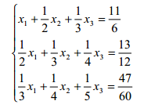
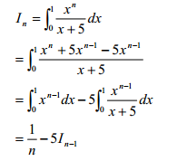

# 第十一章 计算+X

# 第十一章 计算+X

当代科学研究有三大支柱：理论、实验和计算。计算机技术的发展，为利用计算手段来 解决科学和工程问题提供了强大的支持。越来越多的领域（包括自然科学和社会科学领域） 利用计算来解决问题，将解决问题的方法从过去的定性分析发展成如今的定量计算。科学领 域与计算的结合促成了多种交叉学科的形成，如计算数学、计算物理学、计算化学、计算生 物学、计算材料学、计算经济学、计算语言学、计算考古学、计算犯罪学、计算免疫学等等。 各学科下面的子学科冠以“计算”前缀的更是数不胜数，如计算数学下面的计算几何、计算 数论、计算拓扑学，计算语言学下面的计算语义学、计算词汇学、计算幽默学等。

本章介绍一些典型的“计算+X”，以使读者初步了解计算和计算思维是如何帮助各专业 领域求解问题的。

# 11.1 计算数学

## 11.1 计算数学

计算数学是关于通过计算来解决数学问题的科学。这里所说的“计算”既包括数值计算， 也包括符号计算；这里所说的“数学问题”可能来自纯数学，更可能是从各个科学和工程领 域抽象出来的。计算数学包括很多分支，其中最核心、应用最广的是数值方法。

数值方法

数值方法（numerical method，也称计算方法、数值分析等）是利用计算机进行数值计 算来解决数学问题的方法，其研究内容包括数值方法的理论、分析、构造及算法等。很多科 学与工程问题都可归结为数学问题，而数值方法对很多基本数学问题建立了数值计算的解决 办法，例如线性代数方程组的求解、多项式插值、微积分和常微分方程的数值解法等等。

数值方法的构造和分析主要借助于数学推导，这是数学思维占主导的部分。例如，一元 二次方程的求根公式实际上给出了方程的数值解法，该公式完全是通过数学推导得出的；而 通过对该公式的分析，可以了解实数根是否存在等情形。如果问题不存在有限的求解代数式， 可以通过数学推导来寻求能得到近似解的代数式，例如将积分转化为求和。

数值方法最终要在计算机上实现，这是计算思维占主导的部分。有人也许会认为，对于 数值计算问题，只要有了求解问题的数学公式，再将这些公式翻译成计算机程序，问题就迎 刃而解，所以数值方法的关键是数学推导，而计算思维在其中并没有什么作用。是不是这样 呢？仍以一元二次方程 ax2+bx+c=0 的求解问题为例。这个问题的求解求根公式是已知的：


这个公式可以直接了当地翻译成 Python 程序（程序 3.5）：

```
import math
a, b, c = input("Enter the coefficients (a, b, c): ") 
discRoot = math.sqrt(b * b - 4 * a * c)
root1 = (-b + discRoot) / (2 * a) 
root2 = (-b - discRoot) / (2 * a)
print "The solutions are:", root1, root2 
```

下面是此程序的一次执行结果：

```
Enter the coefficients (a, b, c): 1,-(9+10**18),9*10**18
The solutions are: 1e+18 0.0 
```

可见，计算机求解方程 x**2 -(9+10**18)x + 9x10**18 = 0 所给出的根是 10**18 和 0，而非正确的 10**18 和 9。对于这个结果，传统的数学是无法解释的，只有明白了计算机的能力和限制，才能给出解释。计算思维在计算方法中的意义，由此可见一斑。 利用数值方法解决科学与工程问题大体要经过三个步骤。第一步是为问题建立数学模型，即用合适的数学工具（如方程、函数、微积分式等）来表示问题；第二步是为所建立的 数学模型选择合适的数值计算方法；第三步是设计算法并编程实现，这里要着重考虑计算精 度和计算量等因素，以使计算机能够高效、准确地求解问题。在计算机上执行程序得到计算 结果后，若结果不理想，多半是因为所选数值方法不合适，当然也可能是数学模型不合适。 在模型正确、编程正确的前提下，计算结果完全取决于数值方法的选择。

本节只简单介绍计算机的能力和限制是如何影响计算方法的选择的。

误差

正如前述一元二次方程求解例子所显示的，一个正确的数学公式在计算机上却得不到正 确的、精确的结果，这种现象主要是由误差引起的。科学与工程计算中的误差有多种来源， 其中建立数学模型和原始数据观测两方面的误差与计算方法没有关系，与计算方法有关的是 截断误差和舍入误差。

截断误差是在以有限代替无限的过程中产生的，例如计算 ex 的泰勒展开式


时只能选取前面有限的 n 项，得到的是 ex 的近似值，前 n 项之后的部分就是截断误差。 舍入误差是因计算机内部数的表示的限制而导致的误差。在计算机中能够表示的数与数

学中的数其实是不一样的：计算机只能表示有限的、离散的数，而数学中的数是无限的、连 续的。以有限表示无限，以离散表示连续，难免造成误差。例如 Python 中有如下出人意料 的数值计算结果：

```
>>> 1.2 - 1
0.19999999999999996 
```

由于浮点数内部表示的限制，1.2 - 1 的结果并非精确的 0.2。又如，积分计算问题


是连续系统问题，由于计算机不能直接处理连续量，因此需要将连续的问题转化为离散的问 题来求解。一般常用离散的求和过程来近似求解积分①。


舍入误差的控制

计算机内部对数的表示构成一个离散的、有限的数集，而且这个数集对加减乘除四则运算是不封闭的，即两个数进行运算后结果会超出计算机数集的范围。这时只好用最接近的数 来表示，这就带来了舍入误差。因此，应当控制四则运算的过程，尽量减小误差的影响。

在加减法运算中，存在所谓“大数吃小数”的现象，即数量级相差较大的两个数相加减 时，较小数的有效数字会失去，导致结果中好像没做加减一样。例如

```
>>> 10**18 + 9.0
1e+18 
```

> ① 据说积分号就是从 S（sum）演变而来的符号。

由此可知，当有多个浮点数相加减时，应当尽量使大小相近的数进行运算，以避免大数 “吃”小数。例如，设 x1 = 0.5055×104，x2 = x3 = ... = x11 = 0.4500（假设计算机只能支持 4 位有效数字），要计算诸 xi 的总和。一种算法是将 x1 逐步与 x2 等相加，这样每次加法都是大 数加小数，按计算机浮点计算的规则：x1 + x2 ＝ 0.5055×104 + 0.000045×104 ＝ 0.505545×104＝0.5055×104，即产生了舍入误差 0.45。如此执行 10 次加法之后，结果仍然是 0.5055×104，误差积累至 10×0.45 ＝ 4.5。另一种算法是让相近数进行运算，如 x11 + x10 = 0.9000， 在一直加到 x1，执行 10 次加法之后得到总和 0.5060×104，没有舍入误差。这个例子再次显 示了“次序”在计算中的重要意义：数学上毫无差别的两种次序在计算机中却带来截然不同 的结果，就像我们在第三章中计算 231-1 时采用 230-1+230 这个次序一样。

当两个相近的数相减时，会引起有效数字的位数大大减少，误差增大。为了避免这种结 果，通常可以改变计算方法，将算式转化成等价的另一个计算公式。例如：


在除法运算中，应当避免除数接近于零，或者除数的绝对值远远小于被除数的绝对值的

情形，因为这两种情形都会使舍入误差增大，甚至使结果溢出。解决办法仍然是转化为等价 算式。例如：


这里，不同计算公式的选择就如同上述不同计算次序的选择，虽然在数学上结果是一样 的，但在计算机中却存在很大差别。

计算量

站在计算机的角度，对数值方法主要关注的是算法的效率和精度。算法的效率由算法复 杂度决定，数值方法中通常用浮点乘除运算（flop）的次数来度量算法效率，称为算法的计 算量。计算量越小，效率就越高。

当一个算法的计算量很大，并不意味着它能提高计算结果的准确度，相反倒有可能使舍 入误差积累得更多，可谓费力不讨好。利用数学推导来简化计算公式，或者利用计算机的运 算及存贮能力来巧妙安排计算步骤，都可以减少计算量，使计算更快、更准确。

例如，设 A、B、C 分别是 10×20、20×50、50×1 的矩阵，我们来考虑如何计算 ABC。 一种算法是先算 AB，再乘 C，计算量为 10500flops；另一种算法是先算 BC，再用 A 乘， 计算量为 1200flops。显然后一种算法大大优于前一算法，再次显示了“次序”的妙处。

又如，考虑如何计算 x64。一种算法是将 64 个 x 逐步相乘，计算量为 63flops；另一算 法利用


其中 x**2k（k＝2，4，8，16）的计算都可以利用前一步算出的结果，即


这样计算量可以降至 10flops。 有些数值算法甚至会使计算量大到失去实际意义的地步，就如 Hanoi 塔问题的算法对较

大问题规模不可行一样。例如求解 n 元线性方程组的克莱默法则对于较大 n 就是不可行的方 法，因为其计算量是(n+1)(n-1)(n!)+n；而高斯消去法的计算量仅为 n3/3+n2-n/3，是非常高 效的算法。

病态与良态问题

有些问题的解对初始数据非常敏感，数据的微小变化会导致计算结果的剧烈变化，这种

问题称为病态问题，反之称为良态问题。例如多项式 p(x) = x2+x-1150 在 100/3 和 33 处的值 分别为-5.6 和-28，数据变化只有 1%，而结果变化了 400%。又如下面这个方程组



的解是 x1 ＝ x2 ＝ x3 ＝1，当将各个系数舍入成两位有效数字，与原来的系数虽然差别不 大，但方程组的解却变成了 x1 ≈ -6.22，x2 ＝38.25，x3 ＝ -33.65。

相反，下面这个方程组

 的解为 x1 =2，x2 = -2。若对其常数项-2 做微小扰动改为-2.005，则解变成 1.999 和-2.002， 与原来的解差别很小。可见这个问题是良态的。

数值方法主要研究良态问题的数值解法。由于实际问题的数据往往是近似值，或者是经 过舍入处理的，这相当于对原始数据的扰动，如果求解的是病态问题，则会导致很隐蔽的错 误结果。病态问题在函数计算、方程求根、方程组求解中都存在，它的计算或求解应当使用 专门的方法，或者转化为良态问题来解决。

数值稳定性

求解一个问题的数值方法往往涉及大量运算，每一步运算一般都会产生舍入误差，前面 运算的误差也可能影响后面的运算。一个数值方法如果在计算过程中能将舍入误差控制在一 定范围内，就称为数值稳定的，否则称为数值不稳定的。例如，考虑下面这个积分的计算：



根据上面这个递推式，可得出迭代算法：


这个算法是不稳定的，因为 I0 的舍入误差会随着迭代过程不断传播、放大。编程计算一下

可见，结果中甚至出现了负数，而根据原积分式可知 In 应该总是大于 0。

```
>>> def f():
        x = 0.1823
    print "I0 =",x
    for n in range(1,101): 
        x = -5 * x + 1.0 / n
        print "I"+str(n)+" =",x
>>> f()
I0 = 0.1823
I1 = 0.0885
I2 = 0.0575
I3 = 0.0458333333333
...
I97 = 1.36042495942e+63 
I98 = -6.80212479709e+63 
I99 = 3.40106239854e+64 
I100 = -1.70053119927e+65 
```

现在利用下列关系式


先对足够大的 n 取 I[n] 的估计值，然后再计算 I[n-1]、I[n-2]、…、I[1]。迭代算法如下：


这个算法可使误差逐渐减小，因此是数值稳定的，下面程序的运行结果验证了这一点。此例又一次显示了次序的重要性。

```
>>> def g():
        x = 0.001815
        print "I100 =",x
        for n in range(100,0,-1): 
            x = -x/5 + 1.0/(5*n)
            print "I"+str(n-1)+" =",x
>>> g()
I100 = 0.001815
I99 = 0.001637
I98 = 0.0016928020202
I97 = 0.00170225592249
...
I3 = 0.043138734089
I2 = 0.0580389198489
I1 = 0.0883922160302
I0 = 0.182321556794 
```

综上所述，数值方法以利用计算机进行数值计算的方式来解决科学和工程中抽象出来的 数学问题。与纯数学方法不同，数值计算方法的构造和算法实现必须考虑计算机的能力和限 制，亦即计算思维的原则对计算方法具有重要影响。

# 11.2 生物信息学

## 11.2 生物信息学

计算生物学（computational biology）研究如何用计算机来解决生物学问题，主要研究内 容包括对生物系统的数学建模、对生物数据的分析、模拟等。本节介绍计算生物学的一个分 支——生物信息学①。

生物信息学（bioinformatics）主要研究生物信息的存储、获取和分析，这里所说的生物 信息主要是指基因组信息。近年来，通过庞大的项目合作，生物学家对人类基因组和其他生 物的基因组进行测序，获得了大量的数据。针对以指数方式增长的数据，生物信息学应用算 法、数据库、机器学习等技术，来解决 DNA 和蛋白质序列的分析、序列分类、基因在序列 中的定位、不同序列的比对、蛋白质结构及功能的预测和新药物新疗法的发现等问题。生物 信息学已成为处于生命科学和计算机科学前沿的一门有战略意义的学科，对医学、生物技术 以及社会的许多领域都有重要影响。

生物信息的表示 为了利用计算机来处理生物信息，首先要将生物信息表示成计算机中的数据。例如，听上去很复杂的 DNA 和蛋白质的链状分子，出乎意料地很容易表示——用符号序列即可。

DNA 是由 4 种单体，即以 A（腺嘌呤）、C（胞嘧啶）、G（鸟嘌呤）、T（胸腺嘧啶）代 表的 4 中核苷酸聚合成的生物大分子。蛋白质是另一类由 20 种单体，即以 A、C、D、W 等 表示的 20 种氨基酸聚合成的大分子。在链状分子的特定位置上，只能出现某种确定的单体（“字符”），而不是几种可能字符的组合，因此分子链可以用一维的、不分岔的。有方向的 字符序列来表示。例如，DNA 分子可表示成如“AGTGATG”一样的字符序列。

测定 DNA 和蛋白质链状分子的字符序列是从微观结构研究生物的出发点。 除了序列数据，生物信息还包括结构和功能数据、基因表达数据、生化反应通路数据、表现型和临床数据等。

生物信息数据库

数据库技术是管理大量数据的计算机技术，目的是使用户能够方便、高效地访问大量数据。过去数十年间，随着人类基因组测序工程和其他生物测序项目的完成或推进，以及诸如 DNA 微阵列等高效实验技术的出现，产生并积累了大量的生物信息（如前面所说的核苷酸 序列和氨基酸序列），因此需要利用数据库技术将这些信息组织、存储起来。有了生物信息 数据库，生物学家们通过易用的 GUI 来访问数据库，既可以读取数据，也可以添加新数据 或者修订老数据。当然，更重要的工作是利用各种算法来处理数据库中的生物数据。生物学 未来的新发现很可能是通过分析数据库中的生物数据获得的，而非仅仅依赖于传统的实验。

> ① 也有说生物信息学和计算生物学是一回事的。

互联网上有很多生物数据库，例如 EMBL（核苷酸序列数据库）、GenBank（基因序列 数据库）、PDB（蛋白质数据库）等等。

生物数据分析

建立了生物信息数据库之后，生物学家接下来的研究重点就转向了数据分析。庞大的生 物信息数据库对数据分析技术提出了具有挑战性的问题，人工分析 DNA 序列早已成为不可 能完成的任务，传统的计算机算法也越来越显示出不足，这促使生物信息学去寻求新的算法 来解决问题。

序列分析是生物信息学的主要研究内容。例如，通过分析数据库中的成千上万种有机体 的 DNA 序列，可以识别特定序列的结构和功能、特定序列在不同物种之间的不同形式、相 同物种内部特定序列的不同形式。又如，通过对一组序列进行比较，可以发现功能之间的相 似性或者物种之间的联系。还可以在一个基因组中搜索蛋白质编码基因、RNA 基因和其他 功能序列，可以利用 DNA 序列来识别蛋白质。

下面介绍基因组比对的基本思想和方法。当生物学家通过实验获得了一个基因序列，他 接着就要确定这个基因序列的功能。为此，他以这个基因序列作为输入，到基因序列数据库 中去搜索与之相似的、已知功能的基因序列，因为生物学家认为基因序列相似意味着功能相 似。一种衡量基因序列相似性的方法是基因组比对（genome alignment），该方法将两个基 因序列对齐（如果序列长度不同可以在序列中插入一些空白位置），然后为对齐的每一对（代 表核苷酸的）字符打分，所有分数的总和就是两个序列的相似度。例如，对于两个基因序列 AGTGATG 和 GTTAG，适当插入空白（用下划线字符“_”表示）后可以按如下方式对准：

```
A G T G A T G
_ G T T A _ G 
```

假如按如下规则打分：

|  | A | C | G | T | _ |
| --- | --- | --- | --- | --- | --- |
| A | 5 | -1 | -2 | -1 | -3 |
| C | -1 | 5 | -3 | -2 | -4 |
| G | -2 | -3 | 5 | -2 | -2 |
| T | -1 | -2 | -2 | 5 | -1 |
| _ | -3 | -4 | -2 | -1 |

则该对准方案的得分为 14。当然也可以按别的方式对准，但上面给出的对准方案是得分最高的。这个最优对准方案可以利用动态规划算法求得。 另外，计算机科学中最新的机器学习和数据挖掘技术能够实现更复杂的数据分析，很自然地成为当今生物信息学所倚重的方法。机器学习和数据挖掘的领域界线并不明显，它们都 是关于从大量数据中发现知识、模式、规则的技术。具体技术包括神经网络、隐马尔可夫模 型、支持向量机、聚类分析等，这些技术都非常适合生物信息的分析和处理。例如，对大量 蛋白质序列进行聚类分析，可以将所有蛋白质序列分组，使得同组的蛋白质序列非常相似， 而不同组的蛋白质非常不相似。

# 11.3 计算物理学

## 11.3 计算物理学

计算物理学（computational physics）研究利用计算机来解决物理问题，是计算机科学、 计算数学和物理学相结合而形成的交叉学科。如今，计算物理已经与理论物理、实验物理一 起构成了物理学的三大支柱。

物理学旨在发现、解释和预测宇宙运行规律，而为了更准确地做到这一点，今天的物理 学越来越依赖于计算。首先，很多物理问题涉及海量的实验数据，依靠手工处理根本无力解决。例如在高能物理实验中，由于实验技术的发展和测量精度的提高，实验规模越来越大， 实验数据也大幅增加，只能利用计算机来处理实验数据。其次，很多物理问题涉及复杂的计 算，解析方法或手工数值计算无法解决这样的计算问题。例如电子反常磁矩修正的计算，对 四阶修正的手工解析技术已经相当繁杂，而对六阶修正的计算已经包含了 72 个费曼图，手 工解析运算已不可能完成。同样只能利用计算机来解决问题。

在物理学中运用计算思维，使我们可以利用数值计算、符号计算和模拟等方法来发现和 预测物理系统的特性和规律。

解决物理问题时，通常在获得描述物理过程的数学公式后，需要进行数值分析以便与实 验结果进行对照。对于复杂的计算，手工数值分析是不可能的，只能采用数值方法利用计算 机来计算。

有些物理问题不是数值计算问题，需要利用计算机的符号处理能力来解决。例如，理论 物理中的公式推导，就是纯粹的符号变换。有时即使是数值计算问题，由于精度要求很高， 导致计算耗时很长甚至无法达到所需精度，这时可以利用符号计算来推导出解析形式的问题 解。又如，有时数值方法是病态的，如果能将数值计算改成解析计算，则可以得到有意义的 结果。

统计物理中有个自回避随机迁移问题，它是在随机漫步中加上了一个限制，即以后的步 子不能穿过以前各步所走过的路径。这样的问题不像一般的迁移问题那样可以用微分方程来 描写系统的统计行为，计算机模拟几乎是唯一的研究方法。计算机模拟不受实验条件、时间 和空间的限制，只要建立了模型，就能进行模拟实验，因而具有极大的灵活性。下面通过一 个实例来介绍模拟方法在计算物理学中的应用。

热平衡系统的模拟

为了研究一个包含 N 个粒子的热系统，原则上只要了解每个粒子的运动，就能弄清楚 粒子和粒子之间的每一次相互作用。但由于粒子数目太大，要想计算 N 个粒子的轨迹以及 N(N-1)对相互作用，是非常困难的。

然而，对于处于平衡态的热系统，虽然系统的微观特性总是在变动，但其宏观特性则是 恒定不变的，体现为具有恒定的温度。系统的微观状态由每个粒子的速度等物理量来刻划， 粒子间的相互作用会导致微观状态改变；而系统的宏观状态是微观状态的集体特性，表现为 系统的总能量（或温度等）。统计物理学认为，虽然微观状态可能没有规则，但宏观状态服 从统计规律。对于处于平衡态的理想气体而言，虽然微观相互作用可导致粒子能量的重新分 配，但系统的总能量保持不变。

考虑一个由三个粒子组成的小系统 S。假设共有 4 份能量在这三个粒子之间交换，则能 量分布可以有以下 15 种状态：(4,0,0)、(0,4,0)、(0,0,4)、(3,1,0)、(3,0,1)、(1,3,0)、(0,3,1)、(1,0,3)、(0,1,3)、(2,2,0)、(2,0,2)、(2,1,1)、(0,2,2)、(1,2,1)、(1,1,2)。这里元组(a,b,c)表示三个粒子各

自获得的能量。每种微观状态都有自己的出现概率，例如从这 15 种微观状态可见，一个粒 子占有全部能量的概率为 3/15 = 0.2。S 的平衡特性由概率较高的微观状态决定，而通过随 机抽样方法（蒙特卡洛方法）可以有效地产生高可能性微观状态，从而可以用来评估 S 的 平衡特性。

我们引入一个“demon”来与系统 S 发生相互作用。作用方式是：令 demon 与 S 中某 个随机选择的粒子进行相互作用，并试着随机改变该粒子的状态（对气体来说就是改变粒子 的速度）；如果这个改变导致粒子能量减少，则执行这个改变，并将少掉的能量传递给 demon； 如果这个改变导致粒子能量增加，则仅当 demon 有足够能量传递给粒子时才执行这次改变。 按这种方式，每次产生新的微观状态时，系统 S 的能量加上 demon 的能量保持不变。

具体地，将 demon 加入到 S（包含三个微观粒子）中后，宏观状态仍为 4 份能量。新系统“S+demon”的 demon 为 0 能量的状态共有 15 个，正对应于原始系统 S 的那 15 个状态。 如果尝试改变一个微观状态使得某个粒子减少一份能量，则将那份能量转给 demon，这样就 使原始系统变成了具有 3 份能量的系统，而 demon 具有 1 份能量。与这种情况对应的微观 状态有 10 个，即(3,0,0)、(0,3,0)、(0,0,3)、(2,1,0)、(2,0,1)、(1,2,0)、(0,2,1)、(1,0,2)、(0,1,2)和(1,1,1)。由此可见，如果实施一系列的微观状态随机改变，将发现 demon 具有 1 份能量与 具有 0 份能量的相对概率为 10/15 = 2/3。也就是说，当 demon 扰乱小系统 S 时，S 仍然处于 原来的宏观能量的可能性更大，而不是处于某个较低能量。

同理，如果 demon 具有 2 份能量，则 S+demon 系统具有 6 个微观状态；如果 demon 具 有 3 份能量，则组合系统具有 3 种微观状态；如果 demon 拥有全部 4 份能量，则组合系统 只有一种微观状态。这几种情形对应的相对概率分别为 6/15、3/15 和 1/15。

一般地，对于一个宏观系统，当产生大量的微观状态改变之后，其中 demon 拥有能量 E 的微观状态，与 demon 拥有 0 能量的微观状态数目之比是随 E 的升高而呈指数形式下降的， 具体公式为


其中 k 是玻尔兹曼常数，T 是宏观系统的温度。以我们的小系统 S 为例，p(Ed=1) / p(Ed = 0) 约为 2/3。

总之，计算物理学依据理论物理提供的物理原理和数学方程，针对实验物理提供的实验 数据，进行数值计算或符号计算，从而为理论研究提供数据、帮助分析实验数据和模拟物理 系统。

# 11.4 计算化学

## 11.4 计算化学

化学在传统上一直被认为是一门实验科学，但随着计算机技术的应用，化学家成为大规 模使用计算机的用户，化学科学的研究内容、方法乃至学科的结构和性质随之发生了深刻变 化。计算化学（computational chemistry）是化学和计算机科学等学科相结合而形成的交叉学 科，其研究内容是如何利用计算机来解决化学问题。计算化学这个术语早在 1970 年就出现

了，并且在上世纪 70 年代逐步形成了计算化学学科。 因此，计算化学可以帮助实验化学家，或者挑战实验化学家来找出全新的化学对象。

有些化学问题是无法用分析方法解决的，只能通过计算来解决。计算化学一般用于解决 数学方法足够成熟从而能在计算机上实现的问题。计算化学有两个用途：一是通过计算来与 化学实验互为印证、互为补充；一是通过计算来预测迄今完全未知的分子或从未观察到的化 学现象，或者探索利用实验方法不能很好研究的反应机制。

计算化学的研究内容很多，我们简单介绍化学数据库和分子模拟（或分子建模），前者 是关于化学信息表示、存储和查找的，后者是研究化学系统结构和运动的。

化学数据库是专门存储化学信息的数据库，其中的化学信息可以是化学结构、晶体结构、 光谱、反应与合成、热物理等类型的数据。以化学结构数据为例，学过中学化学课程的人都 知道，化学家通常用直线表示原子之间的化学键，利用化学键将若干原子连接在一起，形成 了分子结构的二维表示。这种表示对化学家来说是理想的、可视的，但对化学数据的计算机 处理来说是很不合适的，尤其是对数据的存储和查找。为此，需要建立分子结构的计算机表 示，如小分子可以用原子的列表或 XML 元素表示，而大分子（如蛋白质）可用氨基酸序列 来表示。当今一些大的化学结构数据库存储了成百万的分子结构数据（存储量高达 TB 级）， 可以方便而高效地查找信息。

分子模拟利用计算机程序来模拟化学系统的微观结构和运动，并用数值计算、统计方法 等对系统的热力学、动力学等性质进行理论预测。宏观化学现象是无数个分子（原子）的集 体行为，一般通过统计方法来研究。然而，化学统计力学通常仅适用于“理想系统”（如理 想气体、完美晶体等），量子力学方法也不适用于动力学过程和有温度压力变化的系统。作 为替代方法，分子模拟将原子、分子按经典粒子处理，提供了化学系统的微观结构、运动过 程以及与宏观性质相关的数据和直观图象，从而能在更一般的情形下研究系统行为。分子模 拟有两种主要方法，一是基于粒子运动的经典轨迹的分子动力学方法，一种是基于统计力学 的蒙特卡洛方法。分子模拟技术不仅在计算化学中有用，而且还可用于药物设计和计算生物 学中的分子系统（从小的化学系统到大的生物分子）。

计算化学内部还包括量子化学计算、化学人工智能、化学 CAD 和 CAI 等领域，可以解 决识别化学结构与性质之间的相关性、化合物的有效合成、设计能与其他分子按特定方式进 行反应的分子（如新药设计）等问题。解决问题过程中所用到的计算化学方法有些是高度精 确的，更多的则是近似的。计算化学的目标是使计算误差极小化，同时保证计算是可行的。

# 11.5 计算经济学

## 11.5 计算经济学

计算经济学（computational economics）是计算机科学与经济和管理科学相结合而形成 的交叉学科，其主要研究领域包括经济系统的计算模型、计算计量经济学、计算金融学等， 目的是利用计算技术和数值方法来解决传统方法无法解决的问题。这里，我们特别考虑建模 问题，简单介绍基于代理的计算经济学。

基于代理的（agent-based）模型是用于模拟自治个体的行为和相互作用的计算模型，目 的是从整个系统的层面来评估这些个体相互作用所产生的效果。基于代理的计算经济学（ACE）将经济过程建模为一个由相互作用的代理所构成的动态系统，并应用数值方法来模 拟系统的运行。ACE 中的“代理”是指按照一定的规则行事、并且相互作用的对象，可以 表示个体（如一个人）、社会群体（如一家公司）、生物体（如农作物）或物理系统（如交通 系统）。建模者要做的事情是为由多个相互作用的代理组成的系统提供初始条件，然后就不 加干涉地观察系统如何随时间而演化。系统中的代理完全通过相互作用来驱动系统向前发 展，没有任何外部强加的平衡条件。

ACE 方法的一个应用领域是资产定价。计算模型涉及许多代理，每个代理可以从一组 预测策略中选择特定策略去行事，比如预测股票价格。根据预测的结果，会影响代理们的资 产需求，而这又会影响股票价格。通过对模型的分析，可以获得有用的结果，例如，当代理 改变预测策略时，经常会引发资产价格的大波动。又如，有经济学家认为 ACE 可能对理解 最近的金融危机也是有用的方法。

总之，计算机科学的建模技术为计算经济学提供了非常有用的方法和工具。

# 11.6 练习

## 11.6 练习

1\. 举例说明计算机在你的专业领域中的应用。

2\. 利用本书中学到的知识去解决一个你专业领域的问题。

3\. 假如你是 X 专业的，现在有“计算 X 学”吗？如果有，该学科的研究内容是什么？