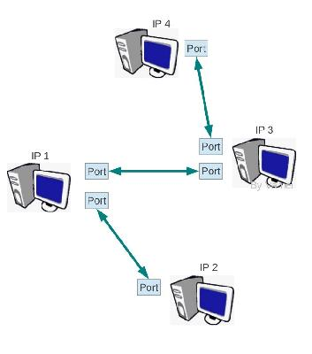

## Python 网络 01 原始 Python 服务器

[`www.cnblogs.com/vamei/archive/2012/10/30/2744955.html`](http://www.cnblogs.com/vamei/archive/2012/10/30/2744955.html)

作者：Vamei 出处：http://www.cnblogs.com/vamei 欢迎转载，也请保留这段声明。谢谢！

之前我的[Python 教程](http://www.cnblogs.com/vamei/archive/2012/09/13/2682778.html)中有人留言，表示只学 Python 没有用，必须学会一个框架(比如 Django 和 web.py)才能找到工作。而我的想法是，掌握一个类似于框架的高级工具是有用的，但是基础的东西可以让你永远不被淘汰。不要被工具限制了自己的发展。今天，我在这里想要展示的，就是不使用框架，甚至不使用 Python 标准库中的高级包，只使用标准库中的 socket 接口(我不是很明白套接字这个翻译，所以使用 socket 的英文名字)，写一个 Python 服务器。

在当今 Python 服务器框架 (framework, 比如 Django, Twisted, web.py 等等) 横行的时代，从底层的 socket 开始写服务器似乎是一个出力不讨好的笨方法。框架的意义在于掩盖底层的细节，提供一套对于开发人员更加友好的 API，并处理诸如 MVC 的布局问题。框架允许我们快速的构建一个成型而且成熟的 Python 服务器。然而，框架本身也是依赖于底层(比如 socket)。对于底层 socket 的了解，不仅可以帮助我们更好的使用框架，更可以让我们明白框架是如何设计的。更进一步，如果拥有良好的底层 socket 编程知识和其他系统编程知识，你完全可以设计并开发一款自己的框架。如果你可以从底层 socket 开始，实现一个完整的 Python 服务器，支持用户层的协议，并处理好诸如 MVC(Model-View-Control)、多线程(threading)等问题，并整理出一套清晰的函数或者类，作为接口(API)呈现给用户，你就相当于设计了一个框架。

socket 接口是实际上是操作系统提供的系统调用。socket 的使用并不局限于 Python 语言，你可以用 C 或者 JAVA 来写出同样的 socket 服务器，而所有语言使用 socket 的方式都类似(Apache 就是使用 C 实现的服务器)。而你不能跨语言的使用框架。框架的好处在于帮你处理了一些细节，从而实现快速开发，但同时受到 Python 本身性能的限制。我们已经看到，许多成功的网站都是利用动态语言(比如 Python, Ruby 或者 PHP，比如 twitter 和 facebook)快速开发，在网站成功之后，将代码转换成诸如 C 和 JAVA 这样一些效率比较高的语言，从而让服务器能更有效率的面对每天亿万次的请求。在这样一些时间，底层的重要性，就远远超过了框架。 

下面的一篇文章虽然是在谈 JAVA，但我觉得也适用于 Python 的框架之争。 

[`yakovfain.com/2012/10/11/the-degradation-of-java-developers/`](http://yakovfain.com/2012/10/11/the-degradation-of-java-developers/)

1\. TCP/IP 和 socket 简介 

回到我们的任务。我们需要对网络传输，特别是 TCP/IP 协议和 socket 有一定的了解。socket 是进程间通信的一种方法 (参考[Linux 进程间通信](http://www.cnblogs.com/vamei/archive/2012/10/10/2715398.html))，它是基于网络传输协议的上层接口。socket 有许多种类型，比如基于 TCP 协议或者 UDP 协议(两种网络传输协议)。其中又以 TCP socket 最为常用。TCP socket 与[双向管道](http://www.cnblogs.com/vamei/archive/2012/10/12/2721484.html)(duplex PIPE)有些类似，一个进程向 socket 的一端写入或读取[文本流](http://www.cnblogs.com/vamei/archive/2012/09/14/2683756.html)，而另一个进程可以从 socket 的另一端读取或写入，比较特别是，这两个建立 socket 通信的进程可以分别属于两台不同的计算机。所谓的 TCP 协议，就是规定了一些通信的守则，以便在网络环境下能够有效实现上述进程间通信过程。双向管道(duplex PIPE)存活于同一台电脑中，所以不必区分两个进程的所在计算机的地址，而 socket 必须包含有地址信息，以便实现网络通信。一个 socket 包含四个地址信息: 两台计算机的 IP 地址和两个进程所使用的端口(port)。IP 地址用于定位计算机，而 port 用于定位进程 (一台计算机上可以有多个进程分别使用不同的端口)。



一个 TCP socket 连接的网络

2\. TCP socket

在互联网上，我们可以让某台计算机作为服务器。服务器开放自己的端口，被动等待其他计算机连接。当其他计算机作为客户，主动使用 socket 连接到服务器的时候，服务器就开始为客户提供服务。

在 Python 中，我们使用标准库中的 socket 包来进行底层的 socket 编程。

首先是服务器端，我们使用 bind()方法来赋予 socket 以固定的地址和端口，并使用 listen()方法来被动的监听该端口。当有客户尝试用 connect()方法连接的时候，服务器使用 accept()接受连接，从而建立一个连接的 socket：


```
# Written by Vamei # Server side
import socket

# Address
HOST = '' PORT = 8000 reply = '

```

Yes'

# Configure sockets      =socket.socket(socket.AF_INET, socket.SOCK_STREAM) s.bind((HOST, PORT))
# passively wait, 3: maximum number of connections in the queue s.listen(3)
# accept and establish connection conn, addr =s.accept()
# receive message request    = conn.recv(1024) 

```
print 'request is: ',request
print 'Connected by', addr
# send message
conn.sendall(reply)
# close connection
conn.close()

```


socket.socket()创建一个 socket 对象，并说明 socket 使用的是 IPv4(AF_INET，IP version 4)和 TCP 协议(SOCK_STREAM)。

然后用另一台电脑作为客户，我们主动使用 connect()方法来搜索服务器端的 IP 地址(在 Linux 中，你可以用$ifconfig 来查询自己的 IP 地址)和端口，以便客户可以找到服务器，并建立连接:


```
# Written by Vamei # Client side
import socket

# Address
HOST = '172.20.202.155' PORT = 8000 request = 'can you hear me?' # configure socket
s       = socket.socket(socket.AF_INET, socket.SOCK_STREAM)
s.connect((HOST, PORT))

# send message s.sendall(request)
# receive message
reply   = s.recv(1024)
print 'reply is: ',reply
# close connection
s.close()

```


在上面的例子中，我们对 socket 的两端都可以调用 recv()方法来接收信息，调用 sendall()方法来发送信息。这样，我们就可以在分处于两台计算机的两个进程间进行通信了。当通信结束的时候，我们使用 close()方法来关闭 socket 连接。

(如果没有两台计算机做实验，也可以将客户端 IP 想要 connect 的 IP 改为"127.0.0.1"，这是个特殊的 IP 地址，用来连接当地主机。)

3\. 基于 TCP socket 的 HTTP 服务器:

上面的例子中，我们已经可以使用 TCP socket 来为两台远程计算机建立连接。然而，socket 传输自由度太高，从而带来很多安全和兼容的问题。我们往往利用一些应用层的协议(比如 HTTP 协议)来规定 socket 使用规则，以及所传输信息的格式。

HTTP 协议利用请求-回应(request-response)的方式来使用 TCP socket。客户端向服务器发一段文本作为 request，服务器端在接收到 request 之后，向客户端发送一段文本作为 response。在完成了这样一次 request-response 交易之后，TCP socket 被废弃。下次的 request 将建立新的 socket。request 和 response 本质上说是两个文本，只是 HTTP 协议对这两个文本都有一定的格式要求。


request-response cycle 

现在，我们写出一个 HTTP 服务器端：

View Code

```
复制代码

# Written by Vamei

import socket

# Address
HOST = '' PORT = 8000

# Prepare HTTP response
text_content = ''' HTTP/1.x 200 OK  
Content-Type: text/html

<head>
<title>WOW</title>
</head>
<html>
<p>Wow, Python Server</p>

</html>
'''

# Read picture, put into HTTP format
f = open('test.jpg','rb')
pic_content = ''' HTTP/1.x 200 OK  
Content-Type: image/jpg

''' pic_content = pic_content + f.read()
f.close()

# Configure socket
s    = socket.socket(socket.AF_INET, socket.SOCK_STREAM)
s.bind((HOST, PORT))

# infinite loop, server forever
while True:
    # 3: maximum number of requests waiting
    s.listen(3)
    conn, addr = s.accept()
    request    = conn.recv(1024)
    method    = request.split(' ')[0]
    src            = request.split(' ')[1]

    # deal with GET method
    if method == 'GET':
        # ULR    
        if src == '/test.jpg':
            content = pic_content
        else: content = text_content

        print 'Connected by', addr
        print 'Request is:', request
        conn.sendall(content)
    # close connection
    conn.close()

```


4\. HTTP 服务器程序的解释

如我们上面所看到的，服务器会根据 request 向客户传输的两条信息 text_content 和 pic_content 中的一条，作为 response 文本。整个 response 分为起始行(start line), 头信息(head)和主体(body)三部分。起始行就是第一行:


```
HTTP/1.x 200 OK

```


它实际上又由空格分为三个片段，HTTP/1.x 表示所使用的 HTTP 版本，200 表示状态(status code)，200 是 HTTP 协议规定的，表示服务器正常接收并处理请求，OK 是供人来阅读的 status code。

头信息跟随起始行，它和主体之间有一个空行。这里的 text_content 或者 pic_content 都只有一行的头信息，text_content 用来表示主体信息的类型为 html 文本：


```
Content-Type: text/html

```


而 pic_content 的头信息(Content-Type: image/jpg)说明主体的类型为 jpg 图片(image/jpg)。

主体信息为 html 或者 jpg 文件的内容。

(注意，对于 jpg 文件，我们使用'rb'模式打开，是为了与 windows 兼容。因为在 windows 下，jpg 被认为是二进制(binary)文件，在 UNIX 系统下，则不需要区分文本文件和二进制文件。)

我们并没有写客户端程序，后面我们会用浏览器作为客户端。request 由客户端程序发给服务器。尽管 request 也可以像 response 那样分为三部分，request 的格式与 response 的格式并不相同。request 由客户发送给服务器，比如下面是一个 request：


```
GET /test.jpg HTTP/1.x
Accept: text/*

```


起始行可以分为三部分，第一部分为请求方法(request method)，第二部分是 URL，第三部分为 HTTP 版本。request method 可以有 GET， PUT， POST， DELETE， HEAD。最常用的为 GET 和 POST。GET 是请求服务器发送资源给客户，POST 是请求服务器接收客户送来的数据。当我们打开一个网页时，我们通常是使用 GET 方法；当我们填写表格并提交时，我们通常使用 POST 方法。第二部分为 URL，它通常指向一个资源(服务器上的资源或者其它地方的资源)。像现在这样，就是指向当前服务器的当前目录的 test.jpg。

按照 HTTP 协议的规定，服务器需要根据请求执行一定的操作。正如我们在服务器程序中看到的，我们的 Python 程序先检查了 request 的方法，随后根据 URL 的不同，来生成不同的 response(text_content 或者 pic_content)。随后，这个 response 被发送回给客户端。

4\. 使用浏览器实验

为了配合上面的服务器程序，我已经在放置 Python 程序的文件夹里，保存了一个 test.jpg 图片文件。我们在终端运行上面的 Python 程序，作为服务器端，再打开一个浏览器作为客户端。(如果有时间，你也完全可以用 Python 写一个客户端。原理与上面的 TCP socket 的客户端程序相类似。)

在浏览器的地址栏输入:


```
127.0.0.1:8000

```


(当然，你也可以用令一台电脑，并输入服务器的 IP 地址。) 我得到下面的结果:


OK，我已经有了一个用 Python 实现的，并从 socket 写起的服务器了。

从终端，我们可以看到，浏览器实际上发出了两个请求。第一个请求为 (关键信息在起始行，这一个请求的主体为空):


```
GET / HTTP/1.1
Host: 127.0.0.1:8000
User-Agent: Mozilla/5.0 (X11; Ubuntu; Linux x86_64; rv:14.0) Gecko/20100101 Firefox/14.0.1
Accept: text/html,application/xhtml+xml,application/xml;q=0.9,*/*;q=0.8
Accept-Language: en-us,en;q=0.5
Accept-Encoding: gzip, deflate
Connection: keep-alive

```


我们的 Python 程序根据这个请求，发送给服务器 text_content 的内容。

浏览器接收到 text_content 之后，发现正文的 html 文本中有，知道需要获得 text.jpg 文件来补充为图片，立即发出了第二个请求:


```
GET /test.jpg HTTP/1.1
Host: 127.0.0.1:8000
User-Agent: Mozilla/5.0 (X11; Ubuntu; Linux x86_64; rv:14.0) Gecko/20100101 Firefox/14.0.1
Accept: image/png,image/*;q=0.8,*/*;q=0.5
Accept-Language: en-us,en;q=0.5
Accept-Encoding: gzip, deflate
Connection: keep-alive
Referer: http://127.0.0.1:8000/

```


我们的 Python 程序分析过起始行之后，发现/test.jpg 符合 if 条件，所以将 pic_content 发送给客户。

最后，浏览器根据 html 语言的语法，将 html 文本和图画以适当的方式显示出来。(html 可参考 http://www.w3schools.com/html/default.asp)

5.探索的方向

1) 在我们上面的服务器程序中，我们用 while 循环来让服务器一直工作下去。实际上，我们还可以根据我之前介绍的多线程的知识，将 while 循环中的内容改为多进程或者多线程工作。(参考[Python 多线程与同步](http://www.cnblogs.com/vamei/archive/2012/10/11/2720042.html)，[Python 多进程初步](http://www.cnblogs.com/vamei/archive/2012/10/12/2721484.html)，[Python 多进程探索](http://www.cnblogs.com/vamei/archive/2012/10/13/2722254.html))

2) 我们的服务器程序还不完善，我们还可以让我们的 Python 程序调用 Python 的其他功能，以实现更复杂的功能。比如说制作一个时间服务器，让服务器向客户返回日期和时间。你还可以使用 Python 自带的数据库，来实现一个完整的 LAMP 服务器。 

3) socket 包是比较底层的包。Python 标准库中还有高层的包，比如 SocketServer，SimpleHTTPServer，CGIHTTPServer，cgi。这些都包都是在帮助我们更容易的使用 socket。如果你已经了解了 socket，那么这些包就很容易明白了。利用这些高层的包，你可以写一个相当成熟的服务器。 

4) 在经历了所有的辛苦和麻烦之后，你可能发现，框架是那么的方便，所以决定去使用框架。或者，你已经有了参与到框架开发的热情。 

更多内容 

TCP/IP 和 port 参考: TCP/IP illustrated [`book.douban.com/subject/1741925/`](http://book.douban.com/subject/1741925/) 

socket 参考: UNIX Network Programming [`book.douban.com/subject/1756533/`](http://book.douban.com/subject/1756533/) 

Python socket 官方文档 [`docs.python.org/2/library/socket.html`](http://docs.python.org/2/library/socket.html) 

HTTP 参考: HTTP, the definitive guide [`book.douban.com/subject/1440226/`](http://book.douban.com/subject/1440226/)