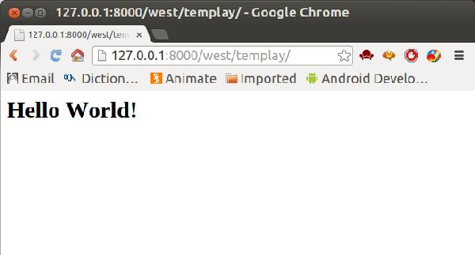

## 被解放的姜戈 03 所谓伊人

[`www.cnblogs.com/vamei/p/3538183.html`](http://www.cnblogs.com/vamei/p/3538183.html)

作者：Vamei 出处：http://www.cnblogs.com/vamei 欢迎转载，也请保留这段声明。谢谢！

在之前的程序中，我们直接生成一个字符串，作为 http 回复，返回给客户端。这一过程中使用了 django.http.HttpResponse()。

在这样的一种回复生成过程中，我们实际上将数据和视图的格式混合了到上面的字符串中。看似方便，却为我们的管理带来困难。想像一个成熟的网站，其显示格式会有许多重复的地方。如果可以把数据和视图格式分离，就可以重复使用同一视图格式了。

Django 中自带的模板系统，可以将视图格式分离出来，作为模板使用。这样，不但视图可以容易修改，程序也会显得美观大方。


**“她是我心中最美的人”，姜戈对德国人说。**

### 模板初体验

我们拿一个独立的 templay.html 文件作为模板。它放在 templates/west/文件夹下。文件系统的结构现在是:

```py
mysite/
├── mysite
├── templates
│   └── west
└── west

```

templay.html 文件的内容是：

可以看到，这个文件中，有一个奇怪的双括号包起来的陌生人。这就是我们未来数据要出现的地方。而相关的格式控制，即<h1>标签，则已经标明在该模板文件中。

我们需要向 Django 说明模板文件的搜索路径，修改 mysite/settings.py，添加:

```py
# Template dir
TEMPLATE_DIRS = (
    os.path.join(BASE_DIR, 'templates/west/'),
)

```

如果还有其它的路径用于存放模板，可以增加该元组中的元素，以便 Django 可以找到需要的模板。

我们现在修改 west/views.py，增加一个新的对象，用于向模板提交数据：

```py
# -*- coding: utf-8 -*-

#from django.http import HttpResponse
from django.shortcuts import render def templay(request):
    context = {}
    context['label'] = 'Hello World!'
    return render(request, 'templay.html', context)

```

可以看到，我们这里使用 render 来替代之前使用的 HttpResponse。render 还使用了一个词典 context 作为参数。这就是我们的数据。

context 中元素的键值为'label'，正对应刚才的“陌生人”的名字。这样，该 context 中的‘label’元素值，就会填上模板里的坑，构成一个完整的 http 回复。

作为上节内容的一个小练习，自行修改 west/urls.py，让 http://127.0.0.1:8000/west/templay 的 URL 请求可以找到相应的 view 对象。

访问 http://127.0.0.1:8000/west/templay，可以看到页面：

 

**“我给你讲个故事吧，勇士拯救公主的故事”，德国人说。** 

### 流程

再来回顾一下整个流程。west/views.py 中的 templay()在返回时，将环境数据 context 传递给模板 templay.html。Django 根据 context 元素中的键值，将相应数据放入到模板中的对应位置，生成最终的 http 回复。


这一模板系统可以与 Django 的其它功能相互合作。[上一回](http://www.cnblogs.com/vamei/p/3531740.html)，我们从数据库中提取出了数据。如果将数据库中的数据放入到 context 中，那么就可以将数据库中的数据传送到模板。

修改上次的 west/views.py 中的 staff:

```py
def staff(request):
    staff_list = Character.objects.all()
    staff_str = map(str, staff_list)
    context = {'label': ' '.join(staff_str)} return render(request, 'templay.html', context)

```

练习: 显示上面的 staff 页面。

**“勇士翻过高山，并非因为他不害怕。”**

### 循环与选择

Django 实际上提供了丰富的模板语言，可以在模板内部有限度的编程，从而更方便的编写视图和传送数据。

我们下面体验一下最常见的循环与选择。

上面的 staff 中的数据实际上是一个数据容器，有三个元素。刚才我们将三个元素连接成一个字符串传送。

实际上，利用模板语言，我们可以直接传送数据容器本身，再循环显示。修改 staff()为:

```py
def staff(request):
    staff_list = Character.objects.all() return render(request, 'templay.html', {'staffs': staff_list})

```

从数据库中查询到的三个对象都在 staff_list 中。我们直接将 staff_list 传送给模板。

将模板 templay.html 修改为：

```py
 <p>{{ item.id }}, {{item}}</p> 

```

我们以类似于 Python 中 for 循环的方式来定义模板中的 for，以显示 staffs 中的每个元素。

还可以看到，对象.属性名的引用方式可以直接用于模板中。

选择结构也与 Python 类似。根据传送来的数据是否为 True，Django 选择是否显示。使用方式如下：

```py

   ... display 1

   ... display 2

   ... display 3


```

其中的 elif 和 else 和 Python 中一样，是可以省略的。

**“勇士屠杀恶龙，并非因为他不恐惧。”**

### 模板继承

模板可以用继承的方式来实现复用。我们下面用 templay.html 来继承 base.html。这样，我们可以使用 base.html 的主体，只替换掉特定的部分。

新建 templates/west/base.html:

```py
<html>
  <head>
    <title>templay</title>
  </head>

  <body>
    <h1>come from base.html</h1>  <p>original</p>  </body>
</html>

```

该页面中，名为 mainbody 的 block 标签是可以被继承者们替换掉的部分。

我们在下面的 templay.html 中继承 base.html，并替换特定 block：

```py




 <p>{{ item.id }},{{ item.name }}</p> 



```

第一句说明 templay.html 继承自 base.html。可以看到，这里相同名字的 block 标签用以替换 base.html 的相应 block。

**“勇士穿过地狱火焰，因为，她值得。”**

### 总结

使用模板实现视图分离。 

数据传递，模板变量，模板循环与选择，模板继承。

**姜戈静静的说，“我懂得他的感受。”**