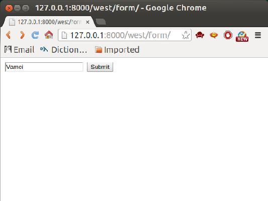
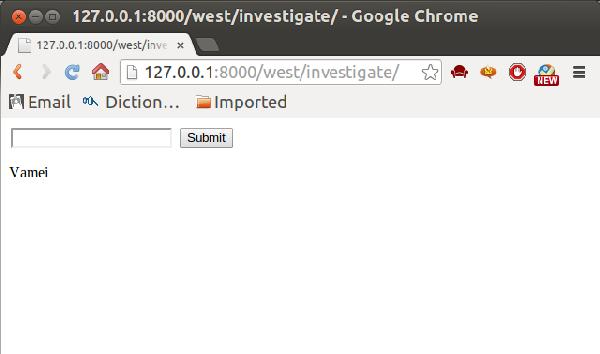
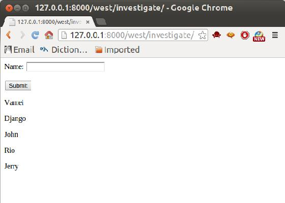
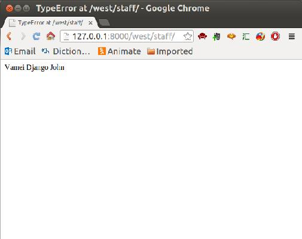

## 被解放的姜戈 04 各取所需

[`www.cnblogs.com/vamei/p/3546090.html`](http://www.cnblogs.com/vamei/p/3546090.html)

作者：Vamei 出处：http://www.cnblogs.com/vamei 欢迎转载，也请保留这段声明。谢谢！ 

我们在[庄园疑云](http://www.cnblogs.com/vamei/p/3531740.html)中讲到了服务器上的数据。当时我们是用手动的方式，直接在数据库插入数据。我们将允许客户向服务器传递数据。

表格是客户向服务器传数据的经典方式。我们先会看到传统的表格提交，然后了解 Django 的表格对象。

 

**“我可不做赔本的买卖”，庄主对姜戈说。**

### html 表格

HTTP 协议以“请求－回复”的方式工作。客户发送请求时，可以在请求中附加数据。服务器通过解析请求，就可以获得客户传来的数据，并根据 URL 来提供特定的服务。 

（http 协议的运作方式，详见[http 协议](http://www.cnblogs.com/vamei/archive/2013/05/11/3069788.html)）

HTML 文件中可以包含表格标签。HTML 表格的目的是帮助用户构成 HTTP 请求，把数据用 GET 或者 POST 的方法，传递给某一 URL 地址。下面是一个表格的例子：

```
<form action="/west/investigate/" method="get">
  <input type="text" name="staff">
  <input type="submit" value="Submit">
</form>

```

这里的 form 标签有两个属性。action 用于说明 URL 地址，method 说明请求的方法。

表格中还包含有两个 input 标签，即两个输入栏目。根据 type 的不同，第一个为一个文本框，第二个为一个提交按钮。name 为输入栏的名字。服务器在解析数据时，将以 name 为索引。

我们可以将上面的表格直接存入模板 form.html，并在 west/views.py 中定义一个视图 form()来显示表格:

```
from django.shortcuts import render def form(request): return render(request, 'form.html')

```

设置 urls.py，让对[site]/west/form/的访问，指向该视图。

最后，我们在 west/views.py 中定义 investigate()来处理该表格提交的数据:

```
from django.shortcuts import render def investigate(request):
    ctx ={} rlt = request.GET['staff'] return HttpResponse(rlt)

```

可以看到，HTTP 请求的相关信息，包括请求的方法，提交的数据，都包含在 request 参数中。

表格是通过 GET 方法提交的。我们可以通过 request.GET['staff']，来获得 name 为 staff 的输入栏的数据。该数据是一个字符串。investigate()将直接显示该字符串。

设置 urls.py，让该处理函数对应 action 的 URL([site]/west/investigate/)。

当我们访问 http://127.0.0.1:9000/west/form 时，将显示:



提交表格后，页面将转到[site]/west/investigate。investigate()读取字符串后，在页面上显示出来。

**姜戈舔舔嘴唇，“这就是你最好的决斗士？我觉得它们不值。”**

### POST 方法

上面我们使用了 GET 方法。视图显示和请求处理分成两个函数处理。

提交数据时更常用 POST 方法。我们下面使用该方法，并用一个 URL 和处理函数，同时显示视图和处理请求。

先创建模板 investigate.html

```
<form action="/west/investigate/" method="post">  <input type="text" name="staff">
  <input type="submit" value="Submit">
</form>

<p>{{ rlt }}</p>

```

我们修改提交表格的方法为 post。在模板的末尾，我们增加一个 rlt 记号，为表格处理结果预留位置。

表格后面还有一个的标签。csrf 全称是 Cross Site Request Forgery。这是 Django 提供的防止伪装提交请求的功能。POST 方法提交的表格，必须有此标签。

在 west/views.py 中，用 investigate()来处理表格：

```
from django.shortcuts import render from django.core.context_processors import csrf def investigate(request):
    ctx ={}
    ctx.update(csrf(request)) if request.POST:
        ctx['rlt'] = request.POST['staff'] return render(request, "investigate.html", ctx)

```

这里的 csrf()是和上面的对应。我们在这里不深究。

看程序的其它部分。对于该 URL，可能有 GET 或者 POST 方法。if 的语句有 POST 方法时，额外的处理，即提取表格中的数据到环境变量。

最终效果如下：



**“哦，是吗，我可是有更好的货色”，庄主似乎胸有成竹。 **

### 存储数据

我们还可以让客户提交的数据存入数据库。使用[庄园疑云](http://www.cnblogs.com/vamei/p/3531740.html)中创建的模型。我们将客户提交的字符串存入模型 Character。

修改 west/views.py 的 investigate():

```
from django.shortcuts import render from django.core.context_processors import csrf from west.models import Character def investigate(request): if request.POST:
        submitted = request.POST['staff']
        new_record = Character(name = submitted)
        new_record.save()
    ctx ={}
    ctx.update(csrf(request))
    all_records = Character.objects.all()
    ctx['staff'] = all_records return render(request, "investigate.html", ctx)

```

在 POST 的处理部分，我们调用 Character 类创建新的对象，并让该对象的属性 name 等于用户提交的字符串。通过 save()方法，我们让该记录入库。

随后，我们从数据库中读出所有的对象，并传递给模板。

我们还需要修改模板 investigate.html，以更好的显示：

```
<form action="/west/investigate/" method="post">  <input type="text" name="staff">
  <input type="submit" value="Submit">
</form>  <p>{{ person }}</p> 

```

我们使用模板语言的 for，来显示所有的记录。

效果如下:


**“他只是勉强够看罢了”，姜戈摇摇头，德国人也赶快跟着摇摇头。** 

### 表格对象

客户提交数据后，服务器往往需要对数据做一些处理。比如检验数据，看是否符合预期的长度和数据类型。在必要的时候，还需要对数据进行转换，比如从字符串转换成整数。这些过程通常都相当的繁琐。

Django 提供的数据对象可以大大简化这一过程。该对象用于说明表格所预期的数据类型和其它的一些要求。这样 Django 在获得数据后，可以自动根据该表格对象的要求，对数据进行处理。

修改 west/views.py：

```
from django.shortcuts import render from django.core.context_processors import csrf from west.models import Character from django import forms class CharacterForm(forms.Form):
    name = forms.CharField(max_length = 200) def investigate(request): if request.POST:
        form = CharacterForm(request.POST) if form.is_valid():
            submitted = form.cleaned_data['name']
            new_record = Character(name = submitted)
            new_record.save()

    form = CharacterForm()
    ctx ={}
    ctx.update(csrf(request))
    all_records = Character.objects.all()
    ctx['staff'] = all_records
    ctx['form']  = form return render(request, "investigate.html", ctx)

```

上面定义了 CharacterForm 类，并通过属性 name，说明了输入栏 name 的类型为字符串，最大长度为 200。

在 investigate()函数中，我们根据 POST，直接创立 form 对象。该对象可以直接判断输入是否有效，并对输入进行预处理。空白输入被视为无效。

后面，我们再次创建一个空的 form 对象，并将它交给模板显示。

在模板 investigate.html 中，我们可以直接显示 form 对象：

```
<form action="/west/investigate/" method="post"> 
  {{ form.as_p }} <input type="submit" value="Submit">
</form>  <p>{{ person }}</p> 

```

如果有多个输入栏，我们可以用相同的方式直接显示整个 form，而不是加入许多个<input>标签。

效果如下：



**庄主看看德国人，再看看女仆，脸上露出狡猾的笑容。**

### 总结

GET 和 POST

表格提交

数据库入库

表格对象

**“哈，那个德国人似乎看上了这个黑女仆呢”，庄主心里打着算盘。**

* * *

作者：Vamei 出处：http://www.cnblogs.com/vamei 欢迎转载，也请保留这段声明。谢谢！

[上一回](http://www.cnblogs.com/vamei/p/3528878.html)说到，姜戈的江湖初体验：如何架设服务器，如何回复 http 请求，如何创建 App。这一回，我们要走入糖果庄园。

数据库是一所大庄园，藏着各种宝贝。一个没有数据库的网站，所能提供的功能会非常有限。


**为了找到心爱的人，姜戈决定一探这神秘的糖果庄园。**

### 连接数据库

Django 为多种数据库后台提供了统一的调用 API。根据需求不同，Django 可以选择不同的数据库后台。MySQL 算是最常用的数据库。我们这里将 Django 和 MySQL 连接。

在 Linux 终端下启动 mysql:

在 MySQL 中创立 Django 项目的数据库：

```
mysql> CREATE DATABASE villa DEFAULT CHARSET=utf8;

```

这里使用 utf8 作为默认字符集，以便支持中文。

在 MySQL 中为 Django 项目创立用户，并授予相关权限:

```
mysql> GRANT SELECT, INSERT, UPDATE, DELETE, CREATE, DROP, INDEX, ALTER, CREATE TEMPORARY TABLES, LOCK TABLES ON villa.* TO 'vamei'@'localhost' IDENTIFIED BY 'vameiisgood';

```

在 settings.py 中，将 DATABASES 对象更改为:

```
DATABASES = {
    'default': {
        'ENGINE': 'django.db.backends.mysql',
        'NAME': 'villa',
        'USER': 'vamei',
        'PASSWORD': 'vameiisgood',
        'HOST':'localhost',
        'PORT':'3306',
    }
}

```

后台类型为 mysql。上面包含数据库名称和用户的信息，它们与 MySQL 中对应数据库和用户的设置相同。Django 根据这一设置，与 MySQL 中相应的数据库和用户连接起来。此后，Django 就可以在数据库中读写了。

**姜戈略一迟疑，旋即走入了庄园的大门。**

### 创立模型

MySQL 是关系型数据库。但在 Django 的帮助下，我们不用直接编写 SQL 语句。Django 将关系型的表(table)转换成为一个类(class)。而每个记录(record)是该类下的一个对象(object)。我们可以使用基于对象的方法，来操纵关系型的 MySQL 数据库。

在传统的 MySQL 中，数据模型是表。在 Django 下，一个表为一个类。表的每一列是该类的一个属性。在 models.py 中，我们创建一个只有一列的表，即只有一个属性的类：

```
from django.db import models class Character(models.Model):
    name = models.CharField(max_length=200) def __unicode__(self): return self.name

```

类 Character 定义了数据模型，它需要继承自 models.Model。在 MySQL 中，这个类实际上是一个表。表只有一列，为 name。可以看到，name 属性是字符类型，最大长度为 200。

类 Character 有一个 __unicode__()方法，用来说明对象的字符表达方式。如果是 Python 3，定义 __str__()方法，实现相同的功能。

命令 Django 同步数据库。Django 根据 models.py 中描述的数据模型，在 MySQL 中真正的创建各个关系表：

同步数据库后，Django 将建立相关的 MySQL 表格，并要求你创建一个超级用户:

> Creating tables ...
> Creating table django_admin_log
> Creating table auth_permission
> Creating table auth_group_permissions
> Creating table auth_group
> Creating table auth_user_groups
> Creating table auth_user_user_permissions
> Creating table auth_user
> Creating table django_content_type
> Creating table django_session
> Creating table west_character
> 
> You just installed Django's auth system, which means you don't have any superusers defined.
> Would you like to create one now? (yes/no): yes
> Username (leave blank to use 'tommy'): vamei
> Email address: vamei@vamei.com
> Password:
> Password (again):
> Superuser created successfully.
> Installing custom SQL ...
> Installing indexes ...
> Installed 0 object(s) from 0 fixture(s)

数据模型建立了。打开 MySQL 命令行：

查看数据模型：

```
USE villa;
SHOW TABLES;
SHOW COLUMNS FROM west_character;

```

最后一个命令返回 Character 类的对应表格:

> +-------+--------------+------+-----+---------+----------------+
> | Field | Type         | Null | Key | Default | Extra          |
> +-------+--------------+------+-----+---------+----------------+
> | id    | int(11)      | NO   | PRI | NULL    | auto_increment |
> | name  | varchar(200) | NO   |     | NULL    |                |
> +-------+--------------+------+-----+---------+----------------+
> 2 rows in set (0.00 sec)

可以看到，Django 还自动增加了一个 id 列，作为记录的主键(Primary Key)。

**这富丽堂皇的别墅中，姜戈隐隐闻到凶险的味道。**

### 显示数据

数据模型虽然建立了，但还没有数据输入。为了简便，我们手动添加记录。打开 MySQL 命令行,并切换到相应数据库。添加记录：

```
INSERT INTO west_character (name) Values ('Vamei'); INSERT INTO west_character (name) Values ('Django'); INSERT INTO west_character (name) Values ('John');

```

查看记录：

```
 SELECT * FROM west_character;

```

可以看到，三个名字已经录入数据库。

下面我们从数据库中取出数据，并返回给 http 请求。在 west/views.py 中，添加视图。对于对应的请求，我们将从数据库中读取所有的记录，然后返回给客户端：

```
# -*- coding: utf-8 -*-

from django.http import HttpResponse from west.models import Character def staff(request):
    staff_list = Character.objects.all()
    staff_str = map(str, staff_list) return HttpResponse("<p>" + ' '.join(staff_str) + "</p>")

```

可以看到，我们从 west.models 中引入了 Character 类。通过操作该类，我们可以读取表格中的记录

为了让 http 请求能找到上面的程序，在 west/urls.py 增加 url 导航：

```
from django.conf.urls import patterns, include, url

urlpatterns = patterns('',
    url(r'^staff/','west.views.staff'),
)

```

运行服务器。在浏览器中输入 URL：

127.0.0.1:8000/west/staff

查看效果：



从数据库读出数据，显示在页面

**“我心爱的人，原来你在这里。” 姜戈强自镇定，嘴角忍不住颤动。**

### 总结

Django 使用类和对象接口，来操纵底层的数据库。

有了数据库，就有了站点内容的大本营。

**姜戈，风雨欲来。**