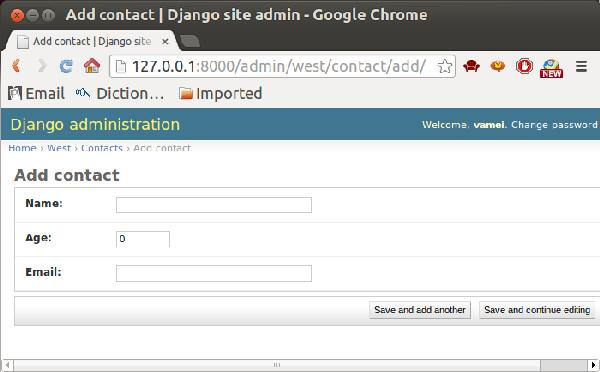
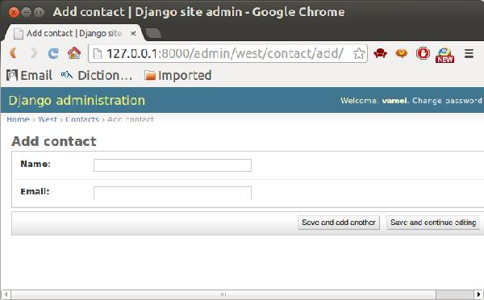
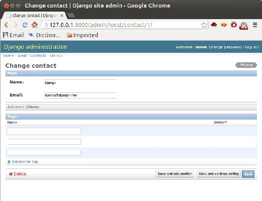
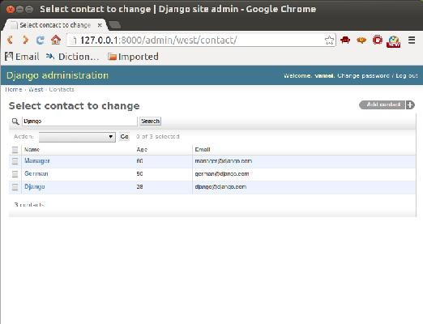

## 被解放的姜戈 05 黑面管家

[`www.cnblogs.com/vamei/p/3548762.html`](http://www.cnblogs.com/vamei/p/3548762.html)

作者：Vamei 出处：http://www.cnblogs.com/vamei 欢迎转载，也请保留这段声明。谢谢！ 

Django 提供一个管理数据库的 app，即 django.contrib.admin。这是 Django 最方便的功能之一。通过该 app，我们可以直接经由 web 页面，来管理我们的数据库。这一工具，主要是为网站管理人员使用。

这个 app 通常已经预装好，你可以在 mysite/settings.py 中的 INSTALLED_APPS 看到它。


**“这庄园里的事情，都逃不过我的眼睛”，管家放下账本，洋洋得意。**

### 默认界面

admin 界面位于[site]/admin 这个 URL。这通常在 mysite/urls.py 中已经设置好。比如，下面是我的 urls.py:

```py
from django.conf.urls import patterns, include, url from django.contrib import admin

admin.autodiscover() # admin
 urlpatterns = patterns('',
    url(r'^admin/', include(admin.site.urls)),  # admin
    url(r'^west/', include('west.urls')),
)

```

为了让 admin 界面管理某个数据模型，我们需要先注册该数据模型到 admin。比如，我们之前在 west 中创建的模型 Character。修改 west/admin.py:

```py
from django.contrib import admin from west.models import Character # Register your models here.
admin.site.register(Character)

```

访问 http://127.0.0.1:8000/admin，登录后，可以看到管理界面：


这个页面除了 west.characters 外，还有用户和组信息。它们来自 Django 预装的 Auth 模块。我们将在以后处理用户管理的问题。

**“我已经管理这个庄园几十年了。”**

### 复杂模型

管理页面的功能强大，完全有能力处理更加复杂的数据模型。

先在 west/models.py 中增加一个更复杂的数据模型：

```py
from django.db import models # Create your models here.
class Contact(models.Model):
    name = models.CharField(max_length=200)
    age = models.IntegerField(default=0)
    email = models.EmailField() def __unicode__(self): return self.name class Tag(models.Model):
    contact = models.ForeignKey(Contact)
    name = models.CharField(max_length=50) def __unicode__(self): return self.name

```

这里有两个表。Tag 以 Contact 为外部键。一个 Contact 可以对应多个 Tag。

我们还可以看到许多在之前没有见过的属性类型，比如 CharField 用于存储整数。

 

同步数据库:

在 west/admin.py 注册多个模型并显示：

```py
from django.contrib import admin from west.models import Character,Contact,Tag # Register your models here.
admin.site.register([Character, Contact, Tag])

```

模型将在管理页面显示。比如 Contact 的添加条目的页面如下：



**“这些黑鬼在想什么，我一清二楚。” **

### 自定义页面

我们可以自定义管理页面，来取代默认的页面。比如上面的"add"页面。我们想只显示 name 和 email 部分。修改 west/admin.py:

```py
from django.contrib import admin from west.models import Character,Contact,Tag # Register your models here.
class ContactAdmin(admin.ModelAdmin):
    fields = ('name', 'email')

admin.site.register(Contact, ContactAdmin)
admin.site.register([Character, Tag])

```

上面定义了一个 ContactAdmin 类，用以说明管理页面的显示格式。里面的 fields 属性，用以说明要显示的输入栏。我们没有让"age"显示。由于该类对应的是 Contact 数据模型，我们在注册的时候，需要将它们一起注册。显示效果如下：



我们还可以将输入栏分块，给每一块输入栏以自己的显示格式。修改 west/admin.py 为：

```py
from django.contrib import admin from west.models import Character,Contact,Tag # Register your models here.
class ContactAdmin(admin.ModelAdmin):
    fieldsets = (
        ['Main',{ 'fields':('name','email'),
        }],
        ['Advance',{ 'classes': ('collapse',), # CSS
            'fields': ('age',),
        }]
    )

admin.site.register(Contact, ContactAdmin)
admin.site.register([Character, Tag])

```

上面的栏目分为了 Main 和 Advance 两部分。classes 说明它所在的部分的 CSS 格式。这里让 Advance 部分收敛起来：


Advance 部分旁边有一个 Show 按钮，用于展开。

**“这两个客人，似乎没有那么简单。”**

### Inline 显示

上面的 Contact 是 Tag 的外部键，所以有外部参考的关系。而在默认的页面显示中，将两者分离开来，无法体现出两者的从属关系。我们可以使用 Inline 显示，让 Tag 附加在 Contact 的编辑页面上显示。

修改 west/admin.py：

```py
from django.contrib import admin from west.models import Character,Contact,Tag # Register your models here.
class TagInline(admin.TabularInline):
    model = Tag class ContactAdmin(admin.ModelAdmin):
    inlines = [TagInline]  # Inline
    fieldsets = (
        ['Main',{ 'fields':('name','email'),
        }],
        ['Advance',{ 'classes': ('collapse',), 'fields': ('age',),
        }]

    )

admin.site.register(Contact, ContactAdmin)
admin.site.register([Character])

```

效果如下：



**“但我也不是好惹的。”**

### 列表页的显示

在 Contact 输入数条记录后，Contact 的列表页看起来如下:


我们也可以自定义该页面的显示，比如在列表中显示更多的栏目，只需要在 ContactAdmin 中增加 list_display 属性:

```py
from django.contrib import admin from west.models import Character,Contact,Tag # Register your models here.
class ContactAdmin(admin.ModelAdmin):
    list_display = ('name','age', 'email') # list
 admin.site.register(Contact, ContactAdmin)
admin.site.register([Character, Tag])

```

列表页新的显示效果如下：


我们还可以为该列表页增加搜索栏。搜索功能在管理大量记录时非常有用。使用 search_fields 说明要搜索的属性：

```py
from django.contrib import admin from west.models import Character,Contact,Tag # Register your models here.
class ContactAdmin(admin.ModelAdmin):
    list_display = ('name','age', 'email') 
    search_fields = ('name',)

admin.site.register(Contact, ContactAdmin)
admin.site.register([Character])

```

效果如下：



**“我要替小主人留心了。”**

### 总结

Django 的管理页面有很丰富的数据库管理功能，并可以自定义显示方式，是非常值得使用的工具。

**“谁，也逃不出我的眼睛！”**