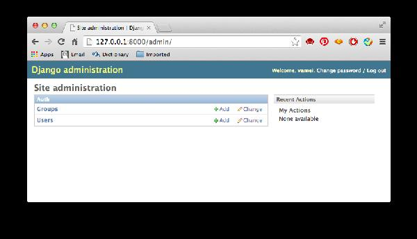

## 被解放的姜戈 06 假作真时

[`www.cnblogs.com/vamei/p/3550951.html`](http://www.cnblogs.com/vamei/p/3550951.html)

作者：Vamei 出处：http://www.cnblogs.com/vamei 欢迎转载，也请保留这段声明。谢谢！

之前了解了：

*   创建 Django 项目
*   数据库
*   模板
*   表格提交
*   admin 管理页面

上面的功能模块允许我们做出一个具有互动性的站点，但无法验证用户的身份。我们这次了解用户验证部分。通过用户验证，我们可以根据用户的身份，提供不同的服务。

一个 Web 应用的用户验证是它的基本组成部分。我们在使用一个应用时，总是从“登录”开始，到“登出”结束。另一方面，用户验证又和网站安全、数据库安全息息相关。HTTP 协议是无状态的，但我们可以利用储存在客户端的 cookie 或者储存在服务器的 session 来记录用户的访问。 

Django 有管理用户的模块，即 django.contrib.auth。你可以在 mysite/settings.py 里看到，这个功能模块已经注册在 INSTALLED_APPS 中。利用该模块，你可以直接在逻辑层面管理用户，不需要为用户建立模型，也不需要手工去实现会话。


**“为了救你的爱人出来，我们要演一场戏。”**

### 创建用户

你可以在[admin 页面](http://www.cnblogs.com/vamei/p/3548762.html)直接看到用户管理的对话框，即 Users。从这里，你可以在这里创建、删除和修改用户。点击 Add 增加用户 daddy，密码为 daddyiscool。

在 admin 页面下，我们还可以控制不同用户组对数据库的访问权限。我们可以在 Groups 中增加用户组，设置用户组对数据库的访问权限，并将用户加入到某个用户组中。

在这一章节中，我们[创立一个新的 app](http://www.cnblogs.com/vamei/p/3528878.html)，即 users。下文的模板和 views.py，都针对该 app。

**"你这套新衣服，还真像那么回事"，德国人说。**

### 用户登录

我们建立一个简单的表格。用户通过该表格来提交登陆信息，并在 Django 服务器上验证。如果用户名和密码正确，那么登入用户。

我们首先增加一个登录表格：

```
<form role="form" action="/login" method="post">
      <label>Username</label>
      <input type="text" name='username'>
      <label>Password</label>
      <input name="password" type="password">
      <input type="submit" value="Submit">
 </form>

```

我们在 views.py 中，定义处理函数 user_login()，来登入用户：

```
# -*- coding: utf-8 -*-
from django.shortcuts import render, redirect from django.core.context_processors import csrf from django.contrib.auth import *

def user_login(request): ''' login '''
    if request.POST:
        username = password = '' username = request.POST.get('username')
        password = request.POST.get('password')
        user = authenticate(username=username, password=password) if user is not None and user.is_active:
                login(request, user) return redirect('/')
    ctx = {}
    ctx.update(csrf(request))
    render(request, 'login.html',ctx)

```

上面的 authenticate()函数，可以根据用户名和密码，验证用户信息。而 login()函数则将用户登入。它们来自于 django.contrib.auth。

作为替换，我们可以使用特别的[form 对象](http://www.cnblogs.com/vamei/p/3546090.html)，而不自行定义表格。这将让代码更简单，而且提供一定的完整性检验。

练习. 使用 contrib.auth.forms.AuthenticationForm。来简化上面的模板和处理函数。

**德国人还是不忘一再叮嘱，"记住，我们可不是什么赏金猎人。" **

### 登出

有时用户希望能销毁会话。我们可以提供一个登出的 URL，即/users/logout。登入用户访问该 URL，即可登出。在 views.py 中，增加该 URL 的处理函数：

```
# -*- coding: utf-8 -*-
from django.shortcuts import redirect def user_logout(request): ''' logout
    URL: /users/logout ''' logout(request) return redirect('/')

```

我们修改 urls.py，让 url 对应 user_logout()。访问 http://127.0.0.1/users/logout，就可以登出用户。

**德国人压低声音，“哦，我是来救你的，我们要演一出戏。” **

### views.py 中的用户

上面说明了如何登入和登出用户，但还没有真正开始享受用户验证带来的好处。用户登陆的最终目的，就是为了让服务器可以区别对待不同的用户。比如说，有些内容只能让登陆用户看到，有些内容则只能让特定登陆用户看到。我们下面将探索如何实现这些效果。

在 Django 中，对用户身份的检验，主要是在 views.py 中进行。views.py 是连接模型和视图的中间层。HTTP 请求会转给 views.py 中的对应处理函数处理，并发回回复。在 views.py 的某个处理函数准备 HTTP 回复的过程中，我们可以检验用户是否登陆。根据用户是否登陆，我们可以给出不同的回复。最原始的方式，是使用 if 式的选择结构： 

```
# -*- coding: utf-8 -*-
from django.http import HttpResponse def diff_response(request): if request.user.is_authenticated():
        content = "<p>my dear user</p>"
    else:
        content = "<p>you wired stranger</p>"
    return HttpResponse(content)

```

可以看到，用户的登录信息包含在 request.user 中，is_authenticated()方法用于判断用户是否登录，如果用户没有登录，那么该方法将返回 false。该 user 对象属于 contrib.auth.user 类型，还有其它属性可供使用，比如

| 属性 | 功能 |
| get_username() | 返回用户名 |
| set_password() | 设置密码 |
| get_fullname() | 返回姓名 |
| last_login | 上次登录时间 |
| date_joined　　 | 账户创建时间 |

练习. 实验上面的处理函数的效果。

在 Django 中，我们还可以利用装饰器，根据用户的登录状况，来决定 views.py 中处理函数的显示效果。相对于上面的 if 结构，装饰器使用起来更加方便。下面的 user_only()是 views.py 中的一个处理函数。

```
from django.contrib.auth.decorators import login_required from django.http import HttpResponse

@login_required def user_only(request): return HttpResponse("<p>This message is for logged in user only.</p>")

```

注意上面的装饰器 login_required，它是 Django 预设的装饰器。user_only()的回复结果只能被登录用户看到，而未登录用户将被引导到其他页面。

Django 中还有其它的装饰器，用于修饰处理函数。相应的 http 回复，只能被特殊的用户看到。比如 user_passes_test，允许的用户必须满足特定标准，而这一标准是可以用户自定义的。比如下面，在 views.py 中增添：

```
from django.contrib.auth.decorators import user_passes_test from django.http import HttpResponse

```

```
def name_check(user): return user.get_username() == 'vamei' @user_passes_test(name_check) def specific_user(request): return HttpResponse("<p>for Vamei only</p>")

```

装饰器带有一个参数，该参数是一个函数对象 name_check。当 name_check 返回真值，即用户名为 vamei 时，specific_user 的结果才能被用户看到。

**德国人羞涩的笑笑，“我确实对她有那么点好感。” **

### 模板中的用户

进一步，用户是否登陆这一信息，也可以直接用于模板。比较原始的方式是把用户信息直接作为环境数据，提交给模板。然而，这并不是必须的。事实上，Django 为此提供了捷径：我们可以直接在模板中调用用户信息。比如下面的模板：

```
 <p>Welcome, my genuine user, my true love.</p>  <p>Sorry, not login, you are not yet my sweetheart. </p> 

```

不需要环境变量中定义，我们就可以直接在模板中引用 user。这里，模板中调用了 user 的一个方法，is_authenticated，将根据用户的登录情况，返回真假值。需要注意，和正常的 Python 程序不同，在 Django 模板中调用方法并不需要后面的括号。

练习. 增加处理函数，显示该模板，然后查看不同登录情况下的显示结果。

**管家冷不丁的说，“你认识他们？！” **

### 用户注册

我们上面利用了 admin 管理页面来增加和删除用户。这是一种简便的方法，但并不能用于一般的用户注册的情境。我们需要提供让用户自主注册的功能。这可以让站外用户提交自己的信息，生成自己的账户，并开始作为登陆用户使用网站。

用户注册的基本原理非常简单，即建立一个提交用户信息的表格。表格中至少包括用户名和密码。相应的处理函数提取到这些信息后，建立 User 对象，并存入到数据库中。

我们可以利用 Django 中的 UserCreationForm，比较简洁的生成表格，并在 views.py 中处理表格：

```
from django.contrib.auth.forms import UserCreationForm from django.shortcuts import render, redirect from django.core.context_processors import csrf def register(request): if request.method == 'POST': 
        form = UserCreationForm(request.POST) if form.is_valid(): 
            new_user = form.save() return redirect("/") else:
        form = UserCreationForm()
        ctx = {'form': form}
        ctx.update(csrf(request)) return render(request, "register.html", ctx)

```

相应的模板 register.html 如下：

```
<form action="" method="post"> 
   {{ form.as_p }} <input type="submit" value="Register">
</form>

```

**“骗子，你们这些骗子”，庄园主怒吼着。**

### 总结

正如我们上面提到的，用户登陆系统的最大功能是区分登入和未登入用户，向他们提供不同的内容和服务。

我们看到了用户验证的基本流程，也看到了如何在 views.py 和模板中区分用户。

**两杆枪，一支指着德国人，一支指着姜戈。**