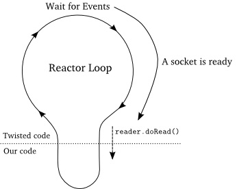

# 由 twisted 支持的客户端

### 第一个 twisted 支持的诗歌服务器

尽管 Twisted 大多数情况下用来写服务器代码，但为了一开始尽量从简单处着手，我们首先从简单的客户端讲起。

让我们来试试使用 Twisted 的客户端。源码在[twisted-client-1/get-poetry.py](http://github.com/jdavisp3/twisted-intro/blob/master/twisted-client-1/get-poetry.py)。首先像前面一样要开启三个服务器：

```py
python blocking-server/slowpoetry.py --port 10000 poetry/ecstasy.txt --num-bytes 30
python blocking-server/slowpoetry.py --port 10001 poetry/fascination.txt
python blocking-server/slowpoetry.py --port 10002 poetry/science.txt 
```

并且运行客户端：

```py
python twisted-client-1/get-poetry.py 10000 10001 10002 
```

你会看到在客户端的命令行打印出：

```py
Task 1: got 60 bytes of poetry from 127.0.0.1:10000
Task 2: got 10 bytes of poetry from 127.0.0.1:10001
Task 3: got 10 bytes of poetry from 127.0.0.1:10002
Task 1: got 30 bytes of poetry from 127.0.0.1:10000 
Task 3: got 10 bytes of poetry from 127.0.0.1:10002
Task 2: got 10 bytes of poetry from 127.0.0.1:10001 
... 
Task 1: 3003 bytes of poetry
Task 2: 623 bytes of poetry
Task 3: 653 bytes of poetry
Got 3 poems in 0:00:10.134220 
```

和我们的没有使用 Twisted 的非阻塞模式客户端打印的内容接近。这并不奇怪，因为它们的工作方式是一样的。

下面，我们来仔细研究一下它的源代码。

> **注意**：正如我在第一部分说到，我们开始学习使用 Twisted 时会使用一些低层 Twisted 的 APIs。这样做是为揭去 Twisted 的抽象层，这样我们就可以从内向外的来学习 Tiwsted。但是这就意味着，我们在学习中所使用的 APIs 在实际应用中可能都不会见到。记住这么一点就行：前面这些代码只是用作练习，而不是写真实软件的例子。

可以看到，首先创建了一组[PoetrySocket](http://github.com/jdavisp3/twisted-intro/blob/master/twisted-client-1/get-poetry.py#L53)的实例。在 PoetrySocket 初始化时，其创建了一个网络 socket 作为自己的属性字段来连接服务器，并且选择了非阻塞模式：

```py
self.sock = socket.socket(socket.AF_INET, socket.SOCK_STREAM)
self.sock.connect(address)
self.sock.setblocking(0) 
```

最终我们虽然会提高到不使用 socket 的抽象层次上，但这里我们仍然需要使用它。在创建完 socket 后，PoetrySocket 通过方法 addReader 将自己传递给 reactor：

```py
# tell the Twisted reactor to monitor this socket for reading
from twisted.internet import reactor
reactor.addReader(self） 
```

这个方法给 Twisted 提供了一个[文件描述符](http://en.wikipedia.org/wiki/File_descriptor)来监视要发送来的数据。为什么我们不传递给 Twisted 一个文件描述符或回调函数而是一个对象实例？并且 Twisted 内部没有任何与这个诗歌服务相关的代码，它怎么知道该如何与我们的对象实例交互？相信我，我已经查看过了，打开[twisted.internet.interfaces](http://twistedmatrix.com/trac/browser/trunk/twisted/internet/interfaces.py)模块，和我一起来搞清楚是怎么回事。

### Twisted 接口

在 twisted 内部有很多被称作接口的子模块。每个都定义了一组接口类。由于在 8.0 版本中，Twisted 使用[zope.interface](http://www.zope.org/products/Zopeinterface)作为这些类的基类。但我们这里并不来讨论它其中的细节。我们只关心其在 Twisted 的子类，就是你看到的那些。

使用接口的核心目的之一就是文档化。作为一个 python 程序员，你肯定知道[Duck Typing](http://en.wikipedia.org/wiki/Duck_typing)。（python 哲学思想：“如果看起来像鸭子，听起来像鸭子，就可以把它当作鸭子”。因此 python 对象的接口力求简单而且统一，类似其他语言中面向接口编程思想。） 翻阅 twisted.internet.interfaces 找到方法的 addReader 定义，它的定义在[IReactorFDSet](http://twistedmatrix.com/trac/browser/trunk/twisted/internet/interfaces.py)中可以找到：

```py
def addReader(reader):
    """
    I add reader to the set of file descriptors to get read events for.
    @param reader: An L{IReadDescriptor} provider that will be checked for
                   read events until it is removed from the reactor with
                   L{removeReader}.
    @return: C{None}.
    """ 
```

IReactorFDSet 是一个 Twisted 的 reactor 实现的接口。因此任何一个 Twisted 的 reactor 都会一个 addReader 的方法，如同上面描述的一样工作。这个方法声明之所以没有 self 参数是因为它仅仅关心一个公共接口定义，self 参数仅仅是接口实现时的一部分（在调用它时，也没有显式地传入一个 self 参数）。接口类永远不会被实例化或作为基类来继承实现。

> 1.  技术上讲，IReactorFDSet 只会由 reactor 实现用来监听文件描述符。具我所知，现在所有已实现 reactor 都会实现这个接口。
> 2.  使用接口并不仅仅是为了文档化。zope.interface 允许你显式地来声明一个类实现一个或多个接口，并提供运行时检查这些实现的机制。同样也提供代理这一机制，它可以动态地为一个没有实现某接口的类直接提供该接口。但我们这里就不做深入学习了。
> 3.  你可能已经注意到接口与最近添加到 Python 中虚基类的相似性了。这里我们并不去分析它们之间的相似性与差异。若你有兴趣，可以读读 Python 项目的创始人 Glyph 写的一篇关于这个话题的文章。

根据文档的描述可以看出，addReader 的 reader 参数是要实现[IReadDescriptor](http://twistedmatrix.com/trac/browser/trunk/twisted/internet/interfaces.py)接口的。这也就意味我们的 PoetrySocket 也必须这样做。

阅读接口模块我们可以看到下面这段代码：

```py
class IReadDescriptor(IFileDescriptor):
    def doRead():
        """
        Some data is available for reading on your descriptor.
        """ 
```

同时你会看到在我们的 PoetrySocket 类中有一个 doRead 方法。当其被 Twisted 的 reactor 调用时，就会采用异步的方式从 socket 中读取数据。因此，doRead 其实就是一个回调函数，只是没有直接将其传递给 reactor，而是传递一个实现此方法的对象实例。这也是 Twisted 框架中的惯例—不是直接传递实现某个接口的函数而是传递实现它的对象。这样我们通过一个参数就可以传递一组相关的回调函数。而且也可以让回调函数之间通过存储在对象中的数据进行通信。

那在 PoetrySocket 中实现其它的回调函数呢？注意到 IReadDescriptor 是 IFileDescriptor 的一个子类。这也就意味任何一个实现 IReadDescriptor 都必须实现 IFileDescriptor。若是你仔细阅读代码会看到下面的内容：

```py
class IFileDescriptor(ILoggingContext):
    """
    A file descriptor.
    """
    def fileno():
        ...
    def connectionLost(reason):
        … 
```

我将文档描述省略掉了，但这些函数的功能从字面上就可以理解：fileno 返回我们想监听的文件描述符，connectionLost 是当连接关闭时被调用。你也看到了，PoetrySocket 实现了这些方法。

最后，IFileDescriptor 继承了 ILoggingContext，这里我不想再展现其源码。我想说的是，这就是为什么我们要实现一个 logPrefix 回调函数。你可以在 interface 模块中找到答案。

> 注意：你也许注意到了，当连接关闭时，在 doRead 中返回了一个特殊的值。我是如何知道的？说实话，没有它程序是无法正常工作的。我是在分析 Twisted 源码中发现其它相应的方法采取相同的方法。你也许想好好研究一下：但有时一些文档或书的解释是错误的或不完整的。因此可能当你搞清楚怎么回事时，我们已经完成第五部分了呵呵。

### 更多关于回调的知识

我们使用 Twisted 的异步客户端和前面的没有使用 Twisted 的异步客户非常的相似。两者都要连接它们自己的 socket，并以异步的方式从中读取数据。最大的区别在于：使用 Twisted 的客户端并没有使用自己的 select 循环-而使用了 Twisted 的 reactor。 doRead 回调函数是非常重要的一个回调。Twisted 调用它来告诉我们已经有数据在 socket 接收完毕。我可以通过图 7 来形象地说明这一过程：

图 7 doRead 回调过程

每当回调被激活，就轮到我们的代码将所有能够读的数据读回来然后非阻塞式的停止。正如我们第三部分说的那样，Twisted 是不会因为什么异常状况（如没有必要的阻塞）而终止我们的代码。那么我们就故意写个会产生异常状况的客户端看看到底能发生什么事情。可以在[twisted-client-1/get-poetry-broken.py](http://github.com/jdavisp3/twisted-intro/blob/master/twisted-client-1/get-poetry-broken.py)中看到源代码。这个客户端与你前面看到的同样有两个异常状况出现：

1.  这个客户端并没有选择非阻塞式的 socket
2.  doRead 回调方法在 socket 关闭连接前一直在不停地读 socket

现在让我们运行一下这个客户端：

```py
python twisted-client-1/get-poetry-broken.py 10000 10001 10002 
```

我们出得到如同下面一样的输出：

```py
Task 1: got 3003 bytes of poetry from 127.0.0.1:10000
Task 3: got 653 bytes of poetry from 127.0.0.1:10002 
Task 2: got 623 bytes of poetry from 127.0.0.1:10001
Task 1: 3003 bytes of poetry 
Task 2: 623 bytes of poetry
Task 3: 653 bytes of poetry
Got 3 poems in 0:00:10.132753 
```

可能除了任务的完成顺序不太一致外，和我前面阻塞式客户端是一样的。这是因为这个客户端是一个阻塞式的。

由于使用了阻塞式的连接，就将我们的非阻塞式客户端变成了阻塞式的客户端。这样一来，我们尽管遭受了使用 select 的复杂但却没有享受到其带来的异步优势。

像诸如 Twisted 这样的事件循环所提供的多任务的能力是需要用户的合作来实现的。Twisted 会告诉我们什么时候读或写一个文件描述符，但我们必须要尽可能高效而没有阻塞地完成读写工作。同样我们应该禁止使用其它各类的阻塞函数，如 os.system 中的函数。除此之外，当我们遇到计算型的任务（长时间占用 CPU），最好是将任务切成若干个部分执行以让 I/O 操作尽可能地执行。

你也许已经注意到这个客户端所花费的时间少于先前那个阻塞的客户端。这是由于这个在一开始就与所有的服务建立连接，由于服务是一旦连接建立就立即发送数据，而且我们的操作系统会缓存一部分发送过来但尚读不到的数据到缓冲区中（缓冲区大小是有上限的）。因此就明白了为什么前面那个会慢了：它是在完成一个后再建立下一个连接并接收数据。

但这种小优势仅仅在小数据量的情况下才会得以体现。如果我们下载三首 20M 个单词的诗，那时 OS 的缓冲区会在瞬间填满，这样一来我们这个客户端与前面那个阻塞式客户端相比就没有什么优势可言了。

### 结束语

我没有过多地解释此部分第一个客户端的内容。你可能注意到了，connectionLost 函数会在没有 PoetrySocket 等待诗歌后关闭 reactor。由于我们的程序除了下载诗歌不提供其它服务，所以才会这样做。但它揭示了两个低层 reactor 的 APIs：removeReader 和 getReaders。

还有与我们客户端使用的 Readers 的 APIs 类同的 Writers 的 APIs，它们采用相同的方式来监视我们要发送数据的文件描述符。可以通过阅读 interfaces 文件来获取更多的细节。读和写有各自的 APIs 是因为 select 函数需要分开这两种事件（读或写可以进行的文件描述符）。当然了，可以等待即能读也能写的文件描述符。

第五部分，我们将使用 Twisted 的高层抽象方式实现另外一个客户端，并且学习更多的 Twisted 的接口与 APIs。

### 参考

本部分原作参见: dave [`krondo.com/?p=1445`](http://krondo.com/?p=1445)

本部分翻译内容参见杨晓伟的博客 [`blog.sina.com.cn/s/blog_704b6af70100q0hw.html`](http://blog.sina.com.cn/s/blog_704b6af70100q0hw.html)