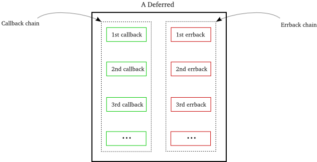

# 小插曲，Deferred

### 回调函数的后序发展

在第六部分我们认识到这样一个情况：回调是 Twisted 异步编程中的基础。除了与 reactor 交互外，回调可以安插在任何我们写的 Twisted 结构内。因此在使用 Twisted 或其它基于 reactor 的异步编程体系时，都意味需要将我们的代码组织成一系列由 reactor 循环可以激活的回调函数链。

即使一个简单的 get_poetry 函数都需要回调，两个回调函数中一个用于处理正常结果而另一个用于处理错误。作为一个 Twisted 程序员，我们必须充分利用这一点。应该花点时间思考一下如何更好地使用回调及使用过程中会遇到什么困难。

分析下 3.1 版本中的 get_poetry 函数：

```
...
def got_poem(poem):
    print poem
    reactor.stop()
def poem_failed(err):
    print >>sys.stderr, 'poem download failed'
    print >>sys.stderr, 'I am terribly sorry'
    print >>sys.stderr, 'try again later?'
    reactor.stop()

get_poetry(host, port, got_poem, poem_failed)

reactor.run() 
```

我们想法很简单：

1.  如果完成诗歌下载，那么就打印它
2.  如果没有下载到诗歌，那就打印出错误信息
3.  上面任何一种情况出现，都要停止程序继续运行

同步程序中处理上面的情况会采用如下方式：

```
...
try:
    poem = get_poetry(host, port) # the synchronous version of get_poetry
except Exception, err:
    print >>sys.stderr, 'poem download failed'
    print >>sys.stderr, 'I am terribly sorry'
    print >>sys.stderr, 'try again later?'
    sys.exit()
else:
    print poem
    sys.exit() 
```

即 callback 类似 else 处理路径，而 errback 类似 except 处理路径。这意味着激活 errback 回调函数类似于同步程序中抛出一个异常，而激活一个 callback 意味着同步程序中的正常执行路径。 两个版本有什么不同之外吗？可以明确的是，在同步版本中，Python 解释器可以确保只要 get_poetry 抛出异常(任意类型, 这里特指 Exception 及其子类)就会执行 except 块。也就是说只要我们相信 Python 解释器能够正确的解释执行 Python 程序，那么就可以相信异常处理块会在恰当的时间点被执行。

和异步版本不同的是：poem_failed 错误回调是由我们自己的代码激活并调用的，即 PoetryClientFactory 的 clientConnectFailed 函数。是我们自己而不是 Python 来确保当出错时错误处理代码能够执行。因此我们必须保证通过调用携带 Failure 对象的 errback 来处理任何可能的错误。

否则，我们的程序就会因为等待一个永远不会出现的回调而止步不前。

这里显示出了同步与异步版本的又一个不同之处。如果我们在同步版本中没有使用 try/except 捕获异步，那么 Python 解释器会为我们捕获然后关掉我们的程序并打印出错误信息。但是如果我们忘记抛出我们的异步异常（在本程序中是在 PoetryClientFactory 调用 errback），我们的程序会一直运行下去，还开心地以为什么事都没有呢。

显而易见，在异步程序中处理错误是相当重要的，甚至有些严峻。也可以说在异步程序中处理错误信息比处理正常的信息要重要的多，这是因为错误会以多种方式出现，而正确的结果出现的方式是唯一的。当使用 Twisted 编程时忘记处理异常是一个常犯的错误。

关于上面同步程序代码的另一个默认的事实是：else 与 except 块两者只能是运行其中一个（假设我们的 get_poetry 没有在一个无限循环中运行）。Python 解释器不会突然决定两者都运行或突发奇想来运行 else 块 27 次。对于通过 Python 来实现那样的动作是不可能的。

但在异步程序中，我们要负责 callback 和 errback 的运行。因此，我们可能就会犯这样的错误：同时调用了 callback 与 errback 或激活 callback27 次。这对于使用 get_poetry 的用户来说是不幸的。虽然在描述文档中没有明确地说明，像 try/except 块中的 else 与 except 一样，对于每次调用 get_poetry 时 callback 与 errback 只能运行其中一个，不管我们是否成功的下载完诗歌。

设想一下，我们在调试某个程序时，我们提出了三次诗歌下载请求，但是得到有 7 次 callback 被激活和 2 次 errback 被激活。可能这时，你会下来检查一下，什么时候 get_poetry 激活了两次 callback 并且还抛出一个错误出来。

从另一个视角来看，两个版本都有代码重复。异步的版本中含有两次 reactor.stop，同步版本中含有两次 sys.exit 调用。我们可以重构同步版本如下：

```
...
try:
    poem = get_poetry(host, port) # the synchronous version of get_poetry
except Exception, err:
    print >>sys.stderr, 'poem download failed'
    print >>sys.stderr, 'I am terribly sorry'
    print >>sys.stderr, 'try again later?'
else:
    print poem

sys.exit() 
```

我们可以以同样的方式来重构异步版本吗？说实话，确实不太可能，因为 callback 与 errback 是两个不同的函数。难道要我们回到使用单一回调来实现重构吗？

好, 下面是我们在讨论使用回调编程时的一些观点：

1.  激活 errback 是非常重要的。由于 errback 的功能与 except 块相同，因此用户需要确保它们的存在。他们并不是可选项，而是必选项。
2.  不在错误的时间点激活回调与在正确的时间点激活回调同等重要。典型的用法是，callback 与 errback 是互斥的即只能运行其中一个。
3.  使用回调函数的代码重构起来有些困难。

后面的部分我们还会讨论回调，但是到这里已经可以明白为什么 Twisted 引入了抽象机制(Deferred)来管理回调了。

### Deferred

由于回调在异步程序中大量被使用，并且正确的使用这一机制需要一些技巧。因此，Twisted 开发者设计了一种抽象机制-Deferred-让程序员在使用回调时更加简便。

一个 Deferred 有一对回调链，一个是为针对正确结果，另一个针对错误结果。新创建的 Deferred 的这两条链是空的。我们可以向两条链里分别添加 callback 与 errback。其后，就可以用正确的结果或异常来激活 Deferred。激活 Deferred 意味着以我们添加的顺序激活 callback 或 errback。图 12 展示了一个拥有 callback/errback 链的 Deferred 对象：

图 12 Deferred

由于 defered 中不使用 reactor，所以使用它并不需要启动事件循环。也许你在 Deferred 中发现一个 setTimeout 的函数中使用了 reactor。放心，它已经废弃并且会在将来的版本中删掉，我们可以直接无视它。

下面是我们看看第一个使用 deferred 的例子[twisted-deferred/defer-1.py](http://github.com/jdavisp3/twisted-intro/blob/master/twisted-deferred/defer-1.py):

```
from twisted.internet.defer import Deferred

def got_poem(res):
    print 'Your poem is served:'
    print res

def poem_failed(err):
    print 'No poetry for you.'

d = Deferred()

# add a callback/errback pair to the chain
d.addCallbacks(got_poem, poem_failed)

# fire the chain with a normal result
d.callback('This poem is short.')

print "Finished" 
```

代码开始创建了一个新 deferred，然后使用 addCallbacks 添加了 callback/errback 对，然后使用 callback 函数激活了其正常结果处理回调链。当然了，由于只含有一个回调函数还算不上链，但不要紧，运行它：

```
Your poem is served:
This poem is short.
Finished 
```

有几个问题需要注意：

1.  正如 3.1 版本中我们使用的 callback/errback 对，添加到 deferred 中的回调函数只携带一个参数，正确的结果或出错信息。其实，deferred 支持回调函数可以有多个参数，但至少得有一个参数并且第一个只能是正确的结果或错误信息。
2.  我们向 deferred 添加的是回调函数对
3.  callbac 函数携带仅有的一个参数即正确的结果来激活 deferred
4.  从打印结果顺序可以看出，激活的 deferred 立即调用了回调。没有任何异步的痕迹。这是因为没有 reactor 参与导致的。

好了，让我们来试试另外一种情况，[twisted-deferred/defer-2.py](http://github.com/jdavisp3/twisted-intro/blob/master/twisted-deferred/defer-2.py)激活了错误处理回调：

```
from twisted.internet.defer import Deferred
from twisted.python.failure import Failure

def got_poem(res):
    print 'Your poem is served:'
    print res

def poem_failed(err):
    print 'No poetry for you.'

d = Deferred()

# add a callback/errback pair to the chain
d.addCallbacks(got_poem, poem_failed)

# fire the chain with an error result
d.errback(Failure(Exception('I have failed.')))

print "Finished" 
```

运行它打印出的结果为：

```
No poetry for you.
Finished 
```

激活 errback 链就调用 errback 函数而不是 callback，并且传进的参数也是错误信息。正如上面那样，errback 在 deferred 激活就被调用。

在前面的例子中，我们将一个 Failure 对象传给了 errback。deferred 会将一个 Exception 对象转换成 Failure，因此我们可以这样写[twisted-deferred/defer-3.py](http://github.com/jdavisp3/twisted-intro/blob/master/twisted-deferred/defer-3.py)：

```
from twisted.internet.defer import Deferred

def got_poem(res):
    print 'Your poem is served:'
    print res

def poem_failed(err):
    print err.__class__
    print err
    print 'No poetry for you.'

d = Deferred()

# add a callback/errback pair to the chain
d.addCallbacks(got_poem, poem_failed)

# fire the chain with an error result
d.errback(Exception('I have failed.')) 
```

运行结果如下：

```
twisted.python.failure.Failure
[Failure instance: Traceback (failure with no frames): : I have failed.
]
No poetry for you. 
```

这意味着在使用 deferred 时，我们可以正常地使用 Exception。其中 deferred 会为我们完成向 Failure 的转换。

下面我们来运行代码[twisted-deferred/defer4.py](http://github.com/jdavisp3/twisted-intro/blob/master/twisted-deferred/defer-4.py)看看会出现什么结果：

```
from twisted.internet.defer import Deferred
def out(s): print s
d = Deferred()
d.addCallbacks(out, out)
d.callback('First result')
d.callback('Second result')
print 'Finished' 
```

输出结果：

```
First result
Traceback (most recent call last):
  ...
twisted.internet.defer.AlreadyCalledError 
```

很意外吧，也就是说 deferred 不允许别人激活它两次。这也就解决了上面出现的那个问题：一个激活会导致多个回调同时出现。而 deferred 设计机制控制住了这种可能，如果你非要在一个 deferred 上要激活多个回调，那么正如上面那样，会报异常错。

这里展示了更多的例子:

1.  [twisted-deferred/defer-4.py](http://github.com/jdavisp3/twisted-intro/blob/master/twisted-deferred/defer-4.py)
2.  [twisted-deferred/defer-5.py](http://github.com/jdavisp3/twisted-intro/blob/master/twisted-deferred/defer-5.py)
3.  [twisted-deferred/defer-6.py](http://github.com/jdavisp3/twisted-intro/blob/master/twisted-deferred/defer-6.py)
4.  [twisted-deferred/defer-7.py](http://github.com/jdavisp3/twisted-intro/blob/master/twisted-deferred/defer-7.py)

那 deferred 能帮助我们重构异步代码吗？考虑下面[twisted-deferred/defer-8.py](http://github.com/jdavisp3/twisted-intro/blob/master/twisted-deferred/defer-8.py)这个例子：

```
import sys

from twisted.internet.defer import Deferred

def got_poem(poem):
    print poem
    from twisted.internet import reactor
    reactor.stop()

def poem_failed(err):
    print >>sys.stderr, 'poem download failed'
    print >>sys.stderr, 'I am terribly sorry'
    print >>sys.stderr, 'try again later?'
    from twisted.internet import reactor
    reactor.stop()

d = Deferred()

d.addCallbacks(got_poem, poem_failed)

from twisted.internet import reactor

reactor.callWhenRunning(d.callback, 'Another short poem.')

reactor.run() 
```

这基本上与我们上面的代码相同，唯一不同的是加进了 reactor。我们在启动 reactor 后调用了 callWhenRunning 函数来激活 deferred。我们利用了 callWhenRunning 函数可以接收一个额外的参数给回调函数。多数 Twisted 的 API 都以这样的方式注册回调函数，包括向 deferred 添加 callback 的 API。下面我们给 deferred 回调链添加第二个回调：

```
import sys

from twisted.internet.defer import Deferred

def got_poem(poem):
    print poem

def poem_failed(err):
    print >>sys.stderr, 'poem download failed'
    print >>sys.stderr, 'I am terribly sorry'
    print >>sys.stderr, 'try again later?'

def poem_done(_):
    from twisted.internet import reactor
    reactor.stop()

d = Deferred()

d.addCallbacks(got_poem, poem_failed)
d.addBoth(poem_done)

from twisted.internet import reactor

reactor.callWhenRunning(d.callback, 'Another short poem.')

reactor.run() 
```

addBoth 函数向 callback 与 errback 链中添加了相同的回调函数。在这种方式下，deferred 有可能也会执行 errback 链中的回调。这将在下面的部分讨论，只要记住后面我们还会深入讨论 deferred。

### 总结

在这部分我们分析了回调编程与其中潜藏的问题。我们也认识到了 deferred 是如何帮我们解决这些问题的：

1.  我们不能忽视 errback，在任何异步编程的 API 中都需要它。Deferred 支持 errbacks。
2.  激活回调多次可能会导致很严重的问题。Deferred 只能被激活一次，这就类似于同步编程中的 try/except 的处理方法。
3.  含有回调的程序在重构时相当困难。有了 deferred，我们就通过修改回调链来重构程序。

关于 deferred 的故事还没有结束，后面还有大量的细节来讲。但对于使用它来重构我们的客户端已经够用的了，在第八部分将讲述这部分内容。

### 参考

本部分原作参见: dave @ [`krondo.com/?p=1682`](http://krondo.com/?p=1682)

本部分翻译内容参见杨晓伟的博客 [`blog.sina.com.cn/s/blog_704b6af70100q52t.html`](http://blog.sina.com.cn/s/blog_704b6af70100q52t.html)