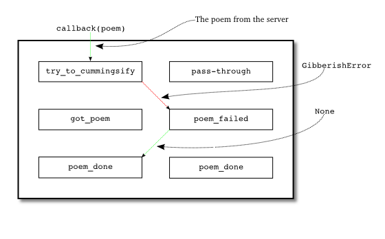
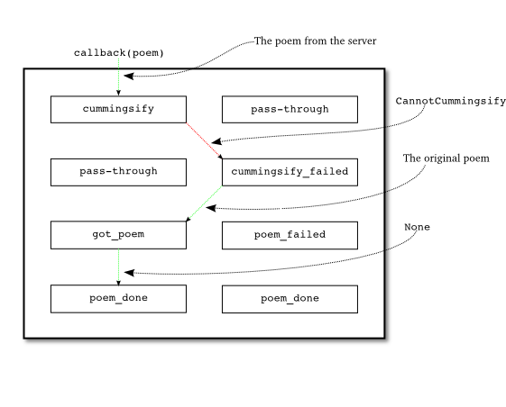

# 增强 defer 功能的客户端

### 版本 5.0

现在我们将要向诗歌下载客户端添加一些新的处理逻辑，包括在第九部分提到要添加的功能。不过，首先我要说明一点：我并不知道如何实现 Byronification 引擎。那超出了我的编程能力范围。取而代之的，我想实现一个简单的功能，即 Cummingsifier。其只是将诗歌内容转换成小写字母：

```
def cummingsify(poem)
    return poem.lower() 
```

这个方法如此之简单以至于它永远不会出错。版本 5.0 的实现代码在[twisted-client-5/get-poetry.py](http://github.com/jdavisp3/twisted-intro/blob/master/twisted-client-5/get-poetry.py#L1)文件中。我们使用了修改后的 cummingsify，其会随机地选择以下行为：

1.  返回诗歌的小写版本
2.  抛出一个 GibberishError 异常
3.  抛出一个 ValueError

这样，我们便模拟出来一个会因为各种意料不到的问题而执行失败的复杂算法。其它部分的仅有的改变在方法 poetry_main 中：

```
def poetry_main():
    addresses = parse_args()
    from twisted.internet import reactor
    poems = []
    errors = []
    def try_to_cummingsify(poem):
        try:
            return cummingsify(poem)
        except GibberishError:
            raise
        except:
            print 'Cummingsify failed!'
            return poem
    def got_poem(poem):
        print poem
        poems.append(poem)
    def poem_failed(err):
        print >>sys.stderr, 'The poem download failed.'
        errors.append(err)
    def poem_done(_):
        if len(poems) + len(errors) == len(addresses):
            reactor.stop()
    for address in addresses:
        host, port = address
        d = get_poetry(host, port)
        d.addCallback(try_to_cummingsify)
        d.addCallbacks(got_poem, poem_failed)
        d.addBoth(poem_done)
    reactor.run() 
```

因此，当从服务器上下载一首诗歌时，可能会出现如下情况：

1.  打印诗歌的小写版本
2.  打印"Cummingsify failed"并附上原始形式的诗歌
3.  打印"The poem download failed"。

为了实现下面内容的效果，你可以打开多个服务器或打开一个服务器多次，直到你观察到所有不同的结果，当然也尝试一下去连接一个没有服务器值守的端口。

图 19 是我们给 deferred 添加回调后形成的 callback/errback 链：

图 19 deferred 中的回调链

注意到，"pass-throug"errback 通过 addCallback 添加到链中。它会将任何其接收到的 Failure 传递给下一个 errback（即 poem_failed 函数）。因此 poem_failed 函数可以处理来自 get_poetry 与 try_to_commingsify 两者的 failure。下面让我们来分析下 deferred 可能会出现的激活情况，图 20 说明了我们能够下载到诗歌并且 try_to_commingsify 成功执行的路线图：

图 20 成功下载到诗歌并且成功变换其格式

在这种情况中，没有回调执行失败，因此控制权一直在 callback 中流动。注意到 poem_done 收到的结果是 None，这是因为它并没有返回任何值。如果我们想让后续的回调都能触及到诗歌内容，只要显式地让 got_poem 返回诗歌即可。

图 21 说明了我们在成功下载到诗歌后，但在 try_to_cummingsify 中抛出了 GibberishError：

图 21 成功下载到诗歌但出现了 GibberishError

由于 try_to_cummingsify 回调抛出了 GibberishError，所以控制权转移到了 errback 链，即 poem_fail 回调被调用并传入的捕获的异常作为其参数。

由于 poem_failed 并没有抛出获异常或返回一个 Failure，因此在它执行完后，控制权又回到了 callback 链中。如果我们想让 poem_fail 完全处理好传进来的错误，那么返回一个 None 是再好不过的做法了。相反，如果我们只想让 poem_failed 采取一部分行动，但继续传递这个错误，那么我们需要改写 poem_failed，即将参数 err 作为返回值返回。如此一来，控制权交给了下一个 errback 回调。

注意到，迄今为止，got_poem 与 poem_failed 都不可能出现执行失败的情况，因此 errback 链上的 poem_done 是不可能被激活的。但在任何情况下这样做都是安全的，这体现了"防御式"编程的思想。比如在 got_poem 或 poem_failed 出现了 bugs，那么这样做就不会让这些 bugs 的影响进入 Twisted 的核心代码区。鉴于上面的描述，可以看出 addBoth 类似于 try/except 中的 finally 语句。

下面我们再来看看第三种可能情况，即成功下载到诗歌但 try_to_cummingsify 抛出了 VauleError，如图 22：

图 22 成功下载到诗歌当 cummingsify 执行失败

除了 got_poem 得到是原始式样的诗歌而不是小写版的外，与图 20 描述的情况完全相同。当然，控制权还是在 try_to_cummingsif 中进行了转移，即使用了 try/except 捕获了 ValueError 并返回了原始式样的诗歌。而这一切 deferred 并不知晓。

最后，我们来看看当试图连接一个无服务器值守的端口会出现什么情况，如图 23 所示：

图 23 连接服务器失败

由于 poem_failed 返回了一个 None，因此控权又回到了 callback 链中。

### 版本 5.1

在版本 5.0 中我们使用普通的 try/except 来捕获 try_to_cummingsify 中的异常，而没有让 deferred 来捕获这个异常。这其实并没有什么错误，但下面我们将采取一种新的方式来处理异常。

设想一下，我们让 deferred 来捕获 GibberishError 与 ValueError 异常，并将其传递到 errback 链中进行处理。如果要保留原有的行为，那么需要下面的 errback 来判断错误类型是否为 Valuerror，如果是，那么返回原始式样的诗歌，这样一来，控制权再次回到 callback 链中并将原始式样的诗歌打印出来。

但有一个问题：errback 并不会得到原始诗歌内容 。它只会得到由 cummingsify 抛出的 vauleError 异常。为了让 errback 处理这个错误，我们需要重新设计它来接收到原始式样的诗歌。

一种方法是改变 cummingsify 以让异常信息中包含原始式样的诗歌。这也正是我们在 5.1 版本中做的，其代码实现在[twisted-client-5/get-poetry-1.py](http://github.com/jdavisp3/twisted-intro/blob/master/twisted-client-5/get-poetry-1.py)中。我们改写 ValueError 异常为 CannotCummingsify 异常，其能将诗歌作为其第一个参数来传递。

如果 cummingsify 是外部模块中一个真实存在的函数，那么其最好是通过另一个函数来捕获非 GibberishError 并抛出一个 CannotCummingsify 异常。这样，我们的 poetry_main 就成为：

```
def poetry_main():
    addresses = parse_args()
    from twisted.internet import reactor
    poems = []
    errors = []
    def cummingsify_failed(err):
        if err.check(CannotCummingsify):
            print 'Cummingsify failed!'
            return err.value.args[0]
        return err
    def got_poem(poem):
        print poem
        poems.append(poem)
    def poem_failed(err):
        print >>sys.stderr, 'The poem download failed.'
        errors.append(err)
    def poem_done(_):
        if len(poems) + len(errors) == len(addresses):
            reactor.stop()
    for address in addresses:
        host, port = address
        d = get_poetry(host, port)
        d.addCallback(cummingsify)
        d.addErrback(cummingsify_failed)
        d.addCallbacks(got_poem, poem_failed)
        d.addBoth(poem_done) 
```

而新的 deferred 结构如图 24 所示：

图 24 版本 5.1 的 deferrd 调用链结构

来看看 cummingsify_failed 的 errback 回调：

```
def cummingsify_failed(err):
    if err.check(CannotCummingsify):
        print 'Cummingsify failed!'
        return err.value.args[0]
    return err 
```

我们使用了 Failure 中的 check 方法来确认嵌入在 Failure 中的异常是否是 CannotCummingsify 的实例。如果是，我们返回异常的第一个参数（即原始式样诗歌）。因此，这样一来返回值就不是一个 Failure 了，控制权也就又回到 callback 链中了。否则（即异常不是 CannotCummingsify 的实例），我们返回一个 Failure，即将错误传递到下一个 errback 中。

图 25 说明了当我们捕获一个 CannotCummingsify 时的调用过程：

图 25 捕获一个 CannotCummingsify 异常

因此，当我们使用 deferrd 时，可以选择使用 try/except 来捕获异常，也可以让 deferred 来将异常传递到 errback 回调链中进行处理。

### 总结

在这个部分，我们增强了客户端的 Deferred 的功能，实现了异常与结果在 callback/errback 链中"路由"。（你可以将各个回调看作成路由器，然后根据传入参数的情况来决定其返回值进入下一个 stage 的哪条链，或者说控制权进入下一个 stage 的哪个类型的回调）。虽然示例程序是虚构出来的，但它揭示了控制权在 deferred 的回调链中交错传递具体方向依赖于返回值的类型。

那我们是不是已经对 deferred 无所不知了？不，我们还会在下面的部分继续讲解 deferred 的更多的功能。但在第十一部分，我们先不讲这部分内容，而是实现我们的 Twisted 版本的诗歌下载服务器。

### 参考

本部分原作参见: dave @ [`krondo.com/?p=1956`](http://krondo.com/?p=1956)

本部分翻译内容参见杨晓伟的博客 [`blog.sina.com.cn/s/blog_704b6af70100q87q.html`](http://blog.sina.com.cn/s/blog_704b6af70100q87q.html)