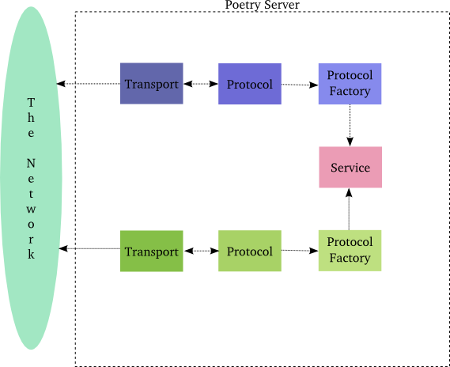

# 改进诗歌下载服务器

### 新的服务器实现

这里我们要新写一个 Twisted 版的服务器。然后，再来讨论一些 Deferred 的新功能。

在第九、十部分，我们提出了诗歌转换引擎这个概念。由于实现太过简单，因此我们用随机选择来模拟了可能会出现的转换失败的情景。但如果转换引擎位于服务器端，那么当服务器宕机就会出现真实的转换失败的情景了。

因此，在本节我们要实现一个诗歌样式转换服务器，然后在下一节，我们会重写诗歌下载客户端使用这一服务来学习 Deferred 的新功能。

### 设计协议

到目前为止，服务器端与客户端之间的交互都是单向的。但样式转换服务需要两者进行双向交互-客户端将原始式样的诗歌发送给服务器，然后服务器转换格式并将其返回给对应的客户端。因此，我们需要使用或自己实现一个协议来实现这种交互。

我们设计服务器端可以提供若干种转换服务，让客户端来进行选择。因此客户端需要向服务器端发送两部分信息：转换方式与诗歌原始内容。服务器只是将转换格式之后的诗歌发送给客户端。这里使用到了简单的[运程调用](http://en.wikipedia.org/wiki/Remote_procedure_call)。

Twisted 支持若干种能解决这个问题的协议：XML-RPC, Perspective Broker, AMP。

但介绍使用其中任何一种都需要大量的时间，因此我们使用自己实现的协议。我们约定客户端发送内容格式如下：

> **转换方式.诗歌内容**

我们将其以[netstring](http://en.wikipedia.org/wiki/Netstrings)格式编码，当然服务器回发的信息也是以 netstring 格式编码。由于 netstring 使用了 length-encoding，因此客户端能够识别出服务器没有将完整诗歌回发的情况。如果你尝试一下会发现，之前的协议无法检测到中途中断传输的情况。

### 代码

新的服务器实现代码在[twisted-server-1/transformedpoetry.py](http://github.com/jdavisp3/twisted-intro/blob/master/twisted-server-1/transformedpoetry.py#L1)中。首先，我们定义了一个 TransformService 类：

```py
class TransformService(object):
    def cummingsify(self, poem):
        return poem.lower() 
```

这里我们仅仅实现了一种转换方法(与转换方式同名)，我们可以通过添加方法支持更多转换方式。有一个重要的地方需要注意：格式转换服务与具体协议的实现是完全分离的。将协议逻辑与服务逻辑分开是 Twisted 编程中常见的模式。这样做可以通过多种协议实现同一种服务，以增加代码的重用性。

下面看看 factory 的实现代码：

```py
class TransformFactory(ServerFactory):
    protocol = TransformProtocol
    def __init__(self, service):
        self.service = service
    def transform(self, xform_name, poem):
        thunk = getattr(self, 'xform_%s' % (xform_name,), None)
        if thunk is None: # no such transform
            return None
        try:
            return thunk(poem)
        except:
            return None # transform failed
    def xform_cummingsify(self, poem):
        return self.service.cummingsify(poem) 
```

factory 提供了一个 transform 的函数，protocol 就是用它来处理客户端连接发送的诗歌格式转换请求的。

如果发现不存在客户端请求的转换方式或转换失败，那么返回 None。和 TransformService 一样，factory 与具体的协议逻辑实现也是相互独立的。

有一个地方需要引起注意：我们通过 xfomr_ 前缀式方法来获取服务方法。这种方法在 Twisted 中很常见，尽管前缀经常发生变化，并且他们经常是依赖独立于 factory 的一个对象（如此处的 TransformService）。考虑到客户端可以发送任意的 transform 方法名，这是一种防止客户端蓄意使用恶性代码来让服务器端执行的方法。这种方法也提供了实现由服务提供具体协议代理的机制。

下面是协议实现代码：

```py
class TransformProtocol(NetstringReceiver):
    def stringReceived(self, request):
        if '.' not in request: # bad request
            self.transport.loseConnection()
            return
        xform_name, poem = request.split('.', 1)
        self.xformRequestReceived(xform_name, poem)
    def xformRequestReceived(self, xform_name, poem):
        new_poem = self.factory.transform(xform_name, poem)
        if new_poem is not None:
            self.sendString(new_poem)
        self.transport.loseConnection() 
```

在这个协议的实现中，我们通过继承 NetstringReceiver 来利用了 Twisted 对 netstrings 的实现。基类很好的处理了编码与解码功能，我们需要做的就是实现 stringReceived 方法。换句话说，stringReceived 接收的参数是客户端编码之后的诗歌，而无需我们再去添加额外的编码信息。而且基类同样管理着缓冲区，即当一首诗歌完整接收完再进行解码。

如果一切进展正常的话，我们会使用 NetstringReceiver 的 sendString 方法来将格式转换成功后的诗歌发送给客户端。

注意我们是如何通过定义 xformRequestReceived 方法将收到的信息一步步推向更高的抽象层而实现了 Twisted 的模式。

### 一个简单的客户端

我们会在下一个部分来实现相应的客户端，这里使用一个简单的脚本来实现客户端，代码位于[twisted-server-1/transform-test](https://github.com/jdavisp3/twisted-intro/blob/master/twisted-server-1/transform-test)中。如果你运行服务器端于 11000 端口：

```py
python twisted-server-1/transformedpoetry.py --port 11000 
```

相应的运行脚本为：

```py
./twisted-server-1/transform-test 11000 
```

那么你会看到如下输出（经过 netstring 编码）：

```py
15:here is my poem, 
```

### 讨论

在这个部分介绍了如下几个方面内容：

1.  双向通信
2.  基于 Twisted 已有的协议实现新协议
3.  将协议实现与服务功能实现独立分开

双向通信的基本机制是很简单的。我们使用前面服务器端与客户端使用的相同的技术来写与读数据，唯一不同的是我们这次两者都使用了（读与写）。当然，一个复杂的协议需要复杂的代码来处理接收到的数据流与格式化输出的信息。这也是为什么使用已经存在的协议的原因。

如果你开始觉得写简单的协议已经很上手了，那么最好就开始看看 Twisted 对不同协议的实现。尽管写一些简单的协议有助理解 Twisted 的编程风格，但在一个真实的程序中，最好是复用那些已经实现并证明性能良好的协议。

最后一点是将协议解析逻辑与服务实现逻辑分开，这是 Twisted 编程中非常重要的一个模式。我们这个服务器程序只是一个演示，你可以想象一下真实的网络服务是相当复杂的。通过将服务与协议逻辑分开，你可以通过复用已有的服务代码来运行于其它的协议实现上。

图 27 展示了一个格式转换服务器通过两种协议提供格式转换服务（当然，我们的服务器只提供了一种协议）：

图 27 提供两种协议支持的格式转换服务器

虽然在图 27 中使用了两种协议，但他们也许只是几个协议属性不同而已，factory 共享同一个服务，这样就实现了代码的复用。

### 参考

本部分原作参见: dave @ [`krondo.com/?p=2101`](http://krondo.com/?p=2101)

本部分翻译内容参见杨晓伟的博客 [`blog.sina.com.cn/s/blog_704b6af70100qa5s.html`](http://blog.sina.com.cn/s/blog_704b6af70100qa5s.html)