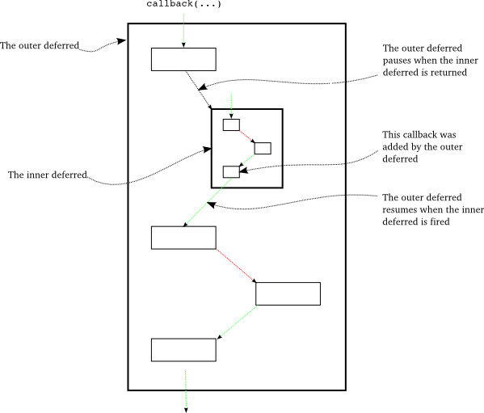
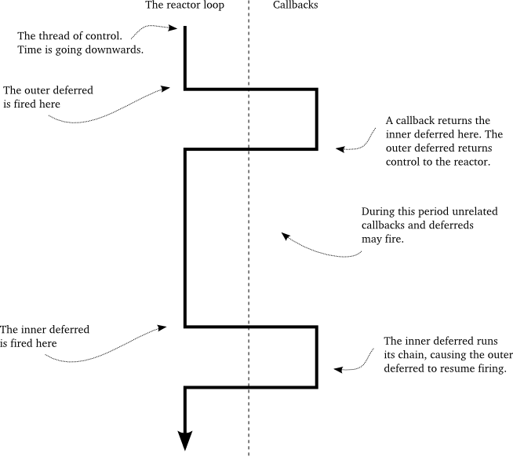

# 使用 Deferred 新功能实现新客户端

### 介绍

回忆下第 10 部分中的客户端 5.1 版。客户端使用一个 Deferred 来管理所有的回调链，其中包括一个格式转换引擎的调用。在那个版本中，这个引擎的实现是同步的。

现在我们想实现一个新的客户端，使用我们在第十二部分实现的服务器提供的格式转换服务。但这里有一个问题需要说清楚：由于格式转换服务是通过网络获取的，因此我们需要使用异步 I/O。这也就意味着我们获取格式转换服务的 API 必须是异步实现的。换句话说，try_to_cummingsify 回调将会在新客户端中返回一个 deferred。

如果在一个 deferred 的回调链中的一个函数又返回了一个 deferred 会发生什么现象呢？我们规定前一个 deferred 为外层 deferred，而后者则为内层 deferred。假设回调 N 在外层 deferred 中返回一个内层的 deferred。意味着这个回调宣称“我是一个异步函数，结果不会立即出现！”。由于外层的 deferred 需要调用回调链中下一个 callback 或 errback 并将回调 N 的结果传下去，因此，其必须等待直到内层 deferred 被激活。当然了，外层的 deferred 不可能处于阻塞状态，因为控制权此时已经转交给了 reactor 并且阻塞了。

那么外层的 deferred 如何知晓何时恢复执行呢？很简单，在内层 deferred 上添加 callback 或 errback 即可（即激活内层的 deferred）。因此，当内层 deferrd 被激活时，外层的 deferred 恢复其回调链的执行。当内层 deferred 回调执行成功，那么外层 deferred 会调用第 N+1 个 callback 回调。相反，如果内层 deferred 执行失败，那么外层 deferred 会调用第 N+1 个 errback 回调。

图 28 形象地解释说明了这一过程：

图 28 内层与外层 deferred 的交互

在这个图示中，外层的 deferred 有四个 callback/errback 对。当外围的 deferred 被激活后，其第一个 callback 回调返回了一个 deferred（即内层 deferred）。从这里开始，外层的 deferred 停止激活其回调链并且将控制权交还给了 reactor（当然是在给内层 deferred 添加 callback/errback 之后）。过了一段时间之后，内层 deferred 被激活，然后执行它的回调链并执行完毕后恢复外层 deferred 的回调执行过程。注意到，外层 deferred 是无法激活内层 deferred 的。这是不可能的，因为外层的 deferred 根本就无法获知内层的 deferred 何时能把结果准备好及结果内容是什么。相反，外层的 deferred 只可能等待（当然是异步方式）内部 deferred 的激活。

注意到外层 deferred 的产生内层 deferred 的回调的连线是黑色的而不是红色或蓝色，这是因为我们在内层 deferred 激活之前是无法获知此回调返回的结果是执行成功还执行失败。只有在内层 deferred 激活时，我们才能决定下一个回调是 callback 还是 errback。

图 29 从 reactor 的角度来说明了外层与内层 deferred 的执行序列：

图 29 控制权的转换

这也许是 Deferred 类最为复杂的功能，但无需担心你可能会花费大量时间来理解它。我们将在示例[twisted-deferred/defer-10.py](http://github.com/jdavisp3/twisted-intro/blob/master/twisted-deferred/defer-10.py)中说明如何使用它。这个例子中，我们创建了两个外层 deferred，一个使用了简单的回调，另一个其中的一个回调返回了一个内部 deferred。通过阅读这段代码，我们可以发现外层 deferred 是在内层 deferred 激活后才开始继续执行回调链的。

### 客户端版本 6.0

我们将使用新学的 deferred 嵌套来重写我们的客户端来使用由服务器提供的样式转换服务。其实现代码在[twisted-client-6/get-poetry.py](http://github.com/jdavisp3/twisted-intro/blob/master/twisted-client-6/get-poetry.py)中。与前几个版本一样，协议与工厂都没有改变。但我们添加了进行格式转换服务请求的协议与工厂实现。下面是协议实现代码：

```py
class TransformClientProtocol(NetstringReceiver):
    def connectionMade(self):
        self.sendRequest(self.factory.xform_name, self.factory.poem)
    def sendRequest(self, xform_name, poem):
        self.sendString(xform_name + '.' + poem)
    def stringReceived(self, s):
        self.transport.loseConnection()
        self.poemReceived(s)
    def poemReceived(self, poem):
        self.factory.handlePoem(poem) 
```

使用 NetstringReceiver 作为基类可以很简单地实现我们的协议。只要连接一旦建立我们就发出格式转换服务的请求。当我们得到格式转换之后的诗歌后交给工厂进行处理，下面是工厂代码：

```py
class TransformClientFactory(ClientFactory):
    protocol = TransformClientProtocol
    def __init__(self, xform_name, poem):
        self.xform_name = xform_name
        self.poem = poem
        self.deferred = defer.Deferred()
    def handlePoem(self, poem):
        d, self.deferred = self.deferred, None
        d.callback(poem)
    def clientConnectionLost(self, _, reason):
        if self.deferred is not None:
            d, self.deferred = self.deferred, None
            d.errback(reason)
    clientConnectionFailed = clientConnectionLost 
```

值得注意的是，工厂是如何处理这两种类型错误：连接失败和诗歌未全部接收就中断连接。clientConncetionLost 可能会在我们已经接收完诗歌后激活执行（即连接断开了），但在这种情况下，self.deferred 已经是个 None 值，这得益于 handePoem 中对 deferredr 处理。

这个工厂创建了一个 deferred 并且最后激活了它，这在 Twisted 编程中是一个好的习惯，即

> **通常情况下，一个对象创建了一个 deferred，那么它应当负责激活它。**

除了格式转换工厂外，还有一个 Proxy 类包装了具体创建一个 TCP 连接到格式转换服务器：

```py
class TransformProxy(object):
    """
    I proxy requests to a transformation service.
    """
    def __init__(self, host, port):
        self.host = host
        self.port = port
    def xform(self, xform_name, poem):
        factory = TransformClientFactory(xform_name, poem)
        from twisted.internet import reactor
        reactor.connectTCP(self.host, self.port, factory)
        return factory.deferred 
```

这个类提供了一个 xform 接口，以让其它程序请求格式转换服务。这样一来其它代码只需要提出请求并得到一个 deferred，而无需考虑什么端口与 IP 地址之类的问题。

剩下的代码除了 try_to_cummingsify 外都没有改变：

```py
def try_to_cummingsify(poem):
    d = proxy.xform('cummingsify', poem)
    def fail(err):
        print >>sys.stderr, 'Cummingsify failed!'
        return poem
    return d.addErrback(fail) 
```

这个作为外层 deferred 的回调返回了一个内层的 deferred，main 函数除了修改创建一个 Proxy 对象这个地方，其他地方都不需要修改。由于 try_to_cummingsify 已经是 deferred 回调链中的一部分，因此其早已使用了异步方式， 这里无需更改。

你可能注意到 return d.addErrback(fail)这句，其等价于

```py
d.addErrback(fail)
return d 
```

### 测试客户端

新版客户端的启动和老版的稍微有点不同，如果有 1 个带诗歌转换服务的服务器运行 10001 端口，2 个诗歌下载服务器分别运行在 10002 和 10003 端口， 你可以这样启动客户端：

```py
python twisted-client-6/get-poetry.py 10001 10002 10003 
```

它会从诗歌下载服务器下载 2 首诗歌，然后通过诗歌转换服务器转换它们。你可以这样启动诗歌转换服务器：

```py
python twisted-server-1/transformedpoetry.py --port 10001 
```

启动 2 个诗歌下载服务器：

```py
python twisted-server-1/fastpoetry.py --port 10002 poetry/fascination.txt
python twisted-server-1/fastpoetry.py --port 10003 poetry/science.txt 
```

现在就可以像上面一样运行诗歌客户端了。下面你可以尝试这样的场景， 让诗歌转换服务器崩掉， 然后用同样的命令再次运行诗歌客户端。

### 结束语

这一部分我们学习了关于 deferred 如何透明地在完成了内部(deferred)回调链后继续处理的过程。并由此，我们可以无需考虑内部实现细节并放心地在外部 deferred 上添加回调。

在第十四部分，我们将讲解 deferred 的另外一个特性。

### 参考

本部分原作参见: dave @ [`krondo.com/?p=2159`](http://krondo.com/?p=2159)

本部分翻译内容参见杨晓伟的博客 [`blog.sina.com.cn/s/blog_704b6af70100qay3.html`](http://blog.sina.com.cn/s/blog_704b6af70100qay3.html)