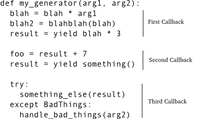
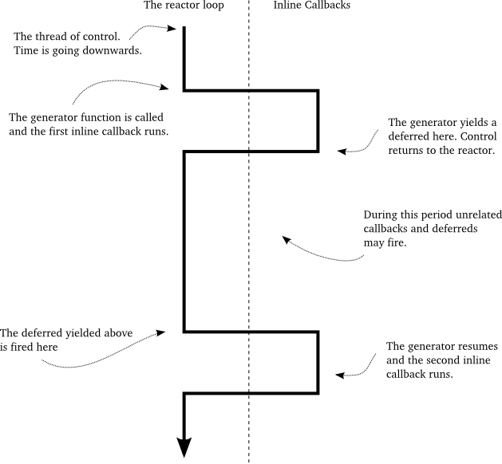

# 构造"回调"的另一种方法

### 简介

这部分我们将回到"回调"这个主题.我们将介绍另外一种写回调函数的方法,即在 Twisted 中使用 [generators](http://docs.python.org/tutorial/classes.html#generators). 我们将演示如何使用这种方法并且与使用"纯" `Deferreds` 进行对比. 最后, 我们将使用这种技术重写诗歌客户端. 但首先我们来回顾一下 `generators` 的工作原理,以便弄清楚它为何是创建回调的候选方法.

### 简要回顾生成器

你可能知道, 一个 Python 生成器是一个"可重启的函数",它是在函数体中用 `yield` 语句创建的. 这样做可以使这个函数变成一个"生成器函数",它返回一个"[iterator](http://docs.python.org/tutorial/classes.html#iterators)"可以用来以一系列步骤运行这个函数. 每次迭代循环都会重启这个函数,继续执行到下一个 `yield` 语句.

生成器(和迭代器)通常被用来代表以惰性方式创建的值序列. 看一下以下文件中的代码 [inline-callbacks/gen-1.py](https://github.com/jdavisp3/twisted-intro/blob/master/inline-callbacks/gen-1.py#L1):

```py
def my_generator():
    print 'starting up'
    yield 1
    print "workin'"
    yield 2
    print "still workin'"
    yield 3
    print 'done'

for n in my_generator():
    print n 
```

这里我们用生成器创建了 1,2,3 序列. 如果你运行这些代码,会看到在生成器上做迭代时,生成器中的 `print` 与循环语句中的 `print` 语句交错出现.

以下自定义迭代器代码使上面的说法更加明显([inline-callbacks/gen-2.py](https://github.com/jdavisp3/twisted-intro/blob/master/inline-callbacks/gen-2.py#L1)):

```py
def my_generator():
    print 'starting up'
    yield 1
    print "workin'"
    yield 2
    print "still workin'"
    yield 3
    print 'done'

gen = my_generator()

while True:
    try:
        n = gen.next()
    except StopIteration:
        break
    else:
        print n 
```

把它视作一个序列,生成器仅仅是获取连续值的一个对象.但我们也可以以生成器本身的角度看问题:

1.  生成器函数在被循环调用之前并没有执行(使用 `next` 方法).
2.  一旦生成器开始运行,它将一直执行直到返回"循环"(使用 `yield`)
3.  当循环中运行其他代码时(如 `print` 语句),生成器则没有运行.
4.  当生成器运行时, 则循环没有运行(等待生成器返回前它被"阻滞"了).
5.  一旦生成器将控制交还到循环,再启动可能需要等待任意时间(其间任意量的代码可能被执行).

这与异步系统中的回调工作方式非常类似. 我们可以把 `while` 循环视作 `reactor`, 把生成器视作一系列由 `yield` 语句分隔的回调函数. 有趣的是, 所有的回调分享相同的局部变量名空间, 而且名空间在不同回调中保持一致.

进一步,你可以一次激活多个生成器(参考例子 [inline-callbacks/gen-3.py](https://github.com/jdavisp3/twisted-intro/blob/master/inline-callbacks/gen-3.py#L1)),使得它们的"回调"互相交错,就像在 Twisted 系统中独立运行的异步程序.

然而,这种方法还是有一些欠缺.回调不仅仅被 `reactor` 调用, 它还能接受信息.作为 `deferred` 链的一部分,回调要么接收 Python 值形式的一个结果,要么接收 `Failure` 形式的一个错误.

从 Python2.5 开始,生成器功能被扩展了.当你再次启动生成器时,可以给它发送信息,如 [inline-callbacks/gen-4.py](https://github.com/jdavisp3/twisted-intro/blob/master/inline-callbacks/gen-4.py#L1) 所示:

```py
class Malfunction(Exception):
    pass

def my_generator():
    print 'starting up'

    val = yield 1
        print 'got:', val

    val = yield 2
        print 'got:', val

    try:
        yield 3
    except Malfunction:
        print 'malfunction!'

    yield 4

    print 'done'

gen = my_generator()

print gen.next() # start the generator
print gen.send(10) # send the value 10
print gen.send(20) # send the value 20
print gen.throw(Malfunction()) # raise an exception inside the generator

try:
    gen.next()
except StopIteration:
    pass 
```

在 Python2.5 以后的版本中, `yield` 语句是一个计算值的表达式.重新启动生成器的代码可以使用 `send` 方法代替 `next` 决定它的值(如果使用 `next` 则值为 `None`), 而且你还可以在迭代器内部使用 `throw` 方法抛出任何异常. 是不是很酷?

### 内联回调

根据我们刚刚回顾的可以向生成器发送值或抛出异常的特性,可以设想它是像 `deferred` 中的一系列回调,即可以接收结果或错误. 每个回调被 `yield` 分隔,每一个 `yield` 表达式的值是下一个回调的结果(或者 `yield` 抛出异常表示错误).图 35 显示相应概念:

图 35 作为回调序列的生成器

现在一系列回调以 `deferred` 方式被链接在一起,每个回调从它前面的回调接收结果.生成器很容易做到这一点——当再次启动生成器时,仅仅使用 `send` 发送上一次调用生成器的结果( `yield` 产生的值).但这看起来有点笨,既然生成器从开始就计算这个值,为什么还需要把它发送回来? 生成器可以将这个值储存在一个变量中供下一次使用. 因此这到底是为什么呢?

回忆一下我们在第十三节中所学, `deferred` 中的回调还可以返回 `deferred` 本身. 在这种情况下, 外层的 `deferred` 先暂停等待内层的 `deferred` 激发,接下来外层 `deferred` 链使用内层 `deferred` 的返回结果(或错误)激发后续的回调(或错误回调).

所以设想我们的生成器生成一个 `deferred` 对象而不是一个普通的 Python 值. 这时生成器会自动"暂停";生成器总是在每个 `yield` 语句后暂停直到被显示的重启.因而我们可以延迟它的重启直到 `deferred` 被激发, 届时我们会使用 `send` 方法发送值(如果 `deferred` 成功)或者抛出异常(如果 `deferred` 失败).这就使我们的生成器成为一个真正的异步回调序列,这正是 [twisted.internet.defer](http://twistedmatrix.com/trac/browser/tags/releases/twisted-10.1.0/twisted/internet/defer.py) 中 [inlineCallbacks](http://twistedmatrix.com/trac/browser/tags/releases/twisted-10.1.0/twisted/internet/defer.py#L973) 函数背后的概念.

### 进一步讨论内联回调

考虑以下例程, 位于 [inline-callbacks/inline-callbacks-1.py](https://github.com/jdavisp3/twisted-intro/blob/master/inline-callbacks/inline-callbacks-1.py#L1):

```py
from twisted.internet.defer import inlineCallbacks, Deferred

@inlineCallbacks
def my_callbacks():
    from twisted.internet import reactor

    print 'first callback'
    result = yield 1 # yielded values that aren't deferred come right back

    print 'second callback got', result
    d = Deferred()
    reactor.callLater(5, d.callback, 2)
    result = yield d # yielded deferreds will pause the generator

    print 'third callback got', result # the result of the deferred

    d = Deferred()
    reactor.callLater(5, d.errback, Exception(3))

    try:
        yield d
    except Exception, e:
        result = e

    print 'fourth callback got', repr(result) # the exception from the deferred

    reactor.stop()

from twisted.internet import reactor
reactor.callWhenRunning(my_callbacks)
reactor.run() 
```

运行这个例子可以看到生成器运行到最后并终止了 `reactor`, 这个例子展示了 `inlineCallbacks` 函数的很多方面.

首先, `inlineCallbacks` 是一个修饰器,它总是修饰生成器函数,如那些使用 `yield` 语句的函数. `inlineCallbacks` 唯一的目的是将一个生成器按照上述策略转化为一系列异步回调.

第二,当我们调用一个用 `inlineCallbacks` 修饰的函数时,不需要自己调用 `send` 或 `throw` 方法.修饰符会帮助我们处理细节,并确保生成器运行到结束(假设它不抛出异常).

第三,如果我们从生成器生成一个非延迟值,它将以 `yield` 生成的值立即重启.

最后,如果我们从生成器生成一个 `deferred`,它不会重启除非此 `deferred` 被激发.如果 `deferred` 成功返回,则 `yield` 的结果就是 `deferred` 的结果.如果 `deferred` 失败了,则 `yield` 会抛出异常. 注意这个异常仅仅是一个普通的 `Exception` 对象,而不是 `Failure`,我们可以在 `yield` 外面用 `try/except` 块捕获它们.

在上面的例子中,我们仅用 `callLater` 在一小段时间之后去激发 `deferred`.虽然这是一种将非阻塞延迟放入回调链的实用方法,但通常我们会生成一个 `deferred`,它是被生成器中其他的异步操作(如 `get_poetry`)返回的.

OK,现在我们知道了 `inlineCallbacks` 修饰的函数是如何运行的,但当你实际调用时会返回什么值呢?正如你认为的,将得到 `deferred`.由于不能确切地知道生成器何时停止(它可能生成一个或多个 `deferred`),装饰函数本身是异步的,所以 `deferred` 是一个合适的返回值.注意这个 返回的`deferred` 并不是生成器中 `yield` 生成的 `deferred`.相反,它在生成器完全结束(或抛出异常)后才被激发.

如果生成器抛出一个异常,那么返回的 `deferred` 将激发它的错误回调链,把异常包含在一个 `Failure` 中. 但是如果我们希望生成器返回一个正常值,必须使用 `defer.returnValue` 函数. 像普通 `return` 语句一样,它也会终止生成器(实际会抛出一个特殊异常).例子 [inline-callbacks/inline-callbacks-2.py](https://github.com/jdavisp3/twisted-intro/blob/master/inline-callbacks/inline-callbacks-2.py#L1) 说明了这两种可能.

### 客户端 7.0

让我们在新版本的诗歌客户端中加入 `inlineCallbacks`,你可以在 [twisted-client-7/get-poetry.py](https://github.com/jdavisp3/twisted-intro/blob/master/twisted-client-7/get-poetry.py#L1) 中查看源代码.也许你需要与客户端 6.0—— [twisted-client-6/get-poetry.py](https://github.com/jdavisp3/twisted-intro/blob/master/twisted-client-6/get-poetry.py#L151) 进行对比,它们的不同位于 [poetry_main](https://github.com/jdavisp3/twisted-intro/blob/master/twisted-client-7/get-poetry.py#L151):

```py
def poetry_main():
    addresses = parse_args()

    xform_addr = addresses.pop(0)

    proxy = TransformProxy(*xform_addr)

    from twisted.internet import reactor

    results = []

 @defer.inlineCallbacks
    def get_transformed_poem(host, port):
        try:
            poem = yield get_poetry(host, port)
        except Exception, e:
            print >>sys.stderr, 'The poem download failed:', e
            raise

    try:
        poem = yield proxy.xform('cummingsify', poem)
    except Exception:
        print >>sys.stderr, 'Cummingsify failed!'

    defer.returnValue(poem)

   def got_poem(poem):
       print poem

   def poem_done(_):
       results.append(_)
       if len(results) == len(addresses):
          reactor.stop()

   for address in addresses:
       host, port = address
       d = get_transformed_poem(host, port)
       d.addCallbacks(got_poem)
       d.addBoth(poem_done)

   reactor.run() 
```

在这个新版本里, `inlineCallbacks` 生成函数 `get_transformed_poem` 负责取回诗歌并且进行转换(通过转换服务).由于这两个操作都是异步的,我们每次生成一个 `deferred` 并且隐式地等待结果.与客户端 6.0 一样,如果变换失败则返回原始诗歌.我们可以使用 `try/except` 语句捕获生成器中的异步错误.

我们以先前的方式测试新版客户端. 首先启动一个变换服务:

```py
python twisted-server-1/tranformedpoetry.py --port 10001 
```

然后启动两个诗歌服务器:

```py
python twisted-server-1/fastpoetry.py --port 10002 poetry/fascination.txt
python twisted-server-1/fastpoetry.py --port 10003 poetry/science.txt 
```

现在可以运行新的客户端:

```py
python twisted-client-7/get-poetry.py 10001 10002 10003 
```

试试关闭一个或多个服务器,看一看客户端如何捕获错误.

### 讨论

就像 `Deferred` 对象, `inlineCallbacks` 函数给我们一种组织异步回调的新方式.使用 `deferred`, `inllineCallbacks` 并不会改变游戏规则.我们的回调仍然一次调用一个回调,它们仍然被 `reactor` 调用.我们可以通过打印内联回调的回溯堆栈信息来证实这一点,参见脚本 [inline-callbacks/inline-callbacks-tb.py](https://github.com/jdavisp3/twisted-intro/blob/master/inline-callbacks/inline-callbacks-tb.py#L1).运行此代码你将首先获得一个关于 `reactor.run()` 的回溯,然后是许多帮助函数信息,最后是我们的回调.

图 29 解释了当 `deferred` 中一个回调返回另一个 `deferred` 时会发生什么,我们调整它来展示当一个 `inlineCallbacks` 生成器生成一个 `deferred` 时会发生什么,参考图 36:

图 36 inlineCallbacks 函数中的控制流

同样的图对两种情况都适用,因为它们表示的想法都是一样的 —— 一个异步操作正在等待另一个操作.

由于 `inlineCallbacks` 和 `deferred` 解决许多相同的问题,在它们之间如何选择呢?下面列出一些 `inlineCallbacks` 的潜在优势.

*   由于回调共享同一个命名空间,因此没有必要传递额外状态.
*   回调的顺序很容易看到,因为它总是从上到下执行.
*   节省了每个回调函数的声明和隐式控制流,通常可以减少输入工作量.
*   可以使用熟悉的 `try/except` 语句处理错误.

当然也存在一些缺陷:

*   生成器中的回调不能被单独调用,这使代码重用比较困难.而构造 `deferred` 的代码则能够以任意顺序自由地添加任何回调.
*   生成器的紧致性可能混淆一个事实,其实异步回调非常晦涩.尽管生成器看起来像一个普通的函数序列,但是它的行为却非常不一样. `inlineCallbacks` 函数不是一种避免学习异步编程模型的方式.

就像任何技术,实践将积累出必要的经验,帮你做出明智选择.

### 总结

在这个部分,我们学习了 `inlineCallbacks` 装饰器以及它怎样使我们能够以 Python 生成器的形式表达一系列异步回调.

在第十八节中,我们将学习一种管理 **一组** "并行"异步操作的技术.

### 参考练习

1.  为什么 `inlineCallbacks` 函数是复数(形式)?
2.  研究 [inlineCallbacks](http://twistedmatrix.com/trac/browser/tags/releases/twisted-10.1.0/twisted/internet/defer.py#973) 的实现以及它们帮助函数 [_inlineCallbacks](http://twistedmatrix.com/trac/browser/tags/releases/twisted-10.1.0/twisted/internet/defer.py#L874). 并思考短语"魔鬼在细节处".
3.  有 N 个 `yield` 语句的生成器中包含多少个回调,假设其中没有循环或者 `if` 语句?
4.  诗歌客户端 7.0 可能同时运行三个生成器.概念上,它们之间有多少种不同的交错方式?考虑诗歌客户端和 `inlineCallbacks` 的实现,你认为实际有多少种可能?
5.  把客户端 7.0 中的 `got_poem` 放入到生成器中.
6.  把 `poem_done` 回调放入生成器.小心!确保处理所有失败情况以便无论怎样 `reactor` 都会关闭.与使用 `deferred` 关闭 `reactor` 对比代码有何不同?
7.  一个在 `while` 循环中使用 `yield` 语句的生成器代表一个概念上的无限序列.那么同样的装饰有 `inlineCallbacks` 的生成器又代表什么呢?

### 参考

本部分原作参见: dave @ [`krondo.com/blog/?p=2441`](http://krondo.com/blog/?p=2441)

本部分翻译内容参见 luocheng @ [`github.com/luocheng/twisted-intro-cn/blob/master/p17.rst`](https://github.com/luocheng/twisted-intro-cn/blob/master/p17.rst)