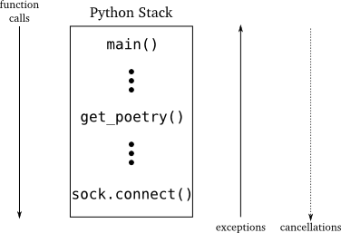
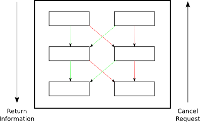

# 取消之前的意图

### 简介

Twisted 是一个正在进展的项目,它的开发者会定期添加新的特性并且扩展旧的特性.

随着 Twisted 10.1.0 发布,开发者向 `Deferred` 类添加了一个新的特性—— `cancellation` ——这正是我们今天要研究的.

异步编程将请求和响应解耦了,如此又带来一个新的可能性:在请求结果和返回结果之间,你可能决定不再需要这个结果了.考虑一下 第十四节 中的诗歌代理服务器.下面展示代理如何工作的,至少对于诗歌的第一次请求:

1.  一个对诗歌的请求来了.
2.  这个代理联系实际服务器以得到这首诗
3.  一旦这首诗完成,将其发送给原发出请求的客户端

看起来非常完美,但是如果客户端在获得诗歌之前断开了链接怎么办?也许它们先前请求 [Paradise Lost](http://www.online-literature.com/milton/paradiselost/)的全部内容,随后它们决定实际想要的是 [Kojo](http://www.toyomasu.com/haiku/#kojo)的俳句.我们的代理还在傻傻的处理前面的下载请求,而且那个缓慢的下载服务器还要等好一会.最好的策略便是关闭连接,让下载服务器回去顺觉.

回忆一下 图 15 展示了同步程序控制流的概念.在那张图中我们可以看到函数调用自上而下,异常也是自下而上.如果我们希望取消一个同步调用(这仅是假设),控制流的传递方向与函数调用的方向一致,都是从高层传向底层,如图 38 所示:

图 38 同步程序流,含假想取消操作

当然,在同步程序中这是不可能的,因为高层的代码在底层操作结束前没有恢复运行,自然也就没有什么可取消的.但是在异步程序中,高层代码在底层代码完成前具有控制权,至少具有在底层代码完成之前取消它的请求的可能性.

在 Twisted 程序中,底层请求被包含在一个 `Deferred` 对象中,你可以将其想象为一个外部异步操作的"句柄". `deferred` 中正常的信息流是向下的,从底层代码到高层代码,与同步程序中返回的信息流方向一致.从 Twisted 10.1.0 开始,高层代码可以反向发送信息 —— 它可以告诉底层代码它不再需要其结果了.如图 39:

图 39 deferred 中的信息流,包含取消

### 取消 Deferreds

让我们看一些例程,来了解下取消 `deferreds` 的实际工作原理.注意为了运行这些列子以及本部分中的其他代码,你需要安装 Twisted 10.1.0 或更高 [版本](http://twistedmatrix.com/trac/wiki/Downloads) 考虑 [deferred-cancel/defer-cancel-1.py](https://github.com/jdavisp3/twisted-intro/blob/master/deferred-cancel/defer-cancel-1.py#L1)

```
from twisted.internet import defer

def callback(res):
    print 'callback got:', res

d = defer.Deferred()
d.addCallback(callback)
d.cancel()
print 'done' 
```

伴随着新的取消特性, `Deferred` 类添加了一个名为 `cancel` 的新方法.上面代码创建了一个新的 `deferred`,添加了一个回调,然后取消了这个 `deferred` 而没有激发它.输出如下:

```
done
Unhandled error in Deferred:
Traceback (most recent call last):
Failure: twisted.internet.defer.CancelledError: 
```

OK,取消一个 `deferred` 看起来像使错误回调链运行,常规的回调根本没有被调用.同样注意到这个错误是: `twisted.internet.defer.CancelledError`,一个意味着 `deferred` 被取消的个性化异常(但请继续阅读).让我们添加一个错误回调,如 deferred-cancel/defer-cancel-2.py

```
from twisted.internet import defer

def callback(res):
    print 'callback got:', res

def errback(err):
    print 'errback got:', err

d = defer.Deferred()
d.addCallbacks(callback, errback)
d.cancel()
print 'done' 
```

得到以下输出:

```
errback got: [Failure instance: Traceback (failure with no frames): 
        <class 'twisted.internet.defer.CancelledError'>: ]
done 
```

所以我们可以'捕获'从 `cancel` 产生的错误回调,就像其他 `deferred` 错误一样.

OK,让我们试试激发 `deferred` 然后取消它,如 [deferred-cancel/defer-cancel-3.py](https://github.com/jdavisp3/twisted-intro/blob/master/deferred-cancel/defer-cancel-3.py#L1)

```
from twisted.internet import defer

def callback(res):
    print 'callback got:', res

def errback(err):
    print 'errback got:', err

d = defer.Deferred()
d.addCallbacks(callback, errback)
d.callback('result')
d.cancel()
print 'done' 
```

这里我们用常规 `callback` 方法激发 `deferred`,之后取消它.输出结果如下:

```
callback got: result
done 
```

我们的回调被调用(正如我们所预期的)之后程序正常结束,就像 `cancel` 根本没有被调用.所以取消一个已经被激发的 `deferred` 没有任何效果(但请继续阅读!).

如果我们在取消 `deferred` 之后激发它会怎样?参看 [deferred-cancel/defer-cancel-4.py](https://github.com/jdavisp3/twisted-intro/blob/master/deferred-cancel/defer-cancel-4.py#L1)

```
from twisted.internet import defer

def callback(res):
    print 'callback got:', res

def errback(err):
    print 'errback got:', err

d = defer.Deferred()
d.addCallbacks(callback, errback)
d.cancel()
d.callback('result')
print 'done' 
```

这种情况的输出如下:

```
errback got: [Failure instance: Traceback (failure with no frames): 
        <class 'twisted.internet.defer.CancelledError'>: ]
done 
```

有意思！与第二个例子的输出一样,当时没有激发 `deferred`.所以如果 `deferred` 被取消了,再激发它没有效果.但是为什么 `d.callback('result')` 没有产生错误,考虑到不能激发 `deferred` 大于一次,错误回调链为何没有运行?

再次考虑 图 39，用结果或失败激发一个 `deferred` 是底层代码的工作,然而取消 `deferred` 是高层代码的行为.激发 `deferred` 意味着"这是你的结果",然而取消 `deferred` 意味着"我不再想要这个结果了".同时记住 `cancel` 是一个新特性,所以大部分现有的 Twisted 代码并没有处理取消的操作.但是 Twisted 的开发者使我们取消 `deferred` 的想法变得有可能,甚至包括那些在 Twisted 10.1.0 之前写的代码.

为了实现以上想法, `cancel` 方法实际上做两件事:

1.  告诉 `Deferred` 对象你不想要那个结果,如果它还没有返回(如, `deferred` 没有被激发),忽略后续任何回调或错误回调的调用.
2.  同时,可选地,告诉正在产生结果的底层代码需要采取何种步骤来取消操作.

由于旧版本的 Twisted 代码会上前去激发任何已经被取消的 `deferred`, 步骤 1 确保我们的程序不会垮掉如果我们取消一个旧有库中的 `deferred`.

这意味着我们可以随心所欲地取消一个 `deferred`,同时可以确定不会得到结果如果它还没有到来(甚至那些 **将要** 到来的).但是取消 `deferred` 可能并没有取消异步操作.终止一个异步操作需要一个上下文的具体行动.你可能需要关闭网络连接,回滚数据库事务,结束子进程,等等.由于 `deferred` 仅仅是一般目的的回调组织者,它怎么知道具体要做什么当你取消它时?或者,换种说法,它怎样将 `cancel` 请求传递给首先已经创建和返回了 `deferred` 的底层代码? 和我一起说:

```
I know, with a callback! 
```

### 本质上取消 Deferreds

好吧,首先看一下 [deferred-cancel/defer-cancel-5.py](https://github.com/jdavisp3/twisted-intro/blob/master/deferred-cancel/defer-cancel-5.py#L1)

```
from twisted.internet import defer

def canceller(d):
    print "I need to cancel this deferred:", d

def callback(res):
    print 'callback got:', res

def errback(err):
    print 'errback got:', err

d = defer.Deferred(canceller) # created by lower-level code
d.addCallbacks(callback, errback) # added by higher-level code
d.cancel()
print 'done' 
```

这个例子基本上跟第二个例子相同,除了有第三个回调(`canceller`).这个回调是我们在创建 `Deferred` 的时候传递给它的,不是之后添加的.这个回调负责执行终止异步操作时所需的上下文相关的具体操作(当然,仅当 `deferred` 被实际取消). `canceller` 回调是返回 `deferred` 的底层代码的必要部分,不是接收 `deferred` 的高层代码为其自己添加的回调和错误回调.

运行这个例子将产生如下输出:

```
I need to cancel this deferred: <Deferred at 0xb7669d2cL>
errback got: [Failure instance: Traceback (failure with no frames): 
        <class 'twisted.internet.defer.CancelledError'>: ]
done 
```

正如你所看到, 不需要返回结果的 `deferred` 被传递给 `canceller` 回调.在这里我们可以做任何需要做的事情以便彻底终止异步操作.注意 `canceller` 在错误回调链激发前被调用.其实我们可以在取消回调中选择使用任何结果或错误自己激发 `deferred` (这样就会优先于 `CancelledError` 失败).这两种情况在 [deferred-cancel/defer-cancel-6.py](https://github.com/jdavisp3/twisted-intro/blob/master/deferred-cancel/defer-cancel-6.py#L1) 和 [deferred-cancel/defer-cancel-7.py](https://github.com/jdavisp3/twisted-intro/blob/master/deferred-cancel/defer-cancel-7.py#L1)中进行了说明.

在激发 `reactor` 之前先做一个简单的测试.我们将使用 `canceller` 回调创建一个 `deferred`,正常的激发它,之后取消它.你可以在 [deferred-cancel/defer-cancel-8.py](https://github.com/jdavisp3/twisted-intro/blob/master/deferred-cancel/defer-cancel-8.py#L1)中看到代码.通过检查那个脚本的输出,你将看到取消一个被激发的 `deferred` 不会调用 `canceller` 回调.这正是我们所要的,因为没什么可取消的.

我们目前看到的例子都没有实际的异步操作. 让我们构造一个调用异步操作的简单程序,之后我们将指出如何使那个操作可取消.参见代码 [deferred-cancel/defer-cancel-9.py](https://github.com/jdavisp3/twisted-intro/blob/master/deferred-cancel/defer-cancel-9.py#L1)

```
from twisted.internet.defer import Deferred

def send_poem(d):
    print 'Sending poem'
    d.callback('Once upon a midnight dreary')

def get_poem():
    """Return a poem 5 seconds later."""
    from twisted.internet import reactor
    d = Deferred()
    reactor.callLater(5, send_poem, d)
    return d

def got_poem(poem):
    print 'I got a poem:', poem

def poem_error(err):
    print 'get_poem failed:', err

def main():
    from twisted.internet import reactor
    reactor.callLater(10, reactor.stop) # stop the reactor in 10 seconds 
    d = get_poem()
    d.addCallbacks(got_poem, poem_error) 
    reactor.run() 
main() 
```

这个例子中包含了一个 `get_poem` 函数,它使用 `reactor` 的 `callLater` 方法在被调用 5 秒钟后异步地返回一首诗.主函数调用 `get_poem`,添加一个回调/错误回调对,之后启动 `reactor`.我们(同样使用 `callLater`)安排 `reactor` 在 10 秒钟之后停止.通常我们向 `deferred` 添加一个回调来实现,但你很快就会知道我们为何这样做.

运行程序(适当延迟后)产生如下输出:

```
Sending poem
I got a poem: Once upon a midnight dreary 
```

10 秒钟后程序终止.现在来试试在诗歌被发送前取消 `deferred`.只需加入以下代码在 2 秒钟后取消(在 5 秒钟延迟发送诗歌之前):

```
reactor.callLater(2, d.cancel) # cancel after 2 seconds 
```

完整的例子参见 [deferred-cancel/defer-cancel-10.py](https://github.com/jdavisp3/twisted-intro/blob/master/deferred-cancel/defer-cancel-10.py#L1)这将产生如下输出:

```
get_poem failed: [Failure instance: Traceback (failure with no frames): 
        <class 'twisted.internet.defer.CancelledError'>: ]
Sending poem 
```

这个例子清晰地展示了取消一个 `deferred` 并没有取消它背后的异步请求.2 秒钟后我们看到了错误回调输出,打印出如我们所料的 `CancelledError` 错误.但是 5 秒钟后我们看到了 `send_poem` 的输出(但是这个 `deferred` 上的回调并没有激发).

这时我们与 [deferred-cancel/defer-cancel-4.py](https://github.com/jdavisp3/twisted-intro/blob/master/deferred-cancel/defer-cancel-4.py#L1)的情况一样."取消" `deferred` 仅仅是使最终结果被忽略,但实际上并没有终止这个操作.正如我们上面所学,为了得到一个真正可取消的 `deferred`,必须在它被创建时添加一个 `cancel` 回调.

那么这个新的回调需要做什么呢? 参考一下关于 `callLater` 方法的 [文档](http://twistedmatrix.com/trac/browser/tags/releases/twisted-10.1.0/twisted/internet/interfaces.py#L556) 它的返回值是另一个实现了 `IDelayedCall` 的对象,用 `cancel` 方法我们可以阻止延迟的调用被执行.

这非常简单,更新后的代码参见 [deferred-cancel/defer-cancel-11.py](https://github.com/jdavisp3/twisted-intro/blob/master/deferred-cancel/defer-cancel-11.py#L1)所有相关变化都在 `get_poem` 函数中:

```
def get_poem():
    """Return a poem 5 seconds later."""

    def canceler(d):
        # They don't want the poem anymore, so cancel the delayed call
        delayed_call.cancel()

        # At this point we have three choices:
        #   1\. Do nothing, and the deferred will fire the errback
        #      chain with CancelledError.
        #   2\. Fire the errback chain with a different error.
        #   3\. Fire the callback chain with an alternative result.

    d = Deferred(canceler)

    from twisted.internet import reactor
    delayed_call = reactor.callLater(5, send_poem, d)

    return d 
```

在这个新版本中,我们保存 `callLater` 的返回值以便能够在 `cancel` 回调中使用. `cancel` 回调的唯一工作是调用 `delayed_call.cancel()`. 但是正如之前讨论的,我们可以选择激发自定义的 `deferred`. 最新版本的程序产生如下输出:

```
get_poem failed: [Failure instance: Traceback (failure with no frames): 
        <class 'twisted.internet.defer.CancelledError'>: ] 
```

正如你看到的, `deferred` 被取消了并且异步操作被真正地终止了(我们看不到 `send_poem` 的输出了).

### 诗歌代理 3.0

正如在简介中所讨论,诗歌代理服务器是实现取消的很好的候选者,因为这可以让我们取消诗歌下载如果事实证明没有人想要它(如客户端已经在我们发送诗歌前关闭了连接).版本 3.0 的代理位于 [twisted-server-4/poetry-proxy.py](https://github.com/jdavisp3/twisted-intro/blob/master/twisted-server-4/poetry-proxy.py#L1)实现了 `deferred` 取消. 变化首先位于 [PoetryProxyProtocol](https://github.com/jdavisp3/twisted-intro/blob/master/twisted-server-4/poetry-proxy.py#L52)

```
class PoetryProxyProtocol(Protocol):

    def connectionMade(self):
        self.deferred = self.factory.service.get_poem()
        self.deferred.addCallback(self.transport.write)
        self.deferred.addBoth(lambda r: self.transport.loseConnection())

    def connectionLost(self, reason):
        if self.deferred is not None:
            deferred, self.deferred = self.deferred, None
            deferred.cancel() # cancel the deferred if it hasn't fired 
```

你可以与 [旧版本](https://github.com/jdavisp3/twisted-intro/blob/master/twisted-server-2/poetry-proxy.py#L52)对比一下.两个主要的变化是:

1.  保存我们从 `get_poem` 得到的 `deferred`,以便之后在需要时取消它.
2.  当连接关闭时取消 `deferred`.注意当我们实际得到诗歌之后(链接最终肯定要关闭)，这个操作同样会取消 `deferred`,但正如前例所发现的,取消一个被激发的 `deferred` 不会有任何效果.

现在我们需要确保取消 `deferred` 将实际终止诗歌的下载. 所以我们需要改变 [ProxyService](https://github.com/jdavisp3/twisted-intro/blob/master/twisted-server-4/poetry-proxy.py#L105)

```
class ProxyService(object):

    poem = None # the cached poem

    def __init__(self, host, port):
        self.host = host
        self.port = port

    def get_poem(self):
        if self.poem is not None:
            print 'Using cached poem.'
            # return an already-fired deferred
            return succeed(self.poem)

        def canceler(d):
            print 'Canceling poem download.'
            factory.deferred = None
            connector.disconnect()

        print 'Fetching poem from server.'
        deferred = Deferred(canceler)
        deferred.addCallback(self.set_poem)
        factory = PoetryClientFactory(deferred)
        from twisted.internet import reactor
        connector = reactor.connectTCP(self.host, self.port, factory)
        return factory.deferred

    def set_poem(self, poem):
        self.poem = poem
        return poem 
```

同样,可以与 [旧版本](https://github.com/jdavisp3/twisted-intro/blob/master/twisted-server-2/poetry-proxy.py#100)对比一下. 这个类具有一些新的变化:

1.  我们保存 `reactor.connetTCP` 的返回值,一个 [IConnector](http://twistedmatrix.com/trac/browser/tags/releases/twisted-10.1.0/twisted/internet/interfaces.py#L24)对象.我们可以使用这个对象上的 `disconnect` 方法关闭连接.
2.  我们创建带 `canceler` 回调的 `deferred`.那个回调是一个闭包,它使用 `connector` 关闭连接. 但首先须设置 `factory.deferred` 属性为 `None`. 否则,工厂会以 "连接关闭"错误回调激发 `deferred` 而不是以 `CancelledError` 激发. 由于 `deferred` 已经被取消了, 以 `CancelledError` 激发更加合适.

你同样会注意到我们是在 `ProxyService` 中创建 `deferred` 而不是 `PoetryClientFactory`. 由于 `canceler` 回调需要获取 `IConnector` 对象, `ProxyService` 成为最方便创建 `deferred` 的地方.

同时,就像我们之前的例子, `canceler` 回调作为一个闭包实现.闭包看起来在取消回调的实现上非常有用.

让我们试试新的代理.首先启动一个慢速服务器.它需要很慢以便我们有时间取消:

```
python blocking-server/slowpoetry.py --port 10001 poetry/fascination.txt 
```

现在可以启动代理(记住你需要 Twisted 10.1.0):

```
python twisted-server-4/poetry-proxy.py --port 10000 10001 
```

现在我们可以用任何客户端从代理下载一首诗,或者仅使用 `curl`:

```
curl localhost:10000 
```

几秒钟后,按 `Ctrl-C` 停止客户端或者 `curl` 进程. 在终端运行代理你将看到如下输出:

```
Fetching poem from server.
Canceling poem download. 
```

你应该看到慢速服务器已经停止了输出打印它所发送的诗歌片段,因为我们的代理断开了链接.

你可以多次启动和停止客户端来证实每个下载每次都被取消了.但是如果你让整首诗运行完,那么代理将缓存它并且在此之后立即发送它.

### 另一个难点

以上我们曾不止一次说取消一个已经激发的 `deferred` 是没有效果的.然而,这不是十分正确.在 第十三部分 中,我们知道 `deferred` 的回调和错误回调也可能返回另一个 `deferred`.在那种情况下,原始的(外层) `deferred` 暂停执行它的回调链并且等待内层 `deferred` 激发(参见 图 28).

如此, 即使一个 `deferred` 激发了发出异步请求的高层代码,它也不能接收到结果,因为在等待内层 `deferred` 完成之前回调链暂停了. 所以当高层代码取消这个外部 `deferred` 时会发生什么情况呢? 在这种情况下,外部 `deferred` 不仅仅是取消它自己(它已经激发了);相反地,这个 `deferred` 也会取消内部的 `deferred`.

所以当你取消一个 `deferred` 时,你可能不是在取消主异步操作,而是一些其他的作为前者结果所触发的异步操作.呼!

我们可以用一个例子来说明.考虑代码 [deferred-cancel/defer-cancel-12.py](https://github.com/jdavisp3/twisted-intro/blob/master/deferred-cancel/defer-cancel-12.py#L1)

```
from twisted.internet import defer

def cancel_outer(d):
    print "outer cancel callback."

def cancel_inner(d):
        print "inner cancel callback."

def first_outer_callback(res):
    print 'first outer callback, returning inner deferred'
    return inner_d

def second_outer_callback(res):
    print 'second outer callback got:', res

def outer_errback(err):
    print 'outer errback got:', err

outer_d = defer.Deferred(cancel_outer)
inner_d = defer.Deferred(cancel_inner)

outer_d.addCallback(first_outer_callback)
outer_d.addCallbacks(second_outer_callback, outer_errback)

outer_d.callback('result')

# at this point the outer deferred has fired, but is paused
# on the inner deferred.

print 'canceling outer deferred.'
outer_d.cancel()

print 'done' 
```

在这个例子中,我们创建了两个 `deferred`, `outer` 和 `inner`,并且有一个外部回调返回内部的 `deferred`. 首先,我们激发外部 `deferred`,然后取消它. 输出结果如下:

```
first outer callback, returning inner deferred
canceling outer deferred.
inner cancel callback.
outer errback got: [Failure instance: Traceback (failure with no frames): 
    <class 'twisted.internet.defer.CancelledError'>: ]
done 
```

正如你看到的,取消外部 `deferred` 并没有使外部 `cancel` 回调被激发. 相反,它取消了内部 `deferred`,所以内部 `cancel` 回调被激发了,之后外部错误回调收到 `CancelledError` (来自内部 `deferred`).

你可能需要仔细看一看那些代码,并且做些变化看看如何影响结果.

### 讨论

取消 `deferred` 是非常有用的操作,使我们的程序避免去做不需要的工作. 然而正如我们看到的,它可能有一点点棘手.

需要明白的一个重要事实是取消一个 `deferred` 并不意味着取消了它后面的异步操作.事实上,当写这篇文章时,很多 `deferreds` 并不会被真的"取消",因为大部分 Twisted 代码写于 Twisted 10.1.0 之前并且还没有被升级.这包括很多 Twisted 本身的 APIs！检查文档或源代码去发现"取消 `deferred`"是否真的取消了背后的请求,还是仅仅忽略它.

第二个重要事实是从你的异步 APIs 返回的 `deferred` 并不一定在完整意义上可取消. 如果你希望在自己的程序中实现取消,你应该先研究一下 Twisted 源代码中的许多例子. `Cancellation` 是一个崭新的特性,所以它的模式和最好实践还在制定当中.

### 展望未来

现在我们已经学习了关于 `Deferreds` 的方方面面以及 Twisted 背后的核心概念. 这意味着我们没什么需要介绍的了,因为 Twisted 的其余部分主要包括一些特定的应用,如网络编程或异步数据库处理.故而,在 接下来两部分,我们想走点弯路,看看其他两个使用异步 I/O 的系统跟 Twisted 有何理念相似之处.之后,在尾声中,我们会总结并且建议一些帮助你继续学习 Twisted 的方法.

### 参考练习

1.  你知道你可以用多种方式拼写"`cancelled`"吗? [真的](http://mw4.m-w.com/dictionary/canceled) 这取决于你的心情.
2.  细读 [Deferred](http://twistedmatrix.com/trac/browser/tags/releases/twisted-10.1.0/twisted/internet/defer.py#L167)类的源代码,关注 `cancellation` 的实现.
3.  在 Twisted 10.1.0 的 [源码](http://twistedmatrix.com/trac/browser/tags/releases/twisted-10.1.0/)中找具有取消回调的 `deferred` 的例子.研究它们的实现.
4.  修改我们诗歌客户端中 `get_poetry` 方法返回的 `deferred`, 使其可取消.
5.  做一个基于 `reactor` 的例子展示取消外部 `deferred`,它被内层 `deferred` 暂停了.如果使用 `callLater` 你需要小心选择延迟时间,以确保外层 `deferred` 在正确的时刻被取消.
6.  找一个 Twisted 中还不支持"本质上取消操作"的异步 API,为它实现本质取消. 并向 Twisted 项目 提交一个 [补丁](http://twistedmatrix.com/trac/wiki/BasicGuideToContributingCode)不要忘记单元测试!

### 参考

本部分原作参见: dave @ [`krondo.com/blog/?p=2601`](http://krondo.com/blog/?p=2601)

本部分翻译内容参见 luocheng @ [`github.com/luocheng/twisted-intro-cn/blob/master/p19.rst`](https://github.com/luocheng/twisted-intro-cn/blob/master/p19.rst)