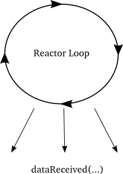
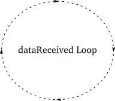
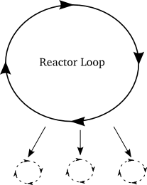
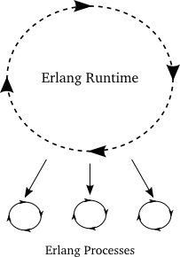
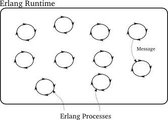
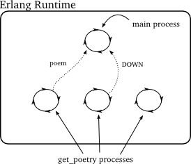

# 轮子内的轮子: Twisted 和 Erlang

### 简介

在这个系列中,有一个事实我们还没有介绍,即混合同步的"普通 Python"代码与异步 Twisted 代码不是一个简单的工作,因为在 Twisted 程序中阻滞不定时间将使异步模型的优势丧失殆尽.

如果你是初次接触异步编程,那么你得到的知识看起来有一些局限.你可以在 Twisted 框架内使用这些新技术,而不是在更广阔的一般 Python 代码世界中.同时,当用 Twisted 工作时,你仅仅局限于那些专门为了作为 Twisted 程序一部分所写的库,至少如果你想直接从 `reactor` 线程调用它们的时候.

但是异步编程技术已经存在了很多年并且几乎不局限于 Twisted.其实仅在 Python 中就有令人吃惊数量的异步编程模型. [搜索](http://www.google.com.hk/search?q=python+async+frameworks) 一下就会看到很多. 它们在细节方面不同于 Twisted,但是基本的思想(如异步 I/O,将大规模数据流分割为小块处理)是一样的.所以如果你需要,或者选择,使用一个不同的框架,你将会因为学习了 Twisted 而具备一个很好的开端.

当我们移步 Python 之外,同样会发现很多语言和系统基于或者使用异步编程模型.你在 Twisted 学习到的知识将继续为你在异步编程方面开拓更广阔的领域而服务.

在这个部分,我们将简单地看一看 [Erlang](http://www.erlang.org/),一种编程语言和运行时系统,它以一种独特的方式广泛使用异步编程概念.请注意我们不是要开始写 `Erlang 入门`.而是稍稍探索一下 Erlang 中包含的一些思想,看看这些与 Twisted 思想的联系.基本主题就是你通过学习 Twisted 得到的知识可以应用到学习其他技术.

### 回顾回调

考虑 图 6 ,回调的图形表示. 是 第六部分 中介绍的 [诗歌代理 3.0](https://github.com/jdavisp3/twisted-intro/blob/master/twisted-client-3/get-poetry.py#L1) 的回调和 [dataReceived](https://github.com/jdavisp3/twisted-intro/blob/master/twisted-client-3/get-poetry.py#L56) 方法中的顺序诗歌客户端的原理. 每次从一个相连的诗歌服务器下载一小部分诗歌时将激发回调.

假设我们的客户端从 3 个不同的服务器下载 3 首诗.以 `reactor` 的角度看问题(这是在这个系列中一直主张的),我们得到一个单一的大循环,当每次轮询时激发一个或多个回调,如图 40:

图 40 以 reactor 角度的回调

此图显示了 `reactor` 欢快地运转,每次诗歌到来时它调用 `dataReceived`. 每次 `dataReceived` 调用应用于一个特定的 `PoetryProtocal` 类实例. 我们知道一共有 3 个实例因为我们正在下载 3 首诗(所以必须有 3 个连接).

以一个 Protocol 实例的角度考虑这张图.记住每个 Protocol 只有一个连接(一首诗). 这个实例可“看到”一个方法调用流,每个方法接收着诗歌的下一部分,如下:

```py
dataReceived(self, "When I have fears")
dataReceived(self, " that I may cease to be")
dataReceived(self, "Before my pen has glea")
dataReceived(self, "n'd my teeming brain")
... 
```

然而这不是严格意义上的 Python 循环,我们可以将其概念化为一个循环:

```py
for data in poetry_stream(): # pseudo-code
    dataReceived(data) 
```

我们可以设想"回调循环",如图 41:

图 41 一个虚拟回调循环

当然这不是一个 `for` 循环或 `while` 循环. 在我们诗歌客户端中唯一重要的 Python 循环是 `reactor`. 但是我们可以把每个 Protocol 视作一个虚拟循环,当有诗歌到来时它会启动循环. 根据这种想法, 我们可以用图 42 重构整个客户端:

图 42 reactor 转动虚拟循环

在这张图中,有一个大循环 —— `reactor` 和三个虚拟循环 —— 诗歌协议实例个体.大循环转起来,如此,使得虚拟循环也转起来了,就像一组环环相扣的齿轮.

### 进入 Erlang

[Erlang](http://www.erlang.org/),与 Python 一样,源自一种八十年代创建的一般目的动态类型的编程语言.不像 Python,Erlang 是功能型的而不是面向对象的,并且在句法上类似怀旧的 [Prolog](http://en.wikipedia.org/wiki/Prolog), Erlang 最初就是由其实现的. Erlang 被设计为建立高度可靠的分布式电话系统,因此 Erlang 包含广泛的网络支持.

Erlang 的一个最独特的特性是一个涉及轻量级进程的并发模型. 一个 Erlang 进程既不是一个操作系统进程也不是线程.它是在 Erlang 运行环境中一个独立运行的函数,它有自己的堆栈.Erlang 进程不是轻量级的线程,因为 Erlang 进程不能共享状态(许多数据类型也是不可变的,Erlang 是一种函数式编程语言).一个 Erlang 进程可以与其他 Erlang 进程交互,但仅仅是通过发送消息,消息总是(至少概念上)被复制的而不是共享.

所以一个 Erlang 程序看起来如图 43:

图 43 有 3 个进程的 Erlang 程序

在此图中,个体进程变成了"真实的存在".因为进程在 Erlang 中是第一构造,就像 Python 中的对象.但运行时变成了"虚拟的",不是由于它不存在,而是由于它不是一个简单的循环.Erlang 运行时可能是多线程的,因为它必须去实现一个全面的编程语言,还要负责很多除异步 I/O 之外的东西.进一步,一个语言运行时也就是允许 Erlang 进程和代码执行的媒介,而不是像 Twisted 中的 `reactor` 那样的额外构造.

所以一个 Erlang 程序的更好表示如下图 44:

图 44 有若干进程的 Erlang 程序

当然, Erlang 运行时确实需要使用异步 I/O 以及一个或多个选择循环,因为 Erlang 允许你创建 **大量** 进程. 大规模 Erlang 程序可以启动成千上万的 Erlang 进程,所以为每个进程分配一个实际地 OS 线程是问题所在.如果 Erlang 允许多进程执行 I/O,同时允许其他进程运行即便那个 I/O 阻塞了,那么异步 I/O 就必须被包含进来了.

注意我们关于 Erlang 程序的图说明了每个进程是"靠它自己的力量"运行,而不是被回调旋转着. 随着 `reactor` 的工作被归纳成 Erlang 运行时的结构,回调不再扮演中心角色. 原来在 Twisted 中需要通过回调解决的问题,在 Erlang 中将通过从一个进程向另一个进程发送异步消息来解决.

### 一个 Erlang 诗歌代理

让我们看一下 Erlang 诗歌客户端. 这次我们直接跳入工作版本而不是像在 Twisted 中慢慢地搭建它.同样,这意味着不是完整版本的 Erlang 介绍. 但如果激起了你的兴趣,我们在本部分最后推荐了一些深度阅读资料.

Erlang 客户端位于 [erlang-client-1/get-poetry](https://github.com/jdavisp3/twisted-intro/blob/master/erlang-client-1/get-poetry#L1). 为了运行它,你需要安装 [Erlang](http://www.erlang.org/).

下面代码是 `main` 函数代码,与 Python 客户端中的 `main` 函数具有相同的目的:

```py
main([]) ->
    usage();

main(Args) ->
    Addresses = parse_args(Args),
    Main = self(),
    [erlang:spawn_monitor(fun () -> get_poetry(TaskNum, Addr, Main) end)
     || {TaskNum, Addr} <- enumerate(Addresses)],
    collect_poems(length(Addresses), []). 
```

如果你从来没有见过 Prolog 或者相似的语言,那么 Erlang 的句法将显得有一点奇怪.但是有一些人也这样认为 Python.`main` 函数被两个分离的句群定义,被分号分割. Erlang 根据参数选择运行哪一个句群,所以第一个句群只在我们执行客户端不提供任何命令行参数的情况下运行,它只打印出帮助信息.第二个句群是所有实际的处理.

Erlang 函数中的每条语句以逗号分隔,函数以句号结尾.让我们看一看第二个句群,第一行仅仅分析命令行参数并且将它们绑定到一个变量(Erlang 中所有变量必须大写).第二行使用 `self` 函数来获取当下正在运行的 Erlang 进程(而非 OS 进程)的 ID.由于这是主函数,你可以认为它等价于 Python 中的 `__main__` 模块. 第三行是最有趣的:

```py
[erlang:spawn_monitor(fun () -> get_poetry(TaskNum, Addr, Main) end)
     || {TaskNum, Addr} <- enumerate(Addresses)], 
```

这个语句是对 Erlang 列表的理解,与 Python 有相似的句法.它对每个需要连接的服务器产生新的 Erlang 进程. 同时每个进程将运行相同的 `get_poetry` 函数, 但是根据特定的服务器用不同的参数.我们同时传递主进程的 PID 以便新的进程可以把诗歌发送回来(你通常需要一个进程的 PID 来向它发送消息)

`main` 函数中的最后一条语句调用 `collect_poems` 函数,它等待诗歌传回来和 `get_poetry` 进程结束.我们可以看一下其他函数,但首先你可能会对比一下 Erlang 的 [main](https://github.com/jdavisp3/twisted-intro/blob/master/erlang-client-1/get-poetry#L96) 函数与等价地 Twisted 客户端中的 [main](https://github.com/jdavisp3/twisted-intro/blob/master/twisted-client-4/get-poetry.py#L96) 函数.

现在让我们看一下 Erlang 中的 `get_poetry` 函数.事实上在我们的脚本中有两个函数叫 `get_poetry`.在 Erlang 中,一个函数被名字和元数同时确定,所以我们的脚本包含两个不同的函数, `get_poetry/3` 和 `get_poetry/4`,它们分别接收 3 个或 4 个参数.这里是 [get_poetry/3](https://github.com/jdavisp3/twisted-intro/blob/master/erlang-client-1/get-poetry#L79),它是被 `main` 生成的:

```py
get_poetry(Tasknum, Addr, Main) ->
    {Host, Port} = Addr,
    {ok, Socket} = gen_tcp:connect(Host, Port,
                                   [binary, {active, false}, {packet, 0}]),
    get_poetry(Tasknum, Socket, Main, []). 
```

这个函数首先创建一个 TCP 连接,就像 Twisted 客户端中的 `get_poetry`.但之后,不是返回,而是继续使用那个 TCP 连接,通过调用 [get_poetry/4](https://github.com/jdavisp3/twisted-intro/blob/master/erlang-client-1/get-poetry#L85),如下:

```py
get_poetry(Tasknum, Socket, Main, Packets) ->
    case gen_tcp:recv(Socket, 0) of
        {ok, Packet} ->
            io:format("Task ~w: got ~w bytes of poetry from ~s\n",
                      [Tasknum, size(Packet), peername(Socket)]),
            get_poetry(Tasknum, Socket, Main, [Packet|Packets]);
        {error, _} ->
            Main ! {poem, list_to_binary(lists:reverse(Packets))}
    end. 
```

这个 Erlang 函数正在做 Twisted 客户端中 `PoetryProtocol` 的工作,不同的是它使用阻塞函数调用. `gen_tcp:recv` 函数等待在套接字上一些数据的到来(或者套接字关闭),无论要等多长时间.但 Erlang 中的"阻塞"函数仅阻塞正在运行函数的进程,而不是整个 Erlang 运行时.那个 TCP 套接字并不是一个真正的阻塞套接字(你不能在纯 Erlang 代码中创建一个真正的阻塞套接字).对于 Erlang 中的每个套接字,在运行时的某处,一个"真正的"TCP 套接字被设置为非阻塞模型并且用作选择循环的一部分.

但是 Erlang 进程并不知道这些.它仅仅等待一些数据的到来,如果阻塞了,其他 Erlang 进程会代替运行.甚至一个进程从不阻塞,Erlang 运行时可以在任何时刻自由地在进程间切换.换句话说,Erlang 具有一个非协同并发机制.

注意 `get_poetry/4`,在收到一小部分诗歌后,继续递归地调用它自己.对于一个急迫的语言程序员这看起来像耗尽内存的良方,但 Erlang 编译器却可以优化"尾"调用(函数调用一个函数中的最后一条语句)为循环.这照亮了又一个有趣的 Erlang 客户端和 Twisted 客户端之间的平行对比.在 Twisted 客户端中,"虚拟"循环是被 `reaactor` 创建的,它一次又一次地调用相同的函数(`dataReceived`).同时在 Erlang 客户端中,"真正"的运行进程(`get_poetry/4`)形成通过"[尾调优化](http://stackoverflow.com/questions/310974/what-is-tail-call-optimization)"一次又一次调用它们自己的循环.

如果连接关闭了, `get_poetry` 做的最后一件事情是把诗歌发送到主进程.同时结束 `get_poetry` 正在运行的进程,因为没有什么可做的了.

我们 Erlang 客户端中剩下的关键函数是 [collect_poems](https://github.com/jdavisp3/twisted-intro/blob/master/erlang-client-1/get-poetry#L58):

```py
collect_poems(0, Poems) ->
    [io:format("~s\n", [P]) || P <- Poems];
collect_poems(N, Poems) ->
    receive
        {'DOWN', _, _, _, _} ->
            collect_poems(N-1, Poems);
        {poem, Poem} ->
            collect_poems(N, [Poem|Poems])
    end. 
```

这个函数被主进程运行,就像 `get_poetry`,它对自身递归循环.它同样阻塞. `receive` 告诉进程等待符合给定模式的消息到来,并且从"信箱"中提取消息.

`collect_poems` 函数等待两种消息: 诗歌和"DOWN"通知.后者是发送给主进程的, 当 `get_poetry` 进程之一由于某种原因死了的情况发送(这是 `spawn_monitor` 的监控部分).通过数 DOWN 消息,我们知道何时所有的诗歌都结束了. 前者是来自 `get_poetry` 进程的包含完整诗歌的消息.

OK,让我们运行一下 Erlang 客户端.首先启动 3 个慢速服务器:

```py
python blocking-server/slowpoetry.py --port 10001 poetry/fascination.txt
python blocking-server/slowpoetry.py --port 10002 poetry/science.txt
python blocking-server/slowpoetry.py --port 10003 poetry/ecstasy.txt --num-bytes 30 
```

现在我们可以运行 Erlang 客户端了,与 Python 客户端有相似的命令行语法.如果你在 Linux 或其他 UNIX-样的系统,你应该可以直接运行客户端(假设你安装了 Erlang 并使得它在你的 PATH 上).在 Windows 中,你可能需要运行 `escript` 程序,将指向 Erlang 客户端的路径作为第一个参数(其他参数留给 Erlang 客户端自身的参数).

```py
./erlang-client-1/get-poetry 10001 10002 10003 
```

之后,你可以看到如下输出:

```py
Task 3: got 30 bytes of poetry from 127:0:0:1:10003
Task 2: got 10 bytes of poetry from 127:0:0:1:10002
Task 1: got 10 bytes of poetry from 127:0:0:1:10001
... 
```

这就像之前的 Python 客户端之一,打印我们得到的每一小部分诗歌的信息.当所有诗歌都结束后,客户端应该打印每首诗的完整内容.注意客户端在所有服务器之间切换,这取决于哪个服务器可以发送诗歌.

图 45 展示了 Erlang 客户端的进程结构:

图 45 Erlang 诗歌客户端

这张图显示了 3 个 `get_poetry` 进程(每个服务器一个)和一个主进程.你可以看到消息从诗歌进程流向主进程.

那么当一个服务器失败了会发生什么呢? 让我们试试:

```py
./erlang-client-1/get-poetry 10001 10005 
```

上面命令包含一个活动的端口(假设你没有终止之前的诗歌服务器)和一个未激活的端口(假设你没有在 10005 端口运行任一服务器). 我们得到如下输出:

```py
Task 1: got 10 bytes of poetry from 127:0:0:1:10001

=ERROR REPORT==== 25-Sep-2010::21:02:10 ===
Error in process <0.33.0> with exit value: {{badmatch,{error,econnrefused}},[{erl_eval,expr,3}]}

Task 1: got 10 bytes of poetry from 127:0:0:1:10001
Task 1: got 10 bytes of poetry from 127:0:0:1:10001
... 
```

最终客户端从活动的服务器完成诗歌下载,打印出诗歌并退出.那么 `main` 函数是怎样得知那两个进程完成工作了? 那个错误消息就是线索. 这个错误来自当 `get_poetry` 尝试连接到服务器时没有得到期望的值({ok, Socket}),而是得到一个连接被拒绝的错误.

Erlang 进程中一个未处理的异常将使其"崩溃",这意味着进程停止运行并且它们所有资源被回收了.但主进程,它监视所有 `get_poetry` 进程,当任何进程无论因为何种原因停止运行时将收到一个 DOWN 消息.这样,我们的客户端就退出了而不是一直运行下去.

### 讨论

让我们总结一下 Twisted 和 Erlang 客户端关于并行化的特点:

1.  它们都是同时连接到所有诗歌服务器(或尝试连接).
2.  它们都是从服务器立刻接收诗歌,无论是哪个服务器发送的.
3.  它们都是以小段方式处理诗歌,因此必须保存迄今为止收到的诗歌的一部分.
4.  它们都创建一个"对象"(或者 Python 对象或者 Erlang 进程)来为一个特定服务器处理所有工作.
5.  它们都需要小心地确定诗歌何时结束,无论一个特定的下载成功与否.

在最后, 两个客户端中的 `main` 函数异步地接收诗歌和"任务完成"通知.在 Twisted 客户端中这个信息是通过 `Deferred` 发送的,而在 Erlang 中客户端接收来自内部进程消息.

注意到两个客户端非常像,无论它们的整体策略还是代码架构.但机理有一点点不同,一个是使用对象, `deferreds` 和回调,另一个是使用进程和消息.然而在高层的思想模型方面,两个客户端是十分相似的,如果你熟悉两种语言可以很方便地把一种转化为另一种.

甚至 `reactor` 模式在 Erlang 客户端中以小型化形式重现.我们诗歌客户端中的每个 Erlang 进程终究转变为一个递归循环:

1.  等待一些事情发生(一小部分诗歌到来,一首诗传递完毕,另一个进程结束),以及
2.  采取相应的行动.

你可以把 Erlang 程序视作一系列小 `reactor` 的大集合,每个都自己旋转着并且偶尔向另一个小 `reactor` 发送一个信息(它将以另一个事件来处理这个信息).

另外如果你更加深入 Erlang,你将发现回调露面了. Erlang 的 [gen_server](http://www.erlang.org/doc/man/gen_server.html) 进程是一个通用的 `reactor` 循环,你可以用一系列回调函数来"实例化"它,这是一种在 Erlang 系统中重复出现的模式.

### 进一步阅读

在这个部分我们关注 Twisted 与 Erlang 的相似性,但它们毕竟有很多不同.Erlang 的一个独特特性之一是它处理错误的方式.一个大的 Erlang 程序被结构化为一个树形结构的进程组,在高一层有"监管者",在叶子上有"工作者".如果一个工作进程崩溃了,监管进程会注意到并采取相应行动(通常重启失败的进程).

如果你有兴趣学习 Erlang,那么很幸运.许多关于 Erlang 的书已经出版或将要出版:

*   [Programming Erlang](http://www.amazon.com/exec/obidos/ASIN/193435600X/krondonet-20) —— 作者是 Erlang 的发明者之一.这个语言的精彩入门.
*   [Erlang Programming](http://www.amazon.com/exec/obidos/ASIN/0596518188/krondonet-20) —— 此书补充了 `Armstrong` 的书,并且在许多关键部分深入更多细节.
*   [Erlang and OTP in Action](http://www.amazon.com/exec/obidos/ASIN/1933988789/krondonet-20) —— 此书尚未出版,但我正在等待.前两本书都没有介绍 OTP,构造大型应用的 Erlang 框架.完全披露:这本书的两个作者是我的朋友.

关于 Erlang 先就这么多.在 下一部分 我们会看一看 Haskell,另一种函数式语言,与 Python 和 Erlang 的感觉都不同.但我们将努力去发现一些共同点.

### 建议练习(为高度热情的人)

1.  浏览 Erlang 和 Python 客户端,并且确定它们在哪里相同哪里不同.它们是怎样处理错误的(比如连接到诗歌服务器的一个错误)?
2.  简化 Erlang 客户端以便它不再打印到来的诗歌片段(故而你也不需要跟踪任务号).
3.  修改 Erlang 客户端来计量下载每个诗歌所用的时间.
4.  修改 Erlang 客户端打印诗歌,并使诗歌的顺序与它们在命令行给定的相同.
5.  修改 Erlang 客户端来打印一个更加可读的错误信息当我们不能连接到诗歌服务器时.
6.  写一个 Erlang 版本的诗歌服务器正如我们在 Twisted 中写的.

### 参考

本部分原作参见: dave @ [`krondo.com/blog/?p=2692`](http://krondo.com/blog/?p=2692)

本部分翻译内容参见 luocheng @ [`github.com/luocheng/twisted-intro-cn/blob/master/p20.rst`](https://github.com/luocheng/twisted-intro-cn/blob/master/p20.rst)